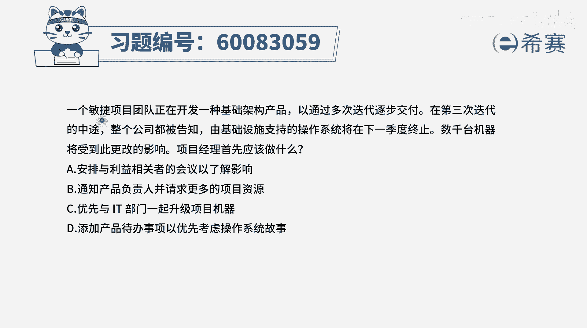
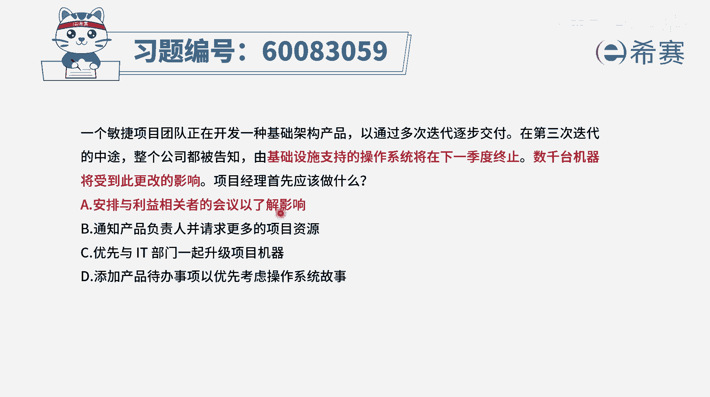

# 【重点推荐】2024年PMP项目管理 100道新版模拟题精讲视频教程、讲解冲刺（第14套）！ - P9：60083059 - 希赛项目管理 - BV1wz4y1q7Az

一个敏捷项目团队，正在开发一种基础架构的产品，已通过多次迭代来逐步交付，在第三次迭代的中途，整个公司被告知，由基础设施支持的操作系统将在下一季度终止，数千台机器将受到此更改的影响。

那项目经理首先应该做什么，当一个重大事情发生的时候，首先我们应该做什么呢，我们肯定是先要去了解情况，分析影响，分析原因，找寻解决方案，应该是这个逻辑对吧，那看一下四个选项，选项a安排与利益相关者的会议。

以了解影响唉这就是我们去了解情况，先了解情况，然后再去想对策，这肯定是合适的，所以它一定是一个正确选项，b选项通知产品负责人，并请求更多的项目资源，这个请求更多的项目资源。

这很显然就是已经在做一个具体的措施，我们一般是先去了解情况，分析影响，然后再去想对策，而这个对策想完以后呢，再去做这样一个具体的事情，所以这个直接去上手去找资源，这个不合适。

就跳过了中间的一些分析啊之类的好，第三个选项，优先与i t部门一起来升级项目的机器，这也是你分析以后才能去干的事情，所以b和c都是我们去了解影响，然后进行分析以后才去干的这些事情。

最后一个选项添加产品待办事项，以优先考虑操作系统的这样一个事情，这个呢首先第一个它也是你分析以后做的事情，其次呢把这个产品待办事项列表中的什么东西，做优先排序，它主要是po来去完成，除非说p o授权利。

否则的话一般是p o来去做这个事情，所以他也没那么合适，那只有a选项相对最合适，就是当一个重大的事情发生以后，我们去了解它的影响。

然后再去做决定，那文字版解析在这里。

