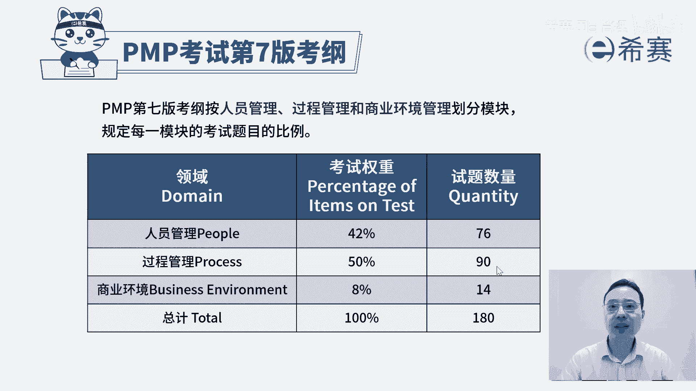
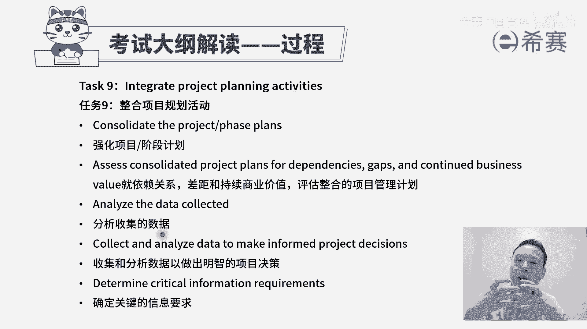
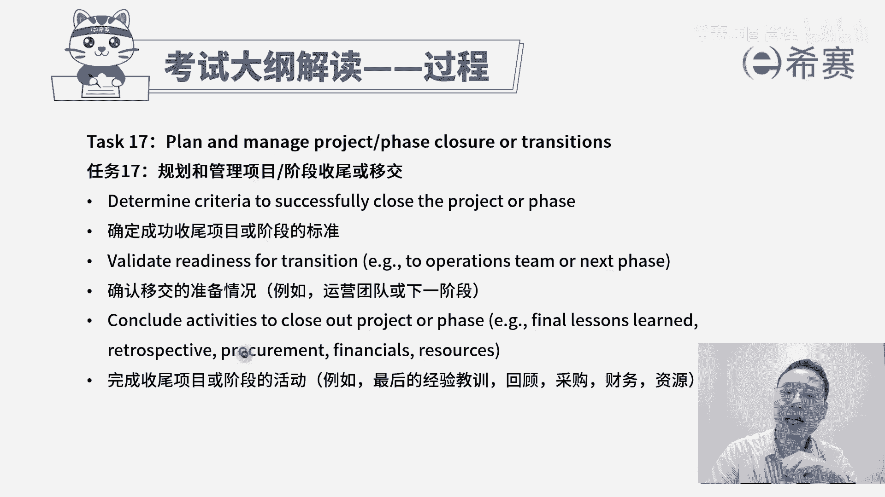
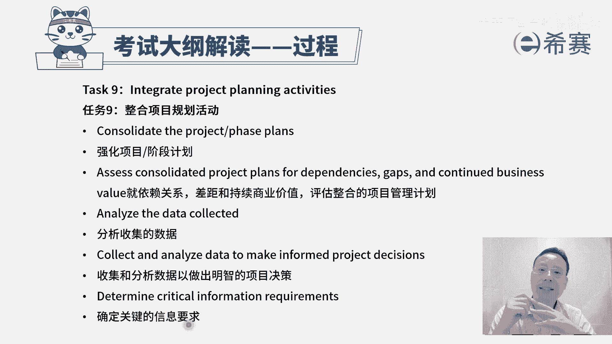

# （附2024年）PMP项目管理《PMBOK指南》第七版精讲视频课程（零基础通关PMP）！ - P106：考纲之过程板块A - 希赛项目管理 - BV1i64y1a74v

大家好，接下来我们一起分享的是PMP考试，第七版考纲，在第七版考纲中，它是按照人员过程和商业环境这三个维度来去，按照分数计分的，那么关于过程这个板块呢，它考试占比占到了有一半50%，占90道题目。

如果说我们已经是看过了关于有呃资源呐，然后沟通啊，干系人呐，范围呀，进度啊，成本啊，质量啊，然后以及整合呀，风险啊，采购啊，看过这些内容以后，我们再来看过程这个板块，它的这些考纲你会发现。

其实大部分你都很容易理解，而少部分不太好理解的东西，我们在后面的敏捷中会展开来讲到。

我们一起来看一下，那整个过程这个板块呢它就是涵盖到整合范围，进度成本质量，资源沟通风险，采购相关方等这些内容，包括启动规划，执行监控收尾，这些内容中间有少量的内容，它是超出了这样一个十大知识领域。

五大关注，那么它会从这个敏捷，SRON的实践，以及敏捷阶段框架中来得到一个有效的补充。

我们一起来看一看，首先第一个关于过程的任务，叫以交付商业价值所需的紧迫性来执行项目，它里面有一个很重要的词汇叫商业价值，我们做的事情一定是能够去交付商业价值，这样的话那才值得去做。

那首先我们说做项目本身，它是需要有这个商业价值，就是这个项目值得去做，同时在做项目的过程中，我们会在敏捷中还会讲到，他会把要做的功能一个两个三个四个五个，它也会是按照商业价值来进行有效排序。

那么在这种排序的情况下，我们优先做那种价值比较大的，然后再然后也会有这样一个过程，那么这里首先第一条就是评估机会，以便增量交付价值，所谓增量交付也是在敏捷中会讲到的一个内容。

就是我并不需要把所有的东西全部都做完以后，才交给客户，我们是先做了一些有用的东西就交给客户，然后再做一部分增量交付，再做一部分增量交付，所以他给的是说评估机会来去增量交付，能够持续交付好。

第二个要检查整个项目的商业价值，就整个这个项目本身是值得去做的，以及每一个具体要做的内容，他是值得去做的，第三个支持团队根据需要来细分项目的任务，以便找到最小可行产品，这也是在敏捷中会讲到的一个内容。

就是我们的这些东西，很多的情况下，我并不需要把所有东西都完成再交付，我们先做一个所谓的叫最小可行产品，Minimal viable product，叫MVP，我们先做一个MVP来看他是不是对付对方。

是需要的有用的，然后在此基础上面再去丰富，再去增加，所以他这里面的话更多的是这种增量交付，迭代交付，然后持续交付MVP的这样一个思想啊，其实关注焦点是商业价值，所以以交付商业价值所需的这个紧迫性。

这个所谓的紧迫性其实就是有有序的排序，OK根据它的这个商业价值，有序排序来执行项目好，第二个任务呢叫管理沟通，那你如果已经是学过了关于沟通管理的话呢，就比较清晰。

你看首先是分析所有相关方他的一个沟通需求，他是在什么时候需要信息，需要什么信息，以什么样的方式来去给他等等，你把这些沟通需求搞搞清楚以后呢，我们就去可以做一个沟通管理计划对吧。

唉就一个沟通策略的这一个计划好，第二步是确定所有相关方的这样一个沟通方式，渠道频率详细程度，这不就是把他这个沟通需求，再细化到这样一些细节的方式，渠道频率和详细程度吗。

好第三个有效的沟通项目的信息和更新，这个呢相当于说是收集沟通的需求，这个是做一个沟通的计划，而这个就是落实沟通，去执行沟通，去管理沟通好最后一条，确认沟通是否有效并获取反馈，这是在监督沟通。

看监督的有效性，所以你会发现整个这样一个考纲中的，关于沟通这一个板块，它就是跟我们在十大知识领域中的沟通管理，几乎是一样的，好，再看到第三条，第三个任务呢，评估和管理风险。

他讲的就是要去确定风险管理的可选方案，以及迭代评估和排列优先级，怎么讲呢，首先就是我们在做项目的过程中，风险是不可避免的，如果产生风险，我们应该是要去想到一些方式和方法，来去应对它。

那么整个在风险管理中，我们说先去识别风险，再做定性的分析，对风险进行排序，然后再做量化的分析，对风险有更深的认识和了解，然后再去规划风险应对，然后呢再去实施风险应对，然后后面是去监督风险。

那么整个过程这就是所谓的确定风险管理，他的这些可选方案就是包含了这类内容，后面一个要说迭代评估和排列优先级，其实所谓迭代评估也是持续的过程，那我们在你整个风险管理中有一个监督风险。

它也会强调我们要持续关注项目的这些风险，有没有新的风险产生啊，旧的风险是否已经过时啊，这都是在做迭代的建议过程，并且所谓排列优先级是我们在做定性风险分析，对的优先级排序，所以整体来讲这样一个任务三。

它就是跟我们的风险管理是相一致的，接下来我们看到任务四叫相关方参与，其实也就是要去争取相关方的参与，让他更好的去支持项目，让他抵制变得更少，那我们来看，首先第一个叫分析相关方，包括他的权利。

包括他的利益，包括他的影响作用，然后可用权利，利益方格等这些方式来去分析这些相关方，他在什么位置，他对这个项目的一些影响和权利是什么样的，然后从而能够去有效的把相关方进行分类，也就是第二句话。

对于相关方进行分类，这个维度的人员我们要重点管理，然后这个维度人员我们又如何如何，这个维度又如何又如何，对吧好，第三个就是按照类别来促进相关的参与，其实也就是说根据你的分类的方式。

对不同的方格里面的人员，我们有一套自己的这样一个应对的规则和方法，来去有效地去管理它，最后一句，制定执行和确认相关方参与策略，其实也就是说我们去落实相关方参与策略中的，这些个东西去执行。

并且如果发现做的不够好的地方呢，我们可能需要去做相对应的调整，这就是整个跟我们的十大知识领域中，相关方管理这个板块是完全匹配的，好在接下来呢会看到一个叫规划和管理，预算和资源。

那这就是既会考考虑到我们的这个成本管理，同时呢也会考虑到我们这个资源管理，我们一起来看一下啊，但重点是在成本管理，您看，首先第一句是根据项目范围，和从过去的项目中来汲取的经验教训，来估算项目资源的需求。

也就是说我们这个项目需要什么样的一些资源，需要多少数量，OK这就是我们在资源管理那一章节里面，其实会有去估算资源，对吧好，接下来是预测未来预算的挑战，所谓预算挑战，其实说我大概可能需要多少预算。

以及可能会存在哪一些风险，然后对于这些风险的话呢，我们可能还要再多花多少这一个呃成本的储备，或者说是预算的储备来去做，这就是关于对未来这一个估算啊，预算啊估做的这些事情，下一条监控项目预算偏差。

如有需要根据治理流程来进行调整，也就是我们像用政治分析啊，之类的这样一些方法来去监控，看目前的成本是超支还是节约啊，如果说成本超支的话，我们该采取什么样的措施来去有效的处理。

可能需要去动用这样一些应急储备啊，动用一些管理储备，肯定要去做一些申请之类的，这是我们再去控制成本好，后面还有一条规划和管理资源，这一来到我们资源管理这个专业中，我们已经是大概知道要多少资源，然后呢。

我们该如何去有效地去利用好这样一些资源，我们该如何去打造团队，建设团队，让这些资源能够更更有战斗力，来去完成某些事情，所以这是既考虑到这样一个成本，也考虑到资源管理好，再看下一个叫规划和管理进度。

你看这里就是重点管理进度，他第一句话说估算项目的任务，其实也就是估算他的这样一个工作量咯，然后估算工作量以后呢，就能够估算出时间咯，能够去列出这些里程碑节点呢，然后他们的这样一些内部依赖关系。

外部依赖关系FSFF整这些依赖关系啊，还包括说故事点，故事点呢是我们在敏捷项目管理这一段，会再展开讲的这样一个内容，其实也就是一种工作量，然后会基于这些信息，然后你看第二个。

利用标杆对照和历史数据来去做一些努力，做什么努力啊，类比估算啊，参数估算呐，哎就是这么一回事对吧，就是利用过往的这些历史数据来做类比估算啊，如果有大量的历史数据的话，我们能够得到一些参数模型。

那就做参数估算，然后基于这些个信息，基于它的这样一个呃，比方说是进度网络图和这些估算数据，我们来去做一个进度计划，所以是基于方法论来去准备进度计划，做出一个具体的进度计划。

然后再看这样一个进度计划的进展情况，我们去监控它的这样一个进展情况，所以基于方法论来去度量进展情况，其实你同样的会发现我们在政治分析，政治管理中，他一样可以算出，我们目前是进度是落后还是超前。

未来还需要花多少时间去完成，哎都是有这些，所以这就是我们去做制定进度计划，便是控制进度，在规划和管理进中，还有一个是基于方法论，来根据需要来修改进度计划，也就是我们在监控的过程中。

如果发现进度已经是严重落后，可能需要去对原有的这样一个进度计划，做相对应的调整，这其实也是控制进度的一部分内容，好最后一条配合其他的项目和运营工作，我们在做进度管理的过程中，也需要去做一个整合的方式。

来共同完成一些事情，所以要配合一些其他的工作内容好，这是关于进度管理，我们前面已经是看过了成本呐，资源呐进度，然后再接下来看看另外一个呢是质量任务七，规划和管理，产品的质量，规划和管理。

可交付成果的质量，OK也就是说我们需要去做好质量管理，那么首先的第一句呢就是确定项目可交付成果，它所需要的这个质量标准，也就是我们在最前面说，制定质量管理计划的时候，在质量管理计划中会包含质量的标准。

然后第二个呢是根据质量的差距，来推荐可改进的方案，那你首先你得要去做一个控制质量，你才能够发现质量的偏差，然后才能够去找到改改进方案，所以这个其实是在控制质量，OK这叫控制质量，然后在最后一句说。

持续的调查项目可交付成果的这样一个质量，那么在这个过程中，如果是持续的过程中的经营管理呢，就是管理质量，那么也就是规划质量管理，控制质量，管理质量，它都是跟我们的，在质量管理这个知识领域完全是一致的。

好再来往下面看到第八条叫规划和管理范围哦，整体来到范围，其实我们去算工作量也好呀，计算质量也好呀，算这些资源也好啊，都是基于范围来的，那么这个规划和管理范围中，首先第一句要确定需求并排列需求的优先顺序。

也就是从客户这边来去获取，关于项目的一些需求，并且呢需求它一定是有更重要的，其次的，然后再次的，然后基于需求，然后把它去转变成范围，并且对范围呢进行分解来分解，这个范围我们为什么要分解。

因为把它分到更小的颗粒度以后，更方便我们去管控，更方便去管理，肯定跟进，所以呢才要去做分解，比方说创建工作分解结构，那这里还有一个词叫代办事项backlog，这个呢是在敏捷里面会讲到的。

我们在试管实践中会讲到一个叫产品，待办事项列表，Product blog，还有一个呢是冲刺待办列表，叫spring backloud啊，这是在敏捷里面会再展开，讲好，后面还有一个叫监督和确认范围。

那确认范围其实是做验收，然后还要去监控范围呢，就是关于这个范围的变化，我们需要去走变更的流程，所以整个任务八基本上就是范围管理，然后再来看到任务九，发现说是整合项目规划活动哇。

这里面有一个点你需要去了解，你会发现他把整个我们在项目管理中的整合，管理呢拆分成很多个部分。

一个是整合项目的规划的部分，然后再一个呢是管理项目的变更，它也是属于整合里面的这个实施整体变更，控制的变更，然后再还有一个呢是管理项目工作，这就是执行，这是在整合中的执行。

然后再还有一个呢说确保知识转移，这也是属于在整合项目管理中的这样一个管理，项目知识，那还有一个说规划和管理项目，它的这一个收尾或移交，这是结束项目或阶段，所以你会发现整合就包含在好几个不同任务中。

我们一起来看一下，首先看到还是第一个关于整合项目的规划活动，那我们知道规划其实是plan做计划对吧，就是各方方面的计划，他的，首先第一句说叫强化项目的计划，或强化阶段的计划，因为我们知道房事预则立。

不预则废，如果没有计划呢，这个事情可能会一盘散沙，可能会没有一个依据，没个着落，第二句就依赖关系差距和持续商业价值评估，整合的项目管理计划，首先我们得要知道项目管理计划，它是一个综合性的计划。

它是整合了范围管理计划，需求管理计划，进度管理计划，成本管理计划，资源管理计划等等等等，一系列，有十几个计划，对不对，所以呢，其实首先第一个是我们需要去知道，计划的重要性，其次呢能够去做出计划。

并且能够去评估这个计划是否依然有效，然后我们来看一看，我们后面还要去监控的时候也是一样的，拿了一个结果和这个计划去比对，看是否需要去做相对应的一些调整，所以是基于一些外部的环境的情况。

来去看这样一个计划，它的这个实际情形好，接下来说是分析收集的数据，那这个收集数据是用来干什么，其实很多时候我们收集更多的信息，是为了方便我们去做决策，所以后面有一条说收集和分析数据。

已做出明智的项目决策，那么这个决策里面有什么呢，就是我们要不要改计划呀，我们要不要做项目的一些调整呢，由于我们要不要去申请更多的资源呢，或者申请延长更多时间呢等等，其实这就是我们在做一些监控的事情。

好后面还有个说确定关键的信息要求，其实也就是说，如果我们需要很好的去做这个项目的话，哪一些信息是我重点需要去考虑，哪些是我重点需要去观察和了解的好。

