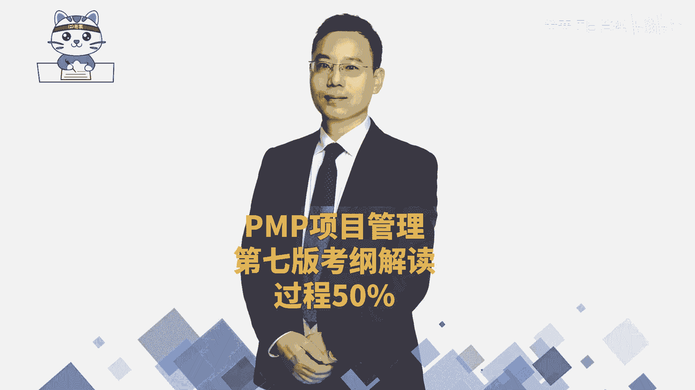
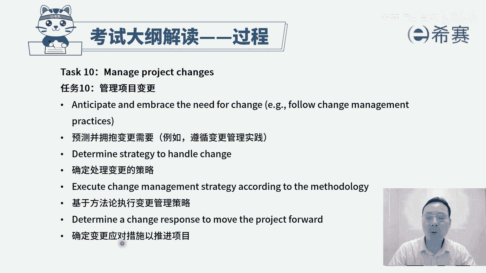
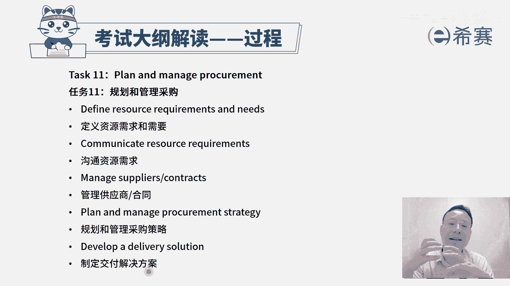
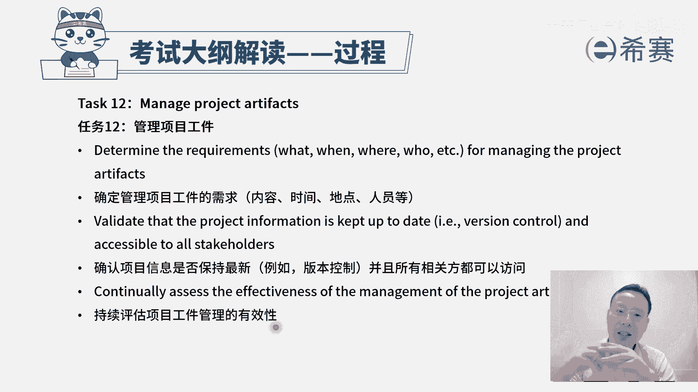
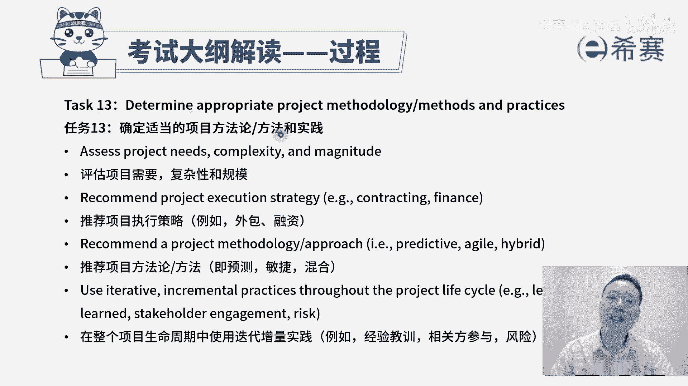
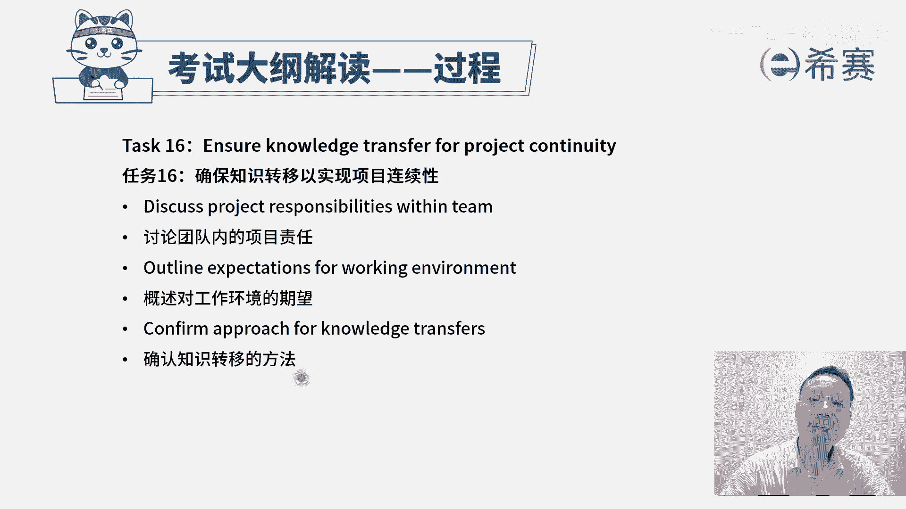
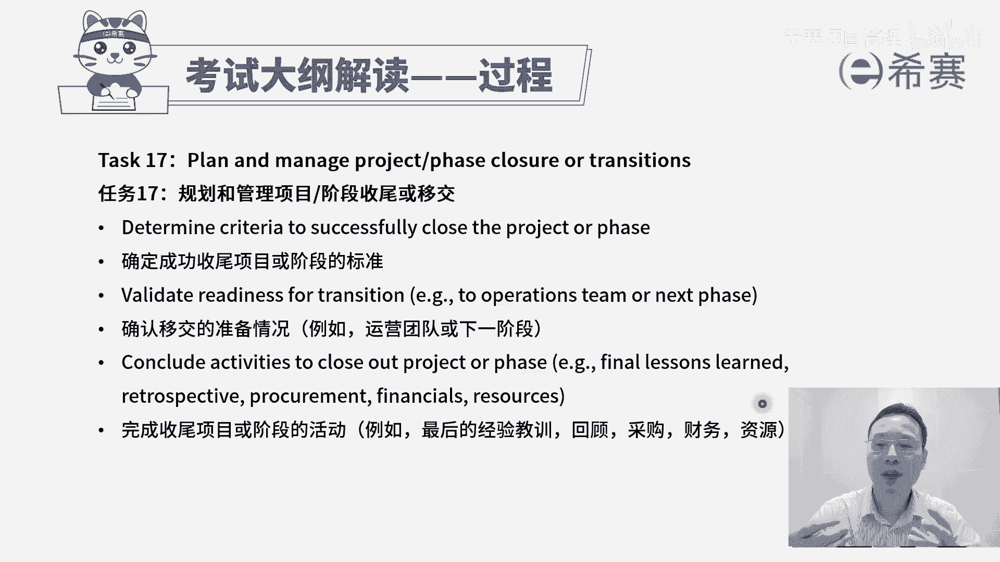

# （附2024年）PMP项目管理《PMBOK指南》第七版精讲视频课程（零基础通关PMP）！ - P107：考纲之过程板块B - 希赛项目管理 - BV1i64y1a74v

我们再来看到任务时呢，管理项目变更。哎，我们前面有一个过程叫实施整体变控制。那你看首先第一个预测并拥抱变更的需要。其实也就是说，如果你明确的知道变更，它几乎是在所难免的那如果用预测型项目管理方式呢。

它会有一个叫实施整体变更控制，我们就要需要去遵循这个变更控制的这样一个过程。那如果在敏捷中，我们后面会讲到敏捷中拥抱变化，它也有一套方式来去拥抱。那如何去拥抱，我们在敏中会再展开来讲，首先要有这个思路。

好，第二个说确定处理变更的策略。在预测中就一定是实施整体变控制的这一个策略。而在敏捷中是一种拥抱变化的这种策略是不一样的。但它都是有对应的策略。第三个，基于方法论来去执行变更管理策略。

也是你有了这个变更的策略以后，要去落实去执行啊，最后一个确定变更应对措施，以推进项目。我们就续有效的去管控，避免这个项目的范围蔓延，避免这个项目做到一种失控的这个状态。

从而能够去有效的把所有的东西都管控在里面。OK这是第十条任务，叫管理项目的变更。

再来看到第11条规划和管理采购，其实并不是每一件事情，我们都能够去亲力亲为的去做。有一些时候有一些事情也许是找别人做会更划算，更合适。那我们首先了解一下，他说定义资源的需求和需要。

我们需要做一些什么东西。然后第二个是沟通资源的需求。我们可能从哪里去获取到。如果有可能说并不会从自己去完成的话呢，我们就可以从外面去采购。所以第三句管理供应商或者是管理合同。

也就是我们通过这种采购的方式，甲乙双方之间，我们需要什么资源，我们提供什么样的资金，他最后就能够帮我们把了这个东西给完成。好，这里还有第四条规划和管理采购策略。

也就是说我们已经是知道我们有需要这样一些资源。我们也知道有对应的一些供应商。然后呢，我们也知道要该怎么样去跟他有效的去合作，能够让我得到我想要的东西，他得到他想要的东西。好，并且呢去落实去执行，去执行。

就是去发布招标广告呀，然后去开这些投标人会议呀，然后去开标评标呀，然后签合同啊，对吧？好，后面一个叫制定交付解决方案，其实也就是签完合同以后呢，对方他应该是要能够去给我们去落实这些东西。

那么他要去制定他一个具体的这个交付方案，也就是投标的过程。投标中他要去提供的这一个好的解决方案。这都是跟采购有关。一般很多时候采购呢是站在一个甲方的角度来考量这个事情。

接下来看到的是第12个任务，叫管理项目工建。这个弓建这个词adfactor。它其实你把它简单理解，其实就是组成部分组成部件。你就像我们的积木块，积木块里面有很多的组成部件。那么对应的我们在项目管理中呢。

也有很多的这些文件呢，这些东西，它都是你的一些所谓的叫工建啊，简单这样来理解。那么他第一句说要去确定管理项目工建的需求内容、时间、地点、人员等等。也就是说我们如果是要去产生什么东西的话。

一定是需要有一些人在对应的时间提出什么样一些要求来去做什么事情。从而能够去产生若干的工建。我们先要搞搞清楚这些需求情况啊，第二个确认项目信息是否是保持最新。并且呢所有相关方都可以访问。

它其实讲的就是一个重点就是版本的控制。也就是目前我们所去交付给大家的这些个弓件，就是这些个文件呢，这些东西它都是最新的，但相对应的这一些有权限人是可以访问得到的。好，下一条持续评估项目工建管理的有效性。

也就是说我们目前这些工件它都是处在一个良好的状态里面，然后都是最新的版本。其实我们在十大知识领域中呢，没有特别专门去强调说管理项目工建。但是呢默认会有一个叫整理这些个经验教训，整理这些组织过人资产。

那包括说整理这些项目文件。那这些文件呢其实也就属于我们的这些工建。我们需要去有效的管控好这些东西。而真正在落实项目的过程中，这些文件它是为一个很非常重要的支撑。这些工建它都是一个很重要的一个支撑。

然后再接下来看到第13条确定适当的项目方法论、方法和实践。其实我们前面已经大概简单认识了一下，有预测型项目管理方法呀，敏捷型项目管理方法呀。其实即便说是敏捷也好，它里面还会有scr的方法呀。

有什么看板的方法呀，有精益呀，有水晶啊，有那个TD啊等等这些东西，那么这里面说是要去确定一个适当的这样一个方法管理。首先第一个评估项目的需要复杂性和规模。如果项目它的规模特别特别大。

那么你用敏捷的方式来搞呢，就不太合适。敏捷它更适合用这种小规模的短时间的。如果周期很长，你还是要一定是用预测的方式，在预测中你分小阶段的时候可以在内部用敏捷，但是大方向你应该是大方向是比较清晰且一致的。

所以公司的这些项目本身的这一特质，它的这些复杂性和规模情况，我们可能会采取的这样一些方法是不一样的。好，第二个推荐项目执行的这样一个策略。啊，有些东西你是自己亲自开发比较合适。

还是说从外面去找一些资源来去帮你去完成，比较合适。还是说你需要去通过一些融资的方式来去自己做。以及你所推荐的这些方法论，是用预测的方法来去做，还是用敏捷的方法，还是混合混合。

它是指预测加上迭代预测加上增量，预测加上敏捷等这种方式，也可说是先预测在敏捷，也可是先敏捷再预测，也个是边敏捷并预测，这都是一种混合。那到底是基于这个项目本身它的这应个具体情况和特质。

我们来看如何做比较好。好，再下来呢在整个项目生命周期中使用迭代增量实践来做事情。那这个特质就是说如果某一些项目它本身特质就是适合用这种敏捷，用迭代的这种方式来做的话呢，我们可以考虑用敏捷迭代。

这个呢是等会后面在敏捷中会展开来讲。并且事实上像这里给来说经验教训是持续的可以去增加的。然后一些相关范的这些参与，也是我们可能会过程中又识别一些新的相关方都把它累积下来，风险也是会识别新的风险。

然后去阶段性的去处理一些对应的风险。然后处理完的东西也会做一些新的文档的整理。那么也是。增量。但事实上呢，我们除了有这样一些过程性的文件的增量以外。我们对于整个要做的工作内容。

它是可以去增量的迭代开发的。所以我们在后面敏捷中会展开讲这一部分，这是确定适当的项目方法论方法和实践，也是要基于这个项目本身的这一特性来去选择合适的方法和实践。

第14个任务，建立项目治理的结构。那么关于治理呢，我们在最开始有讲过，我们说韩信点兵多多益上。那刘班去管韩信管张粮管萧何。这大领导管这些领导们，他属于治理。然后领导管下面人员他属于管理。

那你大概知道这个意图，整个公司的大领导董事会，他来去给公司定好一套规则和机制，这属于治理。所以这里有一条说确定适当的项目治理啊，用什么样一种方式去做治理。这个呢其实不是项目经理们干的事情啊。

项目经理都还够不够格。但是你得要稍微了一下，有这么一个思路。好，这里还有一条定义上报的路径和阈值。也就是说某一些事情该如何去处理我们这种规则啊，路径升问题升级的这个原则或者说是过程流程。

这些东西呢都会是你治理里面提前定好的那我们要有这个意识，就是这套规则是什么样的？是提前治理定好的。然后再来看到第15个问题，管理项目问题。我们经常会把问题和风险区分来。但是事实上你在后面你会发现。

在敏捷项目管理中呢，有的时候把问题和风险就混到一起来，不严格去区分。但在预测型项目管理中，我们有的时候把问题和风险是区分，怎么区分呢？风险是还没有发生，但是将来有概率的。呃，问题呢是已经发生的。

所以我们来看一下。首先第一句话，认识到风险何时成为问题，何时成为问题啊，它已经真的发生了，或者板上钉钉肯定要发生了。那么这个时候呢都可以当这是一种问题。当然这句话其实重点不是说我要知道什么时候成为问题。

我知道的是说如果出现了问题，我们得怎么办？那出现了问题肯定是要去找应对的措施，对不对？所以呢如果出现问题，我们可能要去收集更多的信息，然后分析影响，然后再找寻解决方案，然后再去处理解决这个问题。

一般是这个逻辑。好，到第二句，采用最佳行动，解决问题，以实现项目成功，也就是说出现问题以后，我们要去分析分析原因，采取采取一些措施，然后去落实去处理掉这样一个问题。啊。

那并且呢问题本身我们一定要去跟踪啊，比方说发现了问题啊，要写到这个问题日志里面来，然后去安排给谁谁作为责任人。然后后面的每个步骤环节，对吧？才这都是关于问题。后面一条与相关方就解决问题的方法来进行合作。

那么其实也就是说我们如果要去解决某些问题啊，也许不只是说靠我们自己的力量就可以，可能还需要靠更多的力量。那么我们有可能是跟别人一起。还有就是可能在做项目的过程中。

相关方他自己也会遇到很多的一些问题和挑战。那我们是需要去主动的帮助他来解决。因为我们是拿了别人的钱替别人去干活，所以要去解决好他的这些问题。所以这是最后一句说与相关方就问题解决的方法来进行合作。

那这是关于管理项目问题。我们接下来看到第16条一共有17条啊，倒数第二条了，说确保知识转移，以实现项目的连续性。首先我们在做项目的过程中，一定会有一些经验和教训。那么有经验的话呢。

就可以让下一次做的更好。如果说是一些教训呢，哎就可以避让下一次可以就避免掉这一些事情。所以经验和教训它都是好的事情啊，它都是能够让我们对未来做事情的时候可以少走一些弯路的这些东西。

那这个题标题说的是确保知识转移，也就是我们这些经验和教训能够得到传承。我们这些组织过程资产，它能够得到有效的传承。第一句讨论团队类的项目责任。其实也就是说谁会负责什么事情，谁会负责什么事情。

你负责这个事情。那么出了问题，你也比较容易去有的更深的认识和了解，呃，能够去总结一些经验和教训。好，第二个，概述对项目工作环境的这一个企望，这个点怎么讲呢？其实也就是说你负责这个事情。

你要搞搞清楚这个事情是什么样的情况下，这个事情就可以有效的去开展，可以顺利去开展。其实也就是一种标准启动的标准。好，并且你在做这个事情的过程中，如果真的有一些经验和教训，有这些知识的产生。

包括隐性的知识和显性知识。那我们需要去说有一个方法来去管理好这些知识，包括知识管理工具和信息管理工具，把隐性知识变成显性知识，把显性知识，把它编撰成册，得到这个经验教训的预测。这也是。

确认知识转移的这一方法。

我们来看到整个过程中的最后一条叫规划和管理项目的收尾或移交。规划和管理阶段的收尾或移交，其实也就是结束项目或阶段。啊，结束项目后阶段呢，我们是在项目整合管理中的最后一个内容讲到的。

那么首先第一个说确认成功收尾项目或者说阶段的标准，那个标准是什么呀？通常我们是在最最开始的时候，制定项目章程的时候就定好了这个标准，也是以终为始的这种方式。第二句。确认移交的准备情况。

其实你既然要去做这一个结束项货阶段，要去做收尾，要去做移交，一定要提前准备好很多东西，包括这一些可交付成果以及支撑性的文档各方面的。像以前我罗老师以前是在软件这个行业中去工作的时候呢。

那我们就要去交付这个成果给对方，同时还会涉涉及到一些需求规格说明书啊，概要设计说明书啊、详情设计说明书啊、数据库设计说明书啊，还有什么用户手册呀啊等等这一大堆东西一一一起写一大摞。

那么这些东西都提前准备好好，最后一个完成收尾项目或阶段的活动，包括说总结最后的经验和教训，自己内部去复盘回顾和房行，然后还有采采购的结尾啊，财务的收尾呀，然后资源要去示范掉。

那么这些采购财务财务就是要打款哦。然后资源给示范掉，其实也就是像最后做完了以后，团队成员就解散了，大家就各干各的事情去了，可以做下一个项目的。

那我们刚花了一些时间来去给大家解读了一下关于整个考干中的第二个板块叫过程。而过程呢考试呢占比占到了一半有90道题目，它是非常重要的。基本上你认认真学过了五大关主十大知识领域49个过程。

你对整个过程的这些内容呢，就会相对比较清楚的认识和了解。而我们后面还会讲敏捷的s框架，我们还会讲敏捷阶段框架。那这些时间呢，它都是能够对我们的过程有更深的认识和补充。我相信你认真去学一定没问题。

