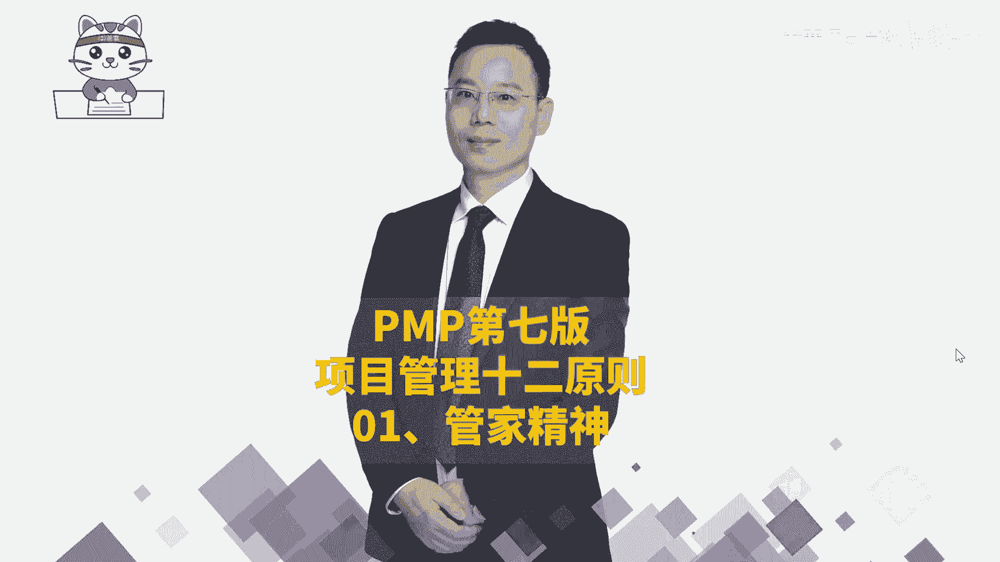
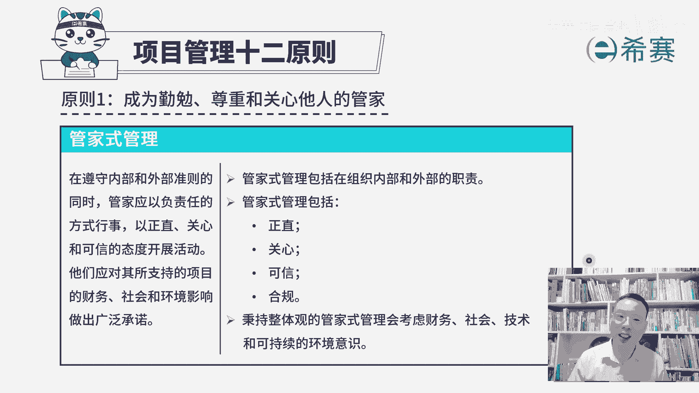
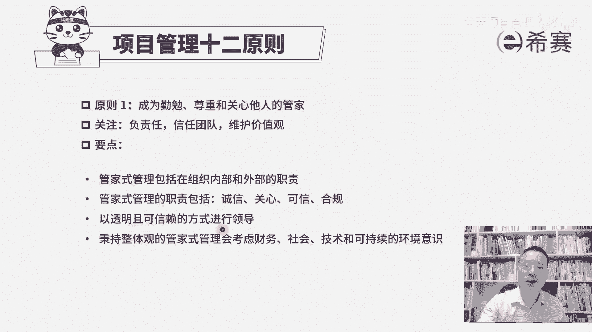

# （附2024年）PMP项目管理《PMBOK指南》第七版精讲视频课程（零基础通关PMP）！ - P112：PMP第七版项目管理原则之01管家精神 - 希赛项目管理 - BV1i64y1a74v

大家好，接下来我们一起分享的是项目管理12条原则的第一条，叫要称为勤勉、尊重和关心他人的管家。那这一条原则呢，它其实包含了三个重要的信息。我们一起来看一下啊。首先它有一个解释，说要做管家式管理。

你可以看到，在遵循内部和外部准则的同时，那么也就是说我们去做项目，一定是要去遵循内部的准则，以及遵循外部，也就是行业社会的准则。那么这里面认识一个词叫合规。我们要在于合规性。

然后在遵循内部和外部准确的同时，管家应该以负责任的这种方式来形式，能够正直关心和可信的态度来开展活动。呃，一会会都解释一下这些词汇啊。

他们应该对其所支持的项目的财务情况、社会情况、环境影响等等做出一个广泛的承诺。大概是什么意思呢？首先第一句，他作为一个管家式的管理呃，我们说管家，你通常情况下。

其实是你要对所有的通盘全局掌握的非常清晰和了解。这样的话你才能够有效的去管理这一些事情。并且呢其实他不是一个高高在上的角色。他有一种服务型领导的这样一个意思在里面。并且他会要求大家在行为处事的时候。

要去遵循组织内部的这样一些个准则，并且能够去遵循外部，也就是宏观环境、社会环境的这样一些准则。那么遵循内部的准则，比方说你们公司在做项目的时候，可能有一套项目管理标准。那作为项目经理去管项目的时候呢。

是需要去遵循这些标准来推进项目，可能会对于什么节点去汇报什么文件，然后去组织什么样的一些活动，他都有要求。那我们是要按照要求来去推进这些事情。并且呢我们是在这一个环境中去工作，在这些社会中去工作。

我们要去遵循法律，遵循这些社会的基本规则和准则。好，这是第一个。第二个呢，管家式管理，它包含正直、关心、可信和合规。那这几个词啊，其实怎么讲呢？我们稍微来展开讲，首先作为一个正直。

我们在前面讲这样一个项目经理角色的时候，有讲过说要正直诚信，要不与龌龊为伍，要浩然正气，对吧？那这里是同样适用的。也就是说你不能够去有失偏颇的方式，你不能够去包庇包含的这种方式。

而是能够去正直诚信的来做一些事情，既能够对你的客户，也是对你的团队成员，包括对你的股东，对你的领导，你都应该是一套这样一个正直的方式来做事情。但这是考试啊，你不要说啊你因为这样一个事情。

然后结果丢了工作的话，你不要来找我，这是考试里面的要求。事实上呢，这也是一个正向的一个社会价值观。好，第二个词呢要关心关心谁呢？你要去关心你的团队成员。关心他们的成长，关心他们在各个方面的这些需求。

以及他们是否会受到大量的干扰信息。我们能够去帮他来清除障碍，能够让他安安心心的专注的沉浸式的工作。哎，这是关于关心。第三个词叫可信。你想你要去展现这种可信的力量，什么样的人算是可信的。

首先他有能力能够办成事情。其次呢他他会按照你所期待的方式，或者说是按照一个社会普世的价值观的方式来去行为处事，是一个可信的这样一个人。那这样的话才是可信。那么还有一个词呢叫合规。所以叫合规。

就是合符这些法律呀、法规呀、规则呀要求。那我们的项目是需要有这些合规。同时呢大家在做项目的过程也需要合规。那你至少不能够偷工减料吗？

我们做的这样一些事情不能够对这个社会有伤害吧啊不能够去破坏我们的环境吧。那你在做事情的时候，你不能违法吧，不能违规吧。哎，这是关于合规。那么还有一条说作为一个管家式的管理。

你要秉持的是整体观的这一种管家式管理。他会去考虑关于财务。社会技术还有可持续的这一个环境意识。哇这个其实对你就拔高了很高的一个要求啊，就是不完全或者不仅仅只是说关于这一个项目上的事情。

它会是我们在NPDP课程中会讲到一个词叫三重底线。它是把这个三重底线给考虑进来，什么意思呢？就是我们在做项目的时候，首先你要考虑到财务，也就是这个项目。

它应该是能够为企业带来正向的这一个产财务价值或者经济价值。呃，简单说白了就是能够赚钱。所以第一个是能够赚钱。O好，第二个呢是能够去考虑到社会，社会其实讲的是人就不管说是我们的工作人员，还是最终这个产品。

它的这样一个客户用户。我们需要去考虑它，也就是说我们所做的项目，你不能够以牺牲员工的这样一个身体健康为基础。呃，你做出来这个结果呢，你也不能够影响这些社会人群，它的这健康生活为基础。所以你要去考虑这。

社会考验人的这个因素。第三个是需要去考到可持续的环境意识。也就是我们做这个项目，不能够去破坏环境。包括说我们做完这个产品本身在使用的过程中，以及使用以后，它也不能够去破坏环境。既能够让我们自己。

我们这一代人可以在这样一个有效的环境中去生存，去工作，去创造价值，也能够让我们的子孙后代。他可以在这一个环境中去生存，去发展，去创造价值。所以这是关于三通底这一个是财务，一个是社会，一个是环境。

其实你听到这个词，你大家知道就是已经拔了很高很高。同时你作为一个管家式管理呢，你还要考虑到这样一个技术的发展情况。就是要考虑到技术因素，这个有点像是一个叫什么叫paestal啊。

或者你可以把它理解叫宏观态势的分析。就是我们需要去关注大方面大方向。所以你这样一个管家其实是一个还蛮有格局的这样个领导啊。所以对于第一条原则，成为一个勤勉的、尊重的和关心他人的管家。

那么他其实首先的一个是你要去负责任的，能够去把这个事情有效的推进。并且呢你能够去关心团队，信任团队能够去引领团队。并且呢你应该是诚实正直善良，你要去维护这样一个价值观。

所以既包含了这些个内容，我已经讲过了，我就不再去重复赘述了啊。这里还加了一条，就是关于管家里面呢，其实有很多条信息，但是我们是把最重要的几条信息摘出来给你分享。

那这里还有一条叫以透明且可信赖的方式来进行引导。就是整个在做项目的时候啊，特别会强调透明。我们知道其实人和人之间有很多的这种误解误会，是源于什么？源于信息的不对称。当我们之间的这种信息不对称的时候。

那么很多事情它就是会导致有很多的这种猜忌啊、猜疑啊之类的那你作为一个情面的管家，你也要尽量用透明的方式来去领导。当然，关于如何用透明的方式呢？我们在前面预测性项目管理时候呢，没有展开来讲。

在敏捷中会特别强调，包括说我们通过开每日战会的方式来去同步信息，通过一种看板的方式，信息发射源的方式来去同步信息。通过这样一些代码共享的方式来去同步信息来做到有效的这种透明。但我们足够透明。

并且你以一种可信赖的方式来去领导团队的时候呢，团队会更加信服你。这个项目呢也能够更有效的去往前推动。那这就是项目管理十2条原中的第一条，你要做一个勤勉的管家，做一个尊重的管家，做一个关心他人的管家。

