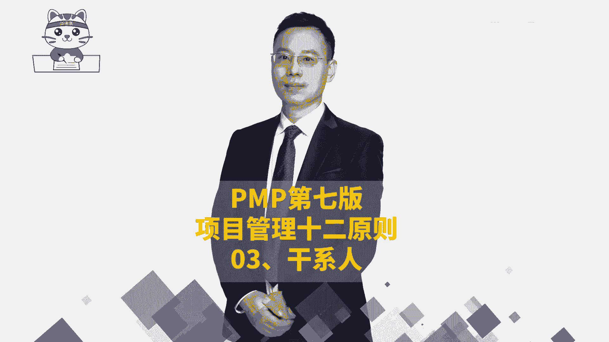
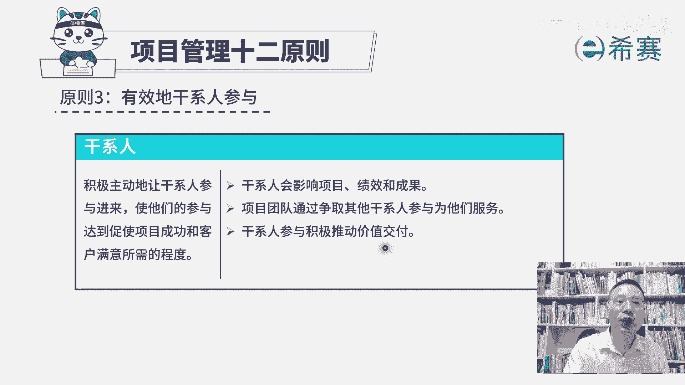
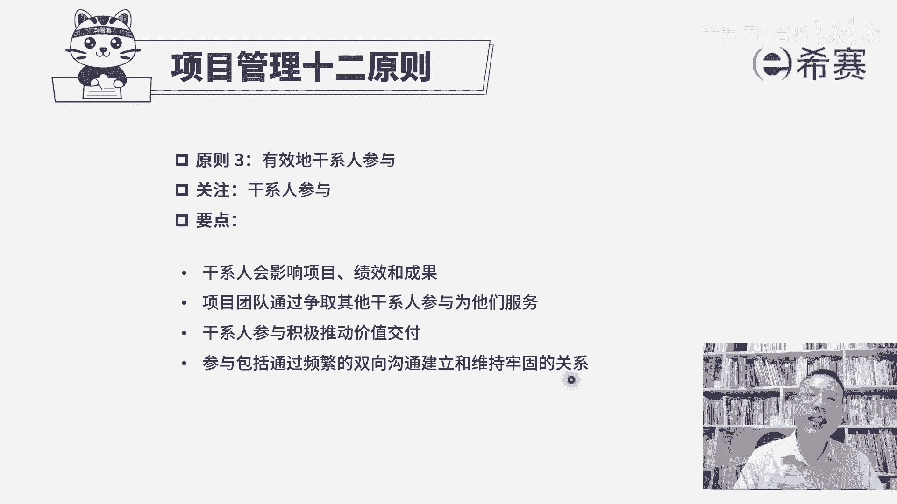

# （附2024年）PMP项目管理《PMBOK指南》第七版精讲视频课程（零基础通关PMP）！ - P114：PMP第七版项目管理原则之03干系人 - 希赛项目管理 - BV1i64y1a74v

接下来我们一起看到的是项目管理十2原则中的第三条原则，叫有效的干系人参与。呃，首先干系人这个词呃，有的版本呢会翻译成叫相关方，它不管叫翻译相关方也好，还是干系人也好，它都是那个takeholder。

其实同一个词啊，其实也就是跟这个项目相关的人，所以会影响这个项目，以及会被这个项目所影响的这些人都叫干系人都叫相关方。那整个这一条有效的干系人参与，他的内容基本上就是你之前所学过的这一个干系人管理。

我们来看一下，积极主动的让干系人参与进来，使他们的参与，能够达到促使项目成功和客户满意所需要的这个程度。其实也就是说，如果能够让干系人有效的参与这个项目的话呢，项目成功的可能性会更大。

如果项目比较成功的话呢，客户满意度也会更高。这就是干系人参与，他要去干的事情。那这里有展开三条信息。第一条说干系人他会影响项目，会影响绩效，会影响成果，想都不用想，肯定是有可能的。

我们说干系人是会影响项目的人你就会受项目所影响的人。所以所有那些影响项目，影响这个项目有效推进，影响这个项目的这一个进程，所有的进程，就是包括进度呀，成那个成本管理啊，这都是他的绩效，对吧？

那那就一定会导致影响结果。好，第二句呢，项目团队通过争取其他的干系人参与，来为他们服务。也就是说我们在做事情的时候，一定要想办法把他们给拉过来跟我们站那一个阵营，他如果以前是不太考虑这个事情。

我们让他去主动去积极参与。他如果说是反对这个事情，我们尽尽量想办法去策反他，让他不要。要反对。我们要去把它争取过来，让他更好的去参与这个项目，去支持这个项目。并且呢他越参与这个项目的话。

他越能够提出一些想法和建议，包括一些反馈信息。那我们就越能够去做一些他所需要的东西，这样从而能够更好的去为他们服务。那整个干系人参与，他能够积极的推动价值交付。因为他只要参与进来的话。

他能够更有效的去提出一些这种反馈信息，而这些反馈信息和意见，他其实就是在给我们指路啊，他告诉我们说我们应该要走哪里，走哪里走哪里，对吧？我们应该要做什么做什么做什么，就这么一回事。

那这样我们做出来东西就更加有价值。因为是客户干系人，他来去定义价值。所以整个关于项目管理12条语原中第三条有效的干心人参与，他相对比较简单，因为前面也都学过了，就是首先谁是干系人。

所有会影响项目影响绩效影响成功人，他就是干系人。当然了，被这些东西影响的也是干系人。而我们呢需要努力去争取他们的参与，从而能。

够让他们对于项目的支持变得越来越多，而抵制变得越来越少。并且事实上能够积极的去参与的话呢，他能够有效的推动这样一个项目交付一个正向的价值。而这个参与呢，他说包括通过频繁的双向沟通来建立牢固的关系。

并且呢通过频繁的双向沟通来维持牢固的关系。这也就是人与人之间呢，这就属于这一个人际关系和交往技能中。你要能够有效的去跟他互动和交流，来去让他更好的去支持项目。好，这是第三条原则叫有效的干系人参与。

