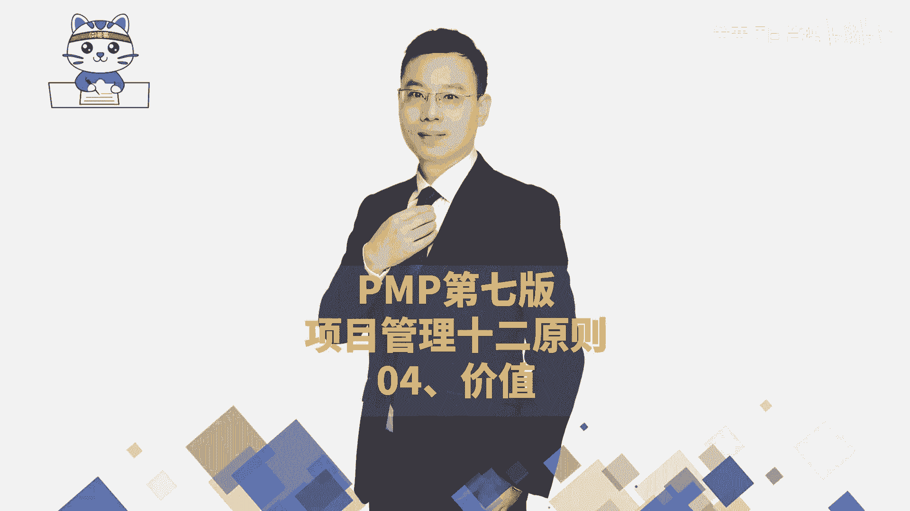
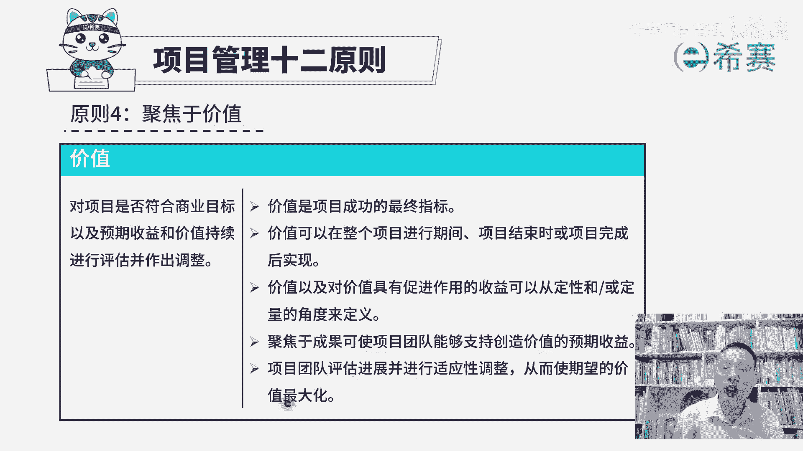
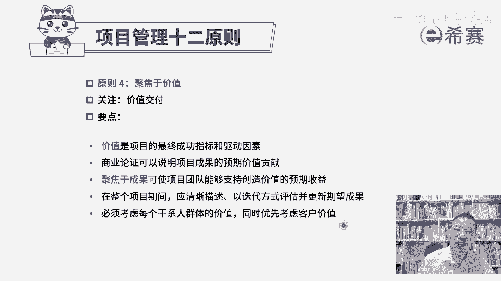

# （附2024年）PMP项目管理《PMBOK指南》第七版精讲视频课程（零基础通关PMP）！ - P115：PMP第七版项目管理原则之04价值 - 希赛项目管理 - BV1i64y1a74v

大家好，我们继续来分享的是项目管理十2原则的第四条叫聚焦于价值。呃，首先我们在做项目的时候呢，一定是希望能够去产生，不管是有形的价值也好，无形的价值也好，一定是希望能够去产生价值，产生收益。

这是一定没毛病的对吧？我们在后面还会去学敏捷项目管理。它是以价值驱动交付。也就说是我们所有每一个迭代，要去交付的东西都是有价值，并且是按照客户来去对价值排序，优先做价值比较大的，然后在后这种方式。

那么关于价值这板块呢，我们来看一下。首先第一个对于项目是否符合商业目标以及预期收益和价值，要进行持续的评估，并做出调整。什么意思呢？首先刚开始的时候，我们就需要对这一个商业目标来进行调整。

也就是进行商业论证。商业论证是指说，我们要去确保这个项目它是值得去做的，它能够产生合适的这一个有形的价值和无形的价值。有形的价值呢就包括了这些个money。钱，然后这样些个设备呀。

然后这些一个什么基础设施啊等等啊，这都是有形的价值。那还有一些无形的价值呢，就包括品牌呀、口碑呀，然后是这样些个影响力呀这些东西。那我们在最开始还没做之前，就要确保这个项目它做完以后。

能够去产生合适的这个有形和无形的价值。同时还要去考虑我们能够做成那我们有这样一个实力，有资源，不会有违规，不会违法啊，都会综合考虑。并且不只是在前期要考虑哦。这里说是在过程中要持续的来进行评估。

什么叫持续进行评估。它指的是说，我们在做项目的过程中，再去进行商业论证的时候，如果发现这个项目它是不再符合商业需求，也就是它目前是没有价值，没有意义。那么理论上来讲，就应该要及时止损。

就应该要去选择终止这一个项目，否则的话你越做你投的钱就越亏，是这样一个情况。那我们来分别看一下关于聚焦于价值的这一条的具体信息。首先第一条价值是项目成功的最终指标。也就是我们做这个项目去交付这个成果。

一定是能够为企业为客户带来价值。它如果不能够带来价值，那就没有必要去做。第二句，价值可以在整个项目进行期间，项目结束时或项目完成后实现。啊，我给你简单举一个例子啊，比方说我们要去点餐的话。

那么整个在上菜的过程中，它上一盆菜，它就在交付价值，我们吃到一盆菜，我们就享受到这个菜的成果。就享受到这个价值。或者说是项目结束后，比方说你要去买一件衣服，那么买到衣服了，你就可以去穿起来。

那还有一个呢是项目完成以后的实现，比方说我们做了一个软件项目，或者是做了一款游戏。做完以后上线了有人去使用，并且去购买它去使用。那这个就源源不断去产生价值，所以价值它可以在项目进行期间来产生。

也可是项目结束的时候，或项目已经是完全完成以后才去实现，这都是正常的啊。不同类型的项目，它实现价时候不相同。事实上，在生活中，绝大部分的项目都是项目已经完成了以后。去投入到运营和使用的过程中。

才会去产生价值。很多都是这样的。好，我们一起来看到第三句价值以及对价值具有促进作用的收益，可以从定性或定量的角度来去衡量。其实量化的角度的话，就是如果你收了多少钱，这是一个量化的角度，对吧？

那定性的角度就是它对于大家这种影响啊什么之类的，他可能有些东西不一定那么好的去量化。但是不管是量化也好呃，还是定性的方式也好，都没关系。总之呢一定是有一些些的方式能够去定义说这东西是有价值的。

对别人是有帮助，有意义的。好，下一句聚焦于成果可以使项目团队能够支持创造价值的预期收益。也就说你也要做成东西，你首先得要有这一个output，有这一个outcome才会能够产生这些benefi。

所以是先做东西出来，才能够真正的去产生价值。你要是东西都做不出来的话，是没有用的。好，再有一条项目团队评估进。并进行适应性调整。从而使7万的价值最大化。也就是说，我们在后面学敏捷的时候。

会讲到一个说拥抱变化，从而能够帮助客户来去创造价值，创造竞争力。因为有一些项目你在最开始所设定的东西，你做着做着以后发现原来的东西呢没那么适用，可能需要做相对的一些调整。就像打个比方。

你讲客户提了一个需求，有一个需求，他是5个月以前提的。他昨天呢把那个需求又做了一个改动。那么你觉得是5个月以前提的需求，对他来讲更有价值，还是昨天改动以后的这个需求更有价值，那一定是昨天新的。

否则他就不要去改了，对不对？那么他对于这些新的东西，我们如果做适当的一个调整以后呢，就能够更好的帮助客户来获得更大的一个价值，获得更多的竞争优势。

啊，那整个关于聚焦于价值这个板块呢，它的这样一个信息就是要做一个价值交付啊，重复的东西我们不去赘述，没有讲的东西呢，我们来去展开。第一个说价值是项目最终成功的这个指标。并且呢它也是我们驱动的因素。

也就是说因为段去追逐价值，我们才会去做这样一些项目。好，第二个商业论证，它可以来说明项目成果的预期价值和贡献。所以我们在项目开始之前是一定要做商业论证的。并且在执行的过程中，在一些阶段性的时候呢。

我们都还要再一次做商业论证，来确保这个项目的这个商业需求依然存在。第三个，聚焦于成果，可以使得我们的团队能够更好的去支持创造价值的预期收益。在整个项目期间，能够清晰的描述。

以迭代的方式来去评估并更新期望的结果。其实这也就是用敏捷的方式来去做事情，不断去更新迭代。最后有一句要解释一下，说必须考虑每一个干系人群体的价值。同时优先考虑客户的价值。怎么讲呢？就是在做项目的时候啊。

其实每一个人对于这个项目它价值的这个意义，他理解是不一样的。大家的这种站的这一位置不相同，立场不一样，他对这个东西期待和需求是不一样。所以我们才说要需要去考虑大家考虑不是说每个人都满足啊。

考虑是说你需要考虑到以后呢，并且去从中去斡旋，从中去周旋，从中去做一些协调，让大家最终达到某一种共识。他同时呢要优先考虑客户价值。因为客户才能够真正去定义这个项目价值，并且客户是为这个项目买单的。

所以客户的价值一定很重要。我们在后面选敏捷的时候也会讲到就客户他会不断去提反馈呀，提需求呀。那么这个东西。都是极其重要的。我们优先要去完成客户所定义的那种高价值的东西，也是符合这阿8法则。

优先做前面的内容。项目管理12条原则的第四条聚焦于价值就分享到这里。

