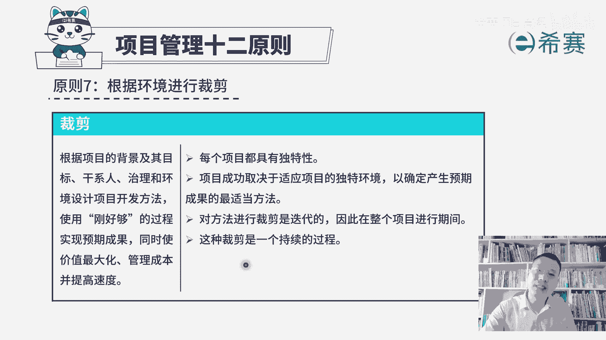
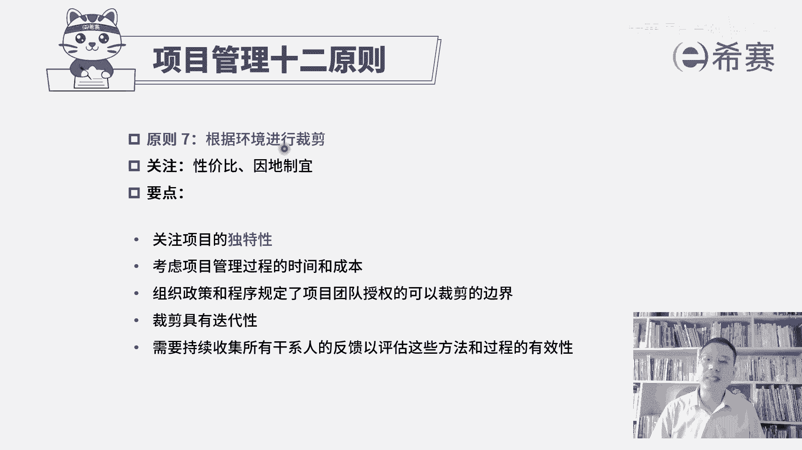

# （附2024年）PMP项目管理《PMBOK指南》第七版精讲视频课程（零基础通关PMP）！ - P118：PMP第七版项目管理原则之07裁剪 - 希赛项目管理 - BV1i64y1a74v

接下来我们一起看到的是项目管理十二原则的第七条，叫根据环境进行裁剪。裁剪呢，我们前面讲过一个词叫取舍。也就是说我们的这些个五大过程组十大知识领域，49个过程，那么多的工具和方法。

你其实是并不需要每一个都用得上。你可以根据这个项目的特性。根据这个项目的需要程度来进行取舍进行裁剪。那我们后面还会学到这一个srant的这个敏捷方法，还会学到敏捷的阶段框架模型。

它里面还有大量这些个敏捷的实践方法，你也是可以根据需要来进行裁剪的那我们一起来看一下关于裁剪。内容是这样的，根据项目的背景及其目标、干系人治理和环境来设计项目开发方法，使用刚好购物的过程。

以实现预期成果。同时是价值最大化管理成本并提高速度。所以这一个裁剪，它其实是能够用刚好够用的这样一种方式来做事情，不要去浪费，这其实也是在节省成本。为什么可以去裁剪？是因为每一个项目它都具有独特性？

这个项目和那个项目是不相同的。我们会基于这个项目本身的特性来去裁剪取舍，看要哪些工具，要哪些方法。项目成功取决于适应项目的独特环境，以确定产生预期成果的适当方法。所以不同类型的项目。

你用的方式和方法不相同。你用的工具和技术不相同。你所要产展现的这一个具体的中间过程结果和最终的成果可能都会略有差异。我们需要去进行裁剪。对方法进行裁剪是迭代的，什么叫迭代呢？他说的是在整个项目进行期间。

你开始想到的一种一个裁剪库，到后面的过程中的这样一个情况，可能会发生一些变化和调整，我们需要去根据实际情况来做出相对应的调整。就像比方说你本来是拿了一把扳手，想要去帮忙，结果后来发现那个扳手根本用不上。

可能需要拿一个螺丝起子，那你再搞一个螺丝起子，类似这样一个意思啊。所以我们在整个做项目的过程中，到底会使用什么样一些方法，使用什么样一些工具。你可能一开始说并没有那么清晰和具体。但是你有个大致的框架。

你已经做了一轮的裁剪。而在整个过程中，你会持续的来进行裁剪，这是关于项目管理的第七条原则，根据环境来进行裁剪，所以它其实会用两个词来去总结，很有意思啊，一个词呢叫性价比。

就如果说你把所有的工具技术都用上，你把所有这几个方法呀，这些个呃工件都做出来，它其实会很耗费资源，很耗费成本。

但是如果我们用裁剪的方式，它就可以用相对比较少的成本来去完成同样的效果。所以是一种性价比极高的方式。并且呢还有一个词叫因地制宜，这也是我们的助教老师来想出一个很好的词，就是我们要因时制宜，因地制宜。

你这个项目本身它是什么样一个情况。我们就采取什么样一种方式来去应对，而不是所有东西都是一股佬一起上。所以这是做裁剪的一个精髓。它关键的是说项目的独特性，并且在整个过程中是考虑到管理的这个时间和成本。

根据需要来进行裁剪。组织政策和程序规定了项目授权的这一个可以裁减的边界。也就是说你要裁剪的时候，也不是随便你想裁就裁。想舍就舍，有些东西它还是有要求的。我们公司会有公司的这些规则，有这样一个要求。

所以这是公司可能会定好了这样一个裁剪的边界。你在这个范围之内来进行适当的裁剪啊，裁剪具有迭代性。需要持续收集所有干系人的反馈，以评估这些方法和过程的有效性。一旦发现这个方法它不起作用。

或者这一个反馈觉得说是这个过程是不太好的那我们可能需要进行一些调整，也就是再一次对这个裁剪进行迭代。这就是项目管理12原中的第七条叫根据环境进行裁剪。

