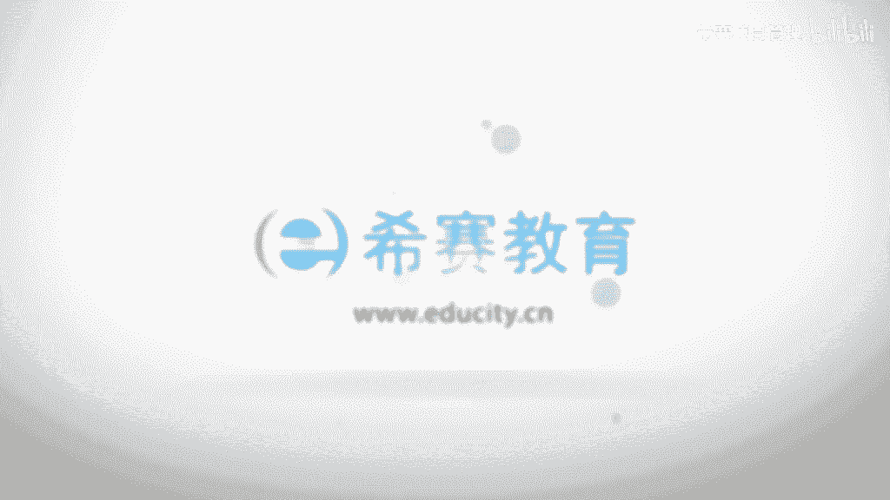

# （附2024年）PMP项目管理《PMBOK指南》第七版精讲视频课程（零基础通关PMP）！ - P30：0501项目范围管理核心概念 - 希赛项目管理 - BV1i64y1a74v

<该字幕由算法自动生成> 大家好，欢迎大家来到西塞教育，我是罗福兴，接下来我们一起共同看到的是拼搏和指南，第六版的第五个章节叫项目的范围管理，那通常我们所理解到的范围呢就是指我们可能要做的一些事情。

以及哪些事情不做，事实上在这样一个知识领域中，他所讲的范围跟你所理解的是一致的，我们一起来看一下，首先范围会分到两个维度，一个叫产品的范围，一个叫项目的范围。

产品的范围呢它是指我们具体的某一个可交不成果，产品的范围呢，它是指的某项产品服务或成果所具有一些特征和功能啊，这个产品成果或服务就是我们说的那个产品的目标，项目的目标，对不对。

也是我们要做一个什么样的项目，我们要得到一个什么样的产品成果或者服务，而这个东西它本身的特征或者是功能，就是我们的产品范围，而项目范围是什么意思呢，项目范围他说的是为了去满足这样一些功能和性能的。

这样一个产品成果或者服务，我们必须要去完成哪些工作，我们必须要做哪些事情，这就是咱们的这样一个项目范围，但有的时候我们会把这样一个产品范围也包含在项目范围之内，就说我就是呃包括了这些功能特性。

加上我要做的工作，这样来说说它的这样一个项目范围，当然事实上对于p m p考试来讲呢，咱们并不需要说完全绝对很严格的去区分他们两个嗯，只是说我们有所了解，会对我们更方便一些。

我们一起来看一下整个项目范围管理，它的这样一些核心概念里面会讲到一个信息，就是说我们在预测性的项目生命周期中，以及在这样一个适应型的项项目生命周期中，关于范围的东西有什么不一样。

首先呢在预测性的生命周期中的话，事实上啊我们应该说最开始就应该定义好这样一个范围，当然它也有可能会做一些渐进细化的这样一种形式，但是如果说在这种适应性的生命周期中。

或者说在一种敏捷型的这样一个生命周期中呢，它就会有大量的迭代对吧，我们有个词叫拥抱变化，那么这样一个大量的迭代呢是会持续的啊，展现在三个方向，或者一个叫做收集需求，一个定义范围。

还有一个在创建工作分解结构，它都会持续的会议啊，重复这些过程在预测性的生命周期中也说，在我们一开始就知道答案的这个生命周期中呢，它通常是在最开始的时候会进行这样一些工作。

然后必要的时候会产生一些实施整体变控制的方式，来对它进行一些更新，而在整个敏捷型或者是适应型里面呢，它就不一样，它会持续的，对于很多过程都会有这种重复，包括说会重复确认范围和控制范围。

确认范围是什么意思呢，他说的是对于这样一些可交付成果的验收，而控制范围他讲的是说我怎么样能够去确保这样一个项目，它所呈现的这样一个情形是一直是维持我的这个范围的基准，然后呃跟我的范围基准没有。

大概没有到了一个偏差的这样一个情形，在预测型的这样一个生命周期中呢，那么确认范围它是在一些重要的时点才会产生，他比如说施了一个可交付成果产生了，或者是在阶段审查的那个时间点会去做这个确认范围的工作。

而控制范围呢是一个持续的过程，从开始到最后一直都会有这样一个持续的范围控制控制范围，那么在预测性的生命周期中呢，经过批准的这样一个范围说明书，工作分解结构以及它相对应的这样一个工作分解结构词典。

他们仨一起组成的这样一个叫范围基准，项目的范围基准，记住了范围说明书，工作分解结构和工作分解结构指点，但是工作分解结合他很多时候都我们直接是写成叫w bs。

叫walk break down structure，工作分解结构啊，它们组成这样一个范围基准，而一旦是得到了基准以后呢，通常是不可以轻易改变的，要改变的话，必须要走流程，走变更的流程啊。

基准它通常是会用来作为一些其他过程的一个参考，然后呢通常它是一个被比较的对象，在整个适应性的生命周期中的话，我们会使用一些未完成的像来去反映当下这些需求信息，这个就是又是另外一种情形就不一样了啊。

那关于项目范围和产品范围，我们前面有看过说产品范围是指的这个产品成果或者服务，它具有的这些功能或者是特性对吧，而项目范围呢是说要满足这样一个功能或特性的这样一个产品，成功或者服务的话。

我们可能需要去做了一些事情，那他的这个验收呢也会有不一样，就完成的标准也不一样，项目范围，它的完成标准就是看这样一个项目管理计划里面的东西有没有做到，而产品的这样一个范围。

它的完成标准就是说根据这一个产品需求来衡量这样一个产品需求，说我要做出一个什么样的一个东西出来，它具备一些什么样的功能特性，诶我们看他有没有达到，是这样来去衡量的，嗯当然他说这边的这样一个需求呢。

是指根据特定的一个协议或者其他强制性的规范，而产品成果的服务必须具备一些的条件或能力，所以是这样一个关于需求啊，还是这样一个需求的信息啊，其实也就是说我要产生了这样一个产品成果或者服务有什么功能啊。

特性啊，这样一个东西啊，然后确认范围这样一个过程，它指的是说正式的验收，所以你记住这两个词要把它关联起来，你只要看到验收，你要想到确认范围，你看到确认范围，你要想到验收啊。

确认范围是验收已经完成的这样一些项目可交付成果的过程，那么这个东西它是来自于哪里呢，首先肯定要去执行，对不对，通过那个指导与管理项目工作，就是在第四章中有一个叫指导与管理项目工作。

通过它以后呢产生这样一些可交不成果，然后呢再到那个质量控制的这样一个呃项目质量管理，这样一个知识领域中有一个控制质量，那么通过控制质量呢得到一个确认的可加成果。

然后再到这边来得到一个验收的可将成果啊冲啊，这边有说明啊，就是从控制质量过程的输出得到一个他不叫何时，它的中文翻译叫核实核实的可交不成果，他作为一个确认范围的一个输入。

而这个验收的可交付成果呢是作为一个确认范围过程的一个输出，并且呢他需要得到一些相关办的一个正式的签字批准，所以他这个验收不是得玩，它是真的验收哦，只是说最后的结束项目或阶段的时候的验收呢。

它是一个流场上的一个也需要签字的一个走过程，走流程的一个验收啊，相关方需要在规划阶段的早期的时候要介入，对于可交付成果的质量提出意见，以便控制质量过程中能够形成以此为依据的绩效。

并且提出必要的这些变更的建议啊，事实上这一句话啊，就早期介入这句话，很多各个知识领域中都会说，大家尽量的早期介入都会有好处，事实上是你越早接触的话，你对这样的信息了解的越多越充分，那么你做处理的话。

