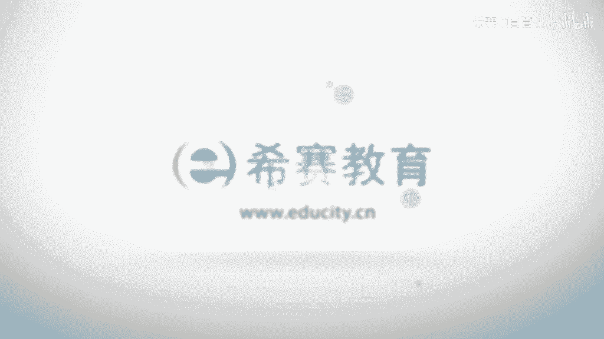

# （附2024年）PMP项目管理《PMBOK指南》第七版精讲视频课程（零基础通关PMP）！ - P76：0805质量功能展开、质量与等级 - 希赛项目管理 - BV1i64y1a74v

接下来我们要一起分享到的这样一个工具呢叫质量功能展开啊，质量功能展开这样一个工具呢，事实上它是呃跟我们收集需求这一块很相似，只是说他会重点关注的，是说把这样一个需求和质量的这样一些特性所关联起来。

我们来看一下介绍，是这样介绍的，说质量功能展开呢，它是把用户需求转换成产品功能的这样一种方法，这样的话能够去知道哪些个需求才是客户会比较关注的，能够去满足它是比较重要的，它首先是从收集需求开始。

我们可以看一下它的步骤啊，看完这样一个步骤可能会比较清晰，他说先将用户的多种需求，然后列成一列，排列成一列啊，这是一个需求的信息，然后呢将产品的这样一些特性，就功能啊特性的一些列表作为一行。

然后这样的话不就形成一个矩阵嘛，对不对，就形成一个矩阵，这样的话呢他把这样一些需求和这些质量特性，功能特性相关的东西关联起来以后呢，由专家来集体讨论每一个特性和需求，它们之间的这种关联性。

这样的话我们就可以去知道哪些东西是我们比较重点需要去关注的，然后呢经过一个加权来去把它们做一个排列，那这是关于一个质量功能展开，当然了，事实上考试并不会让你去详细了解这么多内容，要去做这么讯息呃。

你只要需要知道这样一个质量功能展开呢，它是项目质量管理中的一个工具，它是一种收集质量需求的一种方法，然后另外再看到一个概念叫质量和等级，我们前面其实有看过这样一句话，叫质量不等同于等级对吧。

一个东西它可以是质量很高，也可以是质量一般，也可以是质量很低，然后他等级不变，当然它也可以是质量是相等，类似的情况下等级很中等，等级很高，端，等级很低对吧，但是有一个信息你需要清楚。

就是质量水平如果比较低，那么肯定就是一个问题，而如果等级比较低呢，它不一定是问题嗯，最简单的例子，比如说我们说打火机的话，呃你用那种很高档的这种打火机，那也就是把那个烟点燃了。

你用一根火柴也能够把烟点燃，他们的等级差别会比较大，但它质量不一定有多大的问题，就是说一盒火柴可能是，但现在买火柴已经很难买到了啊，嗯就是买那种比较差的打火机，五毛钱一个，一块钱一个。

他也能把你点燃烟对吧，那么你买一个几百块的，甚至是更昂贵的，他也只是帮你把一根烟点燃，那么这种的话等级的高低是有很大的一个区分，它是什么呢，他是说对于用途相同。

但是技术特性不同的产品服务的这个级别的分类，也就是说你都是要去把把火打着的这样一个东西，但是呢显得逼格不一样，有没有啊，这是关于等级啊，所以有的时候有些人用手机，你用一个1000块的也好呀。

3000块钱也好呀，我就用个水果手机也好呀，然后包括还有些人用什么啊，什么40万的那种奢华的手机，不就是打电话吗，然后就觉得等级比较比较不一样，对吧啊，然后还有一个呢是质量。

那质量呢它本身是说一系列内在特性满足需求的程度，而这样一个特性满足需求的程度呢，呃就是说能够分出好或者坏，就这个质量可以分好坏，等级可以分高低，但是质量好的当然是大家都满意，如果质量不好的呢。

也许就没有办法用，就不能用啊，所以质量问题它就是一个问题，一般来讲的话那个等级比较低，但是质量比较高的这样一些产品其实还是比较受欢迎的，也比较能够占领市场，就是这样的话呢，它又实用。

同时价格又低1年对吧，其实就是我们所谓的物美价廉的这种感觉啊，项目经理和项目管理团队负责权衡一边，同能够同时达到关于质量和等级的水平要求，因为有的时候我们不完全都是在追求质量。

当你上升到另外一个层次的时候，你可能会更加想要去追求这样一些等级，就是要用一种什么豪华版啊，奢华版啊之类的对吧，嗯如果没有满，如果没有足够的成本来去满足基金项目的需求的话，可以降低它的等级。

但是不能够骑行质量，这是他的底线，所以等级和资源是一个很明显的差别，你可以用那个标配版，你可以用豪华版，但是你的质量一定是都要达标啊。

