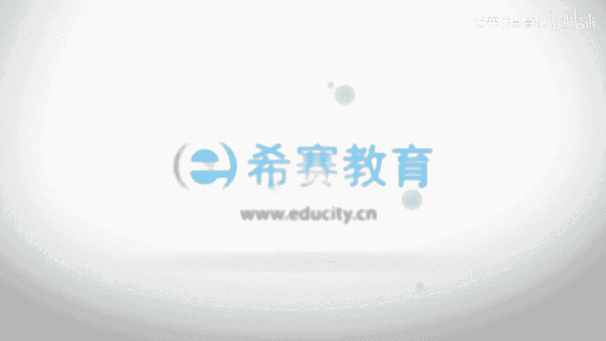

# （附2024年）PMP项目管理《PMBOK指南》第七版精讲视频课程（零基础通关PMP）！ - P77：0806项目质量管理核心概念 - 希赛项目管理 - BV1i64y1a74v

呃接下来我们看到的是关于项目资源管理，这样一个知识领域中的一些核心概念，事实上我想要说明一下，就说我们前面的那些内容中，好多都是在建一个什么核心概念啊，发展趋势啊，这些内容里面啊。

也就是说对于前面的那些内容，你是需要有所了解的啊，我们这边呢就是把那些重复内容就已经去掉了，只把那些没有重复内容给展现了一下，首先项目质量管理，他需要去兼顾到项目管理和项目可交付成果两个方面啊。

什么就是什么意思呢，就说兼顾到项目管理研究过程的这个维度，对不对，而可交互模式的是最后一次交互的这样一个成果的维度，结果的维度也说过程和结果都很重要，都是我们质量管理需要去关心的。

质量测量的方法和测量技术，需要专门针对项目所产生的可叫成果的类型来定，就是说不同的项目它产生可是要成功不同，那么你用来做测试的方式和方法可能会有很大的差别，无论是什么项目，他如果没有达到质量的要求。

那么都是不行的，都是会带来严重的负面后果，比如说我们前面有说了一个赶工对吧，赶工快速跟进，那么赶工的话有可能就让大家去大量的加班，如果让大家大量加班，让他超负荷的去工作，有可能会导致一些各种风险。

导致什么员工有疲劳啊，出错呀，办公呢这些的话都是一个很严重的后果，还是为了抢进度去仓促的完成预定的这样一些质量检查，有可能会导致检查有疏漏，有可能会是有一部分重要的东西没有被检查到，那么项目质量管理呢。

其实呃在不同的情形下出现一些质量问题，然后我们去响应，他付的代价是有很大的不同，那这边给质量的管理做了一个梳理，就是有通过有效性的递增的这种方式来去排列五种质量管理的水平。

首先水平最low的就是也是付出代价最大的就是让客户去发现缺陷，我们说那个项目的质量的成本用非一致性成本来衡量，那么就产生这些外部的非一致性成本，然后这种方式，然后我们来去管理质量。

那么这个质量管理水平是最烂的，是最应该要去避免掉的啊，第二种呢是控制质量过程中，包括先检查和纠正缺陷，然后呢再去交付成果，那这个过程中我们是去检查和纠正缺陷，我们前面已经有讲过。

预防生育检查检查只能够把已有的这些bug给找出来，是尽量找出来，还不一定完全能找出来，那么这种方式呢也不是比较理想的这样一个状态，所以他排在倒数第二，第三个通过质量保证检查和纠正过程本身。

而不是做一个特性的特殊的缺陷，也就是说他会关注整个在实施过程中，关注这个过程，也是我们做了一个质量管理，做质量保证的本身，关注过程的话，因为通过对过程的关注，所以呢它的结果往往会相对来讲会比较好一些。

或它总体来讲他那个好的概率会大很多啊，它也能够更加的让客户满意，所以这种方式是比较可行的，第四个，将质量融入到项目和产品的这些规划和设计中，这里面把它放到更前面去，放到规划和设计中。

也就是说我在前期做质量规划的时候，我在做一些其他的规划的时候，我都会考虑质量这一个维度的信息，那么这个的话当然是更加好了，就是好上加好，对不对，然后到了最后一个，他说将整个组织类创建一种关注。

并致力于实现过程和产品质量的文化就是不断优化的建议，感觉在里面这个的话就已经是很难得啊，就真的是把质量作为一个生命线来去对待，来去把所有东西把它融入到你的日常的工作中呃，这是一个质量管理的一些核心概念。

然后我们再看一下质量管理中的一些趋势和新兴实践啊，我再一次说明趋势和新兴实践书上的这样一些内容呢，有一些在前面已经讲过了，我们就把它给不再重复讲，我们就只讲就是少部分啊。

现在质量管理方法中会力求缩减差异，然后交付满足基金相关方要求的这样一些成果，那么它的趋势可能包含一个是客户满意，ok要说是我们需要去了解客户它的这样一些期望，然后呢尽可能去评估，然后发现如果ok的话。

我们要去实现它的这样一个期望，这是很重要的一个内容，因为你最后做的这个产品最后是要送到客户手上，是要去给他使用的，所以客户满意度是一个很重要的一个参考信息，然后第二个呢是持续改进。

这个我们其实也已经有讲过对吧，就是通过pd c a环的这种方式来去不断的循环，来去持续对这一个项目的质量有改进，每一轮不说是一定要改进有多大，但是呢我们持续的在这样一个状态中，那么他早晚会变得越来越强。

第三个是管理层的责任，就是说管理层对于整个质量的这个情形是有很大的一部分责任，甚至超过了80%以上的责任，因为老板越重视这个事情就越好，做老板不重视，这样就会也会比较马虎啊。

因为本身的话你老板才能够给到大家提供这些资源，但我说的老板他不一定就能说说是那个公司的董事长，就叫老板啊，就是是那个管理层的那些boss层，还有一个呢是与供应商的互利合作的关系。

事实上现在这个社会很少有一个事情是你一个人单打独都可以做完了，对吧，通常都是有一个很多人来去互助协作才能够完成的，那么你跟供应商的关系其实不是一个对立的关系，你们之间要去合作的话。

能够让这样一个事情更好的去进展，这是关于趋势和新兴实践，然后我们再看一下关于裁剪，对于质量管理的裁剪呢，他需要考虑的因素包括这一些，一个是政策的合规和审计，就是我们有哪些质量的政策和程序。

我们在建一个组织中，我们去做项目的质量管理的话，可能会用到哪些工具和技术，这个的话我们是需要去考量的，那么如果觉得是完全不要用的，我们可以把它给裁剪掉对吧，裁剪其实是两个维度。

一个维度是把过程直接给裁掉，就不需要这样一个项目的管理过程，还有呢是把过程中的一些输入呀，工具和技术呀，还有输出啊这样一些内容给裁掉，就是根据你的需要只选择某一些输入工具和技术。

还有输出这两这两个不同的裁剪啊，第二个说是标准和法规，合规性是否存在一些必须要遵循的这样一些行业标准，如果是必须遵循的话，你肯定是不可避免对吧，这个的话作为一个重要的一些输入信息持续改进的这样一个维度。

如果说你的项目中怎么样去做这样一个持续改进，在组织层面上，还是在单个项目中做持续改进，你也是需要去考虑，那么对于你的裁剪也是有一些要求，相关方参与这些信息，他其实说实在对我们来讲只是有一个大致的印象吗。

然后再看一下说关于敏捷适应性的环境中的这些要考虑的因素，因为整个敏捷的环境的话，他就是不断的去做一些新的需求过来，然后不断去想硬件性的需求，不断去面对或者是拥抱这样一些变化对吧。

所以他这边对于质量的要求，他是这样来说的，他说敏捷方法呢要求多个质量和审查步骤贯穿在项目的整个过程中，而不只是面临在结束的状态执行，也就是说我们其实可能说是每一轮迭代的时候。

每一轮的时候我们都要有一个完整的这样一些讯息，就是包括去做管理质量，去控制质量啊，都要去做循环回顾，定期的检查质量过程的一些效果，寻找问题的根本原因，这都是质量的东西啊。

然后去建议实施新的这些志愿改进的方法，这还是质量管理的内容，而后续回顾会议评估实验的过程，然后确定是否可行，是否应该技术以以及做出一些什么调整，以及啊或者直接弃用，这都是质量管理中的内容。

你可以看到它有个词叫循环回顾，这些东西定期做检查嗯，为了促进频繁的增量交付，敏捷方法关注于小批量的工作，尽量让到尽可能多的这些交付成果，那么也就是说我其实每一批的这样一个成果。

我都需要去做这样一个控制质量的过程啊，我们我们在后面会看到，就是控制质量呢是对于这样一些可交付成果来去做检查，看质量到底过关不过关，所以但凡是在这种敏捷性的方法中的话。

其实很多事情原来是说在某一个时间段做的事情，现在是从头到尾一直要做，一直一直不断不断的去做。