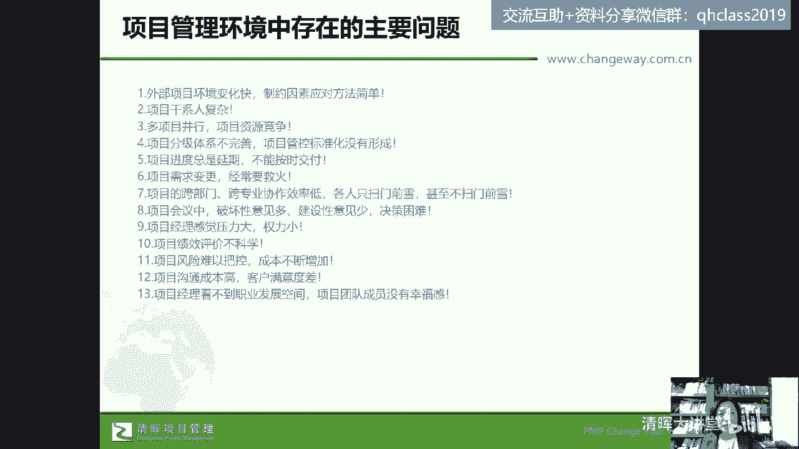
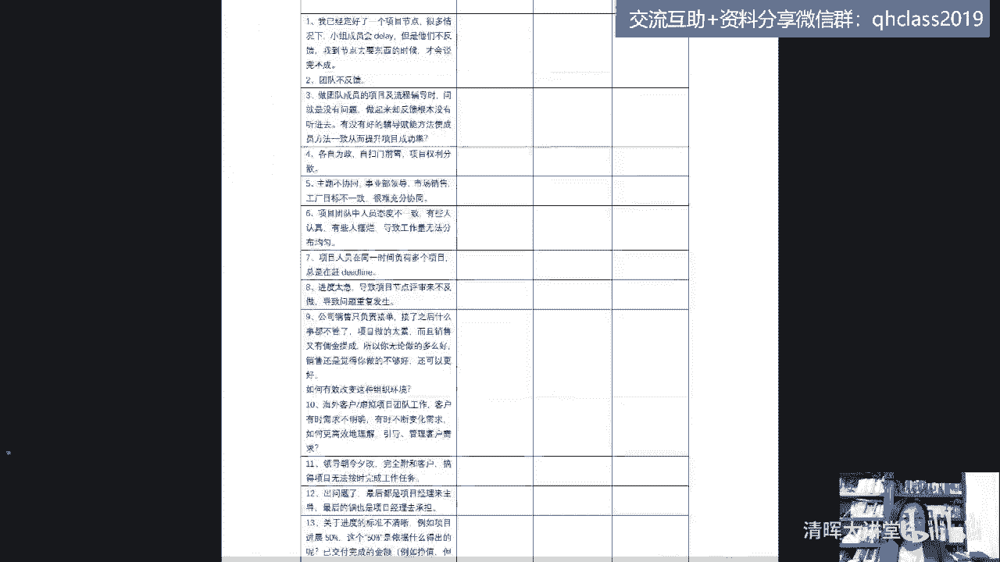
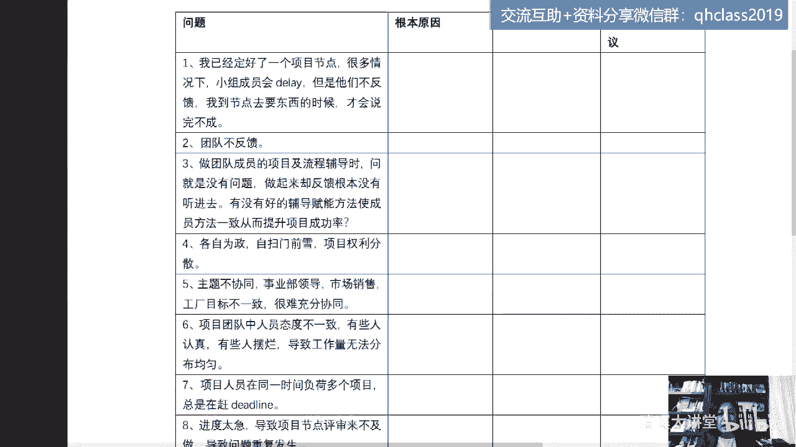
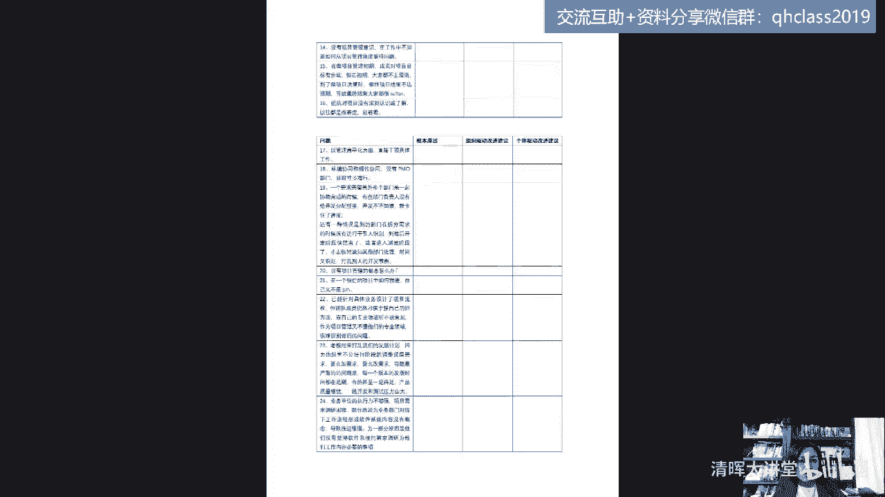
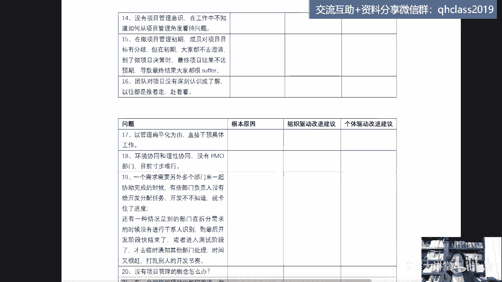
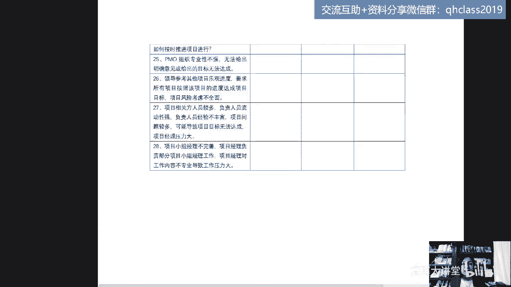
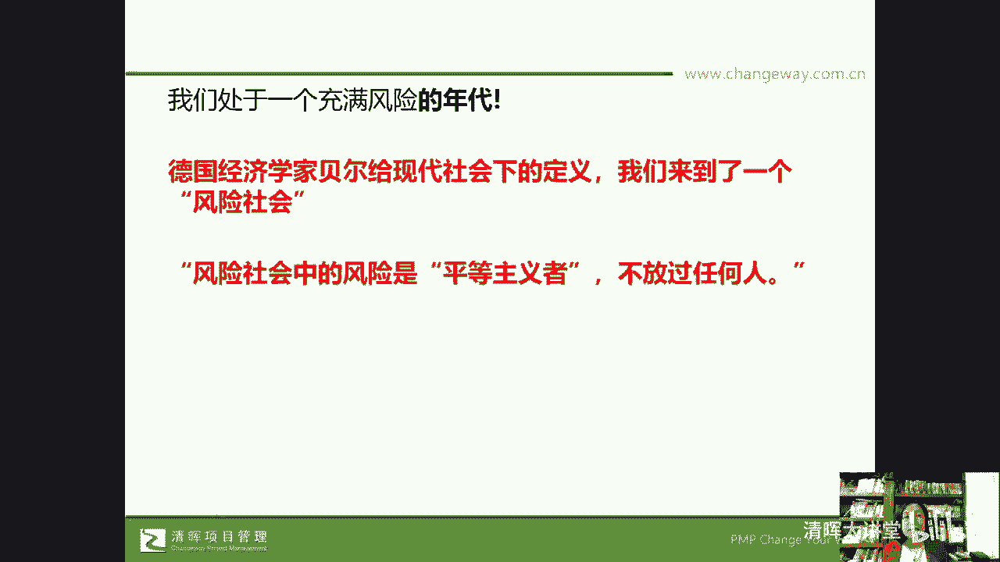

# 🔥项目经理必看！28个棘手难题一网打尽，实战解决方案助你轻松应对💼 - P2：2.28个项目管理实战问题 - 清晖大讲堂 - BV1fztLezEZK

好我们来看看在这家公司呢我们总结了一下啊，总结了一下他们这些问题，后面我们会有这个命问题的明细，我们总结了一下这些问题，它存在的什么呢，它存在的这个呃类型和大概大的问题，比如说外部的项目环境变化快。

制约因素，应对方法简单，这个问题我不知道，咱们今天晚上带到现场的学员呢，有多少是来自于这个座椅方向的身份的啊，在项目经理这个身份上，在公司这个角色上是乙方，那实际上就真的要面临着这个客户层面的。

项目环境变化快，客户层面的这个需求变更了，干系人发生变化了啊，这个评价主体发生了变化了，验收标准发生了变化了等等，甚至甲方和乙方捆绑在一起来交付产品，就乙方为甲方做交付。

然后甲方要拿这个产品去应对整个市场的时候，那竞争环境也发生了变化，那所以呢第一大问题就是我们的外部，项目环境变化快，制约因素对应方法简单，第二就是在这个企业当中，大家普遍反映就是项目的干系人非常的复杂。

第三就是在公司里头多项目并行，项目资源相互竞争，唉资源打架，资源不够用，尤其是核心资源好，那还有第四，因为多项目并行资源竞争就表现出来了，就是什么样的资项目配什么样的资源，是根据什么来匹配资源。

争取资源，那是跟项目经理的人脉关系吗，去刷脸吗，或者说谁会哭，谁就有有奶吃吗，对不对，所以我们说呢项目的分级体系不完善，项目的管控标准没有形成，那接下来就是项目进度总是延期，不能按时交付。

唉这个乙方老板很难受，乙方项目经理很难受对吧，经常要看甲方的脸色唉，甚至被有罚则，那么第六呢是需求变更，经常要救火，然后第七，那么每一个项目的交付过程中，都面临着跨部门跨专业的协作效率低。

个人只扫门前血，甚至不扫门前雪，这样子整个组织就很拉垮，然后在日常工作中，大家普遍反映我们的项目会议唉，会议多，会议长唉，会议臭臭呢，不解决问题嘛对吧，破坏性意见多，建设意见少，一开会大家就吵架。

就互相抱怨，就经常甩锅，然后决策困难，然后我们的项目经理自己就感觉压力大，权力小，然后是项目的绩效评价不科学，这个压力大，权力小，吃苦耐劳背锅，最后呢可能回报又不理想，然后项目风险难以把控。

成本不断增加，项目的沟通成本高，客户满意到差，然后是项目经理看不到我们的职业发展空间，项目团队成员没有这个幸福感，那我想问问大家，你们有没有遇到过类似的问题，愿意分享一下吗。

看看大家有没有遇到过这样的问题，或者类似的哪一条问题，在你的环境中，在你的企业当中，在你的项目当中有没有这样的问题，或者是这样的一些困惑有吗，有能具体的点一下是哪一条吗，我想看再下一题目一有类似的问题。

第二是哪一条让你最头疼，看到了你就觉得哎呀，这个就是我现在遇到的，这个就是我们公司的第二条项目干系人复杂嗯，有同学反馈了第13条，项目经理看不到职业发展空间，团队成员没有幸福感，挺痛苦的是吧，还有吗。

五是五吗，三个五呃，进度延期不能按时交付也是常态化的问题了，是吧好，那也感谢大家给我的一些反馈啊，就看来有些问题可能还是相对比较普遍的，那么有人提到问题，说产品中心材料交付推迟影响进度怎么处理好。

也感谢大家能够及时的去呃提问啊，那我来翻译一下这个问题是指，由于是产品在产品中心工作，由于这个材料交付推迟影响了进度，然后怎么处理是吗好，那实际上呢我们想说第一步，先来快速的回答这个问题啊。

第一我们要给这个问题去定性，那比如说材料交付推迟，在我们的项目管理中有个工具叫什么呢，叫根因分析，我们首先去分析它的结果是进度延误了，但是我们要分析它的原因，比如涉及到这个干细人的管理呀对吧。

涉及到采购管理呀等等啊，那么在我们怎么处理问题之前呢，我们首先要去分析这个问题，我们后面也会讲到这一点，好吧好，那么我们如果大家有问题，也可以在我们的评论区打出来，我们会后面会做一些反馈啊。

那么在这家企业中，我们找出了问题，唉，问题的这种什么呢，嗯重复度最高的唉，相当于说我们用这个直方图，我们用这个帕累托图，大家都知道吧，直方图其实就是我们的柱状图，我们把多类型的问题给它合并，然后呢。

把这个频问的问到的频率比较高的梳理出来了，13项总结了，那么我们用帕累托图呢，又会找出主要的原因或者主要的这个问题，帕累托图，大家知道帕洛特定律，二八定律对吧，哎那么我们再来看看啊。

给大家看点这个我们企业中，我们收集到的这个问题，为这家企业来做咨询的时候。

他们的项目经理提到的问题大概有20多个啊。

你比如说这个问题都非常非常的具体了，哎那么我已经定好了一个，我们就举个例子吧，看看第一个问题，问题不排不不分先后啊，我已经拟定了一个项目节点，很多情况下小组成员会比类，但是他们不反馈。

我到节点去要东西的时候才会说完不成，你们遇到过这种情况没有，大家注没注意到第一个问题，就是小组成员会抵类，但是他们不反馈到节点了，告诉你完不成，还有日常的过程中团队不反馈对吧，那还有第三个问题。

做团队成员的项目及流程辅导时问，就是没有问题，做起来却反馈根本没听进去，有没有好的辅导赋能方法，使成员一致而提升项目的成功率，这些问题你们有遇到过吗，嗯第四个各自为政，自扫门前雪，向权力分散等等啊。

这个呢就是我们在什么呢，我们在这个呃这家企业去做咨询的时候。

哎收集到的问题，你看啊。

这是16个问题，这边呢再往下来我们收集到了什么呢。

我们来看一下最后一页，我们嗯他们公司呢，这个项目经理的团队大概有20多个人啊，我们把这个重复的问题合并之后，非常细的剧叫做原生态的对吧。

28个问题啊，28个问题，这道题问的是项目小组经理不完善，那么项目经理负责部分小组经理的工作，但是项目经理对工作内容又不专业，导致工作压力大，唉这也涉及到了我们所说的啊，我们所说的一些具体的问题。

通过我们这些问题呀，大家实际上会干什么，会注意到这都是原生态的，我们的项目管理环境中的问题啊，项目管理环境中的问题好，那实际上我们如果一对一的去解答，这个问题的话呢，嗯是能做得到的。

我们今天晚上也会在我们课程的后半期啊，我们今天晚上大概两个小时的时间，我们在课程的后半期呢也会干什么呢，也会去给大家挑一些问题来做一些解答，但实际上如果我们的企业不能够建立，我们的一个管理的这个方法论。

去系统性地解决这些问题的话，那随着铁打的营盘流水的兵，那么就真的是1000个人有一千一千个哈姆雷特，对吧，实际上就大家会这个问题层出不穷，这次这家企业之所以去购买这样一种咨询服务。

为他们的在某一个时间段，为他们的项目经理来请这个咨询顾问做coach，相当于类似于做项目管理的心理辅导，或做项目管理的方法论的一对一的辅导呢，实际上也是这个原因好，那么我们先把这些问题先放一放。

刚才是给大家看了一下，我们这次给项目经理的回信，是要针对什么样的问题，都是真材实料的原生态的这些问题啊，原生态的问题，那么我们来看一看在这家公司啊，我们跟他们的什么呢。

跟他们的这个老板，跟他们的管理的高管团队。

怎么去看待这个问题啊，怎么去看待这个问题，刚才我们已经给大家演示了，我们的项目管理问题，停车场我们刚才跟大家分享的一共有28个，真的是来自于一线的，用他们老板的说叫做我们的战斗英雄们。

这个老板你们会说老板是不是太会PPUA了，是不是真的把他们的项目经理，称作为是战斗英雄，因为他们做乙方做得很辛苦，而在过去的3年里，大家都知道所有的企业的生存都不容易，这家企业挺过来了，熬过来了。

因为我们这个项目是去年做的嗯，尤其大家知道去年是非常艰难的一年，对于企业来说，对于每一个个体，对于每一个组织来说都很难，但他们熬下来了，老板怕大家熬不下去，怕大家的心气儿散了，那怎么办呢。

就在去年的这个大概是8月份的时候，请我们去做了这样的一个项目，那么正好去年8月份我们这个服务了三个月，在11个月里头跟他们的自上而下的流程，标准的优化和自下而上的这种，1V1的一个服务。

来优化了整个企业的项目管理的生态环境，我们也愿意把这个作为案例来跟大家分享，和聊一聊啊，好那么我们项目管理问题的停车场，先给大家做了一个简单的这样的一个梳理啊，做了一个简单的这样的一个梳理之后。

我们来看一看唉具体的这样一个有意思的事情，就是这个图片我相信大家啊都不陌生，那么很多人可能在网络上也见过这个图片，那实际上刚才我们讲的，比如说这个第一个问题，大家没注意到。

在他们公司归类出来有外部环境变化快，制约因素，应对方法简单，我想问一下，当你看到这个图片的时候，当你看到这个图片的时候，你觉得这个项目是不是失败了，当你看到这两张图片，写了个客户需求，实际产品。

你觉得这个项目是不是就失败了，请告诉我，你觉得看完这个图片代不代表这个项目失败了，有人说那一定是失败了呀，我要的是一个大美女，可是你怎么给我交付的是一个壮汉呀，对不对，有同学说不代表他失败了，对的。

这个项目并没有失败，也就是说第一你们说啊，这个因为有产品出来了对吧，我们做出来一个东西了，实际上这个项目没有失败的原因是什么呢，是客户一开始提的需求就是什么，就是一个这样的美女。

但是随着我们刚才在这家企业总结的问题，就是环境变化，最后在这个过程中，甲方和乙方不断的变更需求，不断的共创什么呢，共赢最后真正需要的产品就是这样的一个产品，所以这是我们最初的一个什么呢。

我们最初的一个需收集的需求，最后客户验收的唉，他要的是这样的一个产品，这就意味着我们要经历大量的一个变化，这种你想，如果我们一开始的能力是做这样一个美女出来，产美女产品出来，可是最后的挑战和客户的要求。

是做这样的一个壮汉出来，那对团队的要求和挑战大不大呢，那么当我们面对着这样复杂的需求变更，这样的环境变更，我们的团队的韧性够不够呢，我们团队会不会去抱怨，特别多的抱怨，就会导致这个项目团队没有战斗力了。

没有交付力了对吧，那我们可能就做不出来客户要的东西，那么我们可能下一次客户就不给我们机会了，所以说当我们看到这个图片的时候，有可能是一种情况，是客户就要的是美女，我们做出来是壮汉。

那也有可能是客户一开始要的是美女，但是他不断的变更需求，最后他要的是一个壮汉，这都有可能，所以对于我们的项目经理来说，我们一定要有一种见过世面的样子，我见过各种各样的客户，见过各种各样的项目。

我见过各种难度的管理过程，因为我们说呢在这个世界上，一切都是在发生变化的，那么我们看通过这个故事，透过现象看本质，故事的背后问题的本质是什么呢，所以刚才问大家，这看到这个图片代不代表这个项目失败呢。

不代表啊，它代表了什么，代表了这个世界上资源永远不够用，而这个世界永远在发生变化，我们自己其实也一直在发生变化，那么真正的财富是什么，不是现金流啊，是我们的思维，对不对，是我们的思维。

那么我不知道大家有没有做这个嗯，做这个嗯嗯商商超行业的对不对，哎那么做电商行业的，在官方报道中，因为都是上市公司嘛，2011年的苏宁，这是有官方报道的啊，它的营收和利润是超过阿里和京东的，2011年。

10年以后，2021年，大家都知道苏宁暴雷，对不对，到现在为止摇摇欲坠，摇摇欲坠对吧，如果你关注财经新闻的话，那么大家思考一下2011年的苏宁，他的营收和利润，营收是什么，就是他的收入啊对吧。

利润是什么，利润是它的这个企业的这个价值啊，盈利能力啊，那么大家思考一下，为什么10年之后苏宁摇摇欲坠呢，这期间发生了什么，我们说我们认为真正的财富是这个企业的思维，我在2015年的啊。

8月份还是777，8月份曾经给苏宁，在这个南京苏宁总部去上课，其实是一个这个也是给一个高管团队，中高管团队上的课，那其中有一位当时的听课的这个学员，是他们的一位一位高管啊。

那么嗯后来我们成为这个不断地通过交流，他们公司的项目管理成为好朋友，他跟我讲，他说其实在2015年的时候，苏宁是有一次这种刹车，苏宁是有一次这种调整分水岭的调整，但那次机会被苏宁的管理团队给放弃了。

尤其是创始人团队，大家都知道哎，这个张少东张靖康父，对不对，哎所以说呢在10年前到现在为止，12年前，营收和利润能超过阿里和京东的一家企业，但现在摇摇欲坠，核心在于它的管理思维啊。

在于他的管理思维的一个调整，那我们当今的社会是什么一个状态呢，我们说我们处于一个充满风险的年代，这个德国经济学家贝尔，在1986年就写了一本书，叫风险社会，它给现代社会下了一个定义，就是我们人类。

由于按理说我们既科技要为人类服务的对吧，但是随着高科技的发展，那么实际上，我们人类史无前例地来到了，一个巨大的风险社会，那风险社会中的风险是平等主义，他不放过任何人，真的是这样子。

而且风险它既代表了机会，也代表了威胁，那机会和威胁对于每一个人来说都是平等的，他不放过任何人，而任何一个有准备的人，也有可能去抓住某一些机会，那在这样的一个状态下，有一些更形象的说法。

这个名词大家都不陌生了，对不对，叫乌卡时代。

