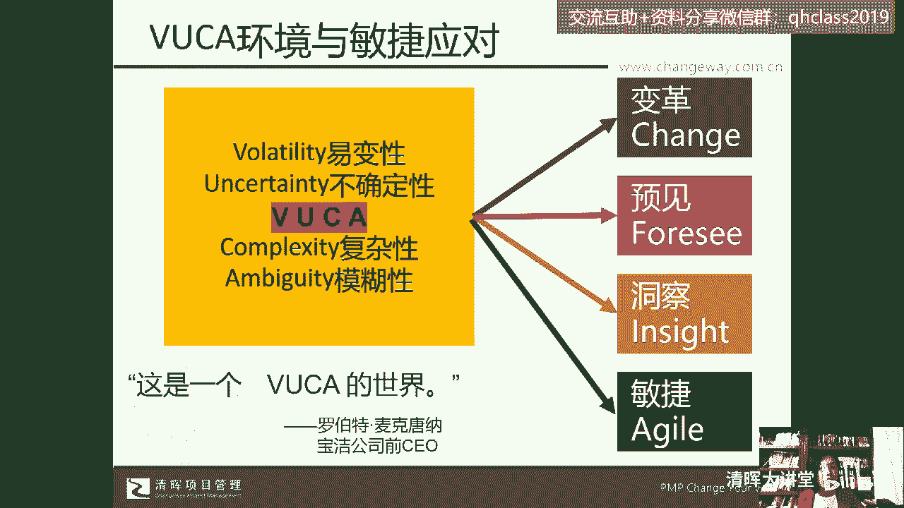
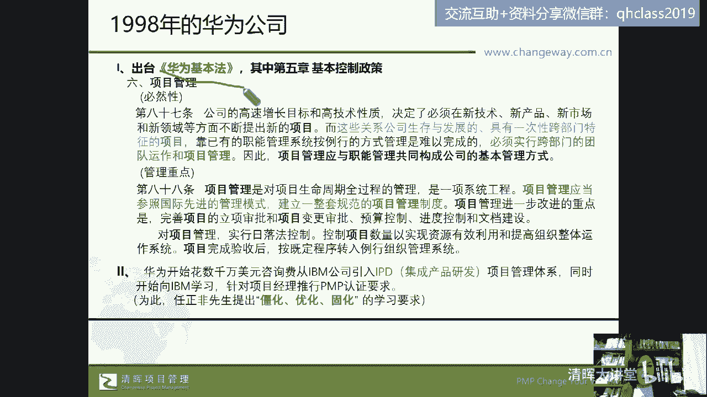
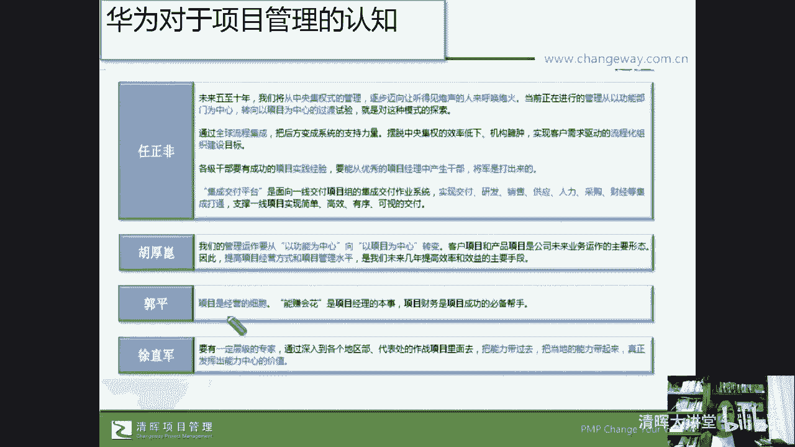
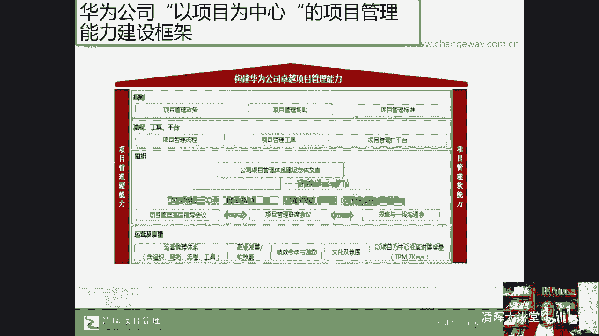

# 🔥项目经理必看！28个棘手难题一网打尽，实战解决方案助你轻松应对💼 - P3：3.华为项目管理业务架构 - 清晖大讲堂 - BV1fztLezEZK

台下咳有一些更形象的说法，这个名词大家都不陌生了，对不对，叫乌卡时代，那乌卡时代的起源来自于这个美国特种兵，当特种兵去执行任务的时候，他面对的任务和执行任务的环境是变化的，不确定的，模糊的，复杂的嗯。

我记得在这个过去的3年里，我在电影院啊，不算今年春节看的这个春节档的电影，那在过去的3年里头，我看了两部电影，一步是悬崖之上，一半步是万里归途啊，这个都是这个张毅演的，我也很喜欢他。

我从我从这个士兵突击的时候，我就很喜欢他，因为在士兵突击里，他演了一个非常普通的，但是很有很有这个任性的这个许三多的班长，对不对，哎，那么在悬崖之上那部电影里头，他们空降到茫茫的东北林海雪原里头。

他们作为一个特种小分队，他们的对象任务环境就是易变的，不确定的，跟他们接头的人，大家都注意到了，如果有人看过这个电影，就知道对方其实就是什么，就是身份有问题的，可是你不知道有没有问题对吧。

下一步任务往哪里走，对象是谁，怎么执行，执行到什么程度都不确定，这就是来自于军方的一个说法，那么我们把它叫做什么呢，叫做乌卡，那么实际上啊实际上我们说的叫什么呢，这个应用在商业社会当中。

来自于这个宝洁公司的前CEO麦克唐纳先生，他认为我们的商业环境就是一个乌卡的世界，那面对这个乌卡的世界，我们是不是就束手无策了呢，我们需要去敢于积极的去变革，就是应对变化的方式，就是变化。

以前有句话叫做以不变应万变，这句话有它的正确性，但是应对变化的方式依然是变化，这句话我觉得也有它的一个正确性，然后我们要有一定的预见性，我们要有洞察能力，我们还要深算灵活什么呢，身形柔软，我们要有敏捷。

那这种预见性和不断的一个变化，我们来看看在中国一家伟大的和成功的企业，他们在在近几十年的发展过程中，大家都知道，遭受到的是全世界的这个，所谓的这个霸权主义的一个打压，可是这家企业依然在努力。

它就是我们值得骄傲的中国企业之光。

华为，那么大家看看华为，从他唉在86年这个创业到现在，这几十年的过程中，他其实一断不断的，非常符合这个人和企业的这个发展规律，就是波浪型的波峰波谷，波峰波谷对吧，那实际上华为也一直在经历着。

他在每个不同的时代，或者每个不同阶段的这样的一个困难，那么在怎么说呢，在这个华为在上个世纪末的时候，实际上也遭受了低谷，在遭受低谷的时候，他们在寻找解决方案，他们的解决方案其实是在19898年初。

他就选择了一个管理方法，纳入了他的企业管理，这个刚性原则中，就是把项目管理纳入到了他的什么呢，纳入到了这个叫什么呢，他的管理原则中，他认为公司的高速增长和高技术企业，决定了我们必须不断的会有项目哎。

新技术，新产品，新市场，新领域，其实项目这个词啊，在我们中国人的日常生活中非常常见，那比如说在前几年啊，在北京有这个中关村的创业一条街里对吧，唉创业咖啡里，那个时候去那个什么呢。

3W咖啡馆坐下来都找不到一个位置，全民创业那个年代，还有现在其实在公交车上，在地铁上，当然现在大家可能慢慢的也习惯了，不在公共场合去喧哗，但是我觉得在在前两年你就是在各种公众场合。

你听到的最多的就是我有个项目，我有个项目外，我们公司有项目，但是有项目不一定包括到现在，这是1998年的华为，到现在不一定有非常多的公司愿意，因为有项目，所以我们就对项目怎么管这个事。

静下来坐下来好好的聊一聊，把它变成我们的一个企业的共识和管理动作，刚性的一个流程标准没有，那么华为做到了，在上个世纪末，因为我们有项目，而这些项目又是与公司的生存发展密切相关的。

而项目本身的一个特征就是跨部门的，在英国项目管理体系prince two体系当中，英国项目管理体系，prince体系中对于项目的特点的定义中，就叫跨职能，跨部门，而偏僻美国项目管理体系中。

对项目的定义是独特性的，临时性的，但是在PRINCI体系中，它会直接有一个特点之一就是跨部门，而1998年的华为就有这样的认知，既然是跨部门，既然与公司生存相关，既然有项目。

那么我们已有的管理体系就不行，我们必须要应对这种特征去建立一个管理机制，那么就是项目管理，项目管理要与我们的运营啊，职能管理啊，来构成企业共同的基本管理方法，大家都知道这段话的重要性和它的严肃性。

就是华为自己内部的管理法则。

那么你们公司是不是把项目管理，有没有建立项目管理流程，有没有建立项目管理的机制，并把它作为公司的刚性要求提出来呢，从我做项目管理咨询诊断来看，大部分的企业还没有啊，就现在我们说很多企业有项目负责人。

有项目这个什么呢，项目的这个什么呢，呃主管这些都是什么，我们想说的是都是虚拟的说法，有项目有管项目的人，但是都舍不得去名正言顺给他一个title，给他一个名分啊，有些公司叫项目组长。

有些公司叫项目负责人，都到现在为止，很多企业都没有去正视这件事，而华为优秀的原因有很多，但这是其中的一点好，那么在他的第88条中说，项目管理是项目生命全周期的管理，是一项系统工程。

而且我们把给了他一个身份，给了他一个重要性的名分，那么我们还不能够，接下来不能够随意，我们要参照国际先进的管理模式，建立一套规范的项目管理的制度，然后华为就从这个99年2000年开始。

从IBM的美国团队中引入了一个咨询团队，基于集成产品研发项目管理体系的搭建，现在很多公司做IPD都是在学华为这一套，当时就是用数千万美元，而在这个过程中就也会有摩擦。

你像我们经常去这个去这个咨询诊断的时候，因为有服务于多个行业，那很多行业的这个人我们就会我被质疑过啊，我被质疑过，就是比如说我们在辅导这个项目，资源管理的时候，然后我就被对方的人力资源部的这个经理。

至于我你有人力资源和相关证书吗，没有，那你凭什么来管给我们交这个东西，我们去做生物研发的时候，你有生物研发的这个呃医学背景吗，我没有啊，我们去讲这个生产制造的时候，你进过车间工作过吗，我没有。

那么我们讲的是一个方法论，然后我们提供一桶水，对方我们的客户可以去中找出他们需要的，IBM的光环，也不足以对这个问题免疫，当时就存在了，任正非团队下面的一些中高管团队认为说。

你挨边的人人凭什么来教我们华为怎么改，你跟那个这个什么呢，这个你卖过电子元器件吗，你改造过这个什么呢，这个交换机吗对吧，你懂产品研发吗，你自己干过产品研发吗，是不是你跟华强北打过交道吗。

大家都知道华为一开始也是卖电子元器件的嘛，对不对，哎那么华为也遇遇到这样的困局，就能不能接受好，任正非先生当时提出了第一步，僵化讲话就是不要质疑，听人家讲，听人家说，把人家讲的说的听懂了，唉了解了。

接下来再去优化我们听到的，学到的，最后我们再来固化为大家统一的行为，所以在华为近几十年的发展中，他的创始人加上历任轮值总裁，都对项目管理的重要性和项目管理的落地啊，提出了重要的什么呢，重要的要求啊。

但是还有一个人也很伟大啊，叫孟晚舟女士嗯，大家都知道过去5年里吧，孟晚舟女士其实扛下了华为的种种啊种种，但是在此之前啊，在他这5年这个特殊经历之前，那么我们想说的是，他做到了非常多的企业没有做到的一点。

大部分的企业的项目管理啊，他会管进度，管质量对吧，也会管范围，管需求，管流程，但是几乎没有和成本拉通，虽然也要求成本要投入产出比，但大部分企业没有拉通，但是华为孟晚舟女士作为之前。

现在他是轮值轮值总裁了啊，之前在作为华为的这个CFO，就是首席财务官的时候，他打通了项目的财务管理和项目的流程管理，和真正的把这进度成本质量和我们的范围，拉通起来了，所以我们说呢。

整个华为的项目管理在20多年的过程中，建立了成为华为卓越能力的一个核心体系。

就是建立了以项目为中心的能力管理框架，这是我们去分析啊，了解到的整个华为的项目管理的体系，那么也是一家成功的企业。

那我们为什么会跟大家分享这个原因呢，其实就是想说，我们在项目管理过程中遇到的各种问题，它既有组织驱动因素，也需要有个体驱动因素，虽然我们今天晚上分享的这个案例，是一家企业的咨询的一部分内容。

就是自下而上的去驱动，但是自下而上的驱动呢，它不能说是我今天啊，我今天把我作为一个中医对吧，或者说是一个西医放在你们你们公司，然后所有的项目我24小时，七十二十四小时为项目经理服务。

谁有我们刚才分享的那个问题清单的问题，我都来去给你做指导，做做做，做什么做服务，它的效率太低了，而且可能会有大量的这种重复的问题，对不对，那么甚至有可能这些基于个体提出来的问题。

是需要从组织驱动的角度来解决的，所以刚才我们就分享了，基于华为从组织驱动的角度来优化，项目管理的这个环境，那么光有组织驱动因素它还是不够的。

