# 🔥项目经理必看！28个棘手难题一网打尽，实战解决方案助你轻松应对💼 - P4：4.项目管理是盘棋 - 清晖大讲堂 - BV1fztLezEZK

光有组织驱动因素它还是不够的，那么我们现在就要谈一谈，从个体驱动的一个角度怎么去解决这些问题，坦率地讲，我们刚才收集到的那28个问题，和我们归类出来的啊，重点的通过直方图帕累托图分析出来。

那13个就是重复率比较高的这种问题，实际上他依然要通过方法论来解决，那么这个方法论怎么去解决它呢，我们来看一下解决项目管理问题的方法论啊，有这样几种，比如说我们最常见的偏僻，来自于美国的项目管理的体系。

它虽然是一个认证，但认证的内容是你对这个来自于美国的这一套，项目管理的方法论的一个认知，这叫偏僻，那这个叫prince two。

i project in control environment to英国的项目管理体系，那CP敏捷PB商业论证，那么PGMP就是我们所说的相机管理，也给大家报告一个好消息啊，就是今年啊在中国呃。

大陆地区会开放，也就中我基金会会开放PGMP的中文版考试，因为以前大家想考这个项目集认证的时候呢，都是又要参加全英文的考试，今年下半年会开放中文版的，还有一个是风险管理呃资质的一个认证考试啊。

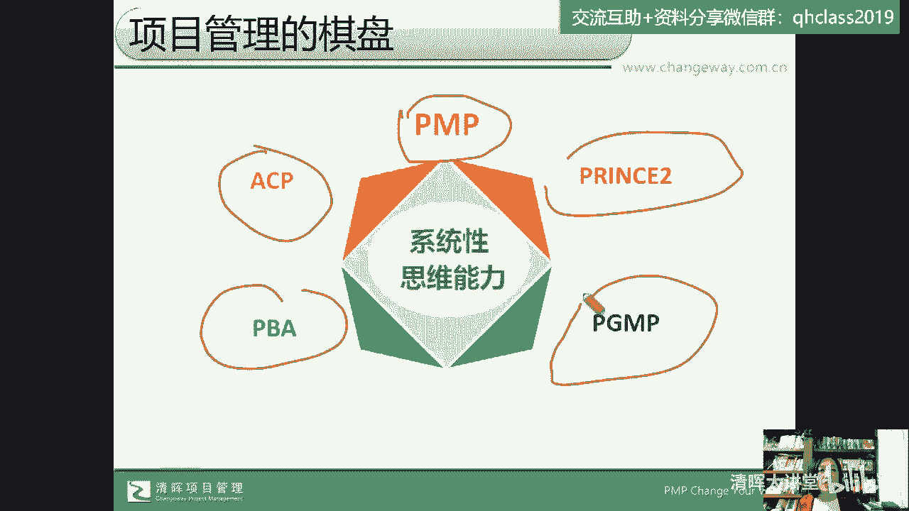

这是一个今年的一个认证变化，好我们来看看这个棋盘，也就是说，刚才我们收集到那20个非常非常具体的问题，实际上它我们给他做解决方，方法论的解决的时候，它可以归纳唉分解到我们的，比如说启动阶段的问题。

哪一类问题是启动阶段发生的，哪一阶段是规划阶段发生的，哪一个是执行阶段发生的问题，哪一个是我们监控阶段发生的问题，哪一个是我们收尾阶段发生的问题，那么实际上刚才我们有同学提了一个问题。

我们再回过头来看一下啊，有同学问了一个问题，说产品中心材料交付推迟影响进度怎么办，如果我们对这个问题做根因分析的话，那么我们可能就会判断什么原因造成的呢，它的结果是影响了进度。

但是什么原因造成了这个问题呢，对不对好，那我们说呢造成这个问题的原因有。

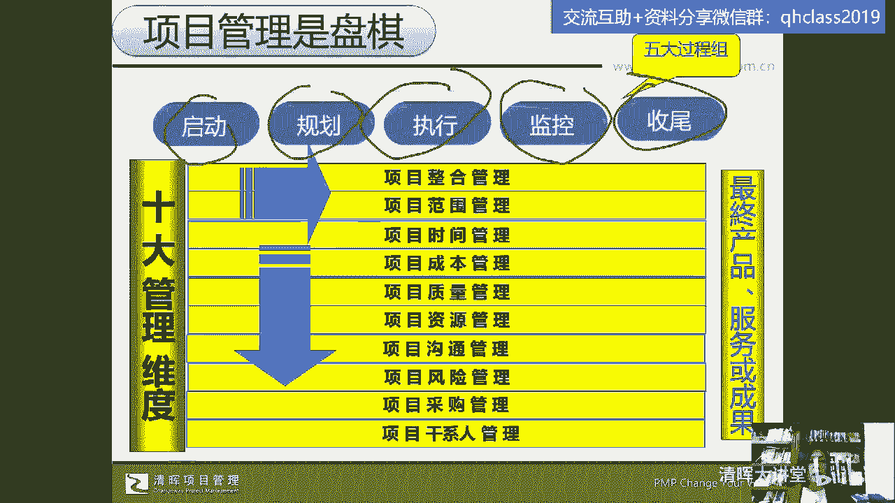

比如说这个问题是在我们的启动阶段，某一个点造成的吗，是在我们由于规划过程中，计划造成的交付推迟吗，还是在执行过程中出现了什么问题，还是在监控，因为我不确定啊，这个问题是什么，我们很可以去分析一下。

我们为什么要去分析呀，因为我们不仅是这一次出现了材料交付推迟，我们怎么去处理它，是我们是希望通过解决这个问题，找出这个问题的根本原因，之后，下一次不再发生类似这样的问题对吧。

或者以后再发生这类问题的概率把它降低，对不对，所以我们说呢，我们要去找到这个问题的阶段属性，那接下来我们要干什么，我们要去看这个项目的整合管理范围，进度成本质量，那么材料交付推迟，比如说这个材料交付。

是外部供应商还是内部供应商，那么不管是内外部，我们所说内部，供应商的意思就是我们的协同部门啊，那么如果是外部可能是供应商，那么我们就要判断是干系人的管理不到位，还是采购管理不到位，对不对。

还是风险管理不到位，他都有可能啊，还是沟通管理有问题，对不对，那么还有质量管理也跟他有问题是吧，结果是进度延误了，但是比如说肝纤的识别不准确，在材料交付这件事情上。

那么我们的这个呃交付的这个核心权力人员，我没有管理好，为大家举一个最简单的例子啊，我曾经为一个在2014年的时候，为中国神华集团，现在叫国家能源集团了啊，以前是中国神华集团，这个宁煤集团。

就宁夏煤业集团，我们去给他们做一个大型咨询项目，是因为在2013年的9月份，国家批批准了400万吨煤制乙烯项目，600亿投资，这个项目在2016年的6月1日，一次试车成功，宁煤集团啊，像陕西，陕西榆林。

还有内蒙，还有这个宁夏，都希望这个项目能落在自己的地方，后来是宁夏宁煤宁宁夏煤业集团属于神华集团，拿到这个项目，我们也很荣幸，我当时为这个项目去做咨询和培训服务了呃，大概从19月份这个项目立项。

10月份他们就招投标，我们我们中标之后，然后到第2年的7月份，我们服务了有大概八九个月，然后当时就出现这么一个情况，就在他们的这个神华，宁煤集团的这个物资公司的总经理负责的，就是你想600亿投资。

他有大量的这个采购吧，然后他当时这个负责人，就总物资中心的总经理就跟我们说了一句话，说我们是甲方嘛对吧，然后承接国家项目，在招投标的时候，我们就是爷等到我们招投标结束了之后，我们就变孙子了。

甲方说自己变孙子了，为什么呀，所有的招投标流程都走完之后，确定了具体的供应商之后，你想他们这么大的一个项目，600亿投资，非常体量很大的一个项目，在这种情况下，他们呃有一个招重到重要。

招投标是十十个这个特种锅炉，那么这种供应商本身就比较少，然后呢，又要又是一个也严重影响里程碑的一个什么呢，严重影响里程碑的一个交付物，那在这种情况下，你知道他们做了一件什么事吗。

就是他们物资中心的总经理啊，相对非常高的，排在优先级高的，亲自带队去这个特种锅炉，这这个什么呢，工厂在那儿住了，包了一个宾馆的几间房子，在那天天看着以房，那这个问题我们说什么。

在采购管理上完全符合国家流程，那么他们就加入了风险管理，虽然我们是甲方，但如果乙方给我们交付延误了，那这种特种锅炉非常庞大的，这种特种锅炉，如果不能如期交付，对我自己的项目影响的进度。

那就不是一个小事了，好风险管理做了评估，沟通管理，天天在现场盯干系人管理，跟人家谈这个事情的优先级，看着对吧，然后这个特种锅炉还不能出问题，质量管理，所以大家想一想，我们为什么啊，为什么。

就他们这个这个这个600亿的这个项目上，600亿投资的这个项目上，当时我们给他们做流程梳理，管理的这个管理的这个动作的纠正，还有呢就是他们的员工的培训，实际上我们说天下的事儿大道至简对吧。

它既有可能说很复杂，但是呢又大道归一，从这些角度去判断，我们的问题所在好，那这个是我们用偏僻的这个棋盘，来解我们项目管理中的问题，那接下来我们还有什么棋盘呢，我们我经常我喜欢武侠嘛。

我经常把这个叫倚天剑，那倚天剑有了屠龙刀是什么，这就是我们的屠龙刀，那我们的偏僻可能是5+10的一个管理模型，那我们的屠龙刀就是372 11，372 11就是代表了什么，它的三就是它的原则，主题流程。

那七代表了它的七大原则，七大主题，七大流程啊，这就是我们提到的，那么它有准备流程，启动阶段，边界管理阶段，控制产品交付管理项目收尾对吧，那么涉及到它的管理主题，风险主题变更主题进展主题，商业论证。

组织主题，质量主题计划主题对吧，管理原则唉，持续业务验证，明确分工的角色职责，关注产品按阶段管理，持续的这个什么啊，学习和易环境裁剪，这就是我们提到的啊，它的英国项目管理体系。

实际上我们在为很多企业做这种系统性的，组织层级的这个咨询和培训的时候呢，会引入pp和引入P2。

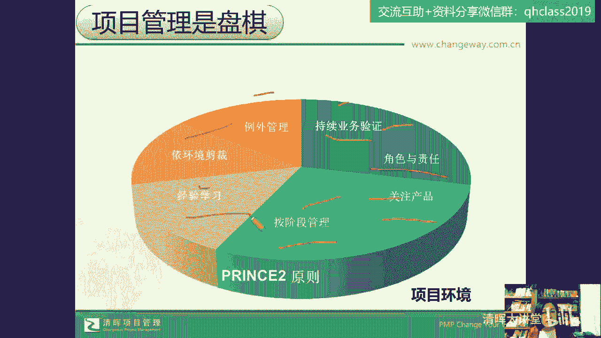

从这里头来寻找到这里头的工具方法，流程流程和小的管理动作去帮客户去挑，唉，适合他们的动作，所以等于说从这两大经典的，英国和美国的管理体系中去挑，那还有很多企业，刚才我们为什么客户要。

一开始要的是一个美女的产品，后来我们交付的是壮汉呢，因为我们面临的环境是乌卡的，是变化的，怎么办，敏捷应对唉，那么很多企业还会在主流的打法中，偏僻的打法中唉，喷素的打法中再引入敏捷项目管理啊。

用到我们的敏捷价值观，敏捷原则，敏捷方法论来解企业中项目管理的难题，来优化我们的管理动作，来减少，由于大家固有的这种思维啊，这种固有的思维，你跟不上企业发展，你跟不上甲方的步伐。

你抱怨他过多的这个什么变更，甚至你可能不能接受他的变更，不愿意接受他的变更，那你可能就会丢掉这个客户，我们刚才讲的那个案例的这个企业，这家企业在过去几年不仅活下来了。

而且还真的是在这企业练好了自己的内功，越难越给自己增加难度，跟上了企业的步伐，他们真正的做到了和甲方共创共赢，哎真的做到了，所以他们在这几年中，不断的在强化自己的组织能力，优化自己的什么呢。

优化自己的这种嗯项目管理的生态环境，那么这就是我们在甲方和乙方都要去考虑，甲方要立项，要招投标，那你要去评估你这个项目它的商业价值有没有，对吧，你的投入产出比对于这样的一个需要要去评估。

比如说老罗要去评估我要造一个什么样的手机，对不对，我的手机的定位，那假会计要造车，我的这个车的这个定位，我的这个需要是真的需要还是假的，需要可不可取，那么我要不断地针对我的这个需要去启发，去分析。

去评估我的干系人，去给解决方案，还要去做跟踪和监督，这个就叫我们的PBA哎我们的商业分析啊，我们的商业分析这样一个我们的方法论，那在这些过程中，我们的项目经理可以去做什么呢。

项目经理既然身在项目管理的这个环境当中，我们要干什么，我们就要去练好自己的内功。

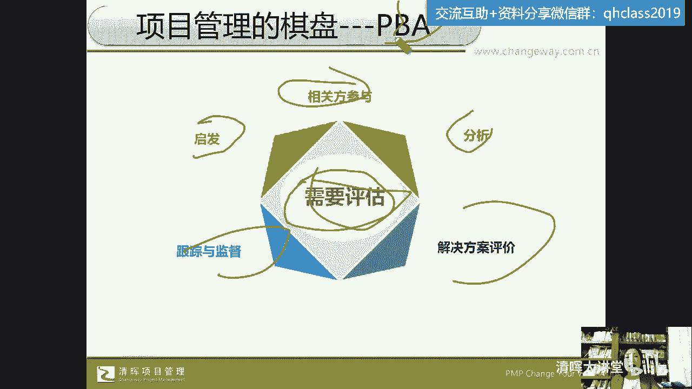

唉我们要进铁布衫，金钟罩都要搞起来，为什么呢，因为对于企业来说，项目经理要干什么，项目经理是你项目的整合者，是你沟通者，是协调者，唉是团队的领导者，甚至你作为那个number one。

你还得是氛围营造者，氛围营造重不重要呢，太重要了，我们经常说啊，我们自己不能跟自己精神内耗，那么在一个团队里头也要减少这种内耗，那一个家庭中，比如说啊今天这个要买这个大西红柿，结果买成小西红柿了。

要不要抱怨呢，那就不建议了，大了就大吃，小了就小吃，今天做饭哎，菜炒的咸了一点，淡了一点，只要没毒嘛对吧，那淡了就那再加点调料，咸了呢，那如果不是很过分的话，也没有关系，怕就怕在呢说在一个家庭当中。

唉这个菜咸了就发脾气，抱怨唉，嗯给脸色甚至拒绝吃对吧，这都是我们所说的这个精神内耗，我们自己不能跟自己有过度的精神内耗，那在一个项目团队中也应该是这样子，我们的项目经理可能真的有委屈了，唉有困难了。

我们还不能过度的去传递这个压力，甚至去把这种不好的不良的情绪带给大家，我们还得做这个氛围营造者啊，这是我们的常见的一个角色，但是我们这样的角色难不难呢，难难可是咱们得扛住了呀，对不对。

这家公司我们服务的这家公司的老板，把他们的项目经理叫战斗英雄，战斗英雄就得扛起了所有啊，所以要扛起这么多的角色，那我们来看看，这只是一家老板对项目经理的PUA吗，并不是，对不对，并不是。

那么我们来看看整个全球的项目经理，他的一个能力模型的发展，这是在20多年前啊，PM美国项目管理协会定义的第一版的，项目经理的能力模型。

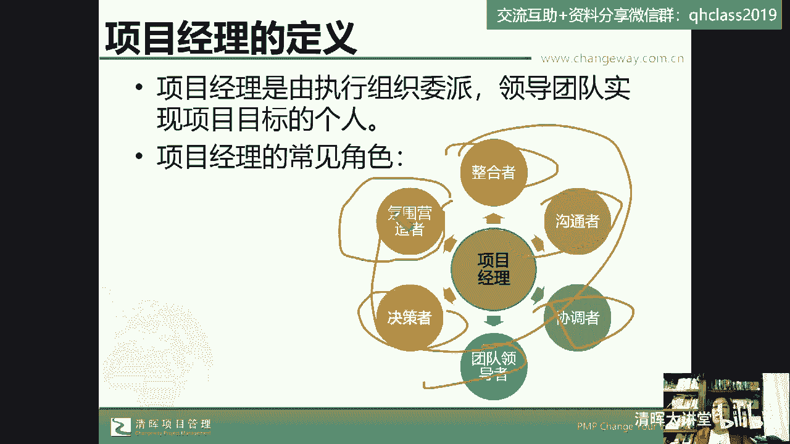

那个时候比如说做项目经理，还是一个嗯刚刚开始正式化的一个职业，或者是一个角色，在企业当中，20多年前啊，那么那个时候他说你要有什么你的个人能力唉，这种个人能力更多的强调的是软技巧，你的执行能力唉。

就像把信送给加西亚，大家都知道在十几年前企业里头，这个就暴露年龄了，对于你们来说，十几年前可能大家还是这个青葱少年，可是因为我的职场生涯里头啊，在近30年的这个职场生涯里头对吧，那么我们想说的是。

真的是近30年了，郭老师有近30年的职场生涯，那个时候我们学的我们企业里学的，在国企里上的课，给发的书，免费发的书就叫做什么呢，就叫做把信送给加西呀，那不就是一一竿子到底的执行能力嘛。

然后是你的知识能力，这是第一版的我们的项目经理的人能力模型，那接下来第二版啊，第二版是近10年发布的，它要求有项目管理的技术要求，你有这种战略和商业管理的这种认知，还得有领导力，Leadership。

然后在最近3年呢又做了一些改变，这个改变的翻译并不好，他要求的是你有这种什么power skills，我认为这个可以翻译为驱动力唉，推动力也可以理解为是领导力。

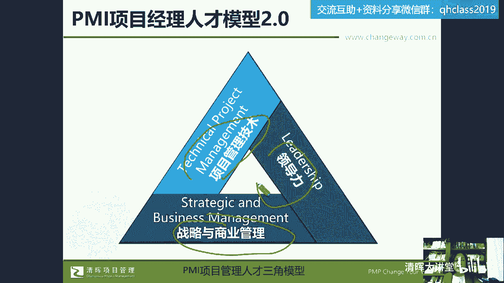

那么他要求你有business的这种商业敏锐力，还要有你的这种工作方法，这种工作方法，其实我依然认为把它翻译为我们的交付利，所以这个是我自己的翻译啊，我认为项目经理要有敏锐力，身形柔软，身段灵活。

要有领导力，驱动力，要有交付能力。

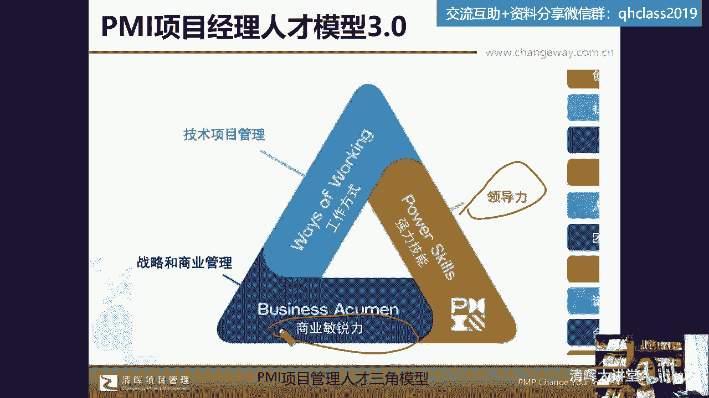

这就用一句比较流行的话说，叫成事儿，很多人会看冯唐写的那本书，讲的是这个谁呢，这个叫曾国藩的这个心术心法啊，叫成事儿，就是你把事儿做成了这个能力，那对于我们的项目经理，不仅是这个老板，他PUA。

他的项目经理是你是战斗英雄，唉你得你得扛下所有，其实在全球的这个项目管理环境中，项目经理可能都是要不断的去成长，最终就是要去做交付的啊，那么我们怎么能够去成长起来，来解决这些问题呢。

也就是说我刚才给大家分享的啊，是我们的项目经理收集到了这28个，我我自己收集到28个问题，但是你自己如果作为项目经理，作为项目总监，作为PM的工作人员。

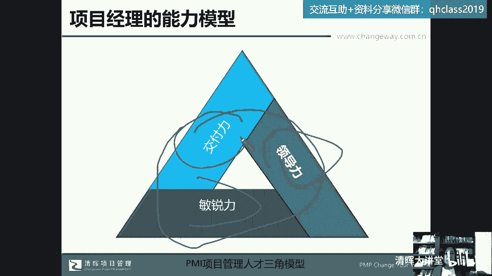

甚至作为这个事业部的老总，你自己会面对你的团队成员，你的项目工程师，你的项目小组经理给你提到的这些问题，那你也应该有解答这些问题，解决问题这些问题的方法论对吧，所以我们说呢对于项目经理来说。

一对一的解决问题和用方法论来解决问题，它在效能上，产出上，能力上还是不一样的，那这种能力怎么去训练出来呢，稻盛和夫先生嗯，他成功的做了两家世界500强的企业，一个是京瓷，京瓷手机啊，都是日本的。

还有一个是日本第二电电，做到了，后来他在这个70岁高龄的时候，还瘦瘦，任命去挽救了东京，日航公司这样一个亏损的企业对吧，是一个伟大的一个管理学家，那么他提到的他对成功的定义是你的能力，热情全面。

一定要有一个正确的思维方式啊，一定要有个正确的思维方式，那实际上在我们那个年代初入职场的时候，这本书也是必读课啊，我们作为公司的管理团队，在国企一个是把心送给加西亚，一个是第五项修炼。

第五项修炼的核心就是你要有系统性思考能力，系统性思考能力就意味着你在面对问题的时候，不是单点去考虑问题，就像刚才我们这位学员非常好，也也很感谢给我们贡献的这个问题，当材料交付延迟的时候。

那么影响了进度的时候，我们一方面要单点解决这个问题，第二我们要系统性思考，为什么会有这个问题，他是干系人管理的问题，它是质量管理的问题，它是风险管理问题，还是干沟通管理的问题对吧，所以大家觉得哎呀。

我作为一个项目经理，我很痛苦，我刚才不是说了吗，600亿国家项目的甲方，那么大家都知道做这种项目的招投标，当时我们去做这个，他们也是向全球这个这个在干什么呢，招投标这个项目管理的咨询团队。

那么我是亲自过去作为首席顾问去投标，达标，拿到了这个标书，然后那个大概我在我在几个月内就飞了，我当时是贝斯在上海的，从上海飞到银川机场啊，只有什么只有这个吉祥航空，我大概很快就飞出来了一个吉哈。

吉祥的什么呢，吉祥的金卡对吧，吉祥航空的金卡，然后那个每一天呢就是在那个银川机场，你就能看到大量的这种，全国的这种招投标的人都在那边，供应商都在那边，请你来了走了来了走了，那么你想这种大项目的甲方。

他们为了保证你们说的是材料延迟，他要保证其中，这还是只是一个啊特种锅炉不延误，他都要亲自带队去甲方那儿蹲点，去分析是干系人怎么办，风险怎么办对吧，所以我们对单点问题，我们要建立的是系统性思考。

那么在稻盛和夫的成功公式中是思维方式，那么在第五项修炼，彼得圣吉提到的啊，那么也是系统性思考好，那作为项目经理，刚才我们说了，你终究是要扛下所有的，你要承担那么多的角色职责对吧，你要解。

然后去解决项目的启动规划，执行监控收尾中的各种问题，那么你要办怎么办，你要打造的是一个团队。

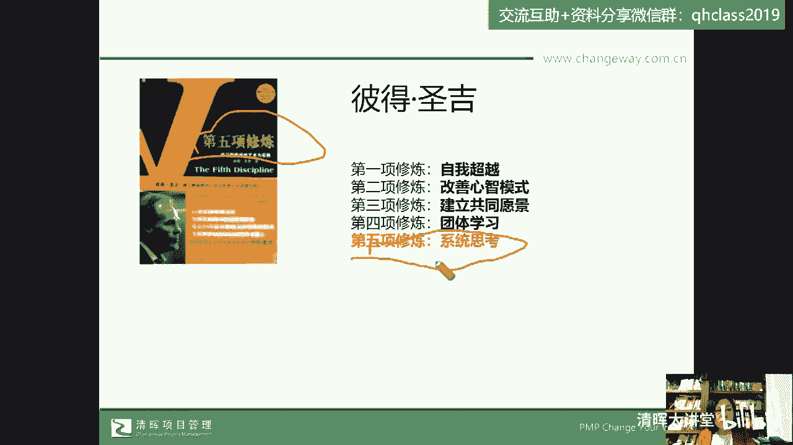

我们经常团队和团团伙，这个group有时候也可以被，在某些场合下被犯为犯罪团伙对吧，团队我们要有共同的目标，价值观要一致，要有我们自己的ground rule，我们的基本的规则哎。

我们要能够实现这种积极的，建设性的一个项目目标，实际上在每个行业啊，在哪个行业，那么我们说呢像这个项目管理，正式的这个项目管理啊，它的提出作为一个系统工程，就是来自于美国军方的这个曼哈顿计划对吧。

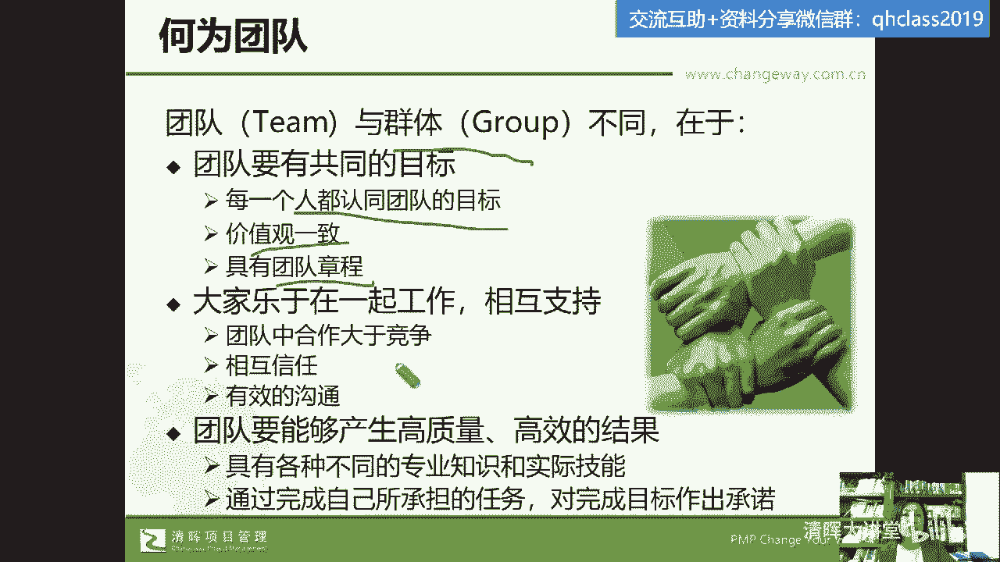

所以很多管理都是从军队的管理中，脱胎到商业环境当中的，那大家想一想，这个事也是一部很多人会很刷很多遍的一部剧，对不对，我的团长，我的团，我们来看看这个团队有什么，李四福下士来自于川军团啊。

重枪二连败兵康火连唉，这个准尉副排长败兵，吴小麦败兵，那么可以理解为这都是一个残兵游勇对吧，徐州会战的败兵，东北军的败兵对吧，还有老寿依稀倒爷，还有什么残了腿的小套小太爷，就这样一个团队。

最后他们成团了，出道了对吧，哎现在的我们现在这个太平盛世，有人替我们负重前行，哎这个腥风血雨之后，我们现在太平盛世里头，我们看到都是成团出道，那么当年他们也成团出道了，可是这样的队伍是怎么带出来的呢。

他们还能够取得抗日战争的一个小的胜利，对不对，所以大家想一想，当我们怎么去系统性的思考和解决这个问题呢，团长是如何做到的呢，当然我们把它作为案例，作为故事，我们来分析的时候对吧，那我认为对于我们来说。

它需要的是我们的两种思维导向，一个叫技术思维导向，一个叫管理思维导向，说到这个地方啊，我要忍不住跟大家插一个小小的有意思的事情，就是我今年在我们清辉呀开了一门课，就是我们的在线学堂里头开了一门课。

叫项目管理小书房，项目管理小书房呢，是把我们清辉这么多年的译注啊，现在已经有十几本了，还有几本在路上呢，准备要出版的，已经正式出版的11本书，我呢一个月带着大家读一本，一共会从2月份读到12月份。

那么我们读的第一本书在2月份啊，今天是3月2号，我已经在2月份读，给大家读完这本书了，就叫项目思维，看到了吗，唉就叫项目思维，那么这本书是我们的一位，英国的两位项目管理的专家啊，项目管理的专家来来写的。

那么我们一个月两次，基本上是嗯隔一周的周二，比如说我们3月7号和我们的这个，下一次是就是下一个周末啊，我们来看看，反正就是周二隔周的周二，那么每天晚上两个小时啊，两个小时来给大家读书，是我给大家读读。

不是朗读啊，是我把这里头的核心内容给大家摘出来，给大家做分享，而且这些书最有意思的点在哪里呢，是他有什么，他有案例，像这本书里头简直就是看热闹的，因为它的副标题叫什么，叫。

为什么优秀的项目经理会做出糟糕的项目决策，讲的就是项目思维，因为我这个地方提到了，技术思维导向和管理思维导向，所以我们正好来说一下我们读过的这个，大家也是买了这个课程之后可以看回放。

刚才我们的这个呃班主任很应景啊，给大家发了一个66元的什么呢，这个呃无无要求的啊，没要求的这个什么呢，就是很多课程都可以去购买的，这个叫什么呢，叫优惠券啊，我们一年的课程项目管理小书房。

我们在3月23月七号，也就下周二晚上，我带着大家读的这本书叫什么，叫项目经理的沟通技巧，是美国坎贝尔他写的啊，坎贝尔本身就是一个项目管理的专家啊，同时呢嗯也为这个世界500强，包括这个什么呢。

这个美国的这个政府，提供项目管理的咨询和服务，而这本书更有意思的是什么，这本书更有意思的是，他从第一章到最后一章，就是用了一个项目案例来结合项目的启动规划，执行监控来专门讲这个沟通项目风险的影响。

对成本的影响，对肝险的影响，对项目全生命周期的这个影响，这是我们在下周二会读的这本书，所以全年啊11本书，22次课程，郭老师给各位小主和太子爷们读书，替你们读一起来看啊，而且我每次课程之后呢。

都会给大家发一些这个，因为发书可能郭老师还发不起，那么嗯，但是给大家可以发一些可以共享的文档资料，我们从书中摘出的一些，我把那个叫简书啊，相当于就是摘要出来的核心内容会发给大家，纸质的资料。

只要购买了我们这个课程，就会收到我们投放的这个课程资料，好吧好，那么嗯这本书呢项目思维虽然我们已经读完了，你买了这个课程，你还是可以回看的，那么他提到的就是系统性的一个，关于项目管理思维的一个梳梳理。

那我这个地方呢，是我自己的一些咨询的一些成果，一些思考啊，也就是说在我们做项目管理的过程中，我们作为项目经理怎么能够扛下项目的所有啊，然后去交付我们的项目呢，技术思维导向我们是不缺的。

而且很多时候可能就因为是技术思维导向，就导致了我们的项目最后商业价值没有实现，因为我们在管理的思考上，管理思维的应用上，这种投入上是不够的啊，所以我们项目就出问题了，而且啊大家看一下特别有意思，你看啊。

这本书就是我们下周下周二要讲的，这个项目经理的沟通技巧里头，他提到的第一个问题就是什么呢，就是很多项目经理都遇到过这种情况，从项目管理角度看，这是一个技术上成功的项目，那么但是从运营团队的角度来看。

他失败了对吧，在商业上他失败了，所以就是我们的管理思维应用的不够唉，那么这是我们在下周会具体来讲的，那今天我们只是来提到了，我们的项目经理必须要左右手爱，左右手互成，不能互搏，要互互相支持。

也就是说左手是技术思维，右手是我们的管理思维啊，右手是我们的管理思维，这两者相辅相成，我们的项目才能够从启动规划，执行，监控收尾这个整个过程中去做一个良好的交付，那么对于我们的项目经理。

我们通过这种系统性的学习，系统性的思维，还能够训练我们项目经理的四大护法，我们要想扛下所有，我们要想把这个事做成，我们要干什么呢，我们要去训练自己的这个四大护法，那么这种四大护法呢。

咱们又不是衔玉而生的贾宝玉，咱也没有一个黄老邪的爹对吧，走出黄呃，从黄黄这个桃花岛出来闯世界的时候，天生就带了个假软卫甲，咱没有，咱得自个儿给自个儿把这个金钟金钟罩，铁布衫给他练出来，那是什么呢。

就是我们的事业环境因素，组织过程，资产假设条件制约因素，在我们刚才给大家展示的，这28个问题里头呢，实际上很多问题是你没有识别你们，你这个项目中的视野环境因素，你没有实利用你的过公司的组织过程资产。

你没有去干什么，监督记录你这个项目能够交付的这个事情，能够交付的假设条件，我们再举一个例子啊，还是拿刚才我们刚才就像给董卿做托儿一样的，这位同学无意中问的这个问题，就是材料没有交付，影响进度了。

那么我们这个进度交付，我们这个材料交付有哪些假设条件吗，就是在什么条件下，这个材料能够如期交付，那这个条件我们就把它叫假设条件，因为他还没有实现之前，它就是一个假设，假设你怎么样了对吧，然后你怎么样了。

那么这就是我们的假设条件，你有没有去识别出让它材料交付的前提条件，或者是假设条件呢，而且这个假设条件和前提条件是动态变化的，那你有没有识别出，影响这个材料交付的制约因素呢，对吧你的进度是客户给你的。

你老板给你的制约因素，你必须要完成，你完不成可能就受罚，你的项目就要失败，但是你的这个你的项目进度不延误的，前提条件是材料还要交付，如期交付，那材料如期交付也有它的前提条件，那在我的头脑当中。

我永远把这四大护法放在我的头脑中，我要识别这个事情的假设视野环境因素，我要识别它的可可见可借鉴的经验教训，在其他项目上有没有出现过，材料不能如期交付啊，以及材料为什么不能如期交付。

我的项目上会不会有类似的情况发生啊，那么材料如期交付的假设条件是什么呀，影响材料交付的制约因素是什么呀，所以我们经常说光明顶上能成大事的人，必须得有四大护法，这就是我们的四大护法，而这四大护法在哪里。

在我们的PNPPN报考这本书里头啊，在我们的美国项目管理资质认证这本书中，会详细的给大家讲解什么是事业环境因素，什么是组织过程资产，什么是假设条件制约因素，对吧好，那么同样。

我们在我们的这个PN报和这本书当中，作为项目经理，对于那20个问题的28个问题的解决，有好多问题我们做了根因分析之后，其实是你的项目的计划的这个问题对吧。

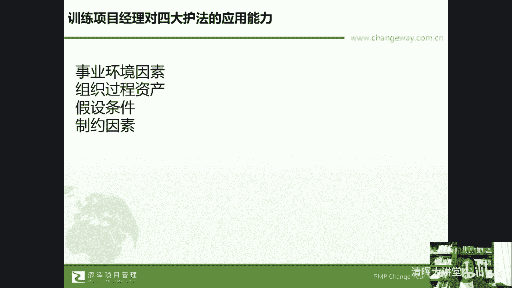