# 🔥项目经理必看！28个棘手难题一网打尽，实战解决方案助你轻松应对💼 - P6：6.项目管理问题复盘模型 - 清晖大讲堂 - BV1fztLezEZK

我来说一下啊，我先试着理解你的问题，是问ICI怎么用，首先ICI这个工具呢，我们把它叫做什么呢，叫做项目职责分配矩阵，也就是说当我们把工项目的WBS做出来了，当我们把WBS做出来了。

就是我们的工作包分解出来了，或者我们的PBS叫产品分解结构也好，工作分解结构也好，甚至甚至在敏捷中能不能用也是能用的，我们敏捷中的这个user story，用户故事唉，用户故事也分解出来了。

也估算出来了，也分人了，虽然说这个敏捷中不太提，这些传统的项目管理的工具，提的更多的什么功能点呀，用户故事啊等等，什么用力呀，但不代表传统的工具不能用，那么你敏捷中承担这个功能。

这个user story这个功能的人，他也不能一个人去战斗，所以凡是需要协同战斗的一个工作任务，那么我们都能用ICI怎么用呢，比如说这个工作需要几个软件工程师来写代码，做测试。

那这几位软件工程师就是我们的R的角色，就是执行人的角色，那么A是谁呢，accountable就是在这几个软件工程师中，可能有一个人，他会担任这几个软件工程师的一个leader小组长。

也可能单独再选一个小组长都可以啊，取决于你们自己的企业，那这个A的角色是什么呢，他负责的是承担领导责任的，那么C是什么，是我这个项目，我的咨询对象是谁，唉出了问题我可以向谁去咨询。

好在我们的偏僻中篇报告当中，有个词叫主题专家，有些公司就已经建立这个机制了，就是我服务的这家企业，就你今天给你们讲的这个呃项目，给项目经理回信的这个这个案例的公司，他们公司呢也是。

在我们去年8月份给他们做咨询之后，他们建了一个，就像你们去医院看那个墙上是不是挂了，这个主任医师谁谁谁，主任医师，副主任医师谁谁谁，对不对，唉他们公司呢也是给项目经理。

这个又又被又被我的一个这个朋友和学员，说成了PUA，就这是一个兼职的，就他们公司呢分了这个叫什么呢，初级项目经理，中级项目经理，高级项目经理和项目专家，这些分类呢是你的单独的荣誉。

然后初级项目经理的月月月，这个基于这个职务是500块钱，中级是1000，然后高级是1500，项目专家是3000，那有人说这个是不是这个加薪的呢，嗯加了一部分，把原来的薪酬中的一部分金额。

金额构成放放在这个维度里头去了，然后每年有一次晋级的机会，那么他们公司有了这样的升级之后呢，然后我不是这个项目团队成员，但是我在我们公司内网上挂牌了，我老郭，假如说我啊就是一个初级项目经理。

那我的能力和我的擅长什么，我的经验有什么，那我有时间的，你比如说你找我咨询，或者你跟我提问或者怎么样，我为你工工作了一个和两个工时的话，我要干什么，我要收费的，不是我自己收钱，是公司会给我计工时。

那我你会约我的时间，然后我服务我提供针对这个问题，我提供两个工时，那有人说初级是一小时，比如50块钱，那中级比如一小时100块钱一个工时，那高级一一个工时多少钱，这个类似于我们的C就是我的咨询对象是谁。

有人说，那我看了一下，我不愿意让我的成本增加，因为他们项目，他们公司已经对项目进行成本核算了嘛，所有的项目的这种资源成本也要核算进去的，做乙方肯定要算人工时吧对吧，他们内部资源挂牌。

然后他去征询这这类问题，咨询谁，他会列出来，那么I是inform，就是我这个信息的告知和抄送对象，避免由于个人因素导致的这种我以为我不知道，我没想到的这种沟通误区，内外部的干系人，那这个工具啊。

我们说呢它的一个最大的一个优势是什么，第一分工明确，第二论功行赏，第三呢责任到人，所以你在多少个项目，他们有一个项目的，总有一部分项目绩效是呃叫组织项目绩效，也就是你在这个项目，在公司的项目中。

你在多少个岗项目中担任了R的角色，在多少个项目的这个工作包或者产品包里，担任了A的角色，在多少个项目中被consult consulted了，在多少个项目中，你项目没有出问题。

你的这个I的对做得非常的好，都会给到什么，都会做一个项目组织级项目绩效评价，然后他们开始从去年年底搞了，第一次的项目经理嘉年华，就是做项目大复盘，用这样的一个复盘模型来评选，优秀管理项目案例啊。

优秀管理项目案例，所以你看啊，在我们的偏僻的认证考试中，RACI这个工具可能只考一分，但是你把它真实的用在你的项目管理的环境中，他创造的价值是不可估量的，而我们要做的就是活学活用，这些项目管理的工具啊。

今晚我只收到了在现场时收到了两个问题，但是我也没有托在座的提问题的，可能学员我还不是跟你很熟悉，但是我觉得问这个问题，我觉得问的都特别的好，都很重要啊，都很重要，大家有什么问题。

我们还有一点时间也都可以在评论区里打出来，好吧，都可以在评论区里打出来，好那么我们接下来来看啊，刚才呢我们是针对大家的问题，试着去给大家解读了，那解读了一下那个ICI，那实际上大家想一想嗯。

如果我们在这家企业，如果他买了我们公司三个月的时间，我去做一个坐诊大夫坐堂服务，那实际上每个人来问一次，就不如我们大家共同的来学习啊，共同的来学习这个什么项目管理的知识和体系。

因为呢对于我们的项目经理来说啊。

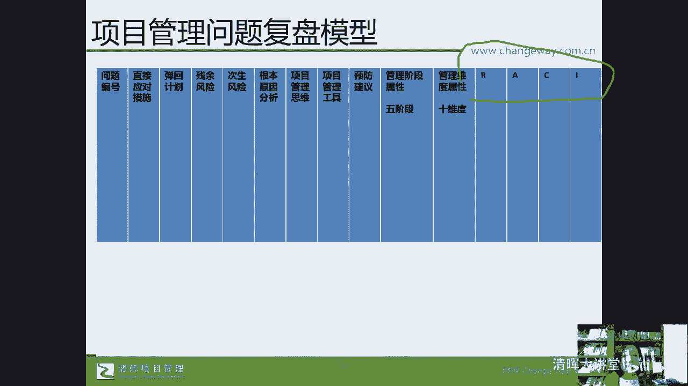

刚才这个领导力模型我们已经都讲过了，那么对于我们的项目经理来说呢，实际上对于我们的项目管理的能力，一般有这四个阶段，无意识无能力，有意识，无能力，有意识，有能力，无意识有能力，如果大家去考过驾照。

坦率的讲啊，郭老师没考下来，那个报过一次，然后学到科目一，考过了，科目二学了一半，然后后来由于工作的原因和工作地点的变迁，后来这个事情也是能力之不及，在这种事情上我不太具备。

而且我对这个驾驶这个事情一直在车多的时候，如果我自己驾驶，我会心理素质不够好啊，所以但是如果你们比郭老师强考过了这个驾照，你就能理解对吧，那比如说我们一开始没有去学这个驾驶的时候，我们没有意识。

也没有能力，我们不太懂，当我们意识到我自己应该去考一个驾驾驾照，学这个驾驶技术的时候，我也没有这个能力，但是当我们初步的学习，比如我至少还考过科目一嘛，有这个意识了，有这个能力了啊。

也知道怎么交通规则了，也知道这个在这个有这种线上的模拟的，这个对吧，但是我依然不知道怎么去实操，我们学习项目公理管理也是这样子的，一开始可能就是我们无意识无能力，我们并不知道自己需要这个能力。

或者说不具备这个能力，当我们逐步的打开了眼界，发现了这样一种学习方法，一种管理体系，一种思维模式的时候，那我们要去怎么办，我们就发现还是不具备这个能力的，通过我们的学习。

我们知比如说现在经常说眼睛知道了，会了手还不会，这就是有意识有这个初步的能力，我们最终啊，我们最终对于项目管理能力的这种具备，是要达到无意识有能力，这就是驾驶，你比如说我虽然没把这个驾照学下来。

但是呢我也知道，就是一些我的朋友在有时候载我的时候，唉就是呃开车带着我的时候，我一看我就说不行，我不太敢坐你的车，为什么呢，我觉得你好慌，这个新手嘛，对不对，还不那么熟悉，对不对。

虽然我们不赞成这个开车走神儿，但是熟手司机，他确实在判断这个特殊情况的时候，他已经不需要再去回忆很多科班知识了，大家就能自如地去应用了，就像刚才我们学员问的这个问题，ICI这个工具。

如果你已经透透彻的理解了他的能力的话。

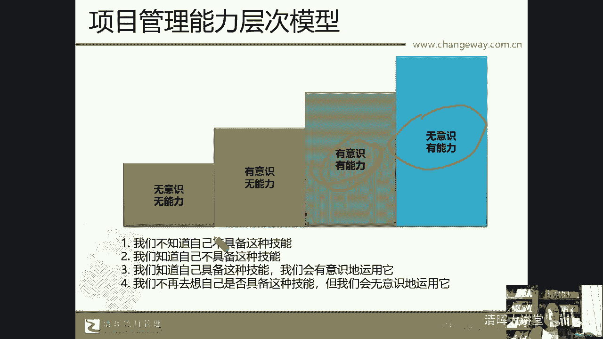

可以在组织层面应用，可以在项目层面应用对吧，在你的小团队中去应用，它就成为你的一种什么，你的工具箱里的这个工具了。

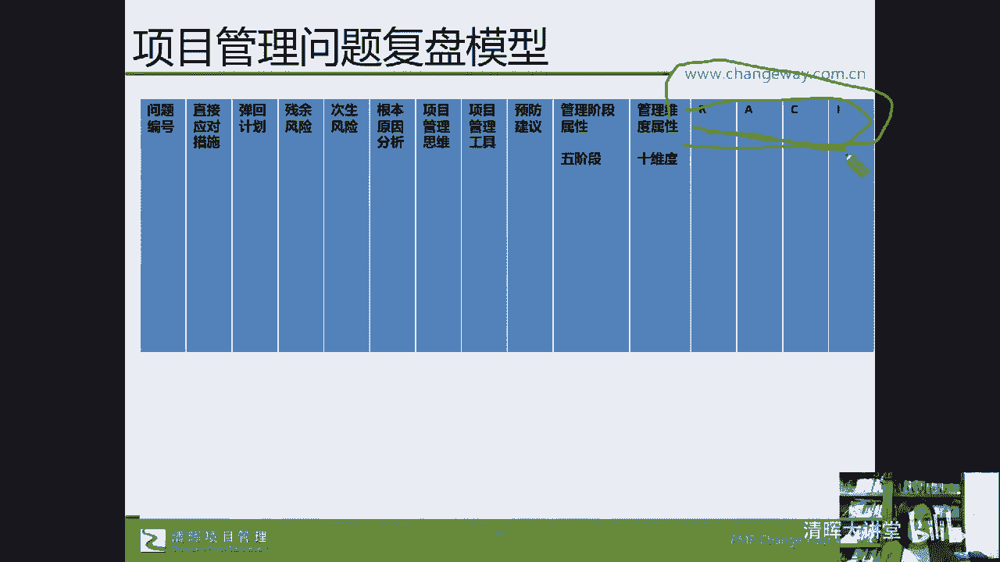

那我们最终要实现的是一个什么样的状态呢，就是打造了基于自己的项目管理的价值链，那么打造了自己关于项目管理的这个价值链呢，那么它有六个要素了啊，知识与体系，工具与技术，这两部分都可以通过我们的偏僻啊。

Prince to，甚至大家说的什么软考啊，CP啊，PBA啊，NPDP的认证啊，都可以实现，这叫做眼睛会了，那怎么能够让手也会了呢，把它变成你自己的肌肉记忆，把它变成你下意识地做事情的指导方针。

去运用它，这就是我们所说的，在王阳明心学中讲的叫事儿上练事儿上练，练中学，学中练，做中学学中做，最后就能成事儿了，那成事儿了，我们的个人价值，企业价值不就实现了吗，大家都觉得打工太难了，大家想一想啊。

我前两天在这个微博上有一个投票，我也去参加了一下，点了一下子，他点的是你认为董宇辉为什么能成功，就董宇辉吸引你的地方在哪里，大概是这个意思，我选的是他的第一个选项，叫做他。

呃丰富的知识积累和旁征博引的这种能力对吧，大家思考一下啊，大家思考一下，你说董宇辉我们是老乡啊，潘哥老乡吧，我也是陕西人，我出生在陕西韩城那啊，他是可能是同同同嗯，潼关人，对不对，陕西人。

那你说他长的那个国字脸，他的个子，他的身高好像作为一个男孩子，可能也就1米6出头吧，因为不是经常在直播间里被人调侃，你到底是坐着呢还是站着呢，就他站着呢跟他的身高跟别人坐着的都差不多，但是大家想一想。

他以一己之力，真的是让新东方再现凤凰涅槃，浴火重生了，对不对，那么他靠什么靠颜值，靠身高，靠背景，靠什么资源，就是靠那个平台呀，那个平台不就是靠他的这种，有人说这是运气，可是这种运气需要。

他真的能够有那么丰富的知识积累和旁征博引，而真诚谦逊的一个输出嘛，他能够跟那么多的大家去对话，给你这个机会，不比颜值对吧，给你一个对话的机会，你可以跟刘心武对话吗，你能跟莫言对话吗。

这种对话没有脚本对吧，不需要没法设计脚本，而且这种对话还能够被大家愿意听下去，对于每个人来说呢，这个时间都是最宝贵的，所以今天晚上大家能够抽出宝贵的时间，来清辉的在线学堂来听郭老师在这嘚啵嘚啵嘚。

我都非常的诚惶诚恐，我很担心大家耽误大家的时间，我也很担心我讲得不对不准确啊，我努力的去做一个朴素的一个一个传递，就是我把我相信的东西，以及我确实因为这个为信他的企业，和非信他的学员。

那么在这件事情上投入了成本，比如你你要学习，你要交学费吧，报考你得交考试费吧，还要投入时间，你可能就要去牺牲休息的时间，牺牺牲休咳，刷短视频的时间，牺牲什么呢，陪伴家人的时间，然后成本加上你的时间。

然后你要去学习，你要去拿证，但他真的帮助过企业有一点点进步，帮助我们的学员有一点点进步，那我就觉得也许可以去试一试对吧，也许可以去试一试，所以这在双城记里头，狄更斯的双城记里的开篇语就是。

这是一个最好的时代，这也是一个最坏的时代，任何一个时代都是最好，都是最坏的机会，都是存在的，我们能不能够把握住，对不对，能不能把握住，那么虽然存在着职场的辛劳，职场的不公平对吧。

存在着企业与员工之间的这种相互的博弈对吧，什么呃，离职补贴呀，突然离职啊，最搞笑的就是最中国有一个学佛的，这个瑜伽创始人，梵音瑜伽没有钱了，跑了天天学佛，慈眉善目的去世人对吧。

因为我也自己也也练过几年瑜伽，不太知道瑜伽修炼的就是心性啊，呼吸呀，可他就做出这样的事情，这个世界上有不美好的一面，这个世界上也有美好的一面，而我们能做的是让自己变得更美好，是不是好。

那么跟大家说了这么多的，我们的偏P偏bug AC p等等，实际上美国项目管理协会。

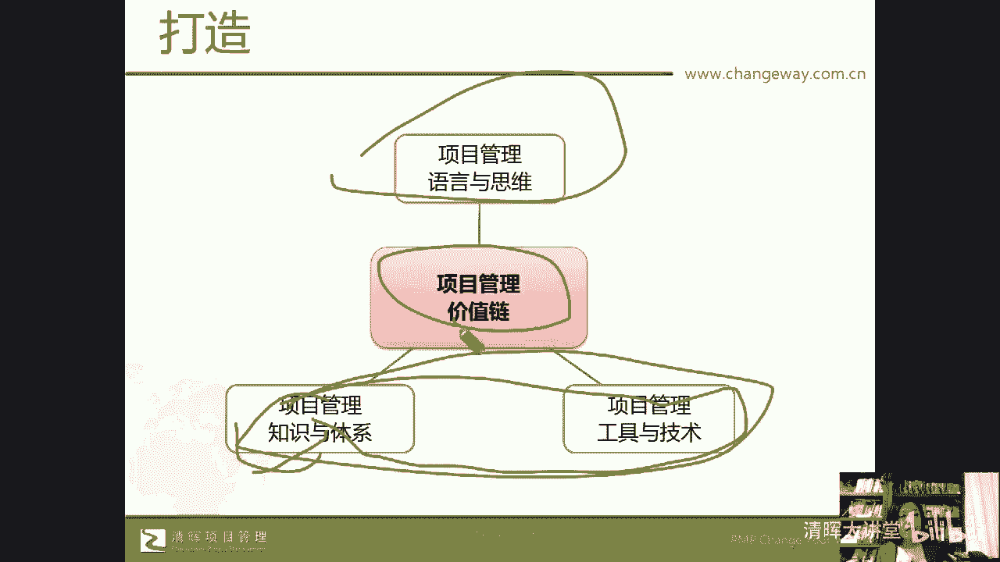

他反倒是一个NGO的组织啊，那英国项目管理学费倒是它的产生是官方组织，后来也不再是官方管理了，是这个公公司化运营了啊，那美国项目管理协会呢也是在2000年开始，在中国的这个深圳和北京。

第一次推出了偏僻的认证考试啊，那这就是我们能够去考的，比如说偏僻ACPPGMP今年就汉化了啊。

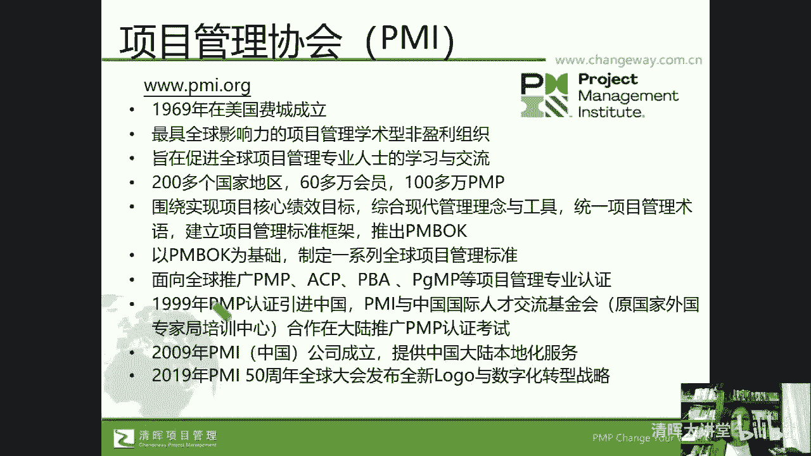

中文考试还有PFMP，这是组合项目经理的考试，现在还没有，那么PBA也是偏僻的，那这个是prince two，就是我们说3月19号会开班的，郭老师的线上课，3月25号会有我的偏僻的课程。

如果您或者您的朋友感兴趣，也可以来学习啊，那可能有些学员还是想了解一下，我们的这个认证考试，对了，就如果大家在你的公司，想引入这种定制化的实战内训，也可以去推荐跟我们的这个班主任啊。

或者你的课程顾问去联系，郭老师，也可以去现场服务的，我们这样就有线下的机会见面了啊，好那么也简单的说一下我们这个考试，他在今年呢还是什么呢。

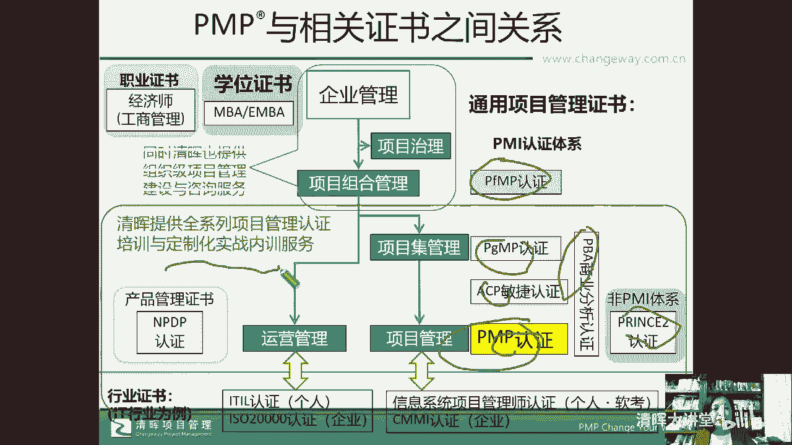

嗯还是我们所说的四次考试，现在是230分钟，180道题，中英文对照啊，所以英文好不好，不影响我们的考试，但是有一点想告诉大家，就是，5月份是最后一次单纯的第六版的考试内容了。

从今年的8月份他就会加入第七版的内容，加多少，现在还没有说啊，我们现在已经在作为教研组，我们已经在更新我们的8月份的教学教材了，6月份就是3月25号这个开班的啊，这个班级是针对5月份考试的。

那这个呢考试我们说呢，现在报名还是来得及的啊，它是单纯的第六版的一个内容考试，这个我们的考试的通过率，还有我们的教学的成熟度，信心是非常足的，当然8月份也没有问题啊，相信郭老师。

我们现在已经开始预研教材了，但是6月份的考试成成能，这个容易程度会相对更高一些啊，相对更高一些好，那么我们再回到我们开头给项目经理的回信的，这件事情上啊，那么刚才我们提到了我们服务的这家企业呢。

它呢有很多的项目问题，那么我们对于外部环境变化快。

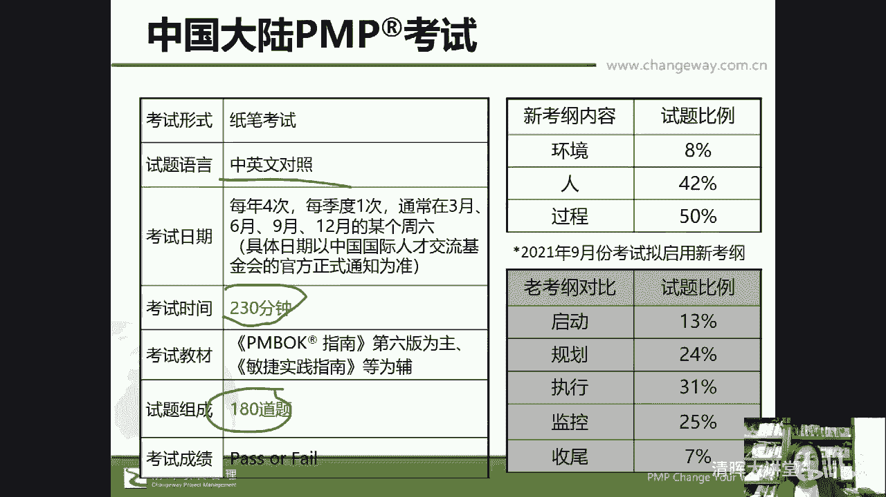

至于因素简单，这是我们收集的问题。

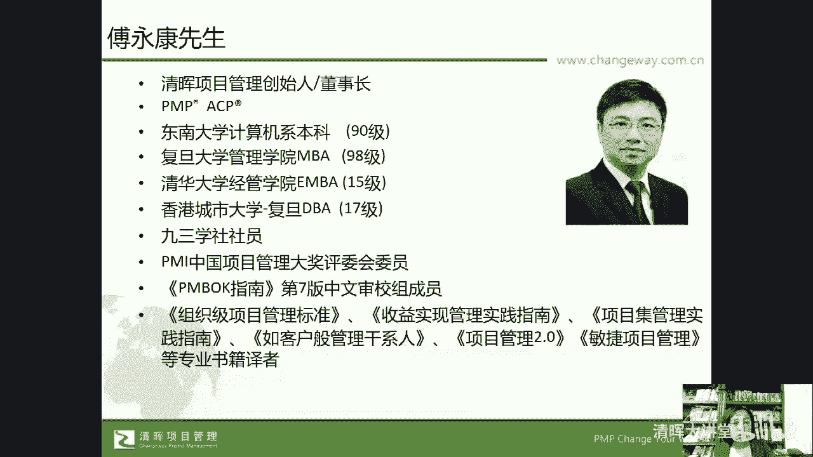

我相信啊，大家也对我们这些具体的问题非常的感兴趣，因为我们时间关系，我们就不能够啊，不能够一一的回答，我来试着给大家解答几道问题。

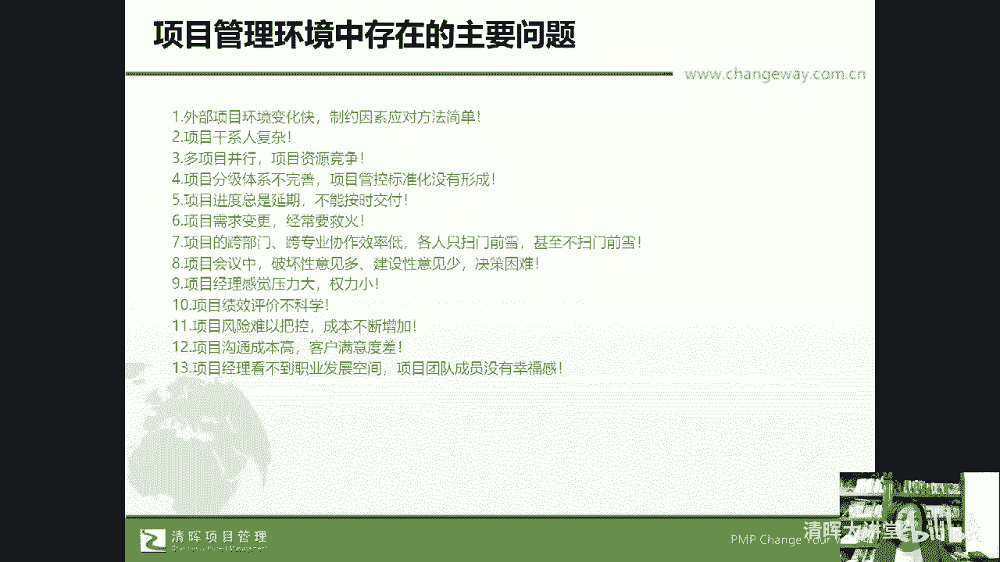

毕竟给他们都回复过了，但是现在因为这个回复的过程啊。

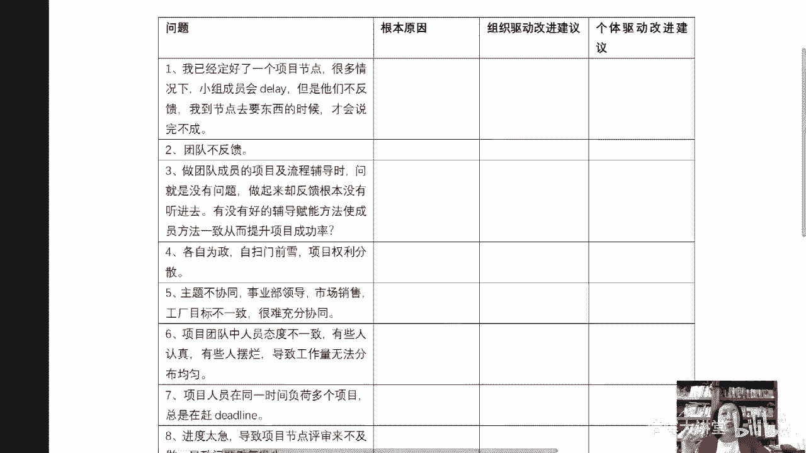

这个具体的比如说根因分析，组织驱动的改进建议和个体驱动的改进建议。

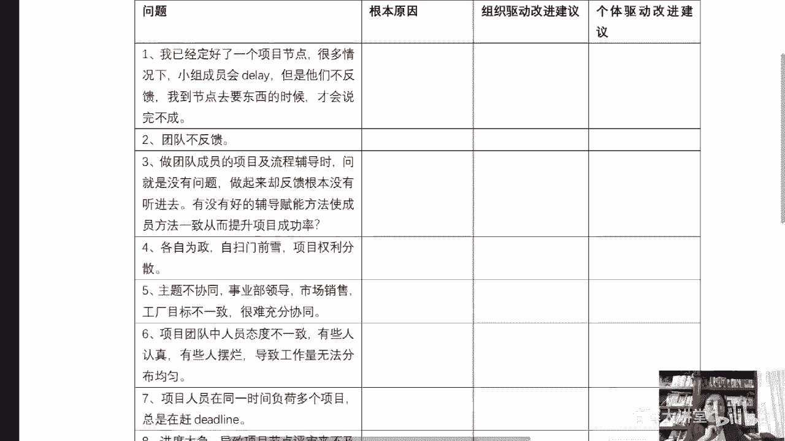

我是不能够完全嗯拿出来的，因为这里头的就是针对他们，这是他们他们的项目经理提的问题，那这些问题的分析和建议，都是完全按照他们公司的具体量身定制的，但是得到了客户的许可，我们把问题给拿出来。

而且这些问题做过脱敏啊，大家是看不出来啊，大家是看不出来这个哪个公司哪个行业的，我们来回答一下这个问题，我口头回答你，比如说我已经定好了一个项目节点，那么很多情况下小组成员会抵类，但他们不反馈到节点去。

要东西的时候才会完不成好，那这个问题我们从偏僻的角度来回答，它的根因分析可以从两个维度切入，第一你的项目节点应该属于你的项目计划吧，那么在偏僻的关于我们的整合，第四章整合管理里头的4。2。

制定项目管理计划中，它不仅告诉你怎么去制定一个平铺型的，就是刚才我们说的943的那个项目管理计划，模型之外，他还会有一个要求，就是你的项目管理计划要得到干系人的批准的。

就是你的小组成员应该是你的团队成员，你的哪怕是虚拟的啊，那么你的小组成员他应该知道这个节点，他对这个节点是有签字确认的，不签字确认也应该有其他方式的确认，那么在这一点上你有没有做到明白了吗。

那还有一个点就是沟通管理计划中，有第一这个就从项目根因分析，是项目管理计划有没有得到团队成员的确认，第二件事情是沟通管理计划中，第一个是计划节点，这个点解决这个问题，他们有没有共识认同这个节点。

第二他们不反馈这件事儿，就是在你的沟通管理计划中，有没有约定什么样的信息是需要反馈的，有没有ground rule，在沟通管理计划中要识别沟通需求，沟通规则，反馈的模式格式，对不对，那在敏捷管理当中。

在敏捷管理当中，有些公司啊，我的一个一个客户，他没有把敏捷全部引入进来，但是他在项目中是传统的管理模式，由启动规划执行监控收尾，但是在他的项目管理中，它引入了在传统中引入了一个就是类似于战会。

他有几个项目小组长，项目小组长每天都会有一个日会，这个日会就像我们所说的这个什么的，daily meeting一样，线上的啊，线上的大家不就是一个一个企业微信群里头。

然后daily meeting大家都知道是敏捷的一个站会，那每天回答三个问题，昨天你做了什么，今天你要做什么啊，不是今天你要做了什么，你遇到什么障碍，所以他们不反馈，如果不引入敏捷的方式。

那就什么引入什么呢，引入我们所说的叫叫什么呢，咳引入我们所说的这个呃项目管理计划，理解了吧，引入我们的项目管理的沟通计划，在沟通计划中做约定，所以大家有没有注意到，那么我们这个的根音元音。

就是你的项目管理计划有没有共识，第二你的沟通管理计划啊，有没有明确，那组织驱动建议是什么呢，就是在你们公司有没有建议，有没有建立第一标准的共识过的，项目管理计划的模型啊对吧。

那么第二就是你们公司可不可以，在重点项目上引入敏捷的一个点，就是daily meeting，因为出了问题后谁买单，最终是企业买单，不能为我不知道我没有想到这个人不听话，唉他们很烦，不不反馈。

不不主动沟通，社恐真的啊，你知道吗，就是有效，有在我问到了这个问题，我们在分析根因原因的时候，我给的根因原因是组织组织的一个治理机制，他们的根本原因分析是什么呢，说呃我让这个项目经理。

我说你自己认为他们为什么不反控，不反馈，项目经理跟我说嘶嗯因为他们社恐哈哈社恐，所以不反馈，大家想一想，我们是成年人呀，我们是来工作的，我们不是说线下我想不想去相亲的问题呀，对不对。

我愿不愿意一个人打游戏，还是跟大家去春游的问题呀，他不是的啊，所以我们说要找到根本原因，所有的根本原因都能对应到我们pp里头的工具，技术模型，然后从组织驱动的角度给出建议，从个体驱动的角度给出建议。

能明白吗，哎这就是我我们提到的这样的一个问题，的一个解答方式，包括团队不反馈这个事，这个问题提得简单又粗暴，看起来好像是这个团队太拉垮，团队不反馈，那你有没有想过在团队不反馈这件事情上，你的责任是什么。

那还是回归到这个问题了，唉团队不反馈，第一他们知不知道要反馈，你有没有对团反馈提出要求啊对吧，那这个里头团队不反馈这件事情，我们说在我们的组织驱动，有没有引入ICIICA中，有一个就是inform。

你有没有约定出这个工作包的责任人是谁，工作包的执行人是谁，这个工作包要向谁，可以向谁咨询，必须信息要告知给谁，那inform给谁，什么时候inform这个事情通知嘛，告知那有没有约定呢，对不对。

所以我们说通过所有的对于这些问题的，什么分析，找到组织层面怎么改进，我们自己层面怎么去改进对吧，那组织层面我们驱动不了，或者公司没有这个意识，我自己有没有可能通过学习偏僻学习prince to。

学习NPDP啊，学习这个软考，学习这个什么CP去增强这方面的一个能力，大家可以去思考一下啊，思考一下，那因为时间的关系，我们就不能对这些问题一一的解答了，一一的解答了啊，好。

那么我们来看一下大家在现场还有什么问题吗，对于我们的这个报考啊，对于我们的这个这个叫什么呢，对于我们的课程啊，包括你自己的项目管理中会遇到哪些问题呢，好不好，大家感兴趣也可以去填一下我们的这个问卷啊。

填写下我们的问卷啊，包括后期希望有哪些对我们的课程啊，对我们的这个教学呀有哪些建议要求啊，也都可以提出来，好不好，好感谢大家，感谢大家啊，prince two是开卷考试，prince two是在线约考。

就上完四天课之后就可以自己在线预约考，他是在线的开卷考试啊，好看看大家有没有什么问题，时间过得很快哦，很快我们两个小时就要结束了，跟大家的这种交流啊，意犹未尽，很希望在我们接下来的prince two。

3月19号的班级，和2月3月25号的这个偏僻的课程，班级里头能够见到大家来跟大家交流，好不好，谢谢大家，各位辛苦啦，谢谢，感谢大家啊，感谢大家，如果大家有什么问题呢，后续也可以通过我们的班主任。

和我们的课程顾问也可以一并地提出来啊，一可以一并地提出来，好谢谢，那我们今天的交流就到现在就结束了，谢谢谢谢谢谢，谢谢你们。

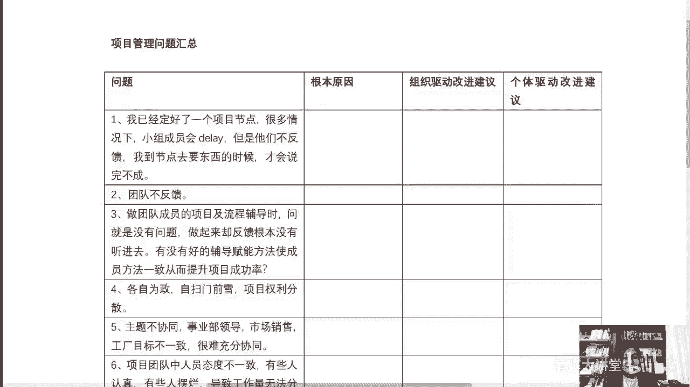