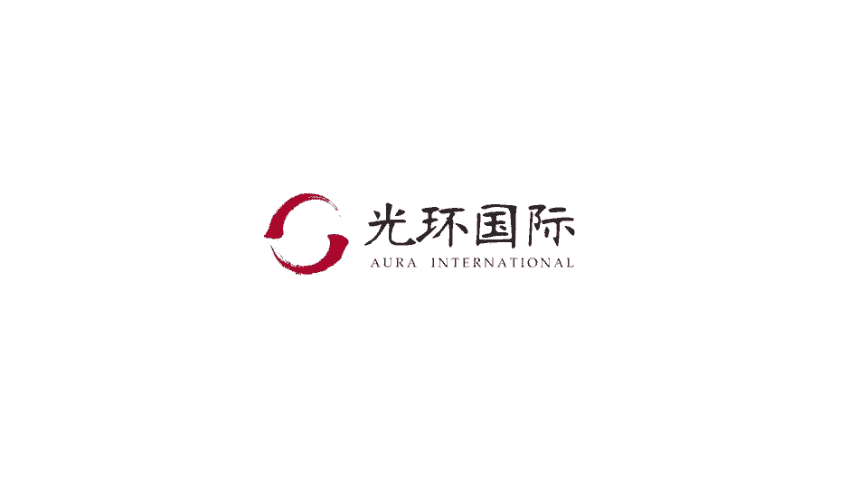
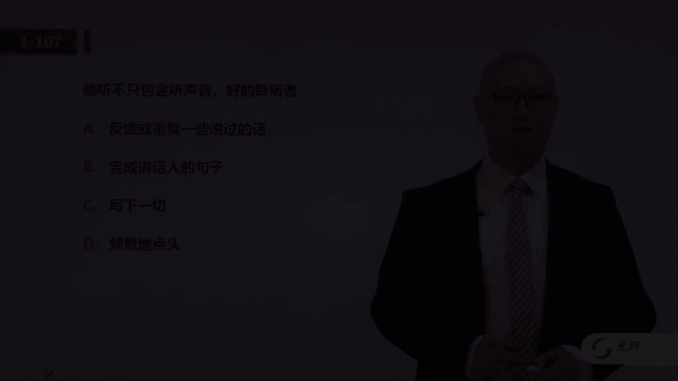
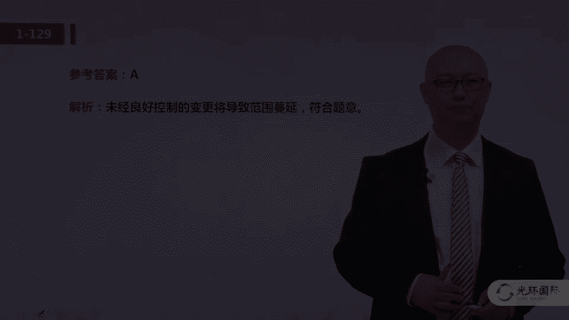
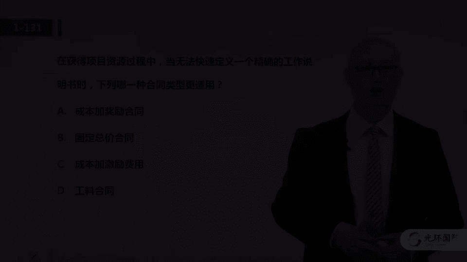
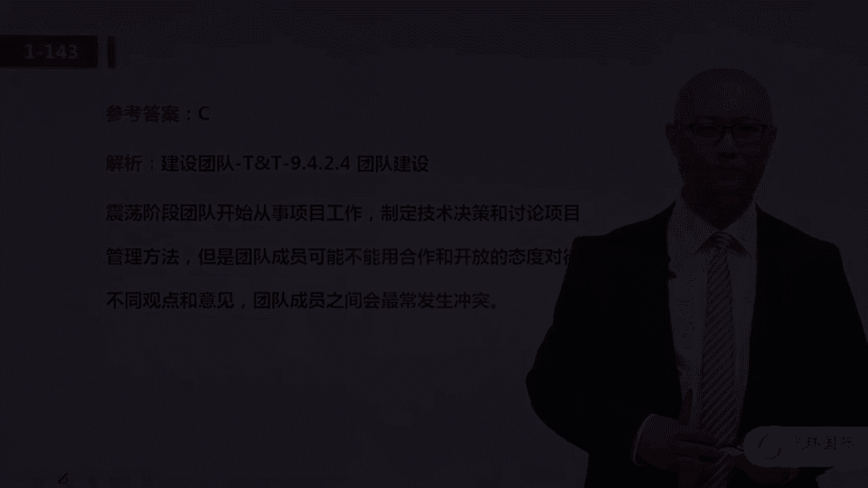
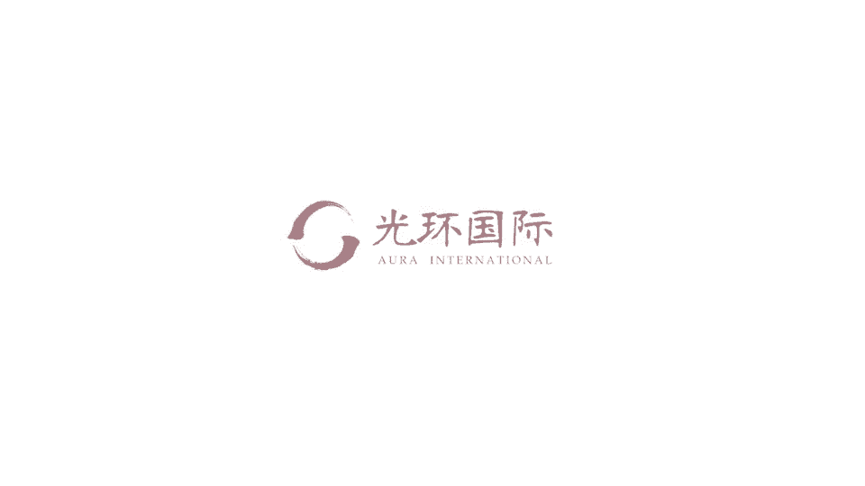

# 01 PMP培训视频教程 03 PMP第六版冲刺串讲视频教程 03 一模解析 3 - P1 - meiwanlanjun - BV1RY4y1f76k

好我们来看101题，项目经理计划为一个呃项目采购混凝土，所有供应商的质量都一样啊，只有价格差别，那么这个时候用什么类型来获得有用的信息，当然是用报价邀请吗，你邀请这些潜在的供应商给我报个价。

因为大家质量都一样啊，所以这道题呢非常的呃简单啊，是一道送分题啊，关于这个规划采购管理的一些输出啊，攻方选择标准啊等等啊，大家呢再看一下教材，101题选c啊，102题，客户要求变更啊，但是这会增加风险。

你应该怎么做，注意这又是变更流程的问题，那你就看看这abcd 4个选项，哪一个是符合变更流程的，或者说呢哪一个是在变更流程之前，就是呃就是啊比如说c啊，比b呢更前是吧。

更早一步要做这道题选的是c就是先分析影响，然后呢再沟通一下，然后呢再去好报给c c b去批准，所以这道题答案选的是c，他考核的还是变更流程的考点啊，好我们来看103题。

这个题呢是小学2年级加减法的问题是吧，有两个项目成本都告诉你了，潜在的收益也告诉你了，还告诉了未来运营的成本，也就是说其实呢对于这个投资方而言啊，那它的利润那一定是收益，减去成本和运营的成本。

就是你有两块成本啊，所以这个非常简单是吧，这是送分题，答案选的是第三个啊，b这个项目是更合理的，也就是说最终的收益应该是潜在效益，减去投资成本，再减去运营成本啊，c说的是最准确的，104题。

在项目的末期，项目经理确定了该项目要增加四个啊，增加了啊，注意啊，增加了四项功能和三个绩效，客户很满意，这对项目来说是否成功了，大家注意啊，这里关键词在这儿呢，增加了四个功能和三个迹象，这是好事儿吗。

客户很满意啊，那客户满意就是项目的成功嘛，大家注意这个不对啊，从管理上来讲，它镀金了他的范围，管的不好啊，范围管理的核心目的是做且只做，做少了不行，做多了其实也不好啊，所以这道题答案选b。

有人说那客户满意就行呗，客户满意，你增加了功能，可能你的团队加班了啊，可能你的成本是呃多支出了，所以说呢，大家不要仅根据客户满意这一一个方面，就认为项目成功啊，答案呢选第二个，从管理的角度呢。

它是造成了浪费，它的范围，管得不好，105题，有一个公司的业务开始流失，那么这个公司呢聘请了一个项目经理呢，来分析项目经理，发现没有可用的风险管理计划啊，风险管理做得很不好。

那这个时候你应该采取什么活动呢，实际上呃这个其实呢我跟大家说，这道题的题干嘛，嗯并没有特别的严谨，你公司的运营呃，真的是与项目的风险管理是等价的吗，大家不要纠结于这个啊，还是那个我们就题而论题。

他的题干当中说了没有可用的风险管理计划，那么首先我们应该怎么做识别风险吗，定性定量分析吗，这些都是后话对吧，我们在真正的去呃管理风险之前，先制定风险管理计划啊，这个答案呢选的是d。

那这道题呢我们用排除法啊，就是呃先制定计划，然后再识别风险，再定性定量的分析，所以这道题答案选第四个呃，对于风险管理的过程的先后顺序啊，之前反正有好多题呢也会考啊，这个大家一定要了解，首先规划风险管理。

编制风险管理计划，然后呢识别风险，然后定性分析，定量分析规划应对，然后在什么监督风险，106题呃，这个呢其实是一个关于因果图的，约定俗成的一个叫法啊，这个大家呢把它当做一个知识点来学就ok了。

就是啊为什么为什么，其实前面说了叫什么yy啊是吧，那这种题呢答案选的是c啊，就这种描述它描述的就是因果图，也叫鱼骨图，也叫这个呃石川图啊，这个呃在咱们一模当中，这个工具呢考了很多次了，大家要了解即可好。

我们来看100 071百零七题啊，倾听不止，包括听声音，好的聆听者，他会做一些什么事情啊，这个题呢也是一些软技能的题啊，就是在与人面对面的沟通的时候，我们应该啊怎么做，实际上大家看啊。

就是我们要挑a b c d当中哪一个呢，是呃更这个呃好一点的，普遍认可的一些好的做法啊，比如说写下一切频繁的点头啊，完成讲话人的句子，接下音是吧，这三个其实是不一定是都在都好的。

那么反馈或重复说过的一些话，这个指的是什么呢，就是对于比如说呢重要的信息啊，你重复一下，跟他确认一下，或者呢你没有啊听清楚的，容易产生歧义的，你重复一下，这个是呃作为聆听者是有必要的对吧。

他会提升沟通的效率啊，答案呢选的是a这个用排除法做，因为bcd呢都不是啊，好的选择好，我们来看108题，项目执行过程当中啊，团队告诉商经理呢，项目不能满足质量标准，于是项目经理开会分析。

大家注意这这道题有两个点，第一个点呢是在执行过程当中，也就是说他是执行过程啊，另外一个呢就是项目经理和相关方开会在分析，他也还是在分析为什么会造成啊满不满足标准，所以说他应该处于管理质量这个过程。

因为它属于执行过程组的，那么大家一定要注意管理质量，这个过程在之前我们有的时候也叫质量保证啊，控制质量我们也叫质量控制，大家一定要注意他们两个的区别，管理质量呢它关注于过程，它关注于提升能力。

提升什么能力呢，提升你高质量的完成工作的能力，而控制质量呢它关注于结果啊，你的实际的产品不满足质量指标，你回去改错而去，所以这道题它还是在过程当中啊，去分析问题，所以答案选的是a啊，管理质量109题。

哪一个过程实现持续的过程，改进答案还是管理质量这个过程啊，同样大家注意管理质量，重视过程啊，作为一个管理质量的一个一个结果呢，他可以提出啊过程的改进的一些建议啊，管理质量关注过程，控制质量，关注结果。

好我们来看110题，团队正在制定风险管理计划啊，这个过程采用何种工具和方法，确定风险的成本啊，并未这个项目预算和什么时间表安排活动进度，他这个后边这些话呢，你不用太在意，为什么这么说呢。

因为大家看第一句话，他正在制定风险管理计划，这也就是说这道题我们再看四个选项当中呢，他的真实问题是在问，制定风险管理计划的工具有哪些啊，那么这四个选项只有一个答案应该选a，在规划风险管理当中。

它的工具呢有会议这个方法哈，这道题呢呃问题确实比较简单，111体，项目进展一半的时候，项目经理发现过去几个月的正职报告有错误，这个事后你该怎么办，有错误，大胆地承认承认与呃积极的纠正啊。

那么选c这四个选项，用排除法选项c呢是比较合理的，它本质上我认为呢它还是考的是呃，项目经理的职业道德是吧，有了错，既然是你的问题啊，要勇于承认并且积极的啊改正啊，这个一一百11题选c，112题。

在一个新产品的需求会上，产品经理提出以往的团队经历了一些问题，并且要求呢项目经理呢提供一个计划，说你如何规避这些问题，大家注意，产品经理说了，以往的项目有问题，这个就隐含的告诉我们什么呢。

嗯这是啊与这个项目相关的组织过程资产，你应该去查一查，俺不要先纠结于说我项目经理如何制定计划，去规避这些问题，你首先要了解问题到底是什么样的，所以这道题的答案选的是第四个，查询经验教训啊。

去先呃了解一些具体的信息，查完了这个之后再是吧，针对啊以往的经验教训，你再去诶调整，或者说去优化你的啊项目的一些各方面的计划，112题呢选的是第四个113题，项目经理想要评估影响生产效率的各种因素。

系统性的评估，对项目总体成果最有影响的关键因素，用什么工具，大家注意啊，最有影响的关键因素，这就用帕累托图啊，帕累托图是什么呢，就是我们知道了一些影响问题的，产生问题的原因啊，可能有十个原因。

我希望找到最重要的原因，这个时候呢用帕雷托都是最合适的啊，大家简单记呢就是因果图是找所有原因的，而帕累托图呢是找主要原因啊，所以这道题选的是a啊，对于质量管理的一些经典工具，帕列托图啊，因果图。

流程图啊，控制图啊等等，大家都要啊仔细的去学好，114题，客户要求项目经理一个礼拜之内呢上线系统，系统仍然有小缺陷啊，但是项目经理希望满足客户的期望，让系统按时上线，大家注意。

这就是典型的消极风险或者叫威胁的什么呀，接受策略啊，就是我对于这个风险的发生不做事先的干预啊，对于威胁的用于策略嘛，有上报是吧，有有接受，有避免，有减轻，有转移，那么对于接受指的是呢我不可能消除。

而且呢可能也不是那么经济，那我呢不做事先的干预，大家注意啊，接受不是啥也不干啊，我给大家举一个例子，如果我的脑袋面临着你打我一拳这个风险啊，什么是这个减轻呢，比如说我戴个头盔，垫个枕头啊，这就是减轻。

什么是转避免的，就我一躲，你没打着，那什么是接受呢，对于我的脑袋面临着被你打一拳这个风险，我相信这个视频屏幕后边儿呢，你正在笑啊，那接受就是啊，我站着不动，你打吧对吧，这可能是接受，但是大家注意。

如果我提前准备个创可贴，提前准备一个呃红花油，大家注意，这个呢也是接受啊，所以一般情况下应急策略，应急计划啊，应急措施往往指的是接受消极风险的，接受呢就是对这个风险的发生和影响，不做事先的干预。

而不是说你啥也不做啊，这个大家一定要掌握啊，114题选第二个选项b115 题，哪一项质量工具用来识别两个惯量啊，变量的关系啊，这个呢又是质量管理经典的工具，散点图。

散点图的意思呢就是啊我不太清楚知道这个，比如说这个缺陷啊，这个问题我们把它叫做y，这是不是温度啊产生了影响，或者是什么电压电流产生影响，那我这是x我就做这种试验啊，同一个x我们测很多的y。

这就是典型的散点图，你看看最终的趋势是不是随着x增大，y y增大，这叫正相关啊，那如果x增大y减小呢叫负相关，还有一种情况就是无关嘛，所以呢散点图就是典型的让我们来去呃。

分析两个变量关系的这样的一个工具啊，当然也是在质量管理当中常用的一种工具，115题呢选第啊，三个选项散点图啊，这个呢也是大家必须要学习并掌握的，好我们来看116题。

风险可以在风险管理过程的哪个阶段被识别啊，这个呢，其实考我们的，是在风险管理的那些管理过程当中，其实它不应该是阶段，而是风险管理的过程啊，风险管理有什么过程呢，规划风险管理，识别风险，定性分析。

定量分析，然后呢实施应对措施啊，然后监督风险是吧等等啊，定量分析完了还要规划应对，然后呢实施应对，然后监督风险，那么在我们的教材当中，在pmbok当中识别风险，当然能够识别出风险来。

那实际上别的过程就不会识别新的风险吗，不是监督风险，也就是项目的实施过程当中，如果出现了你未识别的风险，那么在监督风险这个过程当中还会识别新的风，险，更新登记册啊等等一系列的动作。

所以说呢这道题的答案选的是第二个，116题啊，除了在识别风险这个过程之外，在监督风险这个过程，还会可能识别一些新的风险，所以116题选b，这道题呢其实跟呃考核大家对于风险管理，各个过程的理解啊。

那么监督风险呢，是经常作为pmp考试题当中出现好，我们来看117题，谁可以请求啊，与预算大幅超支有关的项目变更，这个考点呢，其实问我们的是谁有资格可以申请项目变更呢，这个答案呢是呃呃答案选的是所有人啊。

任何相关方都可以，这个呢大家把它当做一个知识点来学习啊，就是在呃项目的过程当中啊，项目的变更不是说只能由客户来提出啊，呃所有的相关方都可以提出呢变更请求啊，这个呢选第二个答案b118 题。

有一个x项目完成了60%啊，由于其他高优先级发起人撤出了资金，那么，把这个部门经理呢把资源啊，把团队成员调到另一个外项目上，这个时候项目经理应该怎么做，大家注意，这个这个时候说的项目经理。

应该指的还是x项目的项目经理，那么这道题的题干描述的情况又是什么呢，又是项目的提前终止，或者说是非正常的终止，那么项目提前终止了啊，前面好几道题都讲到了啊，我们立即好开展4。7啊。

也就是结束项目或者阶段这个过程，那么这四个选项当中呢，选项c属于结束项目的工作内容之一啊，就是整理经验教训，为后续其他的项目提供了经验教训啊，所以118题呢选的是c啊。

在结束项目或者阶段的这个管理过程当中呢，要组织要更新组织过程，资产整理经验教训，119题，项目经理感觉到会议成效很差，大家都没有准备，没有遵照会议的议程啊，应该怎么做这个呢，在之前那一道题上也提到了啊。

就是这个问题呢表现的很低级，那我们就从基础的原因去找，那么答案呢选的是第二个啊，那么整理会议的规矩，这个其实呢隐含的就是基本规则啊，团队的章程，这个同样考核大家的是在规划，资源管理当中的一个输出。

就是团队章程，那么我们呃既然在一起要做项目，那么有一些基本的规则是要共同的遵守的啊，不能由着性子来的意思啊，这个是在资源管理的这个知识域，当中的一个考点啊，答案选第二个b120 斤。

项目召开启动大会的适当时机啊，大家注意这个启动大会呢，因为英文当中啊呃有这个kick off meeting啊，这个呢指的是呃踢球嘛，就是足球中圈开球，那如果中圈开球了，那就说明正式开始了。

那呃对应项目呢就是它表示正式开工的意思，那么这个所谓的启动会啊，不是指的是启动阶段你要制定章程了，而说一些呃初步的计划已经制定完了啊，大家各个执行团队的任务，你都差不多已经有了一个计划了，之后呢。

要在执行之前跟一些呃执行团队啊，甚至是呃有关的相关方呢去开这个会，所以呢这个选的是a啊，是在初步计划制定后，所以这个启动大会，大家要理解是正式开工之前的一个呃誓师大会，动员大会这样的意思。

而不是说呃章程还没制定的那个启动啊，所以这道题选的是a好，我们来看121题，某家公司有一些项目啊，呃有三个a aba abc 3个项目，根据公司的目标，按照相同的标准去划分优先级啊，项目的b啊。

项目b的优先级比较高，因为它能够扩大市场份额，减少依赖性，那么这是在做什么事呢，大家注意这一，首先我们要判断这是多个项目，它就不是单项目管理，那么对于多项目的管理呢，有两个概念，一个叫项目集管理。

一个叫组合管理啊，项目组合管理，那么我们要判断这个选项啊，就做这道题，肯定是从b跟d当中去做选择，那么我们知道项目集和项目组合管理的区别呢，就是他们的项目之间有没有联系。

项目集管理的项目之间呢是有明确的，或者是有一个紧密的联系的，而是项目组合管理没有，那么咱们看这个呃，题干当中的a b c3 个项目，他们没有说明这三个项目之间有什么联系，所以说这道题选的是组合管理。

那么对应在咱们第六版的p m b o k当中呢，是在1。2小节啊，大家回去一定要看看书，那么项目组合管理，主要就是项目组合中的那些项目呢，可能共用组织的啊，同一类型的资源。

所以呢我们公司呢可能要把它们组合在一起，然后呢进行优先级的排序啊，得到一个更优的这样的收益啊，是这样的，121题呢选b122 题，团队识别到一个技术风险，那么大家注意，这个前面说的是一个。

可能对项目产生不利影响的风险，那么他就向这个项目经理报告，那么这是属于什么呢，首先我们注意它是可能造成不利影响，那么我们提前去去分析它啊，甚至是是去去去针对他，那就是典型的预防措施对吧。

这个问题还没有出现，我们可以提前的去做，那么这个122题呢，它嗯指的是什么呢，就是在变更请求当中，有一项典型的就是所谓的预防措施啊，可能未来的风险会影响绩效，影响基准啊，那所以呢我们提前采取干预啊。

可能就会产生变更请求啊，这是对于预防措施的这个知识点的考核，答案选b，123题，若要产生项目的初步概要设计呃，供这个甲方和参与规划的衡量，那么哪个是必要的，大家首先要注意它的题干说的是初步概要啊。

初步概要的定义，那么哪一个文件针对的是初步的问题啊，高层次的啊，整体的风险高层次的范围呢应该是项目章程，同样啊这个考点考大家的还是项目章程的呃，内容它的作用，它的意义，这个123题选第二个选项b好。

我们来看124题，一名关键的相关方不相信啊，项目管理计划当中的呃，提供的成本是正确的，然后就不批准，那这个时候项目经理应该用什么技术，大家注意这道题呢，严格意义上我认为它不是特别的严谨啊。

这个答案选a啊，说什么意思呢，就是只有选项a是成本估算和预算的一个方法，那么你把这个方法呢，像这个呃拒绝批准的相关方给他去去展示，你看我是通过专家判断得到的，这样的一个呃成本的值啊，你就是向他提供依据。

这样的话有助于他批准，但是呢他的问题描述就是他如果拒绝批准，你应该用什么方法，首先应该用的是合理的沟通方式，那你沟通的内容呢是你编制呃成本预算的依据，那这个才是更合理的，但是这道题呢大家可以用排除法啊。

这三个可能就更不相关，从这种意义上呢，答案选的是a啊，124题，只有a呢是与这个题干当中描述的问题，更相关一些，125t，在强矩阵和弱矩阵的组织结构当中，引发冲突的基本条件是什么，大家都知道啊。

这个考点呢考我们的是项目的不同的组织方式，那么答案选d啊，就是矩阵型的组织呢，但这个权限可能不是很明确对吧，呃到底职能经理的权限在哪是吧，项目经理的权限在哪，因为项目有临时性和独特性吧。

啊不一定每一个项目的项目经理，他的职责都是固定的啊，对于公司而言呢也不一定那么的成熟，所以说呢由于这种矩阵型的组织架构呢，就会导致大家的权限呢不是很明确，从而会引发冲突，谁都声称啊，我有这个这个人的啊。

完全的控制权，那不就有问题了吗，所以这道题的答案呢选的是第四个，那么基于这个呢呃有一个考点啊，大家回头呢要在书上去啊，去仔细的阅读，就是咱们第六版p m b o k这个指南当中的表，二杠一啊。

就是组织结构的类型是2。4。4。1小节啊，这个呢也是一个知识点，大家要去呃学习的125题呢，选第四个126题，项目经理为一家没有使用正式的项目，管理流程的公司工作，那么这个公司呢在整个项目生命周期内。

不断的修改需求，那如果要控制进一步的修改，应该更新什么文件呢，这个明显就是对于需求变更的控制，当然用变更流程啊，也叫变更的计划，变更管理计划啊，答案选这个第二个选项b，大家在做这道题的时候。

千万一定要注意的是，这个选项b是个名词啊，就是变更的啊啊流程变更的规范，变更的规矩是这个意思，而不是动宾结构啊，说这个是你把选项b理解成了，要把项目管理计划进行变化，那就换，所以这道题的答案是b啊。

你要遵循呃比较规范的，比较合理科学的变更控制流程是这个意思，126题呢，选第二一百27题啊，是谁将参与变更控制委员会，那这道题的问题就是说，变更控制委员会的成员应该包括谁，同样啊，跟刚才有一道题。

就是谁能够提出变更，这个是一样的，就是变更控制委员会的成员，理论上是可以包括所有的啊，所有的项目相关方啊，你项目经理有的时候可以是cs b的成员，那这个职场经历有的时候可能也是。

那其他没准客户代表呢也是，所以说这道题的答案应该是选c啊，变更控制委员会呢是由相关方来组成的，当然具体的名额呃，人员要根据具体的项目的特点而定，128题，在一次与相关方的会议上呢，大家达成了一项协议。

然后大家都达成了共识，但是啊项目经理从一个主要的相关方案当中呢，说呢，他们说呢他们改变主意了，那这个时候呢也就是说啊依然又不一致了，有冲突了啊，所以说这道题其实我们根据这个选项呢。

你应该知道它实际上考的是冲突的解决，冲突的管理的方式啊，冲突管理的几种方式，那么妥协强迫调和或者叫缓解，还有撤退，大家注意啊，这两个缓和啊，调和或者叫缓解是什么呢，是求同存异。

求同存异的意思就是大家还有不同意见的，也就是说没有最终解决问题，那撤退呢也是啊，就是这个冲突的双方或者意见不一样的双方，他们这个问题你没有解决啊，所以这道题呢首先我们要排除这两个，那么a与b相比呢。

当然这个a更合理一些，所谓妥协的意思就是中等的双方，或者说意见不一致的双方呢，呃各退一步，各退一步呢，就是达成一个双方能够勉强接受的方案，从而解决问题啊，所以呢妥协跟强迫呢都能解决问题，但是相对来说呢。

对于这个题干当中的环境而言啊，这个啊选a呢更合适一些，那么冲突的解决除了咱们这个妥协，强迫缓解和撤退之外，还有一个呢也是最理想的，叫什么呢，叫合作是吧，解决问题，这个是最理想的一种啊。

所以128题呢选a啊，那么对于9。5。2。1小节的冲突管理，大家也是需要呃去看一下书上的呃描述啊，129题，即使项目成功进展，项目经理依然承受来自发起人和客户的，多个新功能请求的压力。

那么管理流程呢已经定义，并且遵循了项目经理提醒变更委员会，太多的变更可能导致哪一项呢，啊，这个呢大家是对于范围管理的一个专有的名词，就是太多的变更往往会导致范围的蔓延啊。

范围蔓延就是往往往由客户提出的变更啊，不断的啊不受控的去一直在增加导致的，而镀金呢往往是由项目团队啊，去增加系统的功能，所以这道题呢考核的是对于像啊，范围蔓延这个专有名词的一个掌握啊，答案选a好。

我们来看130题，可以用什么策略来应对消极或者呃积极的风险，就是说这四个呀有一个既可以用来针对威胁，也可以用来针对机会，哪一个呢，答案应该是接受，那么对于咱们风险应对策略的呃，这个不同的策略。

那么大家啊要看一看规划，风险应对的方法与工具当中啊，关于机会的应对策略和威胁的应对策略，那么有两个啊，其实是都有的，这个是第六版p bk当中新加的，就是你对于风险有一种应对是上报啊。

那还有两个呢就是这两个是一样的，那其他的就不一样了对吧，对于机会而言，你可以开拓啊，分享啊，提高啊，对于威胁而言呢，要规避转移跟减轻130题，选a啊，131题在获得资源的过程当中。

无法快速定义工作的说明书，那么用什么合同类型，大家注意啊，当我们无法准确地知道工作的范围的时候，用总价类的合同当然就不合适是吧，排除掉了吗，你工作范围就不知道，但是你工作范围不准确的知道的话。

成本类跟公料类其实是都可以的啊，是都适用的，那这道题我应该选哪个呢，所以这道题大家在做选择的时候，就还需要一个依据，就是你发现是在获得资源，什么意思呢，就是这个时候啊你要获得资源，那么你就是甲方啊。

你要去采购一些资源，那这个时候你是甲方的话，对于合同类型呢，我们又应该掌握的是，成本类的合同是对甲方不利的，是对乙方有利的啊，总价类对甲方有利吗，但是总价类呢又不能针对于这个，所以基于这两个依据啊。

首先你是甲方，其次呢范围又又不清楚，选工料类，因为工料类，首先它可以针对于范围不清楚的情况，那么其次呢工料类呢又比较的中性对吧，他们对于甲方没有什么不利影响，所以基于这两个依据，我们选的是第四个选项。

d合同类型的这个知识点，在我们一模当中也出现了好多次了，同样大家一定要看一下书上的啊，严谨的说明文字啊，132题，当与一个行动导向型沟通的时候，项目经理应该关注于跟他沟通什么内容。

大家注意这个呢其实就是一个呃软技能啊，小的知识点，大家把这道题当做一个小的知识点来学就ok了，那么这个知识点是什么呢，就是对于呃行动导向型的人呢，你跟他强调什么呢，可行性。

因为他比较关注这个啊具体的可行性问题，而对于结果导向型的人，你跟他沟通的时候呢，要关注于这个结果的利弊啊，因为他更关注这个啊，大家把它当做一个知识点，那这道题呢啊行动导导向型的啊，你跟他强调可行性。

所以选a选项啊，好我们来看133题，项目经理负责一个集成项目，那么在执行管理质押的时候，需要什么文件，大家注意这个管理质量呢，就是我们质量管理这个知识域当中的一个过程，它在执行过程组里哦。

我曾经说过管理质量它他关注的是过程，而控制质量关注的是结果，那这道题说管理质量需要哪些文件呢，这道题的问题，其实问的就是管理质量这个过程的输入，所以这道题考的是输入的问题，那我们在做题的时候。

你应该去分析，就是说我们在，管理质量这个过程执行之前啊，应该先有什么样的文件，应该依据什么样的文件，应该参考什么样的信息啊，结合着这个呢再结合这四个选项去答，当然这样的题我曾经说过。

就是呃很难把所有过程的输入输出都背下来，但并不是说呃每个呃对于选择题而言，也不一定非得都背下来，我们可以用排除法来做，当然啊，我们模拟考试的一个意义，就是通过题去学知识点吧。

所以这道题呢大家把它啊回头去看一下书啊，管理质量这个过程的输入，包括项目管理计划，项目的文件，其中项目文件就特特意强调了质量，测量指标和风险报告，那还包括呢组织过程资产，那综合这个呢答案选的是a好。

我们来看134题，项目正在进展中啊，这个项目经理呢与质量保证部门一起，致力于提高相关方对于满足质量标准的信息，那么在这个过程之前，他们需要什么内容，同样大家注意这个同样考核的是什么呢。

考核的是管理质量这个过程的输入啊，因为与质量保证部门一起嘛，在第五版之前的p m b o k当中呢，把管理质量这个过程称之为保证质量，这只不过是对于词的呃一些呃调整，那么这道题其实考的还是啊。

质量管理知识域当中的第二个过程，在执行过程组当中管理质量，你的输入文件，这道题的答案选的是第四个啊，那么质量管理计划当然是在做管理质量，这个过程的一个输入，那么质量审计呢是管理质量这个过程的。

一个典型的工具啊，这道题呢选的是第四个选项，好我们来看135题，w bs字典已经完成，团队开始识别风险，发起人呢啊做了一些事情啊等等等，提干呢就不给大家念了，这道题，他说接下来项目经理应该做什么啊。

实际上这道题的题干的问题是，你制定完了w bs，创建好了wb s词典之后，这四件事情啊，哪一个是可以开始做的，这道题就是考我们对于这个项目，管理过程之间的顺序，和他们输入输出之间的关系的一个理解。

创建完了w bs呢，从这个理论上就可以开始去什么呀，去定义活动了啊，因为活动就是在工作包的基础上，进一步的去定义活动，那么其他的呢用排除法啊，这个都是不合理的，所以这道题啊。

实际上考的就是w bs制定完之后，可以将工作包分解为活动啊，答案选的是第二个选项，这个用排除法做好136题唉，客户呢接受了两个成果，一共有四个可交的成果啊，那么呃在交付之前，应该怎么样。

才能保证你的可交付成果与客户期望一致呢，就是你现在这个情况不好，那用什么哪一个管理过程来保证可交付成果，与客户的需求一致呢，答案选控制质量啊，这道题同样啊，在于大家对于控制质量这个过程的理解。

我再强调一遍，管理质量关注过程的合法合规性，它的核心目的呢是提高满足要求的能力啊，这个是我们国家呃标准的定义嘛，那么控制质量呢有的时候我们要质量控制呢，它关注的是结果啊，你通过这个过程呢让什么呀。

让实际质量符合呃，质量标准符合客户的要求，也就是说我们用两个字来理解，控制质量呢是要改错，有错你去改，所以这个呢我们选a，那管理质量呢其实就是少出错，而让过程呢更这个符合规范要求。

所以这道题啊136题选的是a好，我们来看137题，控制图有助于项目经理，这个呢考大家的是，对于控制图这个方法的作用的理解啊，这个答案呢选的是第四个选项d啊，流程是否能够正常运转。

我相信这个之前呢我们呃视频课程当中，老师也给大家说了，控制图呢它的横轴是时间啊，它看上下波动是否超过了限值啊，是否有连续七个点都在均值的同测等等啊，这个是控制图的定义啊，这个是一个知识点。

大家一定要掌握，137题选d，138题。

哪一项说明了，为何帕累托图能是指出重大缺陷的有效工具呢，这道题实际上考我们的，是对于帕累托图定义的理解啊，帕列托图就是找主要原因的是吧，我们有十个原因可能导致这个1万个缺陷。

其中有一个原因导致了八八千个缺陷，那可能呢这一个原因，那你怎么样去展现这个图呢，就是用帕雷托图啊，通过识别相对少量的造成最大影响的原因，指出呢最有效的改善的措施啊，这个答案呢应该选a。

这个实际上考大家的，是对于帕里特图定义的理解啊，他是找主要原因的，呃138题选a啊，139题，一个新项目已经启动，并且呢已识别了许多项目的相关方，但是每名相关方对于范围，预算进度的期望都不一样啊。

用什么工具来为相关方可能产生的影响，排定优先级，这个呢是在规划相关方管理啊，甚至在在分析他们的影响的时候，常用的一个工具，这也是典型的工具，叫权利利益方格是吧啊，把权利和利益呢我们做一个呃。

一个这样的一个图啊，可能分成四部分，可能最大的就是权力也高，力也大的，要重点管理，那么权利低，利益低的呢就是简单的呃花最少精力去管啊，这有四种，这四个象限呢它就对应于四种相关方啊。

所以这道题呢139题选第二个b啊，权利利益方格是经常用来进行相关方分析的，一种典型工具，好我们来看140题，客户所用的软件应用程序有10年了，这个但是还得用，另外呢像有一个相关方认为呢要过时了得改。

其实这个题干呀没有多大的呃信息量，它的核心问题就是商业论证用来确定什么，当然啊，大家对于商业论证的字面意思，也能够做出答案来，就是是否值得投资吗，啊就是商业论证呢是制定章程的依据啊，你商业论证通过了。

可能才会呃去启动啊，制定项目章程最终的立项啊，是这个意思，答案呢选的是c啊，对于商业论证的呃呃价值它的作用好，我们来看第141题啊，制定章程的时候呢，一个相关方没有提供任何意见，项目经理反复咨询。

他还是不说啊，就是不告诉你，我就不说，那这时候怎么办，首先大家一定要注意这道题的题干呢，告诉我们的是要制定项目章程，那么那么在制定项目章程的时候，我们发现了这样的一个问题，应该怎么处理啊，答案呢。

来看一下哪一个是可以放在章程里的内容啊，答案选c就是将这个相关方不告诉我他的意见，这件事情呢作为一个项目的主要风险，添加到章程上呃，我们应该知道章程呢是可以啊，加入这个项目的整体的风险这个内容的。

所以这道题呢，实际上考我们还是项目章程的内容啊，这个考点好，我们来看142题，一个项目发起人落实一项新的文件控制流程，这一项新流程呢将延迟对信息的访问，会导致人工成本增加啊。

那么如何来整合这样的一个流程，那么我们读完题之后呢，我们要判断这道题到底在考我们什么，那考什么呢，其实他考我们的是变更控制是吧，那么遇到了一个变更，我们应该怎么做啊，选项a说使用变更管理计划呃。

实施新的需求啊，选项b c d大家注意啊，这四个选项当中，如果有一个选项说了要遵循变更流程，那么往往这个选项都是正确，所以这个选项a一定是保险的啊，所以答案呢选的是这个a啊。

用变更管理计划呢去呃去实施新的需求，去执行变更好，我们来看143题，在哪一个团队建设阶段，团队成员之间会呃最常发生冲突，答案呢应该选比较简单啊，选震荡阶段，这个呢是在团队建设当中啊。

考我们大家的是对于团队建设当中呢，呃这个所要经历的五个阶段啊，那么其中震荡阶段呢，就是大家呢在磨合可能会有冲突啊，大家的工作习惯可能不太一样啊，这个呢大家再看一下19。4。2。4小节。

团队建设这个呃知识点好。

我们来看144题，项目群经理在实时审计的时候发现的问题，日志中的各项都是项目经理啊，那么这种情况是否可以接受呢，比如说所有问题都由项目经理负责，那么这道题的答案啊，先跟大家说啊，答案选d就是不可接受啊。

我们认为呢啊对于美国的项目管理价值观啊，他认为团队呢应该是项目问题的负责人啊，如果有问题应该由团队负责，这个呀，我个人认为，这个他也并不是一个绝对没有争议的，所以这个答案其实并不完美，不是特别好的。

所以大家这道题一定要注意啊，不要把这道题当作一个呃明确的知识点啊，这道题我们只能用排除法来做，就其他选项呢说的其实也都不太合理啊，实际上问题日志那每一个问题吧，可能我们最终都会找到啊。

相应的啊找到相应的负责人啊，谁去负责解决这个问题啊，这个这道题呢，只不过选项d呢是呃比那三个更合理一些，他说我们都应该由团队来负责解决啊问题，但是这个呢呃呃不一定是最准确的啊。

大家呃这道题只能是就题论题用排除法来做啊，啊对于问题日志这个概念，大家还是要看一下，9。5。1。2小节好，我们来看145题，在下列哪一个阶段，项目存在最大的风险和不确定性。

这个呢其实考我们的是对于项目生命周期，各个阶段的特点啊，这个呢在我们第六版当中吧，是在我们的第六版当中的，就是后边啊，就是项目管理标准当中的图一杠三，大家注意啊，这个不是指南当中的图一杠三啊。

是第六版当中，项目管理标准是在我们书的后半部分，图一杠三当中呢有一个这样的一个图，就是在项目的概念和启动阶段呢，风险啊不确定性特别大，但是呢他这个在前期啊，概念和启动阶段变更的影响比较小。

因为我还项目还没有实施嘛对吧，但是呢在前期呢我的不确定性是非常多的，好多事情我不太清楚，这也反映了项目的渐进明细特性啊，这个图呢大家理解一下就ok了啊，这个是第五版的图呢是在呃指南的前半部分。

而这个是放到了标准项目管理标准好，那么145题呢选第二个选项b啊，我们来看146题，项目经理呢正在与两个人沟通，这两个职能经理都说这个可交付成果是他的，那项目经理应该查阅什么文件啊。

就是哪一个项目的可交付成果也好，产品也好，或者说功能也好，属于谁啊，查什么文件呢，查需求跟踪矩阵，需求跟踪矩阵就是建立联系的建立啊，需求的提出者与最终的产品功能之间啊，建立这样的联系。

从客户提出需求到需求规格说明书到概要设计，到详细设计，再到产品的功能啊，把这些啊来龙去脉规定清楚，所以这道题考大家的是需求跟踪矩阵的定义啊，大家看一下5。2。3。2小节，把它作为一个知识点来学习啊。

这道题答案选第二个呃，147题，这道题呢是一套呃非常明显的一道呃，比较简单的一道数学题啊，那么哪个方案的回报比较高呢，我们把每个方案都算一下，方案一呢是成本6000块钱啊，有50%的用户呢可能会使用。

一共呢1000个嘛，50%的用户使用的，那你就有500个用户呗对吧，那么方案二呢成本是呃1万美金，有70%的用户，但是呢这个每个用户的收入就是15美元，所以我们算方案一的就是啊有500个用户用。

然后呢成本是这个方案二，是有700个用户用是吧，然后成本是这个，那么我们算一下方案一的这个呃收益呢比较大，所以这个是一道非常简单的小学数学题啊，这道题选a148 题，一家咨询公司呃，在获得了一个合同。

项目经理，他们对于项目的支公司高层啊，同时呢告诉他，那么项目经理要优先做什么事情，大家注意这个，同样啊我们根据选项，它同样考的是什么呀，考的是项目章程，章程会明确公司高层对于项目的呃。

确认对于项目经理的支持啊，给项目经理授权动用组织的资源等等，所以这道题还是考大家，项目章程的作用和意义啊，选a我们来看149题，项目要求为关键路径上多个任务制定资源啊，那么整个工期的资源是充足的。

但是某个特别的月份吧，可能资源不太够，那这个时候用什么样的技术啊，这又是一个非常明确的一个问题，他的答案也比较明确，就是用资源平衡这个技术，就是我其他月份资源比较多，这个月份资源比较少。

但是需求量比较大，那你可以把其他月份的资源往这边去平衡一下，协调一下啊，对于资源平衡啊和资源平滑，大家一定要掌握这两种资源优化技术，在我们p m p考试题当中呢，也是有可能出现的啊。

这个是在制定进度计划的时候，可以采用的一种典型的技术，资源优化技术呃，149题答案选a好，我们来看150题，公司建立了pmo啊，那么pmo提出对于一个项目啊，具体的这种组织结构啊，它的特点是。

项目经理享有中高级别的权利啊，并且呢可以控制项目预算，大家注意，这道题的关键考点就是题干当中的关键考点是，项目经理呢享有中高级的权利，而且呢啊他有权利控制项目的预算，这个指的就是强矩阵啊。

它的知识点呢同样是项目的组织形式表，二杠一啊，这个呢也作为一个知识点，一个考点。

