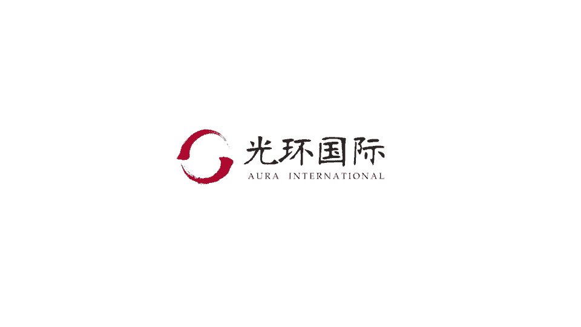
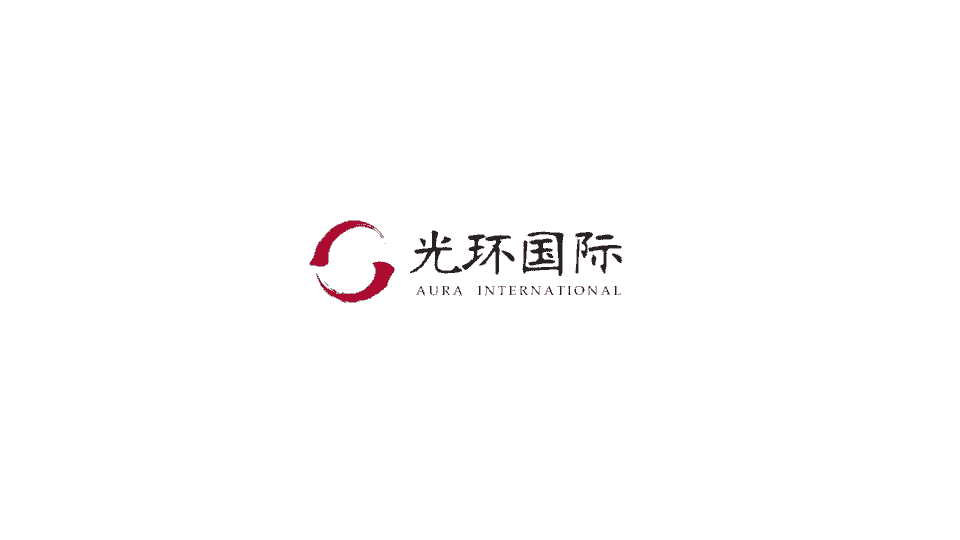

# 01 PMP培训视频教程 03 PMP第六版冲刺串讲视频教程 01 冲刺专题 02 专题二冲突、变更专题 1 - P1 - meiwanlanjun - BV12D4y1W7Dp

各位同学们大家好啊，今天由我给大家讲一下冲突和变更这两个专题，冲突和变更这两个专题，在考试中呢主要的出现都是由情景题为主，那么在考试中占比是比较重的，也是大家比较难理解，容易出错的地方。

所以我们今天呢拿两个专题出来，重点给大家介绍一下呃，那我们来先看一下第一部分冲突管理，冲突管理我们先讲冲突的来源，冲突主要有七个来源呃，大家不需要啊，逐字的去记忆，我们可以看一下规律。

下类从项目管理的角度来讲，容易产生冲突的主要是人时间成本啊，当然还有管理技术，其他这个是人员的个性冲突啊，项目的优先权，其实项目优先权也是围绕在资源的这一角度的，所以大家来啊。

在理解的基础上记一下这七个冲突的来源，那么冲突的影响呢啊并不是只有消极的影响的，它也可以带来积极的影响，这个大家一定要记住，那首先在消极的成分啦，大家可以很好的理解啊，它会产生敌意，会影响团队的绩效。

但是在积极方面呢，所以这个结论大家记住，就是说既有消极的，也有积极的影响就可以了，那说到冲突管理呢，就涉及到管理的风格，我们根据啊，项目经理与团队成员在这个呃做事的这个方式，我们可以分成四大类。

上面这两大类是相对应的啊，指令式的和授权式的，指令式的，就是说由项目经理完全集权于项目经理，由他来决定我们要做什么啊，完全是他决定你来做，那这个关键词就是告知指示，指导揭秘哈，就这相关的一些关键词。

那么与它相对应的是授权式的管理风格，那么授权呢就是完全的放权，由团队成员自己来决定自己要做什么，怎么做啊，这个是这两个相对应的，那下面这个呢，这两个呢是项目经理与团队成员的，这个模式就有所改变。

第一个呢是团队式的，是项目经理，其实参与到整个团队里面，大家一起共同来探讨，共同来决定我们应该如何做，怎么做，这个关键词就是参与啊，鼓励合作，承诺等等，另外一种呢叫做教练式的风格啊。

教练式的风格跟指令呢经常会有会有那个混淆，教练式的风格呢，是说我们大家一起来探讨这件事情怎么做，但是最后呢是由项目经理来决定啊，这个事情最后的方向，那么这个关键点就在于推敲啊，解释澄清和说服啊。

主要的关键词，那么这四种管理风格在整个团队建设的这个呃，这个周期中是怎么出现的呢，我们来看一下啊，形成期，首先形成期是需要一个叫指导式的，这个风格就是指令式的，完全由项目经理来说，我们应该怎么做。

我们要建立制度啊，如何做，这个是指令式的，在震荡期我们需要的是教练式的，大家一起探讨说这个事情怎么做，但是最后由项目经理来决定如何啊，最后来做决策，在规范期大家已经工作得很好了，那么这个时候项目经理呢。

与团队成员的这个关系就是参与式的啊，大家一同来决定啊，一同来做，在成熟期呢啊，整个那个整个这个项目，大家都已经磨合的非常的好了啊，那么就完全放权，大家自己就自己决定啊，自己做啊。

这个这个图里面呢还有两个曲线，大家需要重点关注，第一个呢是工作绩效，第二个是团队的事情，工作绩效这条线啊，是从城成形成期到最后成熟期是单调递增的，也就是说我们这个项目团队从形成开始。

他的这个工作绩效是不断的变好的，但是有另外一条曲线是团队的一个士气，在可以看出啊，在形成期我们的团队士气是比较高的，很有干劲的，但是大家进入震荡期，在冲突不断增加的情况下，我们可能会存在一个区间。

就是这个士气会低落，大家变得嗯没有那么高，没有那么高的士气了，但是逐渐进入规范期和成熟期之后呢，最后达到这个士气的最高点，这两这两个曲线哦非也非常重要，经常是考点，所以大家一定要理解理解这两个曲线。

再来我们看一下这个呃冲突管理这一部分，管理团队，管理团队这个过程的主要作用呢，是影响团队的行为，管理冲突以及解决问题，那么这个过程其实是在整个项目期间，是哦不停的都在开展的。

那下面这个管理团队这个是最新的，我们第六版的这个i t t o图，可以看出啊，跟第五版有很明显的差异，就是说啊在每项下面，我们都列出更加详细的这个这个细项，便于大家理解。

那这一部分的考点主要集中在工具技术里面啊，人际关系与团队技能里面的冲突管理，这一部分是考的比较多的，需要大家重点的去理解记忆，冲突管理这个解决方法这一部分是必考的，而且呢考试里面多是以情景题为主。

所以大家不止要把这个五种方法背诵下来，而是说要实际的理解理解它们的差异，以及他们实际应用的场景，我们来逐一介绍一下，第一撤退回避，撤退与回避这个词的关键点在于，我们从这个问题中跳出来，暂时先不去处理它。

把问题推迟到我们能够解决的时候啊，再去解决它，那就是说这个就是撤退回避，一个很典型的一个呃一个情景，那么第二个是缓和与包容，缓和与包容的关键词在于是为了关系的和谐，气氛的和谐，所以我们关系各退让一步。

我们先这个事情其实也是搁置了，也是没有得到解决方案的啊，缓和与包容是这样的，然后妥协与调解，妥协与调解这一部分呢，其实是为了得到一个解决方案，双方呢都能够各退让一步，最后呢它与缓和的一个关键的差异在于。

妥协这个税后是形成了解决方案的，而由于双方都各让了一步，所以没有任何一方是嗯，实现了自己最初的那个想法的，所以他其实是一种双输的局面，双输的局面，第四个强迫与命令，这个就比较好理解啊。

就是说强迫一方接受另外一方的观点啊，那就是一个输赢的局面，最后也是形成方案的，有解决方案的合作与解决啊，合作与解决问题呢，这个是啊整个项目管理中最提倡的一种方法啊，那就是说在面对问题的时候呢。

我们要有合作开放的态度，引导整个团队去达成共识，去共同寻找解决方案，这种是双赢的局面，那我们综合来看这五种，这五种解决方法，前两种方法撤退与缓和都没有形成解决方案，没有形成解决方案，后三种方法妥协。

强迫合作都形成了解决方案，不同的是妥协，双方各让一步是双输的局面，强迫一方啊，一方观点凌驾另外一方是输赢的局面，而合作是双赢的局面，这样大家会比较清晰一点，那我们来做几道题目练习一下。

首先第一团队士气低落啊，存在严重的冲突，那么团队处于哪个发展阶段呢，对我们看一下刚才那个曲线，大家回忆一下，我们应该选择c啊，这个是震荡阶段哦，团队士气的这一个典型的特征，我们再看一道项目经理。

面临两名团队成员之间的严重分歧，他决定在行动之前了解更多的情况，那是哪一种管理这个哪一种方式，我们来看一下，首先第一点他并没有行动，也就是说没有方案，那就我们只能在缓解和撤退之间选是吧。

那么我们再来看强调的是啊，强调的是一致，并非差异，我们提到缓解呢就有一个词，就是说有一个拖延，就是说等到能够解决的时候啊，先我们先缓解一下气氛之后，我们在调查清楚之后，我们再来解决，所以这道题答案选择。

答案选择b是缓解，我们再来看啊，嗯项目经理注意到两名成员之间的矛盾，使整个项目团队的这个绩效都变差了，那么如何来解决这个矛盾呢，如何来解决这个矛盾呢，那我们来看一下刚才讲过整个冲突管理中。

项目管理最提倡的是一种合作的态度，来解决问题，那么从这里面来看，只有c团队开会啊，确定关键问题所在，允许公开讨论，那么这就是一种非常典型的合作的啊，冲突管理的方式啊，这个是最有利于解决冲突的。

所以呢我们这道题答案选择c，再来看，我们这道题目呢啊题目很长，我们简单概括一下啊，就是说针对一个问题，我们之前已经达成了一种达成了一致，后来呢有一方要改变，那我们应该用哪种方式来解决这种冲突呢。

我们来看一下啊，这个从用排除法来说，缓解和撤退可能都不太适合，因为他们没有最后的解决方案，那么对于项目经理来说，妥协在这种双方啊意见不一致的时候，他都能就是妥协，是能够找到让双方都满。

就是一定程度上满意的方案，那么这种方式呢是非常适合当前的这种情景的，所以呢我们这道题选择a是妥协，妥协，像强迫这种方式呢，一般来说就会造成一些，就是说可能更可能会使矛盾进一步的升级，那我们再来看一道题。

在一个大型项目快要结束的时候啊，团队成员之间的冲突越来越多，影响到了生产效率，然后投项目经理做了一个决定，他开除了两名成员，那这个策略是什么呢，这个很明显就是强迫啊，既没有找，也不用找那个呃。

就是说调调查更多的情况会怎么样，我们直接就是当机立断开除了两名成员，那这就是强迫强迫的这种解决方式呢，有两个特点，大家要看出就是要记住，第一个呢是非常的紧急的行动啊，时间很快，不需要不需要拖泥带水。

那么第二个呢就是说，为了一个长期的这样一个利益，必须临时性的这个采取一些措施，他的优点是短平快啊，优点是短平快。

