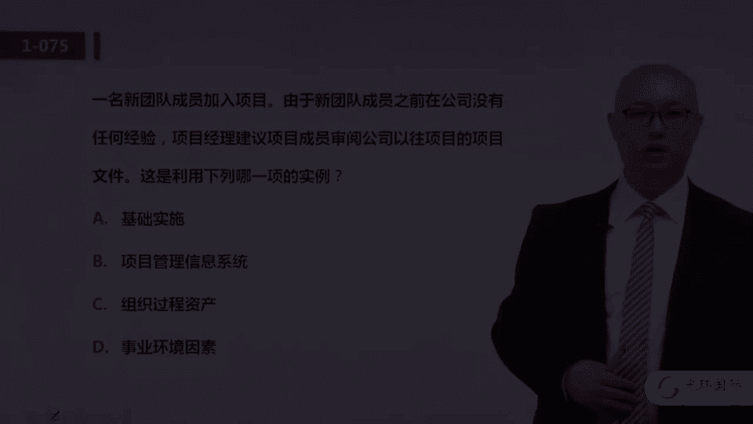

# 01 PMP培训视频教程 03 PMP第六版冲刺串讲视频教程 03 一模解析 2 - P1 - meiwanlanjun - BV1m8411N7x1

好我们来看51题，有一个团队啊，找团队成员，找项目经理说他不知道哪个工作该他玩，该他干啊，那么哪个文件对工作包进行详细描述，哪个文件对工作标详细描述，这个又是我们p m b o k啊。

p m项目管理标准的一个专有的名词，叫w bs词典啊，工作分解结构词典，他对于工作包做详细的描述，这些东西呢啊都没有这个功能啊，这就是一个啊明显的具体的知识点啊，w b s词典就是详细描述啊。

工作他是什么样的啊，它的标准是什么，由谁来负责，所以呢答案选a啊，w bs点是范围基准的组成部分之一，所以呢范围基准它包括wb词典，包括批准的范围说明书是吧啊，还包括w b s，那对于范围基准的内容。

以及范围基准当中各个组成部件的内容，大家都需要啊详细的学习，52题，发起人要求项目经理提前一个月完成项目，那么要满足这个请求应该怎么做呢，大家注意，这是一个典型的变更嘛，你要变更进度基准提前一个月嘛。

所以呢应该使用变更控制，这道题是一个非常呃基础也是非常简单的题啊，答案选a啊，那么在变更控制当中，我们首先要提出正式的变更申请，然后呢团队进行分析，然后呢再交由相关的，比如说c c b啊，去批准啊。

选a53 题，下列哪一项用在定义范围当中，唉这道题问的是什么呢，是定义范围这个过程的，工具和技术是吧，爱注意啊，用排除法完全可以做的范围基准和w b词典，这个是定义范围之后的过程。

w b s这个过程之后的输出啊，所以呢b跟c啊，在定义范围当中呢，你还得不到啊，更谈不上工具了，那这道题答案选a啊，定义范围的呃，工具和技术，这个是在5。3。2啊，工具和技术当中有产品分析。

产品分析呢可以用于定义产品和服务，那么你定义的产品和服务，是不是相当于把你的范围给进一步的明确了，53题选a，54题，针对设计经理提出的某个问题的解决方案啊，项目经理呢必须收集啊相关的呃呃信息。

那么哪一项，能防止任何人对于结果产生不恰当的影响啊，任何人对结果产生不恰当的影响，这个呢是解题的关键啊，大家需要了解什么呢，需要了解德尔菲技术的特点，德尔菲技术呢是专家判断的一种啊，尼奥咨询啊。

好多位专家啊，你要咨询他们的意见，对某一个具体的问题，那怎么样呃，就是有一种啊叫德尔菲技术的，它就是通过匿名的方式啊，这就可能去排除某一某一个单独的个人，对于其他人的影响，给大家举个例子。

比如说我跟我的导师呢，呃有一个呃科研项目啊，都去做评评委会的专家啊，是同意还是否决，那我呢如果在我们导师面前，我们导师同意了，我就不敢反对了啊，因为我比较尊师重教是吧，你不敢，但是如果匿名呢是吧。

如果用调查问卷的方式，匿名的主持人去去去给我们发卷子，这就是所谓的德尔菲技术，德尔菲技术的关键词是什么呢，就是专家匿名多轮啊，比如说第一轮呢我们十个专家投四个项目，选出前两名来。

那第二轮呢再从这两个项目当中再投票啊，选出一个来啊，大家一定要注意专家与专家之间，他们的投票结果是不知道的，互相啊就是专家匿名多轮，这就是德尔菲技术的特点，它就可以有效的避免个人对于结果产生。

不恰当的影响，54题选a啊，德尔菲呢也是一个常考的点，54题选a，好我们来看55题，在项目过程中发生了意外啊，该时间影响了呃成本啊，这个应该是该事件啊，该事件影响了项目成本，但未影响到进度。

那么这个事件呢之前被团队识别成识别到了啊，就是一个风险，那么若要限制该事件对于成本的影响，应该怎么做呢，还是啊对于项目执行过程当中发生了风险，我们的常规动作啊，尤其是以识别的风险。

我们当然第一反应就是查阅登记册，确定适当的应对啊，那么是不是需要提出变更申请啊，是不是进行采用全面措施啊，进行什么分析都是先做a啊，所以这道题答案选a，查阅登记册呃，确定适当的响应，56题嗯。

给了我们一个表，有五个风险，每个风险的概率，他们对成本进度和总绩效的影响，大家注意这一列是概率啊，这一列是不同的三种影响，这个他的问题是啊，大家注意啊，他的问题是如果成本啊是最优先考虑的。

那么你认为哪个影响是最关键的，所以说呀我们只关注什么呀，我们先关注成本，那也就是看这个概率跟成本的影响做乘积吗，找最大的答案应该是d，四个风险选项d啊，这个0。5乘以四，这个等于二点嘛，这个最大啊。

所以呢你用概率乘以成本找这个最大的啊，答案选第四个，57题嗯，相关方呢感觉他们收到的信息十分复杂，难以理解，而且不能做出有效的决定，这说明什么呢，大家注意说明你呢沟通管理计划有问题。

那么你沟通管理计划的问题来源于什么呢，来源于你对相关方的分析不到位，那你应该怎么做呢，你应该去什么呀，去分析人家相关方对于信息的具体需求，那比如说有的管理层，人家只需要一些宏观的信息。

你别告诉我具体的啊，工作是吧，你说的那么事无巨细，所以说呢你要去审查沟通需求，你要不要减少报告数量啊，包含什么术语，包含解释性附件，人家都说了十分复杂了，你还解释是吧，人不想看，所以你先什么呀。

先去审查需求，如果需要再做这三件，所以你看啊，有些题真的是呃四个选项吧，往往有三个呢，它是就是说有一个选项正确答案，你先做这个选项的事情，然后有可能做那三个啊，57题呢选a啊。

这道题呢是根据问题的题干啊，它不是说你报告数量太多了，还是说你没有术语解释表啊，不是这个，而是说你对于人家的需求分析的不到位啊，58题，在项目执行过程当中，又是一个执行过程当中的啊。

各项指标呢都在基线的允许范围内呃，客户对于绩效不满意，你应该首先做什么，大家注意这个题干当中有两点，第一个再极限的允许范围，也就是说你这个项目管得还不错，或者项目目前的绩效还挺好的，但是客户就是不满意。

那么为什么呢，你哪知道为什么你要去什么呀，跟客户见面，了解他们到底哪儿不满意，是我绩效呃，是我的绩效有问题，还是你最初的计划有问题，所以说呢这道题就是遇到了问题，我们先找原因啊，答案呢选的是第四个啊。

与客户见面，用排除法做啊，就是58题呢，选第四个，因为你并没有呃，项目管理方面并没有问题嘛，用排除法好，59题嗯，项目团队成员识别项目质量需求，并记录项目应该如何遵守这些需求，他们应该使用哪一项技术。

大家注意这个考的就比较大细节了，如果大家看书不够仔细的话，这道题往往会给大家造成困扰，或者说有好多同学很有可能做错，这道题到底考我们的知识点是什么呢，就是，我们看题干项目团队在做什么事儿呢。

识别质量需求，如何去遵守这些要求，这是在做哪一个过程，是规划质量还是管理质量还是控制质量呢，答案应该是在做规划质量是吧，在做规划质量的时候，应该采取的工具和技术啊，规划质量管理。

这个过程是质量管理的第一个过程，那么8。1规划质量管理，你能用的工具和技术，包括专家判断数据收集，数据分析决策，数据表现啊，测试与检查和会议这几种，其中数据分析呢包括成本效益分析。

数据表现的包括流程图和思维导图，那么综合这个四个选项当中，只有选项c是完全正确啊，这个趋势图不在啊，这两个都啊大家注意啊，所以这道题答案选c这个考的比较细节啊，好多同学可能呢由于对于规划质量管理的技术。

没有完全的理解和把握啊，所以这个呢确实是呃，需要大家比较细心才能做对，59题选c好，我们来看第60题，一个卖方的管理层告诉他的项目经理，该项目应该想方设法获取奖金啊，合同中奖励条款的主要目的啊。

这个其实呢第一行吧也没有什么多大的信息量，但是他他就隐含的告诉我，你这个合同啊应该是有一些奖励条款的，比如说啊你进度呃提前了一天，我给你1%的额外的奖励啊，进进度提前怎么怎么。

或者是啊成本与目标成本节约了，大家注意成本和呃这个激励费用，或者说总价激励费用当中的激励条款，其实核心的目的啊，不是说让甲方省钱还是让乙方挣钱，核心的目的是要同步目标啊。

这个大家呢把它当做一个知识点去理解，合同类型当中啊，无论是总价合同还是成本合同，都可能存在激励条款，那么激励啊它总有一些激励的呃算法，那么这个激励算法是怎么样去设计的呢，是甲方根据他的期望的目标啊。

我希望让乙方呢也跟我有同样的目标，比如说甲方关注进度，那你就可以呢把进度的一些啊设计成激励条款，所以第60题选c啊，是要激励条款，是要同步目标的好我们来看第61题，管理层呢正在削减预算啊。

必须做出如何削减某个关键的项目的预算，那么项目经理应该怎么做，a啊提交这个减少成本的更新的进度计划，b解散某些分配的资源并延长进度，c减少管理储备，以保证的项目的进行，大家注意这道题呢。

就是首先题干当中告诉我们说必须要削减预算，那我应该用什么方式去应对，大家注意这个对于项目而言，它应该是一个风险，那么我们根据这四个选项，比较合理的就是什么呢，遇到问题我们先分析问题，那对于这道题。

我们遇到的问题是，管理层要削减预算，他对项目的某些方面啊，方方面面产生影响，但是对于哪个方面产生最主要的影响，对于哪个方面可能影响不是那么严重，那么我们应该采用敏感性分析这种方法。

它是一种定量的风险分析的方法，那么敏感性分析就是对于某一个风险事件，不同的呃项目的不同的一些啊，比如说一些子项目啊，一些不同的一些方面啊，他可能对于这个风险的敏感度不一样啊。

比如说削减成本对于进度吧影响特别严重，但是对于这个呃，比如说啊对于资源可能影响没那么强，那可能我们可可能优先选择啊，去去去从资源的角度去入手，所以这道题呢就是考大家的。

是对于风险的定量分析的这个敏感性分析，方法呢啊理解啊，第61题呢选第四个选项，62题，项目经理啊提出了变更请求啊，记录了一些问题，那么他的问题是，项目经理应该记录问题和采取的措施，记录在哪里。

以便未来的项目获益啊，也就是说我们把项目当中遇到的经验和教训，记录在哪里，记录在经验教训里，实际上这道题呢，也就是呃大家看懂他的问题就ok了啊，比较简单啊，就是我们有一个管理计划的标准啊，可能有了变更。

那么我这个项目呢呃变更了，可能下一个项目我提前的可以采取一些措施，这就是典型的经验教训，也叫组织过程资产啊，我们其实简单理解组织过程，资产呢就是经验教训啊，事业环境因素呢就是约束条件。

那么在做项目管理的任何规划的过程当中，都应该去参考一下组织过程，资产和事业环境因素啊，这道题呢选第二个经验教训，62题选b63 体，那么受一个建筑公司的雇佣，一个造价工程师呢，呃给一个项目呢做估算。

但是它没有任何详细的数据，应该采用什么估算的方法，得到初步的一个成本啊，这是两个关键点，没有任何详细的数据，然后呢呃我还得做一下成本的估算，那这个答案呢也是一个我们的专用的技术，叫量级估算啊，量级估算。

这是在咱们成本管理的第二个过程估算成本，但引言当中啊提到的，在启动阶段呢，可以用量级估算得到粗略的成本估算啊，答案选b，64题，项目完成20%，然后cpi 0。67，s p i0。87。

也就是我们看这个正直的两个绩效啊，成本绩效跟进度绩效都非常不好，尤其是成本绩效啊，这个超值很严重，那么这种情况说明什么呢，你应该怎么办呢，说a使用额外的计划啊，b重新设定基准，大家注意啊。

只要选项有重新设定基准，一定慎重选择，因为一般来说呃变更基准得首先走变更流程，所以一般都不选啊，c实施风险应对，来这个监督风险，d重新识别风险啊，实施定性风险分析和定量分析。

那么这道题呢答案应该是最合理的啊，就是还是第四个选项，它项目目前执行绩效这么差，应该是你遇到了一些未预料的风险，那么考点呢仍然是在监督风险这个过程当中，你遇到了新风险，我们要重新识别。

然后呢要定性定量的分析，然后再规划应对，是要需要额外的资源吗，还是需要变更基准啊，都有可能，但是我们先进行啊第四个选项的这样的工作啊，所以这道题选的是d呃，64题，选第四个d啊，65题。

这又是p r t用三点估算法，那么给我给了我们三个成本的估算，有一个呃呃1万美金，这是最可能的，那么最好的呢是9000，最差的呢是17000，那么呃这个成本大家注意啊，这种三点估算法。

尤其是p r t的这种加权分析的话，题干没有特别说明，我们都用贝塔分布，也就是呃1+4+1÷6啊，就是把最可能的权重变大啊，所以这道题呢是一道送分题啊，非常简单啊，你只要掌握了就行，答案呢选c66 题。

作为服务的买方啊，也就是甲方决定执行采购审计，那么审计的目目的是什么，其实呢我在之前的题当中也给大家说了，其实无论是采购审计还是质量，审计还是风险审计啊，对于审计啊都有一个共性的目的。

就在咱们项目管理当中的审计啊，都有一个共性的目的是什么呢，就是呃整理经验教训，给未来的项目呢提供啊有价值的参考啊，所以这道题呢选第二个啊，我们都再说一遍，审计呢要关注过程的合法合规性啊。

关注这措施是否有效，那么最终呢变成经验教训来指导未来的项目啊，66题选第二个b啊，那关于审计的知识点，大家可以看一下，12。3。2。5小节呃，这个就不给大家主子能量了啊，66题选第二个b67 题。

识别风险之后，项目团队对于项目结果的影响意见不一致，那么首先应该怎么做，大家注意题干当中特意提到了，它是在识别风险之后，那么识别风险之后，我们要做定性的分析啊，大家不一致嘛。

我们去定性的分析他们的概率和影响，又讨论一个呃明确的值，然后对风险进行排序，那么b跟c呢都是识别风险的方法，人家特意强调了嘛，你识别完了，那么d跟a呢先做定性再做定量，答案呢选的是第四个选项。

67题选d，68题，项目在完工前终止，大家注意，这又是提前终止啊，项目非正常的提前终止，发起人说呃，说明终止的原因是由于缺乏资金，下一步啊，你看这个abc是吧，就是我们在找点钱啊啊重新获得融资啊。

这都不需要关键字，就是提前终止，那么提前终止我们提呃，我们之前跟大家说了，只要项目提前终止，我们就呃立即的进入收尾啊，这个管理过程也就4。7，结束项目或阶段的过程啊，结束下午答案选d啊，只有选项d呢。

属于结束项目或阶段的过程当中的工作啊，整体经验教训68题啊，又是提前终止啊，我们在结束项目或阶段呢要更新组织过程，资产整理经验教训69题，去管理一个执行阶段的项目呃，人员流动率很高，应该怎么做啊。

这个呢考我们的是建设团队啊，流动率高嘛，我们应该用团队建设活动这样的方法去改进，提升士气啊，这个考我们的是建设团队的工具，这个知识点啊，答案呢选a，这是利用团建活动去呃提高团队的绩效啊，是建设团队的啊。

一个典型的工具，69题选a，70里嗯，需要外包，项目经理呢要制作一份文件给供应商啊，提供足够的细节，告诉他们如何啊来完成我的外包工作，那么你要提供的是什么，大家注意，这就是典型的工作说明书啊。

在之前的题呢我也提到过，如果我们是乙方，我们呃中标了甲方的项目，甲方给我工作说明书，我依据这个来制定章程，因为工作说明书有高层次的需求是吧，那么我是采购房，我是甲方，我需要找供应商给我做一些外包的工作。

那我要给供应商提供工作说明书，让他们来过来明确啊，这个啊我需要的工作的叙述性的说明，所以呢工作说明书也是一个，大家必须要掌握的啊，咱们项目管理当中的一个专有的名文件，70题，选第四个。

那么对于工作说明书呃，在采购管理当中呢，我们有的时候也叫采购工作说明书，简称s o w啊，这个大家必须得理解啊，选第四个呃，71题实施新系统时遇到麻烦啊，对于可交付成果的讨论呢还存在矛盾。

那么这个时候呢项目经理应该采取什么行动，大家根据这个题干啊，就是解这道题的一个关键，是根据这个题干，你去判断这个项目是不是进行中呢，他有没有立项啊，如果是正在进行中呢，那你可能从这个啊定义范围啊。

或者是制定管理计划的角度去分析问题，但是你根据这个这个题干啊，这个项目连可交付成果都没有定义呢，就高层次的范围还没有明确，也就是说还没有正式立项，推动章程的批准啊，所以呢答案选的是第四个呃。

这道题的关键在于，你要根据题干去判断它到底有没有立项啊，呃当然我们还需要知道项目章程它的作用，它的意义啊，71题选第四个选项，第72题，某公司啊计划举行一个区域的会议，但上次的会议呢没有成功啊。

你的高层要求你要确保这次要成功啊，那么呃为了分析这个可能出现的问题，那么你会遇到什么工具，同样对吧，上次为什么没有成功，你把这个上次没成功放在这，然后呢去是吧，去分析问题，是不是啊会场环境啊。

还是说组织者的这个经验呀，啊主持人是不是不好看呀，哈哈什么图啊，因果图啊，也叫石传图，也叫鱼骨图，答案选a，那么有的时候我们也把这个因果图呢叫做什么，为什么为什么分析啊，到底他出现在哪，是不是这个原因。

是不是那个原因是吧，为什么出现这个问题啊，这个呃大家了解即可啊，答案选a73 题，e v200000 啊，pv 300000啊，ac 210000说明什么呢，就是正直啊，分析有一个这样的一个简单结论。

就是ev越大越好啊，咱们这道题就意味最小，意味最小就是都不好意为越大越好，就是e v比p为大，说明进度好，ev比a c大，说明成本好，大家注意这个好呢，我们朴素的理解啊，就是进度好呢。

我们认为就是进度超前了，成本好，就是节约了，那这道题呢就是呃这道题啊，其实三体就是ev呢最小也就是都不好都不好，就是进度也落后啊，预算呢成本呢也超支啊，答案呢选的是a好，我们来看74题。

在一个高端的项目当中啊，pmo啊，想要证明项目可交付成果的质量，符合这个相关的法律啊，要找这个证据，那么pmo主管大家注意这个少写了一个，pmo主管还需要呃已确认的项目差距啊，以及最佳实践。

那么要提供什么文件啊，质量管理文件还是质量控制文件，而这个文件是由谁创建的，首先跟大家说，质量管理文件和质量控制文件，都是应该由团队啊内部团队创建的，那么它这个文件要向pmo提供什么呢。

质量要符合要求的证据啊，以确认的差距和最佳的实践，那么质量控制文件呢，还是呃他关注的就是你的实际质量，与规划的质量指标是否一致，不一致呢，所以这个质量控制文件啊，包括的内容还是比较窄的。

答案呢应该选第二个啊，由内部团队创建的质量管理文件，那么同样呢对于这道题，我们还需要呃进一步的再掌握一下，质量管理计划包括的内容，就这份文件他会给团队也好，甚至给啊高层提供哪些信息啊。

74题呢选第二个b75 题。

新的团队成员加入项目，那么由于新团队成员之前呢没有经验呃，项目经理建议啊，这个审核以往的项目的文件，这属于什么这道题的问题啊，他说的不是特别的明确，它的真实问题应该是什么。

就是公司以往的项目文件属于啊什么呢，当然属于组织过程资产哈，这个题啊其实也比较简单，你要把问题明确了啊，答案呢就是比较的嗯简单了啊，组织过程资产啊，它的定义啊属于就是公司以往的一些文件啊。

一些知识库啊啊，还有一些流程，一些政策，一些程序啊，都属于组织过程资产的啊范畴之内啊，75题选c好，我们来看76题，团队成员认为能够独立工作，项目经理信任他们啊，不用严格管理他们，这就是典型的外理论。

那么x理论与y理论正好相反，x理论认为是人性本恶，所以啊我基于这个理论管理，我的团队就应该啊严格的一些规章制度，上下班得打卡是吧，中午吃饭规定时间啊，等等，那y理论呢就是团队成员呢有工作的自觉性。

甚至它有啊创新性，我要激发大家的这个工作的啊，呃这个这个不用记，就是我呃员工能够自我的管理啊，这是人性本善的理论啊，这个大家把它当做一个知识点来学习，76题选c77 题啊，这个题干很长啊。

就是呃关键相关方，要求团队呢进行一些功能的修改，团队成员认为啊这个涉及的进度时间很短，所以没有通知项目经理就实施了变更，在确认范围的时候，项目经理发现呢，由于这个修改，那么这个团队的初步分析啊，不完整。

这个修改你需要额外的投入啊，一些人元和时间，那么项目经理应该怎么做，选项a撤销变更啊，选项d这个上报发起人就是a跟d啊，这个明显就不太正确，我们可以马上排除掉，我们再来看b跟c呃。

选项b与相关方讨论变更的重要性，强调啊它对成本和进度的影响，那么如果要变更呢，我们应该走流程啊，先让他获得批准，所以其实呢选项b是符合变更流程，那选项c呢通知相关方，由于变更对成本和进度影响。

那么我就不能变更，也就是说其实选项c就直接拒绝这种呢，就至少跟选项b相比呢，它就不是那么的合理对吧，选项b还是啊符合变更控制流程的，我也不是马上拒绝你，但是我首先告诉你。

这个变更啊其实不像我团队成员说的啊，那么微小，它还是会对进度跟成本产生影响，如果呢你要坚持变更的话，我们应该走流程，所以这道题选项b是最合适的啊，答案选第二，77题选第二个b，我们来看78题。

项目完成的时候，客户呢根据主观啊拒绝支付一部分的金额，根据主观决定，那么这就是典型的大家注意关键词主观决定，这就是对应于典型的奖励啊，所谓奖励指的就是啊，甲方根据主观的笼统的绩效来判断啊，不允许申诉啊。

呃就是甲方仅根据他的主观的感受给你决定，最终我是否给你一部分的啊，奖励呢，井啊这个呢又是呃合同类型这个考点啊，答案呢选a79 题，德尔菲技术为啥呢，因为题干当中说要防止啊。

任何人对结果产生不恰当的影响啊，刚才有一道题呢，其实也给大家讲过了是吧，这就是典型的德尔菲技术的特点，德尔菲技术就是为了避免个人对于结果，不恰当的影响，79题选a，第80题，项目团队制作一份图表。

将以识别风险的类别和子类别联系，项目团队在做什么图表，或者说呢将风险的类别和子类别联系起来的，这个图表叫什么名字，呃，这个呢也是一个呃，我们p m b o k的专有的名字，这叫什么叫风险分解结构啊。

风险分解结构它的英文应该是简称rbs，wb是呃工作分解结构吗，r呢risk啊，风险分解结构，80题选b啊，在11。1。3。1小节，这是规划风险管理的一个输出当中，提到的风险类别，可以用二bs。

风险分解结构呢来直观的去展现啊，80题选第二个b81 题啊，项目呢有1000多个工作包，为期2年，cpi一点一八，s p i0。88，那么项目经理应该采取什么方式，大家注意cpi一点一八呢。

说明成本是节约的啊，也就是呃成本绩效是比较好的，而spi进度是落后的，那么进度落后呢，我们可以用赶工和快速跟进，两种压缩进度的方式，那么在这四个选项当中呢，大家记住啊。

这个赶工一般情况下就是要多投入资源，也就是赶工往往会导致成本的增加，而这个项目当前呢正好是成本解约的，所以说呢答案选c，用感光的方式那么快速跟进啊，大家要注意的是，它理论上是不增加成本的啊。

它只不过是把原来比如说呃，串联的工作并联是吧，所以呢对于进度压缩的这两种方式，大家还是要学习呃理解啊，第81题呢选c啊，因为成本是节约的，进度是落后的，所以可以用啊赶工的方式来追上进度，81题选c。

我们来看82题，项目经理呢像这个赞助人啊，通知了重大的成本超支，赞助人想知道为什么提前没有告诉他，那么本应啊也就是项目经理本应采取什么措施，大家注意这道题也是一道挺好的题，呃，不妨呢大家去复盘一下。

这道题的核心关键在于什么呢，其实它说明的核心问题，不是说项目有重大的成本超支，而是这个赞助人，他要知道为什么他之前他不知道这个信息，所以大家注意这个这道题的问题，应该定位。

但项目信息的及时准确地分发跟传达上，也就是沟通管理的范畴啊，那么这四个选项当中呢应该是选项a啊，制定沟通计划，也就是说只要你做题的时候，判断这个项目的题干的问题。

是定位在了项目信息没有准确的传达和分发上，我们往往应该从沟通管理的角度去找答案啊，所以这个呢是选a啊，那么沟通管理计划，大家这个一定要做一个标记啊，回头去看一下第六版的p m b o k上。

关于沟通管理计划这份文件的描述啊，解释说明文字，这是非常重要的一份文件，也经常是作为咱们pmp考试题，的选项当中出现哦，所以呢这个呢要着重理解一下，在我们的10。1。3。1小节啊。

它是规划沟通管理这个过程的重要的输出文件，呃，83体在规划阶段，项目经理认识到呢，与其中一名相关方，在可交付成果方面的理解有差异啊，从而导致关系紧张，那么要解决这个问题，项目经理应该怎么做呢。

我们看这四个选项，你说选项a忽视这个相关方啊，那么选项d与其他团队让说服相关方妥协，这个明显不是非常呃优选的答案，那么答案呢选的是第二个安排会议，了解造成差异的原因啊，努力的去解决，那么这道题呢。

就是嗯就是我们解决问题的一个原则，就是在解决问题之前，或者说在采取具体的呃解决问题的措施之前，首先呢要找原因啊，所以这四个选项当中呢，选项b呢是比较优先的啊，应该采取的措施，83题选第二个b，84题。

管理团队等到可交付成果或子项目成亲之后，才能制定详细的工作分解结构，那么在这种情况下，用什么技术大家注意这道题呢，其实啊他前面说的这种情况非常正常是吧，就是在项目的前期，我很难清楚地知道呃。

后期项目他都一般呃，包括什么工作也很难制定详细的计划，这是合理的，也是正常的，它对应的就是项目的渐进明细特性，那么针对项目的这个特性呢，有一种做计划的技术，就是所谓的滚动式规划。

就是我们把前期的工作计划的比较细致，那么后期的呢先粗略了是吧，定义好，那么详细的等着到了后期再做详细的设计，这就是所谓滚动式规划，那么这个技术呢在我们定义活动啊，就是进度管理的一个管理过程当中引出的。

实际上在做呃，整体的项目管理计划，各种子计划的时候，其实都可以去不同程度的用道啊，滚动式规划这个技术，大家要了解84题呢选c我们来看85题，在一个项目的测试阶段啊，团队发现了缺陷。

那么用什么工具来保证缺陷被识别并记录呃，这道题呢考的是质量管理啊，常用的一些经典的工具，那么用什么工具来保证啊缺陷被识别并记录呢，答案应该选核查表啊，那么在控制质量的工具当中呢。

有关于数据收集的这个方法，那么数数据收集技术当中的一个，具体的就是所谓的核查表，有的时候呢也称之为计数表啊，那么有效地收集潜在的质量问题啊，以及相关的一些数据做好记录啊，这个答案选c86 题。

如果项目因某些活动时间的限制，而无法如期完工，客户对这些活动可做出什么样的推测，推测大家注意这道题的题干说呀，项目由于活动的时间限制无法完工，那么他说的到底是进度落后啊，就是实际的一些进度绩效的问题。

还是说计划的问题，大家注意某些活动时间的限制，无法完工，是不是资源不足呢，显然这个题干当中没有说明，是因为资源不足才导致实际进度落后，所以说呢这个选项b呢，我们就排除掉那选项c跟d啊。

与这个没有什么关系，你对于浮动时间的理解，就是这个活动的进度灵活性啊，所谓浮动时间理解，就是这个活动能够耽误一部分时间，而不影响总工期，或者说啊不影响今后活动的最早开始省事等等。

那么它与这个这个题干的描述也不准确，答案选a什么意思呢，开始时间不切实际，指的是它的进度计划制定的不合理啊，给大家举一个例子，比如说这个项目就两个活动，你的计划说呢a5 天干完，b呢就呃十天干完。

那你的总工期是15天，但实际上呢是吧，a吧，你五天干不完，那也就是说b在第五天末开始不了，可能a需要八天才能干完啊，b呢只能在第八天末开始，那最后你的实际就是18天，也就是说这道题的意思。

就是你的开始时间不切实际，指的是你的计划制定的不合理啊，其实呢这道题大家也别太纠结，就是如果你没有做对的话，为什么这么说呢，因为我认为呢这道题的题干啊，他的信息给的不是那么明确，这里呢我再多说一句啊。

就是在我们的真实的pmp考试题当中，也会有一一些题啊，个别的题有这样的一些情况，他的汉语翻译的不准确，或者说它本身题干描述的问题就是不是很准确，这种情况是一种客观存在，大家在备考的时候。

甚至在实际考试的时候呢，也不要太纠结啊，有一些不太严谨的题呢，我们呃面对接受下来就ok了啊，所以大家一定要注意，不要因为一两道不严谨的题，质疑我们学习的项目管理的理论有问题，好，86题选a，87题。

从前一个，这不是从前啊，是从前一个项目中学到的经验教训，对当前的范围说明书会产生什么影响啊，这个四个选项读完了，有有的选项说不会影响，有的选项说这个忽视经验教训呃，如果不忽视，会制定的很快。

这个选项b明显说反了吗，你参考以前的经验教训呢，你在制定的过程中可能会是吧，会多花时间吧，那这道题的问题就是，经验教训会不会影响范围说明书呢，别的项目的经验教训会不会影响这个项目呢。

范围说明书的制定的答案是会影响它，会什么影响呢，实际上呢答案选c，他的意思就是当前的范围说明书，不会重复过去的错误，这就说明你借鉴了啊以前项目的经验和教训啊，是这个意思，但是啊同样这道题的选项c啊。

他这个翻译的吧啊，包括这个甚至是原始的英文的，这个这个这个描述呢也不是特别的准确，如果我把选项所以这样翻译，就是呃以前项目的经验，教学会对当前的项目范围，说明书呢的制定产生啊比较好的正面的影响。

可能这句话就啊大家就都能选对了啊，大家不用太纠结于这道题的，具体的语言的描述啊，它的知识点在于什么呢，就是在我们定义范围这个管理过程当中，会产出范围说明书嘛，那实际上我们需要输入。

或者说需要参考组织过程资产，其中就包括了以往项目，或者以往阶段的经验教训，也就是说在我们编制范围说明书的时候呢，应该去借鉴范围说明书啊，是这个意思，答案呢选c呃，88体，某天晚上司机休假了。

ceo自己开车，结果呢找不着出楼的路啊，这个停车库可能也比较大啊，也ceo他不自己开车，他可能不太注意看这个指示的路标，感到很恼火，第二天要改善这个楼的出租系统，那么如果你是这个项目的项目经理。

你决定用流程图做什么事呢，大家注意这道题考的是流程图这个工具的作用，那么流程图啊是什么，用来显示一个或多个输入，转换成一个或多个输出的过程，所有可能的步骤和分支啊，帮助改进过程。

并识识别可能出现的质量缺陷，好多同学读完了，他还是不懂，我跟大家说，其实流程图的理解呢，你就理解它的字面意思就行，就是把做某个过程，生产某个产品的全流程全画出来，有的时候也叫s i p o c图啊。

就是从原材料到输入到过程到输出到客户啊，从从原材料供应商一直到客户，全流程我都画出来之后呢，我再看哪有什么问题，那这道题的答案选的是a，就是嗯我把全流程画出来，就有可能去呃。

帮我去分析到底问题出现在哪啊，所以这道题选的是a，本质上他考的是流程图的呃作用啊，和你对流程图这个工具的理解啊，89题，项目经理完成了三个月的工作，成本偏差-3000美金啊，那么说明什么呢。

成本偏差也叫cv是吧，cv等于什么呢，等于ev减ac它是负的，说明呢超值啊，也就是说你呃花了比如说1万块钱，干了7000块钱的活儿啊，你就超了3000嘛，是这个意思啊，就是那也就是cv告诉我了。

我们只能得到成本的绩效啊，那么分析这四个选项比较简单，答案选的是第二个呃，项目的执行效率呢低啊，成本超值，这个还是考我们的，是对于正值分析基本概念的理解，第90题又是一个p2 t的三点估算问题啊。

最可能最快的四天干完最悲观的九天，干完最可能的五天，那么加权之后呢，还是啊1+4+1除以就是最快的加最慢的，加上最可能的四倍，然后除以六啊，答案选c5。5天，这样的题如果啊在考试中出现的话。

大家一定要啊，一定不要丢分啊，一定要把这个分呢稳稳的拿到手好，第91题，在质量控制期间呢，发现这个产品a的现值呢比呃，就是超出限值的频率比计划中的要高啊，那么进行质量审计这个问题是谁执行审计呢。

呃就是说执行质量审计这个动作的主语，应该是由什么团队，什么人来做啊，答案选的是，公司或者外部的审计员，一般情况下大家注意啊，尽量避免自己审计自己，因为呢审计一般都是看你过程的合法合规性，如果你没有是吧。

按照规范去做，你自己可能是不愿意，或者说会会不太情愿地指出来的，那一般情况下我们用外部的人员来审计啊，这是一个小知识点，那么用公司的啊，审审计部门或者呢可以请一个啊，甚至是公司以外的专业的审计团队。

来做这个事情，答案选a啊，用外部的92体进度绩效0。5，成本绩效0。25，这个进度落后，成本超的也很多啊，那么在里程碑接近完成的时候呢，要开一次与相关方一起开个沟通会，那么在这个时候应该做什么啊。

这道题呢大家只能用排除法，就是看四个选项哪一个最合理啊，选项a呃，这个当然是不合理的对吧，选项c啊，像相关方沟通符合进度，这个说的是错的，本身你0。5啊，那进度落后了一半啊。

所以啊选项c就排除了选项d提交变更请求，增加工期和预算，这个有可能吧，其实有可能，但是呢你看看他的另一个选项b召开一次会议，讨论将项目恢复正常进度并符合预算的方法，什么意思，就是有这个b选项。

我们就不选d啊，也就是说这个方法肯定我们就说这件事情，我们应该优先做，如果我们能找到方法呢，能够把进度追回来，把钱这个这个这个成本的超值，给给这个弥补掉呢，所以说呀这这道题的意思就是。

我们目前的绩效是这样的，到底有没有方法，我们先到底有没有方法，去纠正这个不好的绩效啊，我们要开会去讨论一下，然后把讨论的结果呀，把项目的实际信息啊，在开会的时候再跟相关方呢进行呃，有效的沟通啊。

是这个意思，所以92题的答案呢选第二个选项b，这道题用排除法来做，93题，你收到了客户对项目的正式确认，那么下一步大家注意这个指的是什么呢，指的是确认范围这个过程。

那么也就是说如果客户对项目的可交付成果，或者说阶段性的可交付成果正式确认了之后，就可以启动4。7那个过程了，也就是结束项目或阶段了，那么在这个过程当中，你一般情况下应该呢。

把接收到的确认文件分发给相关的啊，就是按照沟通管理计划呀，项目管理计划等等，把这个文件呢分发给与之相关的相关方，然后呢再进行一些收尾工作，最后啊再把相关的文件归档，所以这道题a跟b之间呢应该先选a啊。

先选a，这个呢是确认范围这个管理过程要做的工作啊，答案选a呃，我们来看94题，有一个会议呀，由于主导讨论的人迟到而中断，那么为了提高会议的效率，项目经理应该怎么做这道题呢，我们看题干他的问题啊。

其实很低级，就是很重要的，会议的主持人都迟到了吗，那这说明什么，说明团队缺乏基本规则啊，就是啊大家在组建团队和建设团队的过程当中，应该制定基本规则，让团队都遵守啊，并且承诺啊要明确这个规则。

并且承诺遵守，这样的话呢有助于减少误解，提高啊生产力等等，那么它的考点是规划资源管理，这个过程当中的一个输出啊，就是所谓的团队章程要制定明确的基本规则，比如说会议迟到啊，在会议讨论不相关的内容啊等等。

一些特别基本的事情呢，应该提前都说清楚啊，是这个意思，答案呢选第三个c95 题呃，有一个项目啊，计划盖20层，结果发起人呢希望增加到21层，希望加一层啊，这是一个盖楼的项目。

项目经理要求发起人呢呃批准标准的变更请求，但是发起人认为用电子邮件批准就行了，这说明什么呢，或者说用什么文件可以避免这类问题呢，这个题干的描述它说明什么，说明你没有明确了。

或者说呃经各方都接受的一个变更管理计划啊，如果我有了一个规范的变更管理计划，并且呢是经过发起人甚至相关方都认可的，那么有了这种这种重大的变更呢，我就按照计划走对吧，你拿电子邮件批呢，我是不认可的。

你必须得是吧，在纸质文件当中给我签字啊，所以啊答案呢应该选第一个啊，要定义明确并被批准的变更管理计划，这是由于你没有这个东西，所以才导致了这个问题啊，是选项a呢，是对最针对于题干当中描述的问题啊。

95题选a好，我们来看96题，题干很长啊，他又给了一个章程，又给了章程的摘要，有总体目标，有这个一般的目标，有高层次的风险，就不给大家念了，但是它的问题是什么呢，他的问题是用什么进一步完善章程。

所以大家注意啊，就是这个题干前面那那句话可能都不是最关键，关键是最后这一句话，abcd哪一个是与制定章程相关的工作，然后我们用排除法做就完了，这道题呢选a，为什么呢，因为只有a说明确总体目标。

这是与章程相关的，其实我们再来看啊，他这个总体目标扩大影响，向私人客户提供更多的本地服务，这个是不能量化的啊，这个总体目标呢很难很难去明确下来，所以不是很难，就是你这个总体目标还不明确。

那么你真正在项目立项的时候，应该有一个呃呃量化可测量的目标才更合理，那么b c d呢都不是在制定项目章程的时候，你要考虑的啊，这个正式立项之后，你才需要完善的风险应对啊。

啊去去去去关注项目管理计划的编制啊，啊每个人的措施和方法呀对吧，所以这个b c d呢，它不是制定章程的时候关心的事情啊，是这个意思，所以答案呢呃选的是a啊，96题，选a。

本质上还是考的是你对于章程的内容的掌握啊，你要知道bcd它不是章程关注的内容，好我们来看97题，有一个项目啊，有个教训是在项目的过程当中呢，对历史信息使用不恰当，那么用什么工具来找原因呢。

还是啊考我们的是质量管理，就是找原因的这个具体的工具的问题啊，答案选的是a啊，就是因果图，也叫鱼骨图，也叫石川图，那么这里呢有关于因果图的详细的说明，当然我们的p m b o k当中也有。

大家呢一定要啊找到书上的那个解释说明，好好的看一看，97题，选a98 题，大家注意啊，这个第一句话就说呢有一个项目啊，对于某一个变更批准了，但是发现啊忽略了天气情况。

而且呢这个户外工作吧本身对身体的伤害啊，这个风险还没考虑，那么这个时候他就问项目经理应该怎么做，所以大家注意这道题吧，是一个挺挺呃这个少见的一种情况，什么情况呢，就是批准的变更有问题啊。

批准的变更有问题怎么办啊，选项a说，那我就违约吧，这个你看啊，其实呢我们用排除法，这个可能不能马上就排除，就是有的时候我们项目经理的这个职业道德，就是该承担的责任，我们要承担是吧。

但是你再看看其他选项有没有比a更好，选项b呃，就是撤销这个变更，大家知道呃，变更批准的变更就是要执行，那么啊如果你认为批准变更有问题，那你可能再提出一个新的变更，没有所谓的撤销的变更的这个这个问题。

而且你原计划可能也是不合理的啊，所以选项b呢是不正确呃，答案选答案选这个第三个啊，寻找替代的方案，当然咨询发起人呢，大家不要说遇到问题就找发起人，找发起人就不正确，这个呢也不要因为说找了发起人。

你就不选这个选项啊，就是一般不找，但是有什么呃，有一些例外的情况可以找发起人去咨询一下啊，跟相关方会面会面一下，它的核心是这个就是找一下替代方案，能不能在这个批准的变更的基础上，把这两个问题考虑进去。

有一个更好的方案，所以答案选的是c啊，答案选的是这个c，不过这种问题啊，对于呃首先大家要知道，一般情况下，绝大多数情况下批准的变更呢，就是要按照呃批准的方案去执行，但是你发现执行的时候这个有问题的话。

再继续的去解决这个问题啊，只能用排除法来做，这道题也并不是什么呃，特别典型的一种项目的情况啊，大家也不用太纠结这道题的嗯，你说是不是只要有这样的问题，我都这么做呢，大家不要纠结这个好，99题嗯。

团队正在收集范围啊，那么项目经理在尝试完成章程，用什么样的工具和技术啊，这个关键词呢就是你在完成章程的时候，用什么工具，它考的就是编制章程的工具和技术，那么这四个选项。

只有选项b是制定章程这个过程的工具啊，只有这个事啊，其他三个呢都不是，那么关于制定章程这个过程强调了很多次了，大家一定要重点学习第100题，在结束项目的时候呢，需要进行信息的编制啊等等。

那么把这个经验教训啊，在优势劣势啊，什么技术啊，这这个信息收集过程称作什么这个问题啊，就是答案给的是c啊，就是这个信息收集过程呢叫经验教训，这个其实呢不准确，这个信息收集过程应该叫整理经验教训。

或者叫收集经验教训啊，所以这道题呢大家也千万不要太纠结，其实呃他应该问的是一个动作是吧，是一个过程，那你就应该是一个动作，你你答一个名词其实也是不严谨的，还是呃我跟大家说了啊，就是p m p考试题。

如果呃语法上，汉语翻译上有些不严谨的，大家在做的时候千万不要太这个钻牛角尖啊，这个呢就是考的是组织过程，资产当中的关于经验教训的理解问题啊，100题呢选的是c啊。

