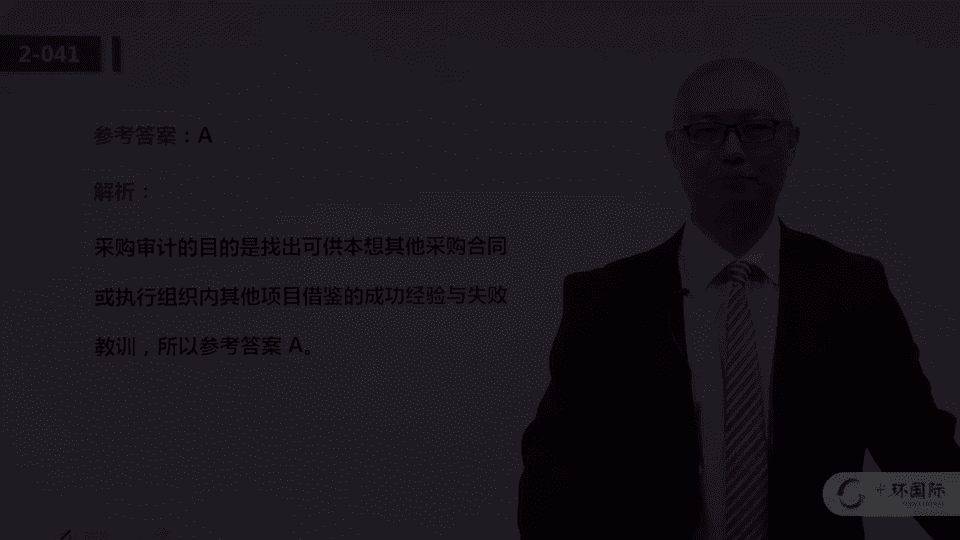

# 01 PMP培训视频教程 03 PMP第六版冲刺串讲视频教程 04 二模解析 1（1-50） - P1 - meiwanlanjun - BV19P4y1r7eb

好，欢迎各位光环pmp远程的同学，来学习我们的视频课程，那么今天呢来给大家讲解我们模考的第二次，模考的试题啊，以及它涉及到的一些重点的考点，以及呢解题的思路，分析问题的方法，不知道大家一模的呃。

试题有没有分析完，有没有进行复盘，再学习任何一次呃，模考的过程当中呢，我在讲解之前啊，再跟大家强调一下，就是关于复盘啊，就是我们做了一遍题，甚至听完了一遍视频的讲解之后呢，还是有一个非常重要的动作。

就是要再重新过一遍，那么复盘的过程当中呢，你不要纠结于这道题的对错，而是说首先要把握这道题所涉及的知识点，或者说是考点啊，就是要保证自己再出类似的题能够做对呃，这个知识点呢能够掌握。

那么其次呢就是它会有一些呃，呃几十道这样的这样的比例的题呢，是值得你去从解题的思路和方法上去，进行复盘的，大家注意，不是所有的200道题都是有价值去说啊，这道题呃它涉及到的方法是什么对吧。

有的题呢可能考虑的就是知识层面的东西啊，下列哪一个属于质量管理的范畴，a b c d那这样的题就就不用太纠结于技术呃，呃解题的方法，但是有的题呢就可可会呃有这种非常大的价值，除了去学习知识点之外。

还有助于你呢去掌握一些去体会一些解题的，分析问题的思路和方法好，那么接下来呢就给大家讲解，我们二模这200道题，那同样啊在讲解的过程当中呢，题干跟选项，我不一定每一每一个字都给大家逐字逐句的念。

因为这个我们设定呢，大家在听这个视频讲解的之前呢，应该已经先把题做完了啊，甚至你应该把答案对完，然后呢最好是带着问题来听好，那么我们开始，首先我们来看第一题啊，一个项目连续的错过交付日期。

可能它的进度一直在延后啊，评估完情况呢，意识到团队绩效差的原因在于，团队成员对于自己的职责缺乏认识，那么他项目经理应该关注哪一项呃，我们做任何一道p mp的选择题，最主要的第一步就是先定位问题。

先找问题啊，这个呃我们在专题的讲解当中也会给大家提到，那么这道题的题干问题主要问题是什么呢，主要问题是团队成员对于自己的职责，缺乏清晰的认识啊，这个题干说得很清楚，那么解决这个问题用什么样的技术呢。

或者说采用什么方法呢，那当然是创建r a c i图，那什么是r a c i图呢，r a c i图应该是责任分配矩阵的一种形式啊，它是通过一个表格的形式呢，把活动跟人建立联系啊。

是由本这个人呢来负责制制作，然后卡洛斯呢去通知他，然后这个不同的责任，所以呢这就是我们第六版p m b o k，教程当中的一个示例啊，rsi这种表格矩阵图的示例，所以这道题呢是一个非常基础的题啊。

考大家的是对于raci矩阵是否了解，所以呢这道题选a好，我们来看第二题，作为一个财务问题的结果啊，卖方a将延迟关键产品，项目经理识别了另一个卖房可以提供，那么下一步应该怎么做。

大家注意这个题干隐含的告诉我们说，项目经理很有可能去更更换供应商，更换卖方，那么这个时候首先我们看了这道题，我们应该把这道题定位成采购管理的题啊，我是项目经理，我可能会更换卖方，那我是在做采购的事情。

然后我们再来看四个选项呢，更换卖方应该是一个比较正式的重要的变更，那我们借助选项，我们就可以把这道题判断为，它考的是变更流程啊，整体变更控制的一道题，那么分析四个选项，答案应该是先提出变更请求。

所以呢这道题选a啊，那变更流程啊，我们的视频课程当中呢，老师会给大家已经给大家做了详细的讲解，我们首先要提出变更请求，然后呢要分析是吧，变更的影响，然后呢再向ccb去审批啊。

这个正式的这个变更的方案等等等等，那么这个也是常考的点，在我们的一模当中也出现了好多次整体变更，控制啊，一定要把它作为一个重点的考点来学习，第二题选a好，我们来看第三题，签约的公司未达到质量标准。

并且呢频繁的延期，将你们经理发现呢，合同条款无法确保卖方提高绩效，首先啊我又是做采购的啊，我我我我是项目经理，我要采购嘛，我们把问题定位为采购管理，然后呢为了避免卖方的第一绩效，项目经理采取什么行动。

a啊执行影响分析，b呃实施采购的绩效审查，c风险在评估d参与合同的详细拟定，大家注意这道题，首先他的问题是卖方的绩效比较低，我采用什么样的方式啊，卖方的绩效比较低了。

那我图根据采购管理的一个典型的技术呢，用的是采购审计这样的一个方法，那么通过我考核审查，乙方就是我的供应商啊，我的这个乙方，他的在在完成我的这个外包部分的，工作的过程当中，是不是按照我的要求啊。

它的质量啊，进度啊，成本等等，那么通过审计这种方式呢来去督促啊，乙方或者说卖方呢，去按照我期望的绩效去执行这个项目，所以这个答案呢选的是b啊，采购绩效审查呃，大家呢要看一下书上的第12章的，12。3。

2小节的数据分析，其中呢专门有绩效审查啊，所以第三题呢选第二个选项b，第四题，项目经理说我现在不能处理这件事情，它是采用了何种冲突解决的问题，这就是典型的撤退是吧，问题呢暂时解决不了，暂时搁置。

从当前的冲突当中撤退出来啊，所以这道题是一道送分题，那么关于冲突的几种解决的呃方式，比如说解决问题，这个是比较完美的是吧，那么强迫呢，就是说项目经理呢支持冲突某一方的意见，而打压另一方。

或者说就发挥项目经理的职权啊，大家都听我的哎，这是强迫撤退呢，就是这道题的选项啊，那么妥协呢指的是冲突双方各退一步，已达成，双方都能够勉强接受的方案啊，妥协和缓解是需要大家去区别的，缓解呢是求同存异。

大家注意你们呃，我们应该把这个关注的重点放到存异上啊，所以缓解呢是没有解决问题的，而妥协呢是解决了问题，那么撤退呢我们简单理解啊也是没有解决问题，所以说呢强迫啊能解决问题，合作一杠问题解决。

这个也能解决问题，妥协也能解决问题，而撤退跟缓解呢不能够解决当前的问题，这是第二题，所以啊这是第四题啊，第四题选c啊，这个是个这道题，是个送分题，我们来看第五题，在定义活动的过程当中。

团队讨论一个项目经理从来没听说过乐活动啊，这个活动项目经理没听过，这个时候应该怎么做呢，我们来看这四个选项呢，就是你会发现有多个选项，可能项目经理都需要做啊，比如说这个a确保大家理解。

并将这些活动包含在清单里啊等等，那那这个b也是有有有道理的，c也是有道理的啊，这个d呢评估变更的影响，大家注意，这个不一定是变更嘛，就是从工作包分解为活动，我们团队成员一起在做这件事情。

那可能呢项目经理拿到的是一个比较早期的版，本的这个活动清单，然后团队呢在讨论另一个新的活动，这是这个项目的情景，这道题啊，主要考核的或者说它涉及到的解题技巧，就是我们根据问题。

然后结合着选项去找一个最先做的啊，你比如说a b c可能都是需要做的，那最先做什么呢，我们分析三个选项啊，答案应该选的是第二个，先询问为什么要包括这个活动，这个原因是合理的。

然后呢在这个确认大家都认同啊，然后再把它包含在清单里，所以这个如果让我们排序的话，应该是先b再c再a，所以这道题呢我们答案是选的是选项b好，我们来看第六题嗯，为了减少技术风险啊。

这个公司呢用了一个概念验证原型，那么这属于风险应对的什么类型的，这个应对策略啊，这是这道题的问题，大家注意，我呢很担心他可能会有技术风险，那我先做一个原型，可能会验证一些我不太熟悉的。

或者是比较最新的技术，我通过言行去验证呢啊，我就能够得到这个新技术的一些经验是吧，然后我再把新技术应用到真实的系统当中，这种做法一定能够完全避免掉，在新技术在在你的最终的产品当中，一点问题都不发生吗。

应该避免不了，所以说呢我们造原型去验证这个技术啊，应该是典型的减轻，那当然这道题，其实在题干当中也给了我们一点小提示，就是为了减小技术风险，也就是说实际上我们要判断啊。

就是我们用圆形这种方法是完全避免掉了，还是说能够降低它的影响啊，答案答案呢应该选的是减轻啊，那么对于威胁的应对啊，或者说我们叫消极风险的应对的时候，减轻呢就是啊通过我的一些努力。

让这个风险发生的概率或者影响变低一点啊，但是并不能完全百分之百的避免掉这个风险，第六题选c好，我们来看第七题，在进行自制外购的决策之后呢，决定外包，那么公司对项目管理是外行，不完全了解合同的范围。

最好签订什么合同，所以呢这道题其实根据四个选项，他考我们的是合同类型这个考点啊，那么在一模的时候呢，也给大家强调过，首先三大类合同成本类，工料类和总价类，总价类比较适合于甲方啊，那如果我是在做采购。

那这个时候我就是甲方，就是像这道题啊，总价类比较适合于甲方，但是总价类呢不能很好的去应对，范围不明确的项目对吧，你具体的范围都不太明确，你跟人签什么价格呢，所以如果你是甲方范围又不明确啊。

我们选工料合同，这个呢是以一个呃通过做题，大家应该去学习到的一个小的考点啊，那如果我是乙方呢，我肯定优选成本类合同，因为成本类合同呢对于乙方比较有利，所以大家在做合同类型这样的题的时候。

你要根据题干去判断一下，就是，你这个项目经理是站在乙方的立场，还是甲方的立场啊，他是在做采购，还是说要申请甲方的项目，所以这个呢呃大家要注意，所以第二呃第七题呢选的是第四个选项啊，公料类的合同好。

我们来看第八题，在管理一个项目啊，这个这个项目啊是要什么是含大豆的，什么什么饮料是吧，这个不重要，重要的是题干当中说了，客户说你的进度报告是汉谟拉比法典，因为只有埃及人能看懂，全是象形文字。

大家注意题干当中客户反映的这个问题，说明什么呢，说明你给他的进度报告，他根本就看不懂，那问题是什么呢，那当然是项目信息的传达有问题啊，项目信息的生成制作有问题，所以这道题我们应该把问题定位到沟通管理上。

那么用什么样的方式去避免这种问题，或者说去解决这种问题呢，当然是要制定一份合理的沟通管理计划，这道题啊，就是需要大家去锻炼一下定位问题的能力，就是你要看看问题的主要矛盾到底是什么。

你说我雇佣一个专业的报告撰写人员，准备标准化的报告，这个可能也是一个方案，但是他就不如这个地啊，就是沟通管理计划更全面，你在雇佣他撰写标准化的报告，客户就接受吗，所以你还得先去分析客户的期望啊。

了解他们的习惯，然后以这个为基础，制定一个啊最合理的，对双方都能接受的这样的一个沟通管理计划，所以呢沟通管理计划，最终负责项目信息的啊生成啊处理，然后呢去去分发等等这样的工作。

所以这道题选的是第四个选项啊，沟通管理计划，第九题，大家注意这道题啊，在测试过程中，发起人决定要变更产品的主要功能，首先我们看就进行在测试过程了，那这个产品可能以这个项目啊，可能是在后期了。

发起人变更主要功能，项目经理用什么成本去涵盖呢，是用应急储备还是管理储备，所以其实这道题结合的选项，我们分析问题，这道题问题到底在问我们什么呢，他应该问我们的是这个风险啊，就是在后期项目的后期。

发起人变更主要功能，这个风险，你认为是已知的未知风险还是未知未知风险，那如果是已知的未知啊，我们选应急储备，如果是未知的未知呢选管理储备，那么针对这个风险，我们判断啊，发起人变更产品主要功能。

这个可能涉及到章程的改变，就是高层次的范围可能都变了，那一般我们认为这种风险呢是未知的风险啊，这个用应急储备是涵盖不了啊，大家这么去分析的话，答案应该选的是a啊，主要这道题我们是要根据题干去判断。

它到底是已知风险还是未知风险，当然有同学说老师你看他的问题，说项目经理将会用什么来涵盖啊，那有同学说啊，这个我们学过啊，就是应急储备是项目经理有权使用的，而管理储备呢是项目经理没权使用的呀。

那你说项目经理怎么用管理储备，去涵盖这个成本呢，你要是这么想的话，大家注意，这就是你呃对于这个问题的把握，还是没有把握精准，他不是说项目经理有权使用，哪个没权动用什么成本，它考点不是这个它的考点是呢。

针对这个问题，针对这个风险，项目经理应该用什么成本去，那你如果你认为啊项目经理应该用管理储备呢，那你项目经理就可以去申请发起人去批准啊，申请向公司高层去申请批准，这笔钱的使用呗，所以这道题吧。

你千万不要认为他考核的是项目经理，有权使用什么类型的储备，因而这道题真实考核的是这个风险，到底我们应该做判断，是它是已知风险还是未知风险，所以第九题选a，第十题。

团队遵循过程分析中说明的步骤来识别改进啊，那么这是在什么过程组中呢，大家注意这个题干当中啊，给了我们明确的关键字，首先是过程分析，然后呢要改进啊，在什么过程组，他考的是这个工作。

属于项目管理五大过程组中的哪一大类，过程改进，这当然应该是执行过程啊，过程改进计划呢，它是呃质量管理的一个子计划对吧，它主要关注的就是过程，而关注过程的质量，管理过程呢那个名字现在叫做管理质量啊。

所以这道题答案选b啊，选的是执行过程啊，它其实属于8。2，管理质量这个项目管理的小过程，第十题选b，第11题，使用什么样的工具和技术来监督风险，那这道题呢没得说啊，考的是纯的知识点啊。

就是你要通过这四个选项去判断，它应该只有一个是呃，都是典型的，或者说是我们教材p bk当中提到的啊，监督风险这个过程的工具和技术，那去做判断图像，比如说呢帕列托分析啊，这可能呢是呃就是质量管理的是吧。

那就我们可以通过这样的去排除，当然啊还是要学习一下知识点，那么这道题的答案呢选b啊，就是选项b当中，这三个工具呢都是都属于监督风险的工具，那么11。7监督风险这个过程的工具和技术，大家注意这个tt啊。

就是technology tools是吧，工具和技术啊，那呃监督风险包括风险，再评估风险，审计啊，偏差趋势分析，技术，绩效测量储备分析这个状态审查会等等啊，11题呢选第二个选项b，12题。

哪一项属于质量控制的范畴，首先我觉得这道题特别好，大家一定要复盘啊，你在听这个视频课的时候呢，你手里应该拿着一本后呃，就是你你手上应该有，不管是电子版还是纸质版的啊，我们的二模的试题。

那么你一定要把这个12题做一个标记，我认为这道题啊呃是一个很好的学习过程，因为a b c d这四个选项呢，每一个都代表了质量管理的一个呃，非常典型的一个过程，或者是一个技术。

那么选项a确定产品的要求和标准，这是典型的质量规划过程要做的工作，选项b确定工作是否能持续改进，这应该是管理质量这个过程要关注的工作，你的产品质量的问题啊，这个就是质量控制的典型工作。

而选项d确定活动是否满符合公司的政策，这个呢是典型的，它也是管理质量的一部分，但是它是典型的质量审计关注的工作，我们都说审计是关注过程的合法合规性吗，啊你看它是否符合政策，符合规定。

那当然是审计要关注的工作，所以a是规划，b是管理质量，c是控制质量，第一是质量审计啊，所以这道题呢，你不妨把这四个选项呢呃当做知识点来学习，那这道题选呢选c啊，那么规划质量。

我们简单理解就是给项目可交互产品制定指标，以及呢针对这个指标，你计划用什么样的方式去实现管理质量呢，是关注过程，目的是为了提高能力，提高什么能力呢，提高他满足质量要求的去完成项目的能力。

所以我们简单理解成三个字，少出错，大家注意啊，管理质量就是执行过程组的这个过程，他关注的其实不是结果，他关注的是过程，那么控制质量呢关注的是结果啊，有错就改，所以呢我们用两个字理解就是改错啊。

这道题12题呢选c好，我们来看13题，13题呢题干呢文字很长，但实际上解题的时候真的不难，因为他考我们就是最基本的希望货币值分析啊，有两个方案，每个方案有对应不同的可能性啊，那这道题，比如说方案a。

他说呢他有40%的可能挣1。5个亿，30%的可能挣6000万，30%呢不挣钱，那对于发a而言啊，30%的可能对收入没有影响，大家注意没有影响，是目前有一个亿的收入吗，所以呢大家注意这个方案a的意思就是。

你有40%的可能挣这么多，30%挣这么多，10%挣这么多，那你就加起来就完了啊，就是把这个挣的钱跟这个概率加起来，然后乘乘完了再加啊，这就是典型的期望货币值，期望货币值分析。

它是决策树分析的一个一部分啊，它是决策树分析的一部分，那么乘完了一比较，那当然选项b呢它的期望会比值高一点，那这道题呢我们就选的是第二个选项，选方案b他的e mv为1。111。111，哎呦我去1。

11亿啊，13题选b 14题，项目经理了解啊，一个团队成员没有报告进度，项目经理确认呢，已经向这个成员分配了相关的活动，并且让他交付产品，那么报告流程在批准的项目管理计划中有说明，下一步应该怎么做。

首先这道题就是，我们要根据题干去判断问题到底在哪啊，问题是没有要求他提交吗，不是题干说了呀，已经要求了，又有具体的说明吗，所以呢他的问题在于呢，这个团队成员没有按要求去做。

那么首先我们先去保证的是他会做，然后你如果他不会做呢，那你你要去培训他对吧，可能他不会用你咱们公司的什么这个，这个这个项目管理流程啊，项目管理信息系统，这个呃项目的进度报告，可能必须得用这种系统去去做。

电子版的提交等等，他可能不会用，那你就去培训他嘛，所以这道题的选项呢，答案应该选的是第二个选项，这道题呢同样啊我们结呃看了题干之后，还要结合的选项做排除，你上来就选a啊，变更这种报告进度的进度。

报告的这种方式当然是不合理的啊，因为你的方式是被批准的嘛，我们首先考虑的不是变更这个方式，它题干当中也没有说这种方式是不合理的对吧，他提干就是说这个团队成员没有按照要求去做，那你去先培训呢啊。

保证他会做，所以14题呢选的是b，它的考点应该是9。4啊，建设团队这个过程的培训啊，就是这个工具与技术啊，这是它的考点好，我们来看15题，又是一个知识点的问题啊，这样的题就不涉及到什么解题的技巧。

人员配备管理计划到底是做什么的，大家从他的字面意思，人员配备啊，就是你如果是一个项目经理，你的项目是需要好多人的，好多不同做不同工作的人的，那我们开发一个软件，我们需要需求工程师，需要做设计的。

需要编码的，需要测试的，但是这些人是必须一定在同一个时间，你都要用吗，不一定你可能在做需求的时候，你做测试的还不需要呢吗，所以呢这个人员也好，就是我项目需要的资源在什么时候需要啊，他啥时候进入我的团队。

他工作完了之后啥时候退出，那么这份文件呢就称之为人员配备管理计划，答案选的是c啊，就是告诉我人力资源何时可用，可用多久啊，就是何时如何加入和退出团队，所以这道题选的是第三个选项，15题选c。

那么这个人员配备管理计划这个概念呢，大家可以看一下这个解析啊，就不给大家念了，16题在值质量保证的时候应该用什么技术啊，随机都会有计划的，那这个呢就是其实考的呀，就是管理质量这个过程啊。

其实在第六版之前，我们都把管理质量称之为保证质量，或者叫质量保证，它都属于它，它就是质量管理这个知识域的执行过程组，唯一的过程，质量管理呢三个过程是把规划过程呢叫规划，质量，规划质量管理，而执行过程呢。

我们第六版呢把它称之为管理质量，然后控制过程呢称之为控制质量，那么呃在前几版啊，都叫质量保证，这实际上考我们的还是管理质量，这个过程的工具和技术，其中有一个最典型的就是审计，所以这道题选的是c质量审计。

那么审计主要关注的过程的合法合规性，是否遵循了组织的政策，过程和程序嘛合法合规性，然后呢大家记住审计还有一个共性的目的，就是我审计完了啊，我有一个什么目的呢，就是要整理提炼经验教训啊。

这是审计的一个目的，16题选c 17题，由于相关方的进度制约的问题，项目发起人要求放弃啊，要求项目经理放弃启动大会，那么哪一个管理过程被忽视了这道题的问题呀，真实的问题就是考核大家项目启动大会。

可主要针对于这四个选项的哪一个项目，启动大会是干什么的啊，考的问题是这个问题，那么这里的项目启动大会呢，其实在一模也跟大家说过了啊，是足球中圈开球那个kick off大会呃，初步的计划已经完成了。

那么在正式实施之前开一个这样的启动大会，把项目的相关方都召集在一起，做什么事儿呢，成员互相认识，建立联系，自上而下，要求自下而上，承诺分配工作，明确责任等等，这是启动大会的主要目的。

那么与哪个选项更合更，更匹配呢答案选的是a啊，管理相关方的期望啊，让相关方呢对于项目做出一些必要的啊，一些承诺等等，所以17题选a，18题，项目经理将空调采购啊，从a转向了b新产品检验完毕。

交付了所有项目的可交付成果，下一步做什么，大家注意题干当中明确说了，交付了所有可交付成果，这个时候呢大家脑海中就反应，他应该是正式的啊，进入了结束阶段啊，就是4。7小节结束项目或阶段。

这个过程结束项目或结束阶段，那你再看这四个选项，哪一个是做是结束项目或阶段4。7，这个管理过程包括的工作呢，答案应该是d一个选项啊，呃将所有权移交，以便再次抢购呃，以便再次采购，那其他的都都不是做呃。

做结束的时候啊，就是收尾那个过程组要做的活儿，不是啊，那这个用排除法啊，首先呢我们要定位它是考我们的，是4。7收尾的那个那个过程，19题，对于一个具有战略意义的重要的客户项目经理，确认啊。

组织资源的可用性时，发现呢有一个关键资源掉网了，别的一个项目项目经理首先应该怎么做啊，他的问题是呢，你作为项目经理，我发现我有一个项目非常重要的资源，去做了一个内部其他的内部项目。

这个所谓内部项目就是我们公司内部的项目，组织内部的项目，那首先要怎么做呢，首先去找职能经理，因为他提到了是矩阵组织嘛，那矩阵组织啊，项目经理对于人员不一定有百分之百的支配权。

那你就先看一看这个所谓的关键资源，它隶属于哪一个职能部门，然后跟这个职能经理呢去谈判啊，让他看能不能按时的按我的要求，进入到我的项目上，如果不行是吧，可能呢你还得走问题升级程序，甚至是让发起人啊。

还是让公司的高层去支持你一下，但是首先要怎么做呢，要与职能经理去谈判啊，19题选的是d，它实际上考我们的是获取资源，这个过程的典型技术啊，就是项目经理与职能经理去谈判，获取资源，第20题。

在收集需求的时候，用什么方法来获得不同国家的相关方的反馈，大家注意这个呀两个信息点啊，第一个是要收集需求啊，这个呢是呃明确的啊，但但是第二个是不同国家的，所以你看这四个选项a b c d呢。

它都是收都可以是收集技术的方法和工具，但是比较适用于在不同国家的相关方，去获得反馈的话，答案就是a了，你开焦点小组会引导是研讨会，这个还是相对来说啊，还是面对面开比较方便的。

或者它的定义指的是面对面的开这种会，所以说呢你你不要非得去钻牛角尖，有的同学就说，那我们用远程技术是吧，网络通讯这么发达，你要这样说的话，那那这呃四个选项可能都有道理，但是我们在做题的时候。

你不要去跟出题人去抬杠啊，那问卷调查呢是不受地理位置限制的，所以这道题呢考核我们的是收集需求的工具，当然啊你要去判断这四个选项，哪一个更适合于不同国家啊的这种需求的获取，答案选a21 题。

下列哪项不是项目经理的权利，他说这道题我我自己在第一次做这道题的时候，我看了这四个选项和问题之后，我都愣了，因为这是典型的，这都是典型项目经理的权利嘛，所以大家一定要注意啊。

就我们真的考试当中遇到这样的题了，我第一反应是四个选项都不对，我们都知道项目经理有五类型的权利，一种是正式的权利，一种是奖励的，一种是惩罚的，一种是专业的，还有一种叫暗示型的啊，就是你跟团队说啊。

我跟ceo关系特别好，我们俩称兄道弟，天天喝酒，那这个时候你就有一种暗示的权利，可能呃是嗯团队发现你跟ceo好，那可能他就会比较听你的，但这至少这四个选项都是的话，那我该怎么选，这个时候呢。

你不要上来就判断说这道题是个错题，不严谨的题，你还是要在沉下心来去分析，结合着问题去分析，这四个点，是这四个选项，是不是有一个与其他三个有不同点，如果有的话，你就把那一个找出来啊。

那这道题呢就是我们发现什么呢，选项d专业的权利啊是不能被授予的，而a b c呢，你看啊正式的权利，奖励跟惩罚的权利都是可以什么呀，组织直接赋予给项目经理啊，哪怕来一个新的项目经理。

只要在这个项目章程当中，组织给这个项目经理去确权了是吧，给他授权了，那这三个权利他都可以有，只有哪个呢，第四个专业的权利，专业的权利指的是什么呢，就是项目经理在带领团队的过程当中啊，不断的去发现问题。

解决问题，通过他的能力，渐渐的在团队成员当中树立起了微信，让大家都佩服你都信服你啊，这个我们叫专家或者叫专业的权利，那这个呢是不能被直接授予的啊，所以这道题呢答案选的是第四个选项啊，这个相关的知识点啊。

可以看一下解析的文字呃，专业的权利是非职位授予的权利啊，是要靠你个人的魅力也好，个人的工作的能力去证明的啊，去潜移默化的去获得的啊，这所以这道题选第四二十二题，22题呢考我们的是一个呃项目管理当中啊。

尤其是软件项目管理当中，经常会涉及到的一个文件需求跟踪矩阵，大家注意这道题的题干啊，你甚至都可以把这道题的题干，当作需求跟踪矩阵作用的一种解读，发起人希望核实所有可交付成果，是不是满足了业务目标。

以及在整个项目过程当中，是不是啊，所有批准的变更，或者说正规的变更都已经执行了，用什么文件去核实呢，就是需求跟踪矩阵，就是大家把这个题干啊，可以当做需求跟踪矩阵作用的，一种典型的知识来学习了啊。

答案选选b，需求跟踪矩阵非常重要的作用，就是做这件事情的啊，从最初用户提出需求，然后你在呃定义范围啊，嗯形成规格说明书啊，然后再做设计啊，然后编码去实现啊，所有的这个重要的过程啊。

定义和文档都由需求跟踪矩阵来控制，那过程当中出现变更了呢，也由这个来去做记录啊，这个答案呢选b啊，对于需求跟踪矩阵，大家可以查一下p m b o k的5。2。3，点二小节啊，这里有一个完整的定义。

我们来看23题是一道政治分析的问题啊，任务a的估算1000美金，计划呢12月30号总工期十天，那可能他是20号开始呗，在30号审查的时候，发现只完成了70%啊，只完成了70%，花了600美金。

他问的是计划价值是多少，就是说大家注意啊，就这道题的题干给了我们很多信息，比如说这个活动的总预算是1000美金，总计划是十天啊，这是进度，计划成本呢是1000美金，计划了十天，然后他还告诉我。

在我与计划截止日期的时候，12月30号的时候，你只干了70%，这个肯定就是进度落后了，但是他的问题就是一共值1000美元的项目，你完成了70%，你的计划价值是多少，那就是700。

这个其实考你就是大家对pv这个概念定义的理，解，计划价值不叫pv吗，plan value啊，正直呢叫earn的，value叫e v，而ac呢是实际花费actual cost的。

那我们都知道这600美金是实际花费嘛，也就是实际上呢，这个项目就是你现在啊用了十天，花了600块钱，干了700美金的活儿，所以这700美金啊，pv啊，大家注意啊，它的单位是钱，但是它的物理本质不是钱。

是活，正值分析三个关键概念啊，pv就是这段时间的计划工作量的，啊大家注意啊，这这这个这个700美金是一维啊，大家注意，pv的定义是这段时间项目计划工作量的预算，那么我们就就就要找个时间段。

在12月30号的时候，这个项目应该干多少活儿，这是pv的定义，而干完了多少活，这是意味的定义，所以这道题应该选的是d，也就是说你在12月30号的时候，你应该干1000美金的活，再说一下啊。

pv的定义是这段时间项目计划，工作量的预算价值，所以它的物理本质应该是工作量，他只不过是用钱来描述工作量，意味也是意味着这段时间的实际工作量的，预算价值，其实我们完全把pv跟e v怎么理解呢。

pv就是该干的活，而ev呢就是干完的活儿啊，pv是该干的，ev是干完的，那我们要找计划找pv，从计划上找pv，从实际上找e v这道题选d啊，1000美金，他在12月30号应该干1000美金。

你只干了700美金呢，你就是只干了70%，那说明什么，说明进度落后了啊，你该干的就是你干完的呀，比干呃干完的比该干的少，二三题选d啊，这个啊考点还是政治分析的基本概念的理解，24题，项目经理完成了章程。

下一步呢，这个大家把它当做一个小知识点，去学习就行了啊，完成了章程，而且他选项当中还有一项是吧，获得正式批准，那当然是选第四个啊，就是章程一定要正式批准的，而且往往是由发起人啊。

或者说是公司高层正式批准的，他给项目经理授权给这个项目呢正式立项，制作完了不行，你还得让人家签字啊，项目经理往往是这个做项目章程的人啊，发起人不会说给你写完，直接就给你用了，可能项目经理制定完呢。

让呃发起人去审核去批准，所以这道题答案选第四个选项d25 题。

资源直方图表示什么，这个呢也是一个考大家知识点的问题，这资源直方图就是按时间，按时间段的预期资源使用的情况啊，横轴是时间，纵轴呢是我对于某个资源的需求量啊，横轴是时间，比如说第一周呢我需要五个人啊。

或者说需要这个人干五天是吧，这个这个比如说我们叫高级设计师啊，第一周需要他干五天，那么第二周呢可能是需要他干三天啊，第三周呢需要他干四天，或者需要去干干六天，那可能第三周你就得让他加班了。

你要干六天的话是吧，所以这个呢就是所谓的资源直方图，按时间段的显示的啊，预期资源的需求啊，答案选a26 题，s w o t技术能够帮助项目经理确定什么，这道题应该这么问。

就是在做哪一个项目管理过程的时候呢，常会用到s o s w o t技术啊，这个也是一个小知识点啊，s w o t呢指的是优势劣势，机会和威胁，那么往往在识别风险的时候呢，经常使用。

那其中优势与劣势呢是要从组织自身去分析啊，而机会跟威胁呢是从外部的环境去分析啊，所以有的时候我们也把s w o t呢，呃称之为内外部的这种这种分析啊，这个也是其实他一方面能够帮助组织识别风险。

更主要的它可能更高层次的啊，就是组织高层在确定组织战略的时候呢，也经常用到s w o t这样的一个技术，27题项目落后啊，进度落后，团队发现呢通过一个替代的方法，可以更加快进度，但是会增加成本。

项目经理应该怎么做，结合这四个选项，其中有一个选呃，选项说a说增加资源，b呢是进行呃期化货币值分析，c获得批准啊，d通过增增加成本更新到预算当中，大家注意这个呢就是你要换一个方法。

而且这个方法呢会加快进度，但是会增加成本，这就是一个非常重要的变更了，因为你的进度跟成本基准可能会变，那么你要是，要进行变更的话呢，就要得去走变更流程，这道题考的还是变更流程的问题。

那么你要不要用这个方法，不是你说了算啊，可能呢得cc b去批准，所以这道题选的是选项c去推动它啊，呃申请这个变更啊，让他去让c c b去批准，考的还是变更流程的这个知识点好，我们来看28题。

出资人啊认为你的成本估算太高了，要你削减项目估算的15%，这个时候应该怎么做，大家注意这四个选项呢，选项a说启动项目啊，不断的节约成本，这个呢我们不正确啊，就是首先啊我要跟他说。

这道题的题干其实说的不是特别的清楚，就是到底你他出资人认为你的价格高啊，是因为你成本估算的问题，还是说是因为出资人的一个外行，或者是他的偏见，这个其实题干当中没有提，那么既然题干当中没有说具体的情况。

到到底是为什么他认为高啊，那么我们假设就是作为项目经理，我们应该去去坚持自己的成本估算啊，我们的成本估算应该是有依据的，你要是给我捡钱，可能我就得缩减范围了啊，这个你要去跟他沟通啊。

这个答案呢选的是c告诉出资人要削减活动，或者说要削减范围，这个的隐含意思就是说呢，你要对你的成本估算呢有信心啊，你要是你的估算应该是有依据的，是这个意思啊，其他选项呢其实都不太合理。

这道题呢大家也别太纠结啊，因为我个人认为啊，这道题的题干呢并不是特别严谨啊，情况啊描述的不够具体，但但是大家要知道p m p的真实考试题当中呃，这种可能存在争议或者说不严谨的题嗯，一定是有的。

甚至有十分20分了，那这样的话呢大家一定要去锻炼啊，通过做模考啊，通过做练习题去多体会一下p mp的出题的风格，28题选c29 题啊，又是一个冲突解决的问题，呃团队成员呢自身利益导致问题得不到解决啊。

有一个高影响的风险，关键点呢是下边这句话，项目经理必须快速行动，让啊团队呈现，就是他说必须快速行动，那么你再看这abcd只有一个是最快速的嗯，能够解决问题的啊，因为他还强调了必须快速行动。

以便项目恢复嘛，就是你首先必须得解决问题，而且还得快速行动，那选项呢选的是答案，选的是c啊，强迫这个方法啊，可能会使冲突的一方呢很不满意，但是这个呢是对于项目经理而言，对于这个题干当中描述的问题而言。

是最这个合适的，它更针对于问题，他的问题说你要快速解决问题啊，你用妥协跟合作这样的方式啊，不一定能够非常及时，所以29题选的是c啊，30题，这道题的题干也比较长啊，要更换一个这个系统。

那么管理人员呢将灵活的价格结构作为需求，然后在项目期间啊，大家一定要注意啊，价格结构的变更呢，将导致频繁的反攻和重新测试，大家注意他的问题是用什么样的方式啊，能够解决这些问题。

不是大家一定要分析题干当中提的，这个他说他到底要解决什么问题，他应该希望你解决的是由于频繁的变更，导致反攻和重新测试，那用什么能够解决呢，就是你把项目范围说得很详细，并且让大家都能够接受啊，这道题。

我个人认为它的题干当中有自相矛盾的地方，就是大家一定要注意啊，灵活的架构结构跟频繁的反攻，或者说呃跟这个变更不是一回事儿啊，可能它的价格的报价，比如说我们简单理解报价系统是灵活的啊，这是系统的需求。

这个是可以的，但是你在开发系统的时候老变更，这是不行的，但是本身啊这个题的题干它描述的挺混乱的，但是大家一定要知道他考点考的试啊，就是我们用什么方法能够相对来说呃，避免由于频繁的变更。

导致经常返工和重新测试呢，就是你要把项目范围说的很明确，这样的话大家就不一定会进行频繁的变更啊，所以30题的答案呢选的是d啊，它的考点呢考的还是范围定义这个过程啊，31题，在识别完一项技术风险之后呢。

项目经理决定雇佣高级的资源加入团队，那么这个属于什么类型的应对策略，大家还是分析一下，我用了一个高级资源，就完全避免技术风险不发生了吗，应该是避免不掉的啊，这个应该是典型的减轻。

可以呢降低它发生的概率或者是影响啊，这个高级资源比较有经验啊，处理技术问题的时候呢，可能就会呃效果会比较好啊，答案选的是a啊，这个比较简单，32题这道题我相信啊，如果大家对于政治分析。

尤其是e t c和e a c这两个概念，理解不好的话，可能连题都看不懂啊，这是啥意思呢，首先我跟大家说，这个呢就是选的是c啊，答案是c，当前的偏差被被视为未来典型的代表，那么关于这道题啊。

我给大家举一个例子啊，就是比如说我生产100把椅子，我要生产100把椅子，预算是11000把，然后我呢花了60万呢，目前情况是花了60万完成了50把，这个时候我相信大家都知道，跟进度没关系。

因为我在求etc的时候不考虑进度嘛，我花了60万完成了50把，那这个时候吧，求e a c我得先求etc吗，etc呢就是剩下的活儿需要多少钱，那么你花了60万干了50把，剩下50把得花多少钱。

这是我当前面临的问题，我要做估算，那这个时候呢我要分析什么呢，我要分析我要不要用这个成本绩效，就说我剩下的50把需要50万，这是原预算，那一般情况下我们怎么去分析呢。

我们一定要分析造成这个成本偏差的原因，我给大家举个例子，比如说呢我分析问题发现啊，我花了60万，是啊，我这个前面完成的这50把我反攻了，可能是有一道工序做的不好，质量不达标，我反攻了，我超了10万。

然后我呢认为剩下的58我不再返工了，我做好质量管理工作，那这个时候呢我们就还用50万去估算，剩余的预算就是合理的，那这样的情况下，我们就把这种情况叫做当前的偏差，原因不典型啊，就是a这种情况。

就是你造成了当前超了10万啊的原因不典型呢，我就不按照当前去分析，那但是还有一种什么情况呢，就是我花了60万才完成了50把的，原因是红木涨价了啊，比如说木材涨价了，最终我干了50把。

我核算下来每把成本就得12000 一把，11000把干不完啊，那我这个时候我分析了剩下的50把啊，木材它还得涨价嘛，就是我还是控制不了这个涨价因素，那这种情况下，那剩下50把可能你在做估计的时候。

60万就更合理，那这种情况叫什么呢，这种情况就是当前的成本偏差，典型或者说准确的话，就是造成当前成本偏差的原因比较典型，它会持续影响我剩余的工作，那我们就要用这种业绩表现嘛，就是原预算是1万美把是吧。

每把1万，而现在是12000没把，是这个意思，所以这道题的答案选的是c33 题，项目经理正处于项目规划的阶段，努力确定相关方的信息需求啊，用使用什么技术，这个呢呃比较的呃，问题也比较明确啊。

就是在分析相关方需求的时候要用什么技术，那当然啊它属于规划沟通管理的技术，考点属于规划沟通管理的技术啊，答案呢选的是第二个沟通技术，这这个选项啊，这个呢大家看一下10。1。2。

整个这个小节规划沟通管理的工具与技术，这个小章节34题嗯，题干说啊，客户呢要来开我一个会啊，因为以前客户跟我都是非正式交流，而且目前啊有一个项目呢，遇到了一个可能的一个问题，客户要来参加你的正式会议。

你应该如何准备这个会啊，这是这道题的问题，那么结合着选项，我们用排除法做啊，这个啊a跟b首先排除掉了是吧，这个是不合适的啊，你，主要呢是我们要从c跟d当中做区别去去做选，择。

c说呢通知团队成员准备一份讨论议题，d说明确每一个成员，有他们准备任何议题所需的任务，这道题选项d也好，其实他的中文描述的不是特别的，这个选项d的中文描述啊，描述的不是特别好啊。

其实选项d的真实意思就是明确任务，明确什么任务呢，就是让团队成员，对于所有客户可能提到的议题呢，都做好相关的计划，是这个意思，那当然c跟d比较起来呢，选项d呢就比c更全面一点是吧啊。

你这个c呢说你准备好一个议题，但是d呢是啊准备所有可能的议题，所以答案呢选的是d啊，34题，这个要用排除法做，但是呃也不是特别的难啊，我说但是的意思呢就是这个选项d啊，它的中文描述的其实不是特别好呃。

p mp考试题，确实会有一些语言感觉不通顺的地方，因为它翻译得不是很好啊，我曾经问过一些p m i的人，他说中文的翻译是由台湾人做的，我现在觉得吧，随着技术的进步，你要是用这种台湾的这种翻译。

还不如用用用软件呢是吧，还用什么科大讯飞，我觉得我比他翻译的好，35t一个项目需要内部资源和外部资源，外部资源呢要采购飓风呢，使得供应商呢无法满足这个时间需要，那么查看合同什么条款。

这个也是一个非常嗯简单的知识点啊，飓风啊，就是大家在呃，如果你看过你们公司的，一些商务的项目的合同的话，这个是为了以防万一的啊，发生哪种情况下啊，可能会给什么双方去免责呀等等，那当然飓风呢，答案选a啊。

36题，在项目的施工阶段啊，供应商发生火灾了，原材料会延迟，那么已识别到了这种风险，并包含在计划当中，大家注意他指的计划，应该指的是风险应对的计划，那真实的发生了这件事，项目经理当然是要执行响应计划嘛。

所以这样的题啊，就是风险发生了，而且还告诉你这个风险呢，你以识别并且有应对了，那你应该怎么做呀，查阅登记册，执行应对计划，当然他他这个呢就是说你已经查阅登记册了，你知道吗，所以这道题呢答案选的是a啊。

不是要更新登记册啊，你可以查阅登记册，然后按照呃对应的响应计划去应对嘛，所以这个呢36题选a啊，他应该属于在监督风险的过程当中呢，去实施应对计划，37题，在一件设备交付到项目现场之后。

最终用户投诉产品与预期不一样，为了避免这种情况，用什么技术，大家注意他的问题是什么，题干当中的问题是客户发现啊，产品与我要的不一样，那这是典型的质量问题，质量问题用什么方式呢。

应该是用控制质量这个过程去解决，所以这道题考的是控制质量，用什么方法啊，能够解决这个问题，就是说你在交付给客户的时候，别出现质量的毛病呢，应该答案选的是a检查啊，检查的意思就是看看实际质量。

符不符合相关的质量指标，如果不符合呢，你再去改，可能你检查完之后发现不符不符合了啊，你还得用什么因果图，甚至是啊控制图帕累托图去呃，去去去找原因啊，但是用因果图啊去找原因，但是呢这道题先选检查啊。

答案呢选a38 题，控制图有八个点，其中有一个点在界限之外，那如何解读呢，这个考的是控制图的这个知识点啊，控制图就是看过程是否稳定的，那什么情况下我认为控制图失控了呢，有两种情况。

第一种情况就是这种题干说明的这种情况，控制住大家注意，它都有三条线是吧，有一个控制的上限啊，有一个下限，有一个均值，那这个，在在上下限波动嘛，我认为这是我能接受的啊，这也是符合客观规律的。

那么有一种情况就是我认为它过程不合理了，我得停下来找原因了，哪种情况呢，就是有任何一个点超过了限制在界限之外了，这是我们的界限之内吗，这是一种情况，那还有一种情况呢，就是连续七个点啊。

连续七个点都在均值的同一侧，连续七个点在均值的上上方或者下方，我们也认为过程失控，所以这道题呢应该选，应该选第四个嘛，我们要找原因了啊，呃这是一种控制图的失控的一种情况啊，所以这道题选的是选c啊。

啊这属于不正常情况，这不不仅是呃警警警告信号啊，这是不正常的情况，生产流程需要改进啊，需要去找原因啊，不是说质量标准需要升级，不是这个啊，质量标准你不达标吗，大家注意啊，这个选c啊。

那么控制图这个考点啊，大家必须要掌握啊，也是质量管理非常常用的，也是常考的一个知识点，好我们来看39题，在最后阶段啊，项目经理从客户收到了多个设计变更，遵循的流程变更控制之后呢，批准了。

若要提供一个标准有效和有效率的方式来管理，变更，用什么系统啊，这个其实前面都不是很重要啊，重要的就是说a b c d这四个选项哪一个呢，可以比较好的管理变更哈，这道题的问题非常简单，答案呢选的是d啊。

配置管理配置管理系统啊，它主要针对于可交付成果的啊，配置像是吧可交付成果的呃一些识别呀，呃生产和制造开发呀，然后呢去跟踪和记录啊，以及变更控制啊，所以配置管理系统它有一个很重要的作用。

就是帮助你做变更控制，用一个非常呃规范的一个信息系统啊，让你把这个重要的那些可交付成果都管理起来，答案选的是d啊，那么配置管理系统这个概念，大家查一下pm bok的术语表，好，我们来看第40题。

项目遇到了一个未预料到的问题，高级领导呢高级技术人啊，技术领导解决方案没有被团队接受，那么这个人呢就觉得很受挫折哈，项目经理应该是用什么技术来解决这个问题，这个呢就是典型的软技能，你要解决什么问题。

你要解决的是高级技术人员感觉很受挫折，那这就是典型的软技能，那软技能和硬技能应该怎么分呢，大家简单理解就是软技能呢关注人的感受啊，处理人际关系技术，处理人际关系的，那么硬技能呢就是处理事儿了啊。

软技能是管人的啊，大家简单这么理解，40题选d，41题，项目经理开始一个新的项目，获得了一份报告，显示上一个项目发生了采购失败的情况，那这份报告应该出自什么呢，考我们的还是审计，大家注意啊。

如果是得到了一份报告，显示上一个项目中发生了质量啊不达标的问题，那出自什么呢，也是审计，那个就可能是质量审计报告，而这个就是采购审计报告，那么关于审计呢有一个共性，大家要学习的就是他要有一个共性的目的。

是要整理经验教训，而这个呢是经验教训呢，是为其他的后续的后续的项目做参考用啊，所以这个呢答案选的是a啊，采购审计也多次出现了啊，大家一定要好好的去学一学42题。

成功的沟通始于哪一步啊，有的同学看完了四个选项，可能上来就规划沟通管理啊，这是沟通管理的第一个管理过程吗，你要这么想呢，答案就错了，答案选的是识别利害关系者啊，识别相关方嘛，识别相关方是沟通计划的前提。

你在做沟通管理计划之前你都得有，所以这个而且识别相关方呢它还是在启动过程，它比这个计划呢还更早啊，所以这道题呢大家在做选项的时候啊，一定要呃细心一点，我相信这个如果你足够细心的话，是能选对的啊。

43题嗯，在收尾的时候应该执行什么活动，大家注意这道题，我个人认为呢有问题问题在哪，问题在于这四个选项当中的这些词啊，这些工作名称不严谨，从p m b k上不是能够都找到的，或者说我们判断起来就很难啊。

你说审审查财务文件要不要在收尾的时候审查，是是你审查还是谁来审查，所以这个呢其实在我们的呃p m b o k当中，可能很难找到明确的说明，那只有哪个呢，只有选项d关闭工作单。

材料储值跟转移资源是在什么呀，是在咱们p m b o k，4。7小节的引言当中说过的，所以这道题选项d是肯定对的，a b c呢不一定对，或者这么说啊，比如说b评估工作单呢，就不如关闭工作单准确。

这是这是呃书上的用词，那我们就用这个所谓p m b o k的用词，就把大家不要把这个当做一个，多么重要的知识点啊，因为本身这三个用词不严谨，那根据这道题呢，我倒建议大家啊，再好好阅读4。

7这个结束项目或阶段，这个过程的引言，这个呢经常出题考啊，大家不要纠结于这a b c3 个选项了啊，千万不要纠结这个了，比如说c啊，确定工作单，那这个就就不对嘛，好啊，44题团队制造1万个小零件。

那么检查了500个，这是典型的抽样统计啊，这个送分题是吧，对于抽样统计，大家从字面意思上也能够选出来啊，抽样统计呢，也是控制质量当中的一种典型的工具啊，这个不多说了啊，44题是送分题。

选c45 题项目的进呃呃落后啊，进度落后，成本还超支啊，质量呢又出现了缺陷，应该更新什么呢，大家注意啊，这道题就是题干当中的问题了，就是你项目经理应该做啥，但实际上你说我要不要更新登记册呢，可能也需要。

我甚至有可能要更新项目管理计划，因为进度落后，成本超支，质量有问题吗，这次这个什么传统的项目管理三角形都有问题，但是首先更新的是问题日志啊，先把这个记录下来，然后呢你看看是是不是要变更基准。

如果要变更的话呢，还得走流程，所以这个c跟d啊可能是在a之后的事情，所以这道题还是让我们把这四个选项排个序啊，有一个是最先要做的，那关于问题日志这个考点，大家也不妨呢去学习一下我们教材当中的啊。

你可以去找一下术语表，或者是一些十大知识域当中的一些定义，问题日志啊，这个主要是记录一些问题，以及对一些问题的分析的结果，也可以往这个问题日志上写，45题选a啊，46题，谁创建质量管理计划。

一起团队和项目经理，或者说项目经理和团队一起创建，这个不是某一个人的工作啊，这个有这个选项d，那我们就不选别的选项啊，选项d是最合理的，因为呢为什么要让团队参与呢，只有团队参与呢。

你的质量计划呢才更合理更可行啊，嗯避免闭门造车啊，46题选第四个，大家把它当做知识点来学就ok了，47题，在项目的执行期间，你的团队成员向买方递交了可交付成果啊，也就是甲方，但是甲方拒绝。

因为他们说不符合啊技术标准第300页的要求，然后你呢你作为项目经理呢，你审核了这个文件吧，并同意甲方的观点，那么接下来你应该怎么做啊，就是你也认为他不符合，那么就肯定不符合吗，就说合同错了，做出变更。

当然错了，你这a呀，合同这个不是合同错了，所以不选a啊，然后就说马上就变更吗，如果你认为需要变更的话，你你也应该先什么呢，先去确认一下这个问题，你自己因为项目不是项目经理一个人做的呀。

啊是团队要开发的呀，那你应该什么呢，首先会见负责这部分的团队的成员，然后呢去，去审核啊，这个300页的要求，你认为啊你同意客户的观点，看看团队同不同意，从技术的角度，从专业的角度去确认一下这个问题。

如果确认了这个问题，然后呢再再去走一些呃变更啊，或者是一些流程，那么选项c跟d我要哪个，这是这道题，我们需要做判断的，你看选项a啊，审核这个要求会见负责的团队成员，以审核工作分解结构啊。

为什么要审核工作分解结构呢，工作分解结构词汇表呢，因为w b s词典呢，它就包括了相关的具体的标准，而这里说不符合第300页的标准，这个指的就已经是非常具体了，所以你要去让负责这个工作包的团队成员。

跟他们一起去审核啊，你不一定需要所有团队都开会啊去审核，所以这个c跟d啊，我认为区别就在这呢啊区别是在这儿呢啊，就是负责的啊，可能这个项目比较庞大的团队成员啊有很多啊，那我主要是要找这负责的这部分人。

然后另外呢就是c呢他说的更准确一点，他提到了w b s词典，而这个呃产品的一些具体的细节的标准呢，是在w b i词典当中会有明确的定义啊，基于这两个呢，我们c跟d呢选的是c好，我们来看第48题。

又是一道正直的问题啊，其实与其说是政治问题，不如说是小学数学问题，为什么这么说呢，我们来看啊，为期五个月的项目运行了两个月，运行了两个月，一定就干了40%吗，你一共五个月，不一定。

你看它的实际情况是500个任务干了一一百个，500个任务干了100个，用了两个月，而且你认为呢所有任务啊，工作量啊，费用以及持续时间都差不多，也就这500个，每一个可能都需要差不多相同的时间。

然后这是那个图啊，但是这个图啊大家注意，其实对于解题没有多大用啊，这是黑的，是什么呢，是pv啊，白的这个呢是意味，你会发现实际上它的进度正好落后了一半吗，什么意思，其实你应该用两个月干200个。

你只干了100个，然后他就问你啊，这几个月的分布相同，其实这句话是比较关键的，任务的持续时间都很相似，而且在几个月分布相同，他的意思就是当前的进度偏差比较典型，你原计划是五个月干500个。

但实际是两个月才干100个，剩下400个需要多多少个月，这是他的问题，剩下400个是需要四个月还是八个月呢，他说了所有任务持续时间都差不多，那说明可能你的原进度计划有问题了，那么这道题选的是c。

与其说它是政治分析问题，不如说是一道小学的数学题啊，但是这个阅读理解能力可能就需要大家去判断，实际上他的意思就是啊任务持续相同，那你可能到最后呢需要需要十个月才能干完啊，就是你五个月干不完啊。

那么还剩下呢还剩下还剩下的活还需要八个月，一共需要十个月干啊，大家注意这对于政治分析的理解啊，就是咱们在做咱们正直的选择题的时候呢，还是要去多啊判断啊，多去体会他到底让我在求什么。

他说当前的进度绩效可能是比较典型的，两个月干100个，剩下四个月呢需要八个月，这是这道题的问题，好我们来看49题属于哪一项，属于质量成本，那这道题呢，考核我们的是对于质量成本这个概念的理解，和学习。

质量成本的意思就是为了使质量达标，我们花的钱和质量不达标，我们花的钱啊，就是质量不达标，我们去返工啊，我们去做什么，这个修改花的钱啊，质量这是质量成本的定义，那再结合这四个选项，答案选的是c。

防止与要求不一致的，成本啊，这属于质量成本的内涵，那么质量成本呢，又有一致性成本和非一致性成本，一致性成本呢，指的是为了使其实际质量与计划质量一致，我们要花的钱，而非一致性成本是发现了不不行。

我去呃花的钱，那么把这两部分钱都加起来啊，这是质量成本，这四个选项只有c呢是正确，第50题，一个项目啊拥有矩阵式的组织结构，那么没有招聘权限的项目经理，用什么方法获得团队啊，那这道题呢。

其实考我们的就是获取资源这个过程，但工具与技术，那么他又提到了是矩阵型的组织，那么最常用，最典型的在矩阵当中获取资源的技术是谈判，而这个谈判指的是与职能经理去谈判啊，获取相应的资源。

所以这道题选的是b啊，大家看一下。

