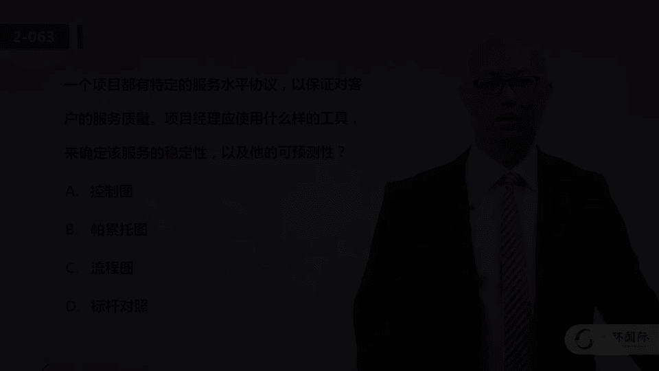

# 01 PMP培训视频教程 03 PMP第六版冲刺串讲视频教程 04 二模解析 2（51-100） - P1 - meiwanlanjun - BV1SA411d7sM

呼呼呼。

好我们来看51题，一个施工项目完成了第一版的w b s啊，那么项目团队询问，是否要将团队的工作包含进w bs中，这个呢非常简单是吧，当然是要包含了，那其实呢他考我们的是w b s这个工作。

分解的一个原则啊，这个原则就是百分之百的原则，那这个答案呢当然不用犹豫选第四个啊，所谓百分之百的原则，就是一定要包含全部的项目的工作啊，这个是我们做呃w b s分解的一个原则，要是要在分解的结构当中。

体现出所有的全部的项目的所有工作，当然要包括项目管理工作和一些实施的，所有工作啊，51题选d，52题，项目完成了75%，客户呢对范围进行意料之外的变更怎么做，然后我们再看四个选项呢。

它我们就能判断这是考的是变更流程的问题，那当然变更流程的第一步呢，是要提出变更请求啊，我们再看这是三呃，呃这四个选项那比较合适的呢，应该是选第三个啊，其他的都不太对啊，答案呢选c啊。

他还是同样考我们的是变更流程的问题，呃当然我们也可以从用排除法，从从这四个选项当中去分析，比如说选项a像发起人通知变更，那这个当然是不符合变更控制原则的是吧，你要得c c b批准之后啊。

再通知所有相关的人，光通知发起人可能也是不合适，那么接受请求并更新，这同样忽略了审批的这个流程，选项d呢创建计划应该早就创建啊，这个不是说变更发生了，你才开始制定呃变更计划，那这个当然是不对。

答案选c53 题嗯，这个又是一个呃专有的技术名词和方法，这样的一道题啊，一个发起人呢关心成本业绩啊，问你哪个预算达到，哪个没达到，那么你应该向他向他提供什么，我相信有好多同学啊。

嗯别乐肯定说的就是你好多同学呃，可能会蒙着选b吗，业绩衡量图表，有的有人说，你看发帖人，他关心业绩吗，我给他业绩衡量图表，什么叫业绩衡量图表，你知道吗，啊你说你不知道你蒙着选的吧，这个就不对啊。

业绩衡量图表没有这个概念，不光p n b o k上没有，连网上都没有啊，你你去网上搜索就没有这个概念，所以说这道题呢其实用排除法啊，答案呢选a绩效测量基准，当然其实呢这个a吧也不是特别的呃。

全面就是发起人如果问你哪个预算达到，哪个没达到，你光给他一个基准可能还不够，你应该给他一个绩效报告啊，就是实际成本与基准相比较，然后这个是符合的，那个是节约的，那个是超支的，这样才更好。

但这个选项呢也没有更合适的，如果这道题有呃成本绩效报告的话，那我觉得选成本绩效报告可能就更合理了啊，用排除法答案选a啊，这个我相信好多同学蒙着选b啊，这个呢一定要准确，尤其是一些专有的技术跟名词的话啊。

大家不要去做呃，猜测53题选a，54题哪一个描述应急储备，那我们都知道应急储备呢，是针对已知的未知风险啊，什么叫已知未知风险呢，大家就把这个选项c啊，当做一个知识来学就ok了啊，没有计划。

就是我不在我的成本基准呃，呃呃这个计划的，但是呢我是这个识别了的啊，我知道它有可能发生，但是它对我项目的影响是未知的，这就是已知的未知选项，c指的就是已知的位置啊，这个所谓未计划的意思呢是说。

因为它的影响未知呢，我不会专门针对这个风险啊，提出一个额外的钱，是所有的已知未知风险，我们都用应急储备来包含，所以这个题呢答案选的是c啊，那么应急储备针对已知未知风险，项目经理有权动用管理储备。

针对未知未知风险使用之前要得到高层的批准，分解属于生成什么文件的技术，当然是生成w b s的技术了，所以这样的题呢是一道送分题，这个就不多说了，那关于w b s了，相关的技术也建议大家看一下，5。4。

2小节啊，在复习一遍，55题，选第四个选项d，56题，呃你要建设一个生猪养猪的一生，呃，这个这个生猪养殖的厂家，那么你分析完了之后呢，你说服管理层迁出啊，这个地方就换一个场址，那么这个就是典型的避免啊。

有人说，那我换个场址，那那个新厂址的居民会不会反馈呢，反对呢，这不需要你考虑，你要考虑的是这道题应对的风险是什么，这道题应对的风险是当地居民，那当地啊我们原计划的这个厂址的居民，他呢反对。

那我换了一个地方就可以完全避免掉，他在反对了吗，啊比如说你原打算在北京，你就说那我去天津吧，那当然北京就不会反对了，这就是避免啊，所以这个56题呢选第四个选项啊，57题嗯，项目经理啊，在执行的过程当中。

收集工作绩效信息的目的是什么，呃这个呢其实考我们的是对于工作绩效数据，工作绩效信息，工作绩效报告这样的呃文件啊，或者说嗯内容的理解，工作绩效信息呢，是为了监测成本进度和可交付状态。

那么一般我们都说数据呢是最原始的观测值，那么我们再把数据与基准做比较呢，就能够得到对于决策有帮助的信息啊，你比如说目前两个月干了100件事儿啊，这个就要数据，那我原计划两个月干200件事呢，这个叫基准。

那么我们把100跟210比较，我们得到一个结论叫进度落后了，那这个可能就叫做信息了啊，所以他还是为了监测成本进度和可交付状态，答案选a啊，有人说那进度绩效报告呢，这个工作绩效报告啊。

就是把信息呢汇编成比较正式的文档，一共这个呃相关的相关方啊，去给相关方发送，所以工作绩效报告呢一定是沟通管理，我们经常去发送的一个呃正规的正式的报告，58题嗯，这个呢也是一个比较简单的题，考一个知识点。

就是两两沟通渠道数的计算问题啊，那么，沟通渠道数的计算就是一个公式，n乘n减1÷2，那么这道题的题干说了，一共有12个人，又加了两个人，那么也就14个人呗，那14个人呢沟通渠道数两两。

沟通渠道数就是14x13÷2，等于91，58题，这样的题如果再考的话，一定要拿分啊，这是送分题，我们看59题，你是项目经理，当你看到呃，这个pmo项目管理办公室给你发送的建议的时，候，你心情激动了。

你又一次被批评，没有提供足够的支持细节，然后他就说了啊，支持细节包括a b c的哪三个，除了哪一个，所以这道题呢考你的是支持细节，包括啥，不包括啥，这道题本身的知识点就特别细节啊，p m b o k啊。

有专门对支持细节做过定义啊，这个我相信大家第一遍看书，甚至你第二遍看书可能都不一定会注意到啊，这个也不是特别常见的重要的这个概念啊，但是呢这道题考了，我们就以这道题呢来学一下知识细节的定义啊，是在6。

5。3。3啊，是制定进度计划的输出文件，它呢会包括这个进度数据啊，其中进度数据呢又定义了支持细节，包括啊呃这个资源直方图啊，备选的进度计划呀，使用的进度储备啊，所以呢这道题a b c呢是包括的。

那答案呢选的是第四个啊，大家以这道题呢为一个一个小的例子，然后呢再看一下啊，支持细节的概念的定义就ok了啊，6。5。3。3小节好，我们来看第60题，在项目的实施过程中啊，需要一位顾问。

那么这时候用什么合同的类型，其实呢如果大家够仔细的话，你看工料合同的话，他专门举例子了，它特别适合于啊，比如说签订一些外部的专家人员，或者说一些材料啊，这道题呢答案选的是c。

公告合同呢首先如果范围不明确啊，没有说明书，用公料合同比较合适，然后其次呢就是临时增加人员，工料合同洽谈起来呢比较方便啊，这道题选c61 题，在中途啊，项目中途团队成员告诉经理呢，项目范围比较复杂。

估算的进度不太充分，项目经理应该怎么做，a管理风险实时响应呃，b分析啊，以确定最佳的行动措施，c收集并整理经验教训，执行详细的分析，如果需要的话，提交变更，请求大家注意，如果你把它认为是风险。

那么你也应该什么呢，你应该先去分析一下它的程度是什么样的，然后在查阅登记册，看看有没有规划的风险响应，所以其实a啊说的并不是特别的合理，而且呢大家注意啊，如果这道题没有选项d的话。

我觉得吧这个选项b还比a合适呢，你说有了选项d呢，我们就用排除法做，d呢说的是最合理的，就是说首先我们要分析他给我报告了，这个估算的进度不充分，是不是不充分，到底是啊，我我的原进度计划就是快了。

这个是不合理不合理的程度是多少是吧，你原计划十个月，那是不是12个月能干完，还是11点，五个月能干完，这个都不太硬，你要进行分析，如果必要提出变更请求，所以这个选项d呢比abc吧都合适。

那c肯定就首先排除了是吧，得问题都解决了啊，你要把这个经验教训可以呢啊，整理一下，61题呢选第四个啊，62题，团队成员在执行任务的时候有困难，这个是什么，就是我分配给了他任务，他不会干哈，选。

那怎么办呢，直接更换，你说a是一个方法吗，是一个，但不是最优先采用的，或者说我们首先不这么考虑，那你再看其他选项呢，应该是对他进行培训，所以大家注意啊，就是我们在做题的时候啊，我们首先要判断问题。

甚至是定位过程，啥意思呢，就我们看了这道题，在执行阶段，团队成员不会干活，或者说有些技术啊技能不够啊，我们要把问题定位到项目管理的哪个过程呢，就是团队建设啊，建设团队这个过程，而不是组建团队。

你要更换了，所以呢答案选的是第二个b啊，在建设团队的时候，我们往往需要培训啊，他可能呢对于这个项目，因为项目有临时性吧，有特殊性嘛，所以他可能缺乏某一些技能，那作为项目经理应该给他提供培训的机会。

当然在组建团队的时候，或者说在获取资源的时候，我们首先优先的是选用那些具备技能的资源，但是你团队组建完了，他还有一些技能上的问题，那着手呢对其进行培训，62题，选b63 题。

一个项目都有特定的服务水平协议啊，那么使用什么样的工具来确定稳定性，以及可预测性啊，这道题又是考大家对于控制图的理解，稳定性吗，是否可预测嘛，大家注意，如果我控制图啊，是这样的。

我觉得呢就是稳定的是可预测的，那下一个点要么在这，要么在这嘛是吧，那如果是突然这样了，那我觉得可能得找问题了，所以控制图啊它的横轴是时间，所以说呢他就能够反映稳定性，就是随着时间的发展。

你的过程是否稳定啊，63题考的又是控制图的知识，那么详细的解析呢，大家可以再阅读一下，另外我说一下，就是我们在录视频的时候啊，每一个解析的每一个字，不一定会给大家逐字地念，大家可以呢去把视频暂停去读哈。

这个也呃完全不会很麻烦，另外这个解析的电子版啊，也会就是纸质版还是电子版吧，就是我们远程的学员也都会拿到64题，团队成员担心一项批准的变更会增加范围，延长时间，却不担心预算应该怎么做，大家注意啊。

首先这道题我们要定位问题，它的真实问题是什么，他的问题就是面对批准批准的变更，你应该怎么办，那么有一个原则就是批准的变更就要被执行，那这道题就说了，批准的变更，团队担心啊，这个可能会进度有问题啊。

成本有问题，那你应该怎么办呢，就是寻找可替代的方案，大家注意，这个可替代的方案，指的是在不违背这个批准的变更的前提下，我们看有没有更合适的方式，如果你认为啊批准的变更你很难去实现的话。

也不是要拒拒绝变更，你就再提一个变更请求呗，所以这道题呢我们答案选的是a啊，寻求可替代的方案，在现有的范围和预算之内呢去工作，如果你认为真的有问题，64题啊，选a65 题，三点估算法的问题。

最乐观20天，最坏32天啊，最乐观14天啊，最悲观二三十二天，最可能的是20天，每天是140美元，那么预算是多少，就是我们先用三点估算法把时间定出来，加权平均啊，用这个正态分布的这种方式。

把这个1+4+1的权重给它分配好，我们得到的是21天，那么21x140啊，算出来预算答案选的是第二六十六题，项目团队成员的非正式谈话呢，发现一个供应商在执行批准的变更的时候，有问题怎么办。

这考我们的又是供应商的工作有问题，大家注意啊，供应商呢就指的是你在做采购了对吧，你去采购他的服务，那么供应商的工作有问题，如果选项当中有那些具体的项目管理的工作，一般不选。

因为供应商的工作是他们自己管啊，你想你你你作为外包房，你是甲方，你呢具体的工作你不应该去去做啊，或者不不需要你去干预，但是你可以通过什么呢，可以通过采购审计的方式去督促去监督他，所以你看啊。

一般往往供应商的问题，我们往往用采购审计的方法，答案选的是啊，这道题也是同样的问题，所以答案选的是c啊，又是在控制采购当中的采购绩效审查，采购绩效审查，呃66题选c，67题，在下列哪一个过程呢。

团队将收到的标书，将收到标书，并根据预先定义的标准审查卖方资格，这个题呢，考我们的是对于采购管理的那些过程的，工作内容的理解，比如说规划采购呢，就是我们先分析要不要采购，如果采购的话。

我们啊呃应该按照什么样的原则啊，什么样的标准去去去做，就是制定一个计划，而实施采购呢就是具体做干活了，你比如说招投标啊啊收到标书啊，去审审查呀，所以这道题选的是a啊，这是具体在实施采购。

那么管理采购呢应该就是针对问题啊，去做一些啊控制的工作啊，这道题答案选的是a啊，考我们的是对于实施采购这个过程的理解，大家可以看一下实施采购这个过程的引言，68题嗯，客户告诉项目经理没有钱了。

不会再支付项目了，所以这个呢其实隐含的指的是，项目要提前终止啊，这个一模呢也也做过好多这样的题，项目要提前终止的话呢，我们往往一定要第一反应就是要进入收尾了啊，要结束了，要4。7了，4。7小节嘛啊。

整体管理最后一个过程结束项目或阶段，那么这道题答案就是选第二个进入收尾啊，第二个是最合适的，那同样啊，提前终止呢是也是经常会在选择题当中啊，考核大家的呃，4。7小节引言，以及整个这个小节的内容。

都需要大家仔细的去看，68题选b，69题，有一部分的工作要外包啊，制定了计划，并向多个供应商发出了建议，邀请团队从潜在的供应商那里，获得关于工作的询问，为了向潜在供应商提供响应啊，团队应该怎么去做。

大家注意这个题干描述了一个什么情景呢，就是你要采购，然后呢你发出了建议，邀请好多供应商呢给你提问题，你用什么方式去响应供应商的这些问题呢，大家注意啊，有我们可以去去排除法，那当然其实这个考的。

我们也是一个实施采购当中的一个典型工具，就是如果供应商对你采购的服务啊，这些说明有一些疑问的话，如果他特意问了，是对你的招投标招标文件有问题，那我们可能得修订招标文件是吧，但是呢供应商对于工作有问题。

我们怎么样才能让供应商有，对于你采购产品的清晰且一致的理解呢，一个非常好的方式是召开投标人会议啊，不一定是你的采购文件有问题，而是而是说大家对于具体的工作，有一些不清楚的问题要问你。

那么非最合适的方式就是投标人会议，这种方式，通过会议的方式向所有的潜在供应商提供，对于我需要的产品和服务的清晰切一致的理解，所以这道题考大家的知识点，是在实施采购过程当中经常使用的一项技术。

叫投标人会议，它的核心目的就是为了让所有潜在供应商，对我需要采购的内容具有清晰一致的理解，好我们来看第70题，项目接近完工啊，项目团队成员呢，向项目经理报告一个可能影响重要期限的问题。

而且每周状态报告要在第二天发送，主要相关方下一步应该怎么做，那这道题一定是结合着选项我们去做排除，现在目前我们的问题是，第二天要把一份正式的呃状态报告是吧，发给相关方，然后呢，但是今天呢团队说了。

有一个可能会呃重要的影响期限的问题，那这个时候怎么办呢，大家注意发现问题，首先我们要更新问题日志嘛，所以呢结合这四个选项呢，更新问题日志可能是a跟d的，前半句话可能都是比较合理的，a说更新分析问题日志。

通知发起人使用升级程序，这个时候大家就就得慎重了是吧，项目当中遇到的一些具体的问题，我们一般呢不找发起人对吧，只有当这个项目章程可能需要变化了，项目的生死面临着呃抉择了，可能得找发起人。

所以a呀这个可能我们就需要排除掉，b呢，在下一次状态报告中通知，这个可能也不太合适啊，这个从即时性上可能就不合适，c核实这个问题是否在风险计划当中，如果不在啊，包含在内啊，编制风险计划。

其实c说的吧好像是在针对问题呢，但是他可能没有没有关注到这个题干当中说了，我第二天要发送报告，那这报告我到底要不要这个包括这个问题呢，所以这个答案呢我们用排除法啊，选的是第四个更新。

问题日志将可以帮助解决问题的人员，包括境内，包含境内呢，并且与相关方进行沟通，这是最合理的啊，就是解决这个问题，可能不只是你项目经理和项目团队，可能会涉及到相关方，那正好你第二天呢跟相关方沟通。

那我可以把这个问题，你认为这个问题可能涉及的那些相关方，包括进来，跟他们先做好沟通啊，这道题其实呢还是沟通管理的问题啊，那对于问题日志啊，在我们之前一道题呢也提到过是吧，大家呢再去看一看呃。

相关的定义啊，10。3。3小节，这个实际上考核大家的是监督沟通这个过程，71题，这道题呢是比较两个项目啊，哪个更值得投资，那我们比较什么呢，我们看已知项目a的投资回收期是21个月。

那我们要比较的就是投资回收期，我们要把项目b的投资回收期算出来的话呢，这个越短越好嘛，那项目b说呢成本是17。5万，然后第1年呢是75000，之后每个季度是5万，也就第1年呢你能收回75000来。

然后每个季度是之后啊，从第2年第一个月开始，每个季度5万的话，你第1年收75000，还剩10万没回本，那第2年你是不是用两个季度就能回本，所以说呢你的投资回收期就是1年半是吧，两个季度嘛，1年半呃。

18个月，那也就是说项目b呀合适，它的投资回收期比a呢更短啊，所以呢答案选的是第四个啊，项目b是18个月的投资回收期，这样的题呢也是比较简单的数学题啊，大家要保证正确，这是送分题，好，我们来看第72题。

在识别和了解项目风险的过程当中呢，希望通过图形化的方式表现风险啊，用图形化的方式表现风险啊，一些决策，一些不确定因素，因果关系等，那么这道题用什么样的风险图解技术呢，结合这个选项。

答案选的是第四个影响图帕累托图，这个是管理质量经常用的是吧，德尔菲图呢，这个嗯嗯是是专家判断叫德尔菲法啊，这个a abc呢都不对啊，没有那个a跟c那个概念啊，大大家呢这个呢对于风险分析啊。

一种风险的图解方式，就是有一个概念叫影响图啊，在11。4。2。5，大家呢建议大家去看一下pm bok的完整的定义，72题选d73 题，这道题给了我们一个正值分析的曲线啊，那么他问我们说项目的绩效是什么。

大家注意这道题其实你一定要知道啊，就是项目的绩效，你一定得先什么呀，确定一些时间嘛，所以你一定得说到哪个时间点，项目的绩效是什么样的，而这道题呢这条直线就是我们关注的时间啊，大家可能不是很清楚。

这个实线黑的呀，是pv，这个点化线是ac啊，也就是说，这个是e v啊，这个是ac，那么对于这个点呢，大家注意ac跟ev是相等的，ac跟ea相等，说明成本是持平的，而e v又大于p v是吧。

这个点的pv在这呢嘛e v大于p v的话呢，说明进度是超前的啊，所以进度提前，而且成本是持平的，那答案呢选的是c啊，答案选的是c，74题，在一个工程项目当中啊，项目经理应用了在之前更为复杂的项目当中。

应用的项目管理方法，团队成员抱怨说呢，这种方法吧每份文件都进行同行评审，需要花费太多的精力，若要确保质量成本满足项目特征啊，项目经理应该怎么做，所以大家注意啊，这道题的题干呢给了我们挺多信息。

第一个信息，你想用一个在别的项目当中好用的方法，但是你注意到别的项目是非常复杂的，项目可能非常复杂，规模比较大的项目，我们用同行评审，每个文件都评审是必要的，但是你的项目如果不复杂，你用这种的话。

可能就会给你带来更多的成本，而且他的问题是要确保质量成本满足项目特征，你应该怎么做呢，在做计划中考虑质量成本，就是说我们其实无论是管理质量也好，还是说管理项目也好，我认为啊对于项目管理啊，有一个。

很重要的一个一个一个怎么说呢，一个境界就是你要帮忙不添乱，就是对于实施而言，对于项目而言，你的项目管理工作，应该是帮助项目顺利地完成目标，而不是说为了管理而管理，为了过程而过程，不是这样对吧。

所以呢我们采取的方法应该符合项目的特征，那他这道题只能特指了质量成本，那就是在做计划的时候考虑质量成本a，你说直接就全省略了呢，可能也不合适，那你可以可能会这样规定，比如说一些重要的文件是吧。

我们用同行评审来一些非重要的，可能就不需要答案呢，选的是第四个啊，75题，一份项目过程当中产生的项目文件，项目收尾文件和历史信息清单啊，属于下列哪一项啊，这个呢比较简单，它都属于组织过程资产啊。

这个其实考点就是组织过程资产这个概念，它包括什么，大家要知道呢，就是组织所使用的计划过程，政策程序和知识和知识库啊，都属于组织过程资产，75题选a76 题，进行自制外汇分析之后呢。

项目经理将w b s工作的一部分内容吧，进行了外包啊，那么他问你这个外包的这部分工作，要不要包含在w b s当中呢，当然要包括，所以这道题啊也是一个送分题啊，将需要外包的内容保留在wbs当中啊。

同样考的是w bs的一个分解的原则，就是要百分之百原则，只要是项目相关的工作呀，可交付成果，无论你是自制还是外购，它都属于项目的内容啊，都要保留在wps中，76题，送分题选b，77题，在一个项目中啊。

团队发现一个新的方法，报告了项目经理，项目经理分析发现呢，实施这种工具呢可以缩短速度啊，可以缩短进度20%啊，节约成本10%，大家注意，那你如果用了这个技术，将相当于你可能会变更基准。

那如果是要变更基准的话呢，就应该走正式的变更审批流程，那么根据这四个选项，答案应该是选b啊，按照流程去变更，这个又是考大家的，是变更流程的这个题，78题，在成本加固定费合同当中的费用如何改变啊。

就是无论是什么合同，你说费用就完全是固定不能变的吗，这个是不不会的，那如果要改变合同当中的金额，一定应该走变更流程，那么这个四个选项当中呢，选项b说的是最合理的，如果同意变更了，那是可以改变的。

答案呢选第二个b啊，关于合同类型，其实呢你仔细看他也有提到，除非范围发生了变更，否则金额呢是不允许随意变更的啊，79题，在执行阶段，项目经理跟踪风险，并在登记册中呢更新已记录的状态。

这个登记册还包括属于实施风险响应，直接结果的风险啊，这道题问的就是风险响应的导致的结果，这种风险我们称之为什么呢，这个在一模也考了，我印象中就是它应该属于它的名字叫次生风险。

就是因为我实施了风险应对策略，从而产生的新的风险啊，我举过那个例子是吧，我为了安全，我要带骑摩托车呀，我要戴头盔，那我是为了防止出了车祸受伤，那我戴个头盔呢，我出汗是吧，特别热，他这个可能出汗已呃。

影响你的舒服的体验，那这就属于次生风险啊，79题啊是一个小概念，次生风险的定义就是啊，实施应对策略而导致的风险，79题选d，80题，在管理当前项目的时候呢，非常重要的一点是运用以往的经验教学。

那么呃在结束的时候，内衣回顾哪一项比较重要，这个呀很有可能呢大家可能会选错啊，就是你说我在总结经验教训的时候啊，我说这个项目曾经发生过的中等程度风险，我给他整理好，作为类似项目的经验教训，可以吗。

可以你说其实a也不错啊，所以p m p的题大家一定要注意，就是呃有一个原则，就是四个选项我们找一个可能更对的，而不是说一定剩下那仨就百分之百错，不一定是这样啊，那对于这四个选项当中。

哪一个更是典型的组织过程资产呢，哪一个更能够啊，在其他的项目当中能够有非常直接的帮助呢，答案选的是第二个风险核对单啊，那对于风险核对单这个概念啊，实际上在识别风险的工具当中提到过。

它就是啊从类似项目的呃信息当中呢，去获得这个核对单啊，列出过去曾经出现，并且可能与当前项目相关的单个风险，这是吸取已完成类似项目的，经验教训的有效方式，所以说对于这道题而言啊，和核对单啊。

其实他就比他更全面一点是吧，不光是中等风险，那高高等的呢啊，低等的呢可能我都可以放到这里来嗯，这种意义上说呢，选项b啊，b a呢就更呃优先选择，所以这道题选的是第二个选项b81 题，监督风险涉及什么啊。

这个考大家的是监督风险，这个过程当中呢往往包括的工作内容呃，建议大家看监督风险的引言，这道题选a啊，就是监督风险是在整个项目期间监督啊，风险应对计划的实施跟踪，以识别的风险。

识别和分析新的风险以及评估风险管理有效性，有同学说老师你看这有识别和分析啊，那我选b c跟d呢，大家注意啊，是的，监督风险的引言当中说了啊，你要识别新的风险，并且分分析新的风险，所以说这道题严格意义上。

这个a b c d都对你风险频率和影响评估，这也是定性分析的111部分内容吧，所以这道题吧我们张开一看，a b c d都对，那你一定是找一个什么呢，就是是不是有一个与其他三个不一样啊，那选项a呢。

一般是特指在监督风险这个过程当中做的，而b c d呢它他会也会做，但不是说只在监督风险当中做，所以监督风险说了，要评估有效性嘛啊要监控计划的效果，所以这个a呢就是优先选，是这样的，大家不要钻牛角尖。

不要抬杠，81题，选a82 题，哪一份文件说明了含有按合同规定所要的啊，所要提供的产品和服务呢没得说啊，这个是一个非常重要的啊，一模二模甚至三模一定会考的，咱们真实项目管理。

考pmp考试当中一定会考的这个概念，工作说明书啊，为什么就经常考呢，因为这个概念啊，这份文件与大家常规理解的工作说明书，这五个字不一样啊，如果你没学过p m p啊，工作说明书。

你感觉上他就是告诉我应该怎么干活，告诉我工作应该怎么干，不是这样，工作说明书是产品的叙述性描述啊，你是乙方，甲方给你工作说明书，你照着这个来制定范围来干活，你是甲方，你要采购的话。

你给乙方提供工作说明书，所以呢制定章程呢要输入工作说明书，这个时候你是乙方，那如果你是采购呢，那你是甲方，你要给供应商工作说明书啊，这个概念经常考，大家一定要啊，一定要呃学透啊，82题选c，83题。

你的管理层总是要削减你预算10%啊，项目范围不清楚，包含30个相关方，管理层，预计项目将降低25%的停停机时间啊，这种情况下最好是什么，有好多信息可能用不着，有30个相关方降低25%的时间啊，选项a啊。

我们获得35%的时间，他就他就不给你削减预算了吗，所以这道题的问题啊，还是说如果他要削减你的估算，你应该怎么办，答案选c啊，提供准确的呃估算啊，来支撑这个结果，这个意思就是说你管理层要削减你的估算。

那你要给管理层提供你估算的依据，告诉他我的估算是有理有据的，你要削减的话呢，可能项目的范围或者目标呢不一定能够实现了，你要跟管理层呢进行沟通，那你要给他一些呃，在沟通之前你要准备好啊一些支持的信息啊。

是这个意思，所以答案选的是c啊，你对你的估算要负责，你呢有义务呢坚持一下，不是说完全不能变，你要跟他进行沟通啊，这个答案呢选c是合理的，84题，团队正在讨论啊，建立了奖励机制啊，鼓励团队合作。

他们是否应自己完成工作，还是外包给他人，这就是在典型的进行自制外购分析，而自制外购分析呢又属于规划采购的这个阶段，所以这道题啊啊前面的第一句话，第一个句号，前两个句号都没什么用啊，问题很明确。

在做自制外国分析的时候，属于项目管理的哪一个过程，组的过程应该是规划采购的过程，所以84题选b啊，自制外购分析呢，是呃这个规划采购经常用到的一个工具啊，也是一个输出，就是自制外购决策，那就是它的输出了。

85题，你决定向一个供应商提供合同，你跟他经常合作表现良好，你现在的项目啊与与以前不同，但是与该供应商完成的其他工作类似，也就是说这个供应商做过类似的项目，但是你跟他之前合作的项目呢，不是这种类型的啊。

是这样的一个意思，他的问题就是你要签订什么合同啊，所以这个考点吧还是问大家呢，对于合同类型的特点的掌握，你要与供应商签合同，那么这个时候你就是甲方，那既然你是甲方的话，我们优选总价类合同。

那么呃这个总价加币值调整，或者加经济价格调整，这个指的是要历经好几年是吧，我们要考虑通货膨胀的因素，所以这个a排除掉，那b呢没有这个合同啊，什么叫固定抽筋呢，没有这个概念，答案选的是c啊。

选固定总价合同，也就是说我们要在cd当中做选择的话，那c呢可能是最合理的啊，你是甲方嘛，所以我们避免选成本类的，成本类的对乙方太有利了，因为他报报销所有乙方给你的成本，但是你作为甲方，你又不专业啊。

有些成本你不一定能核实，所以啊啊这样啊，我们答案选的是c，好我们来看86题，86题这道题吧，特别长啊，跟一个外国人，就是你不同国家的项目，项目的项目组成员去沟通，打好多电话，俩人说的母语还不一样啊。

等等等等，但实际上大家注意啊，那个部门经理就是外国的部门经理说呢，我们的下属必须要执行二级测试，这就会给他产生工作量，使得进度呢一直就延期，而且你听到了四遍，你该怎么办，所以这道题吧，我们看这个选项啊。

首先就可以排除a跟b了啊，因为他不是沟通的问题，虽然大家打电话说母语不一样，可能沟通起来有点困难，但是他最终没有影响沟通，结果就是说信息的传达还是能够准确地传达的，我们一定要注意，就是通过这个题干。

我们把主要矛盾找到，就造成项目当前问题的原因到底是什么啊，造成问题的核心原因，主要矛盾是这个二级测试的这个政策，那作为项目经理，我们就是要推动这个政策去改进啊，推动组织提高效率，有的同学不敢选d啊。

就是说我们项目经理没有这个能力跟权限，大家注意啊，你看d说不断改进这个政策，提高机构的效率，就是在项目过程当中，如果你认为公司的政策有一些问题，你不是说呃不能提，提出这个建议，对不对。

但有一些项目可能优先于一些原来的政策，如果你的项目对于公司特别重要，如果公司的原来的政策，所以说呢这道题选d的原因，就是只有d呢是针对主要矛盾，你说c确认接下来的活动是否重新估算。

这个没有针对主要矛盾啊，造成项目有问题的核心点是这个政策，所以答案呢选的是第四个啊，这道题啊确实是呃，可能大家由于觉得项目经理没有这个权限，而不敢选这个地，大家呢也也不用特别的呃。

就把这道题当做一个多么重要的知识点，一个解题原则去做，呃，我们呢就是把握一个原则啊，找主要矛盾，做p mp的考试题，我们一定要找唯一的主要矛盾，然后定位唯一的答案，86题选第四个，87题。

项目经理发现关键路径上的一个活动的开始，结束的依赖关系遗漏了，应该事先怎么做啊，这个呢其实考大家的是逻辑关系有问题，开始结束的时间分析得不到位，那用什么方式，用什么方法能够避免这个问题啊。

当然是进度网络分析，进度网络分析，就是让项目经理能够清晰地把握，活动的依赖关系，从而呢找到啊，呃从而去计划各个活动的最早开始，最晚结束等等这样的一些时间啊，所以这个选项b呢是最针对这个问题。

那么进度网络分析呢也是啊常考的一个点啊，大家要了解，首先进度网络图呢，就是排列活动顺序的一个输出，我们画完了进度网络图，把活动的逻辑关系反映到图上，然后你在估算完时间之后呢。

再把活动的持续时间标注到网络图上之后，你就可以进一步的制定进度计划，那由于有了网络图，活动的逻辑关系呢就很清晰，就可以帮助你去避免遗漏，一些什么制约的因素了，八七题选b啊，88题。

在一个软件开发项目的计划阶段啊，如果比承诺交付时间提前两个月交付产品，公司呢将得到奖励产品呃，开发的项目经理，让编程人员呢，在需求和设计完成之前就编写代码，这属于哪项进度呢，呃这属于哪项进度的一个知啊。

技术啊，在设计完成之前就开发代码，这就是典型的快速跟进啊，快速跟进呢可以压缩进度，赶工也可以赶工，指的是通过多投入资源增加成本，而压缩进度，快速跟进呢就是让呃后续的工作，让这种串联的工作并联啊。

这个指的是快速攻击，那么我们理解快速跟进呢，就简单理解，比如说原计划是先设计再施工fs关系，那我快速跟进就可以变成了边设计边施工，这样的话呢就有可能去缩短进度，但是你要知道快速跟进呢。

就可能会增加风险对吧，答案呢选c89 题，读完了前三行，我还以为是政治分析的问题，说给了我们一个预算啊，又给了个时间点，又给了完成百分比和实际成本，他说接下来应该怎么做呢，啊这四个选项我发现哦。

原来他不是考的政治分析，他问的是我们有了计划，也有了一些实际啊，比如说1200万是原计划吗，3年这也是进度计划是吧，实际情况是六个月干了25%，花了400万，那接下来该怎么做呢，接下来该执行偏差分析啊。

这个偏差分析指的是谁与谁的偏差呢，大家思考一下这个问题，谁跟谁偏差，应该是分析实际是吧，分析实际与计划的偏差啊，分析实际与计划的偏差，针对这个偏差呢，我们分析原因，然后呢采取措施，所以这道题选的是b啊。

偏差分析他应该是在做政治分析啊，政治管理当中的一个部分，呃我我认为啊就是项目管理，如果让我用三个词儿来描述的话，我对项目管理的理解是控制实际符合计划，所以三个词儿就是计划，控制和实际啊。

这是三个我认为最重要的管理的关键词，那么计划呢是基础，是依据，我得先制定合理的计划，那么计划做完了，对于管理而言啊，不是说执行不重要啊，而是控制更重要，控制呢的核心目的就是让实际符合计划。

所以我如果项目管理的话，核心的工作就是控制实际符合计划，89题，选第二九十题啊，这个又是三点估算法的问题啊，给了我三个时间参数，最可能45呃，最慢其实最快32，那么加权平均啊，三点估算。

把最可能的权重变成四倍，1+4+1÷6，这道题呢不说了，选第三个选项啊，91题，项目经理希望监控质量保证措施的有效性，用什么工具啊，看看它是否有效，看看过程是否合法合规，这就用典型的审计啊。

质量审计答案选d，关于质量审计也好，采购审计也好，采购绩效审查也好啊，经常考甚至风险审计嘛，风险这个在评估嘛等等，审计呢经常考，大家呢要整体的去把握啊，看看是否有效啊，看看过程是否合法合规啊。

啊总结经验教训呢，只要有这些词，我们脑海当中呢，首先应该反映出来，这是可能就考的是审计啊，91题选第四，92题，项目经理要求风险经理，开展每月的定量风险分析，那么应该提交什么，就是a b c d呢。

哪一个是定量风险分析的一个结果，答案选a，那这道题考的是风定量风险关系的啊，定量风险分析的典型的技术，那蒙特卡洛图呢是典型的定量分分析的技术，b c d都是定性的是吧，所以答案呢选的是a啊。

那b不是定性啊，重新评估啊，这是在监督风险的时候涉及到的工作啊，呃92题选a，93题，项目已经交付给客户a了，开始了收尾工作，团队将会转移到b上，那么销售经理要求项目经理提供a的售后支持。

项目经理应该执行什么呢，首先你要知道就是对于项目a而言，你应该在做收尾啊，所以你再看四个选项，答案应该选的是确保a的特定知识获得了收集，医疗组织，因为c是在整理组织过程资产。

这是属于典型的行政收尾的工作，你说选项d拒绝请求查阅合同，这个不一定是吧，你上来就拒绝嘛，而且呢因为有选项c，它的问题是要说你在做收尾的时候，应该做什么工作，所以这道题的选项c呢就比这个选项啊。

其他选项呢就更好一点啊，这个同样还考大家的是4。7，这个小章节结束项目或阶段啊，选项c指的是呢啊整理组织过程，资产这份这部分的工作，94题，一个团队成员对其他成员非常不满，贬低别人。

那这个与其说考我们的是项目管理的题啊，不如考我们的是阅读理解的题，他老贬低别人，那么我们就认为啊定义他这种行为是攻击者嘛，你老攻击别人，贬低别人啊，那么对于团队而言呢，有两大类角色啊。

一个叫破坏性的角色，一个叫建设性的角色，那破坏性的呢有挑衅者啊，什么啊，支配者吹毛求疵者，多变者，寻求认同者，怕事者，碍事者啊，那么建设性的也有好多，那这道题呢是是攻击者啊。

ceo非常关注成功并承诺分配所有必要的资源，那么ceo的参与程度当然对于我这个项目而言，是非常重要的领导角色对吧，他首先非常关注成功，承诺给资源，也就是说，他很在意这个项目是否能够成功地完成。

所以它就是领导者的角色，那领导者指的是呢知晓项目的影响，并积极致力于保证成功啊，他是ceo吗，答案选的是b96 题，在项目结束的时候，项目经理报告项目成功，但是发起人不同意啊。

项目经理从哪里得到验收标准，有的同学啊光看验收标准了，选的就是范围说明书嘛，有的时候范围说明书它会包括呃一些呃，可交付成果的验收标准，这时候你就错了，再看看题啊，是发起人不同意项目成功。

那也就是发起人关注的不是细节吗，大领导嘛他应该关注的是高层次的，你的项目的成功的定义，而项目成功的定义应该是在章程当中约束的啊，又因为章程是发起人签字的吗，如果你认为啊，你有证据显示它符合章程的定义。

那你就可以把章程给发起人去看啊，跟他去讨论，所以这道题选的是d，我们来看97题，在风险登记册的一个风险，在后项目后期发生，那么最有效的应对措施是什么啊，首先呢我们通过题干能够发现。

这个风险是在风险登记册上的，所以呢它不是未知风险，所以呢首先排除a了，那么风险发生了，我们一般啊就是会去分析跟那什么去去去定性，定量分析啊，但是本身他在登记册上的话呢，应该说已经分析过了，这是一方面啊。

我们可以通过这个呃思考，去把选项b跟c排除掉，那么既然你是风险登记册的，然后我们根据选项呢，那他应该是已知的风险，那嗯只有选项d是最合适，实际上无论是在后期还是前期发生呢，如果是风险登记册上有过定义的。

风险出现了之后，我们的常规动作应该是查阅登记册上呃的响应，那么他这道题可能指的是这种啊，并没有那个嗯，就是这个风险的影响可能不太清楚，所以呢用的是应急储备，所以这道题呢还得结合排除法。

最终呢我们选的是选项d啊，这个已知风险用应急储备，它考的知识点是这个点98题，项目到目前的实际成本是85万啊，总预算90万，正值75万，那么状态是什么呢，大家注意这个总预算啊。

可能他与我当前的成本绩效是没有关系的，就这个题不给我90万，这道题我也能啊完全做出来啊，那么成本超支就是看ev跟a c的差，ev呢是实际工作量的预算价值，而a c呢是实际工作量的实际成本。

那么这两个一做差就ok了，那这道题呢成本呢是超支的，因为ac多嘛，实际花的多，比谁多呢，比e维多多多少呢，多10万啊，就85跟十之间跟75差10万，所以这道题应该是超出预算10万，选选项a呃。

考我们的还是政治分析的基本概念的呃知识，第99题，项目管理办公室的这个经理呢，要对项目经理进行培训啊，他说对于每一个项目，项目经理都需要制定相关的质量标准，并确定如何满足这些标准。

那么它指的是什么文件呢，这个这句话呀，其实就是质量管理计划的一个呃，最核心的作用的一个定义啊，质量管理计划就是制定相关的质量标准，并确定如何满足这个标准，所以这道题考大家的是质量管理计划这份文件。

它的核心的作用呃，所以这道题呢答案选第二个选项，那么质量管理计划是规划质量管理的，输出的第一份文件啊，也是一个13个子计划之一，我们来看第100题，一家公司呢希望将项目选择模型存储。

存储在计算机的数据库当中呢，那么它在更新什么呢，也就是说项目选择模型，属于这家公司的什么东西啊，那答案呢应该当然是组织过程资产，我再强调一下，组织过程资产呢，我们简单理解呢它就是呃经验教训啊。

在做任何项目的计划的时候呢，都可以去参考一下，而事业环境因素呢，我们简单理解可以用四个字来理解，就是限制因素啊，有的它可能会提高或者降低项目的灵活性，这是事业环境因素，这两个概念大家一定要理解。

那组织过程资产的题呢也出了很多了。

