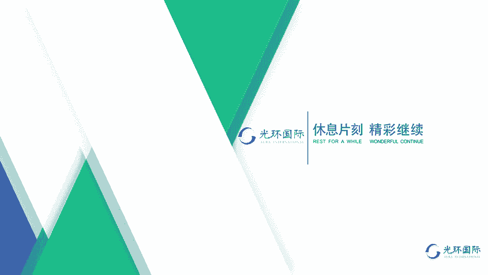
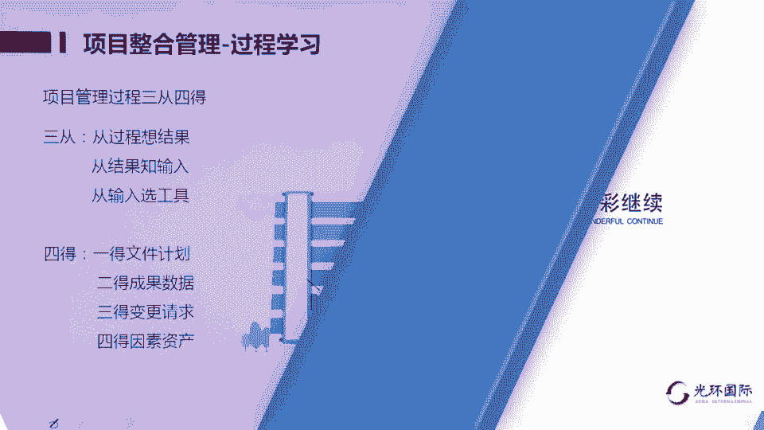

# 01 PMP第六版培训视频教程 01 第4章项目整合管理 1 - P1 - meiwanlanjun - BV1L3411U7jb

学员们好，欢迎大家收看p mp考前培训课程，这一节我们将讲解项目管理十个知识领域的，第一个叫做项目整合管理，这一节呢主要讲解整合管理的一些基本概念，首先我们要了解的基本概念是什么，叫做整合。

片子中的大段文字是书里的文字，我不想把它一一读出来，我想用一个例子说明什么叫整合，对于搞信息技术的学员来说，整合这个词就是集成的概念，整合呢是指的融合，不是简单的叠加，1+1=2，整合也有它很多的难度。

你比如说我们兜里可能有各种各样的卡片，有银行卡，煤气卡，水表卡，还有医保卡，还有这个呃什么这个公交卡等等这些卡片，那么这些卡片都独立的在我们的身上装着，出现在我们生活里，如果我们想做一个事儿。

在一个地区解决一个问题，那么多个部门的这种制约，就会让我们做事的效率很低，会做起来很不方便，甚至就是交通卡各个不同地区的都不一样，你比如说你拿着北京的公交和地铁的这个卡，你就坐不了上海的地铁。

坐不了天津的地铁，天津离我们就30分钟高铁，但是我们都坐不了这个地铁，是因为他们互相之间没有整合，如果把多个卡片变成我们兜里的一个卡片，或者一张身份证，把这些都解决掉，能做到吗，这个就叫整合啊。

那么从技术角度上来说，整合还是相对来说比较好实现的，整合的难点在于，背后它所涉及到的不同的职能和不同的职能的，不同的管理规定，以及不同职能背后的利益的纠葛，纠缠他们的管理方式不一样。

那么这个例子说明了什么叫整合，但是对于我们学习项目管理，我们这个角色的人来讲，我们可能不讨论那么远那么高的事，我们只是整合，有利于我们把项目做成的那些因素整合什么呢，整合相关的资源，整合他们背后的职能。

整合十个知识领域，不要把它们分散的一个一个叠加，而是把它变成一个融合的一体的东西，来指导我们项目管理这件事情，才能把它做成整合是非常非常重要的，它是项目成功的关键，如果一个项目。

不能够在一个人的统合之下去进行，都要单独分别对应着不同的知识领域，对应着不同的职能，他做起来困难就相当大，这个角色，项目经理pm这个角色是因为整合而存在的，如果没有整合，可以不用项目经理。

也就是我们也不用再去考这个p m p p mp，这个专业人士就是做项目经理，这个职业经理人的，做项目管理这个职业的经理人的，那么这个职业经理人他做的重要的工作就是整，合，说起来好难呀，好高大上啊。

那整合其实就有一个办法，他唯一用的方法整合的唯一方法叫做沟通，协调，当然了，请大家不要把沟通认为就是说话对话，你跟我说话，我跟你说话叫沟通，听说读写，传递信息，把信息能够有效地传递出去，都叫做沟通。

所以这个角色他重要的工作是沟通协调，大概要花大于90%以上的经历用于沟通，协调，用于整合上，不管这个项目团队有多大，项目经理把自己的一些管理权授权给多少人，整合就是项目经理的职责，你就是授权给了别人。

让别人管理整合也是项目经理的职责，如果这个项目没做好，因为整合的问题，那都要由项目经理来担待，就是项目管理者来担待整合，所以整合是项目经理的一个非常重要的工作，下面我们再看，在整合环境中。

我们还要讨论关于用敏捷方法怎么去整合，敏捷和迭代方法去整合的，有人员这个层面的，还有技术这个层面的敏捷，这个方法中，迭代和敏捷中一定要让更多的团队成员，所有的团队成员和专家参与到整合来。

不是一个项目经理自己在那单打独斗，自己在那做文章，每一个成员都一起来跟你决定怎么整合，整合哪些组件，由团队成员一起来进行规划，敏捷和迭代方法中，团队成员的关系更趋向于或者更像合作伙伴，就是合作伙伴关系。

你这个项目经理人他不是凌驾于别人之上的，下边都是下属，不是大家都是平级的，平等的，共同来进行计划的决定和整合，甚至那个执行团队的人员也参与管理，也在管理中进行整合，所以在适应型项目的这种氛围中。

项目经理更加关注的是一个合作型的决策氛围，而不是区分开管理团队，执行团队，那么团队成员呢，都应该参与到这个整合的工作中来，下面我们再看一下整合的发展趋势，整合的发展趋势就是越来越在项目管理中。

使用自动化的项目管理信息系统，减少手动化的工具，这样让项目管理更加有效率，更加可以摆脱人为因素，可以让我们获得更好的项目管理的结果，另外呢大量的采用可视化的管理工具，比如说看板，比如说展示图。

一个什么作战图，一个图形用看板表示出来，而不是拿本本册册，写出了很厚很多的东西来藏在抽屉里，而是用大家都能看得见的，在工作场合展示出来的图表来进行管理，另外呢应该广泛的应用项目的知识管理，在员工中。

共享经验教训，还有整合管理的发展趋势是不断增加，加大了加重了项目经理在整合方面的职责，也就是项目经理你要对整合负责，另外我们可以用一些混合的方法进行项目整合，这是整合的发展趋势。

考虑到方方面面的情况和项目不同的规模，不同组织项目管理的文化分为事业环境因素，所以所有的整合的因素并不是说我什么都要，什么都有，可能需要经过剪裁，有个剪裁的概念，标准都是在适用我们的情况之下来进行剪裁。

标准可能内容很多，但是我们可以剪裁一些管理的知识经验教训，治理的方法和效益和开发的方法等等，把他们我们需要的结合我的实际进行剪裁管理，这是一种最新的一种想法，不光是整合知识领域，项目管理的十大领域。

对于这一版学习的49个过程，132个工具都需要进行剪裁，都需要进行整合和剪裁，并不是说每个项目我可能都履行这么多步骤，把所有的工具都用完，而是结合实际该用什么，用什么做适当的剪裁，有这么一个概念啊。

对这项目整合管理过程。

我们就要进入过程的学习了，但在进入过程学习之前，想给大家提供一个学习方法，这个学习方法也只是一个引导而已，如果不适应你，你可以用你所总结出来的方法来学习，项目管理过程，我们在学习的时候。

都是教材里都是从输入一个内容，经过工具处理，到了输出，是这样一个步骤，但是我们在学这个过程的时候，如果这样学的话，就会觉得很没有逻辑，很不清晰，既然项目是一个目标管理。

那我们就会总结一些目标管理的学习方法，也就是每一个过程我们锁定输出，建出支入，从输出来推导输入，这样的学习呢让我们可以提高效率，所以我总结了项目管理学习的所谓三从四德。

当然这个不是我们中国传统文化的三从四德了，第一从我们先从这个过程的名称，先去想这个结果，因为项目是目标管理，我先锁定我的目标是什么，根据我要得到的这个结果，我想要得到的这个结果。

来选择这个管理过程的输入，我想要得到这个，我需要什么作为输入才能得到呢，然后我再选用那132个，甚至更多的管理工具中的哪些工具来处理输入，达到结果呢，这是三重的概念，通过项目管理的多个过程，输入输出。

输入输出，不断的去重复，得到了大量的文档和成果，那我们把项目管理得到的东西也总结一下，在这些过程和步骤中，第一个得到了文档，这是两个概念，文件计划，它们统称为文档，有些被称为计划，有些被称为文件。

文件和计划统称为文档，第二个我们得到了可交付成果，这个实物和各种各样的数据，这也是两个得到的东西，如果我们把它合并，就是第二个得到第三个，我们通过项目管理对比计划。

就执行计划过程中发现的变更提出了变更请求，如果我们这个变更请求是用文字表示的，他也可能表现出是个文档的方式，第四个，我们得到了事业环境因素和组织过程，资产的更新，通过管理项目做项目。

我们不仅得到了这个项目想要的产出和成果，我们还得到了各种各样的，在这个过程中积累的数据和经验教训，它是甚至是比这个项目产出还要重要的，公司资产它是很值钱的，有些是有形的，有些是无形的。

同时呢也通过项目来反过来对我们公司的，我们企业的组织过程，资产所带来的那种环境氛围，那种事业环境因素进行更新，进行更改，那么有这种思路呢，我们就知道，其实项目管理过程看起来多49个，但是在我们脑子里。

始终围绕着就这样一些东西啊，通过三个从分析每个过程，通过得到的文档和成果，我们梳理出了项目管理的重量级的项目管理啊，每一个步骤得到什么东西，尽管项目管理现在已经进入到可以用敏捷方法。

轻量级来处理来管理了，但是希望同学们不要把传统跟所谓的现代，割裂开，因为没有原始的项目管理，就没有现代的所谓现代的项目管理，那么传统也并不预意识着或者意味着落后，愚昧不适用，在不同的情况之下。

可能就需要使用精细化的项目管理方法，在不同的行业或者不同的项目中，可能我们又需要采用敏捷的方法，敏捷方法并不仅仅仅限于用于it或者信息产业，在传统项目中，在生产制造业这样的行业中。

也同样可以用敏捷方法进行良好管理，获得良好效果，但是至于我们采用重量级的项目管理方法，还是轻量级的项目管理方法呢，匹配最好，适应最好，而不是永远的轻量级就比重量级好，重量级就比轻量级精细。

我们需要识别剪裁，用匹配适应的方法来决定，选择用什么方法进行项目管理，那么整合管理这个过程，整合管理这个知识领域一共有七个过程，这个七个过程分别属于五个管理过程组，启动管理过程组对应着是这个知识领域。

有一个过程，规划管理过程组有一个过程，执行管理过程组有两个过程，监控管理过程组有两个过程，那么执行和监控确实是在项目管理中，很重要的两个环节，最后一个结束项目或阶段，它属于收尾过程组。

那么按照我们三从四德的那种学习方法，我们看一下这些过程都什么目的呢，一第一个过程制定项目章程，顾名思义，我们用我们的生活工作经验，知道这个过程得到了一份文档，这个文档叫做项目管理文件。

它的名字是项目章程，用于立项，他的批准预示着对项目经理的授权已经完成，授权完成了项目活动就可以启动了，授权，这个项目经理在项目管理活动中，可以动用组织的资源，不过他不是亲自去扒拉组织的资源。

他要通过职能经理和公司中的高层经理，那些运营经理来获得资源，当然大家都已经知道他是主管这个项目的，它有使用这个资源的权限，第二个过程，制定项目管理计划，顾名思义，这个过程得到一份项目管理计划。

是一个整合的计划，那么在第六版的p m b k里，这个整合的计划是12+6，我们前面我们在其他的章节，也学习过这样的内容，12个项目管理子计划，四个基准，还有两份重要的文档。

一个是关于生命周期的开发的生命周期的描述，一个是对开发周期的确定，都在这个六之中，第四第三个过程指导与管理项目工作，这个过程属于执行过程组在进行的，叫做执行，这个过程的目的是执行项目管理计划。

我们刚才在4。2这个过程得到的计划，要在4。3过程得到执行，同时还应该执行那个被批准的变更，因为被批准了的变更，就相当于更新了以后的项目管理计划，他也是要被得到执行的，其目的是为了实现项目的目标。

第四个过程管理项目知识，它属于执行过程组，在这个过程中重点的工作就是知识管理，进行项目的知识管理，它最核心的做法或者作用，是利用公司或者我们员工自己现有的知识，经过交流分享讨论，共享生成新的知识。

这样一个过程，现有知识不断生成，分裂出新的知识来管理项目，帮助我们的公司组织成为一个学习型的组织，帮助我们的组织拥有非常强的知识，知识产权，专利可以帮助我们走得更远，那是一个软性的本领。

第五个过程监控项目工作，对项目的工作进行跟踪跟踪，监督审查，进行偏差分析计算，看看对项目整体的进展和整体的绩效，有什么样的情况，通过监控及时发现偏离迹象，目标的那些因素及时得到纠正。

第六个过程是实施整体变更控制，在这个过程专门处理，第五个过程进行监督过程中发现的项目偏差，那么这些偏差要通过变更的机制来决定，到底是变更还是终止，不变更了，我们变更的那些内容到底能不能够获得批准。

通过一个变更机制把它完成，第七个过程叫做结束项目或阶段，这个过程就是完成单个的一个项目，单独的单个项目和单独项目的一个阶段，和相应的合同，单独的合同把它关闭掉的这样的一个过程。

这几个过程把它统一列在一起，看看它的作用，我们在前面其实已经用我们的语言解释了，梳理的语言，已经解释了每一个过程的作用，希望每一个参加考试的学员，都应该能用自己的语言来解释，每一个过程的目的作用。

当你知道每一个过程是解决什么问题的，准备达到什么目的的，那么这个过程的学习你就掌握了，不需要死记硬背的去背这些过程，输入输出和工具，但是你通过这个过程的目的，就能够掌握这个过程所要进行的工作。

和他所使用的管理工具，这一节我们就学习到这里。