# 01NPDP清风-文化、团队与领导力 - P1 - 希赛产品经理 - BV1t14y1M7cu

大家晚上好，欢迎来到线下版专业的在线教育平台，我是罗福兴，那很高兴能够有这样一个机会，跟大家一起共同分享呃，关于产品经理课程中的第六章，文化团队与领导力，那今天晚上这些内容呢。

可能有一些学过偏僻的同学会觉得诶很熟悉，因为有很多东西都是相重复的，也有一少量的东西是做了一个新的补充，有一些些不一样啊，我们的安排会是这样的，今天晚上会把这一章讲完，然后明天晚上呢会去讲的是精益创业。

所以明天晚上，如果大家对于精英创业这个话题会非常有兴趣，包括说自己想要做老板啊，自己想要去创业啊，自己想要去做一些事情的话呢，那明天晚上的课程一定要来听，会比较有意思，我们到时候也可以去多交流和探讨啊。

可以探讨那整个第六章关于产品的这些文化。

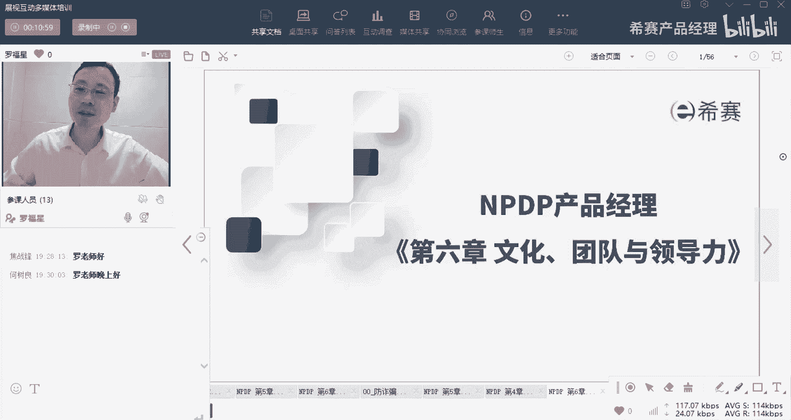

团队与领导力，他一共是考试占到了10%，有20分呃，这个内容主要是跟人相关，就不管说是哪一些战略也好呀，组合管理也好呀，流程也好呀，各种开发的工具也好呀，调研的这些个方式方法也好，都需要人去完成。

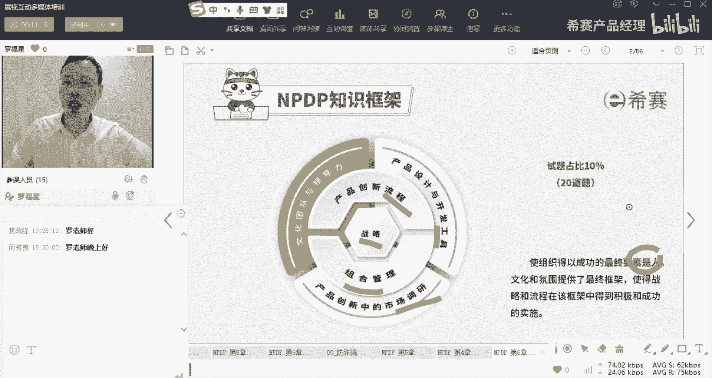

都叫人去完成，那其中我们在前面讲到一个是关于文化和氛围。

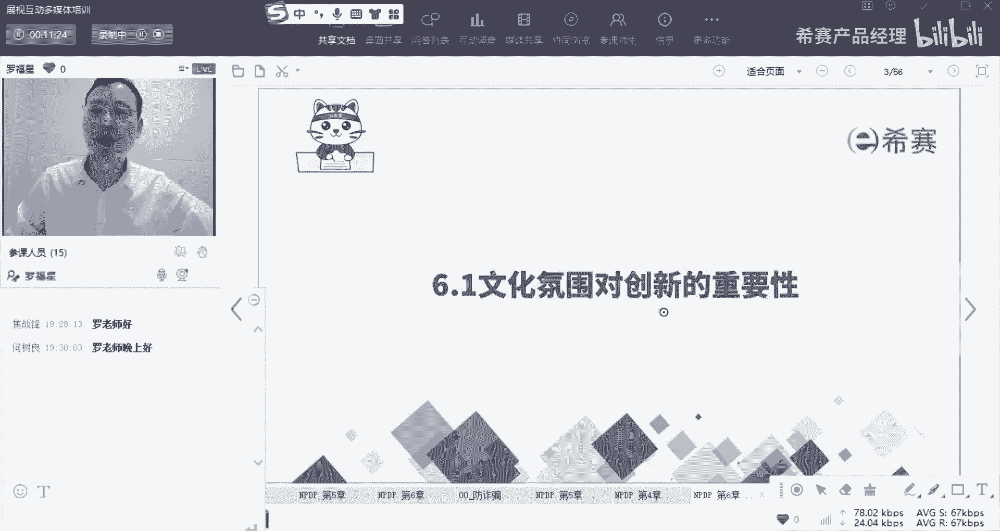

以及文化和氛围，好的文化氛围是什么样的，然后讲到的是关于新产品开发中管理者的角色，它包括说是作为一个战略的制定者，包作为流程的这个用户人呢，流程的主管呢，流程的这些创建和推动者。

包括所组织的这样一个组织和文化，里面有倡导者，发起人和引导者，就是要能够去推进文化，还有一个就是产品线的制定者啊，产品产品线的架构师啊，组合管理的，还有方向制定，这个方向制定。

它其实就跟这个战略优势相重复了啊。

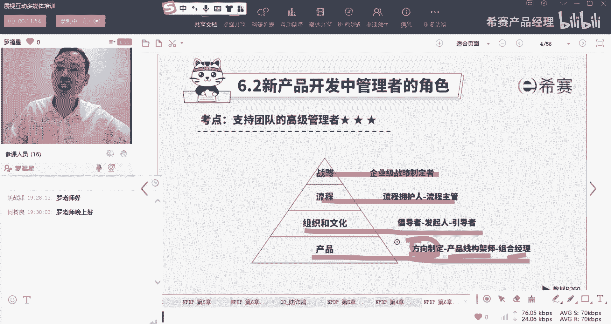

然后再讲到第三个板块呢，就是关于，而团队的组成，就是由一群可能有能力互补的人来共同形成，并且他们是有一个共同的目标，要完成一个共同的一个大目标，然后在重点讲的是关于团队类型，那团队类型有哪几种。

还记得吗，有累计种团队类型还有印象吗，掐我一下，要不呃，有一个是职能型的团队，有一个是自制型或叫自主型的团队，然后还有一个是轻量级的团队，一个叫重量级的团队对吧，有这样这样四种。

它其实类比到偏僻重的话呢，就是呃这种职能型和项目型，然后是弱矩阵和强矩阵，其实是这样来去类比的啊，对谢谢罗小琴，是的，就是轻量级和重量级，然后呢，接下来我们就讲到关于团队的发展和管理。

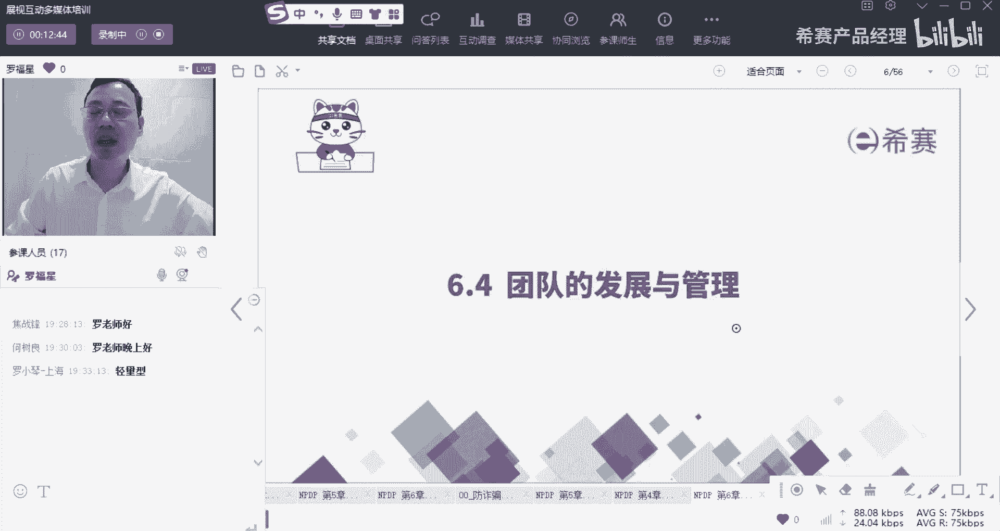

那团队发展和管理呢，这个章节它其实其实会讲到一个很重要的点。

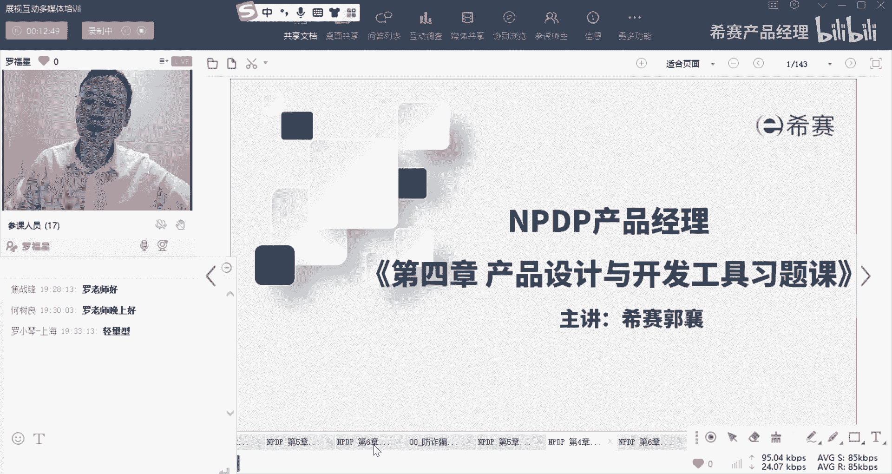

是识人和用人，就十人的时候可能会用到很多的工具，然后用人的时候可能会用到很，也用了同样的很多工具，用到不同的一些工具，其中就包括一些现实的时候，用了一个叫diss工作风格。

然后后面还有一个叫生命周期模型的z模型，然后到用人的话呢，可能会有一些呃通过培训的方式让他能做，然后通过激励的方式让他愿意做，以及做的起劲对吧，同时呢作为一个领导者，还需要有领导力。

同时人在一起的话可能会难免有冲突，我们说有人的地方就有江湖，就有是非就有冲突。

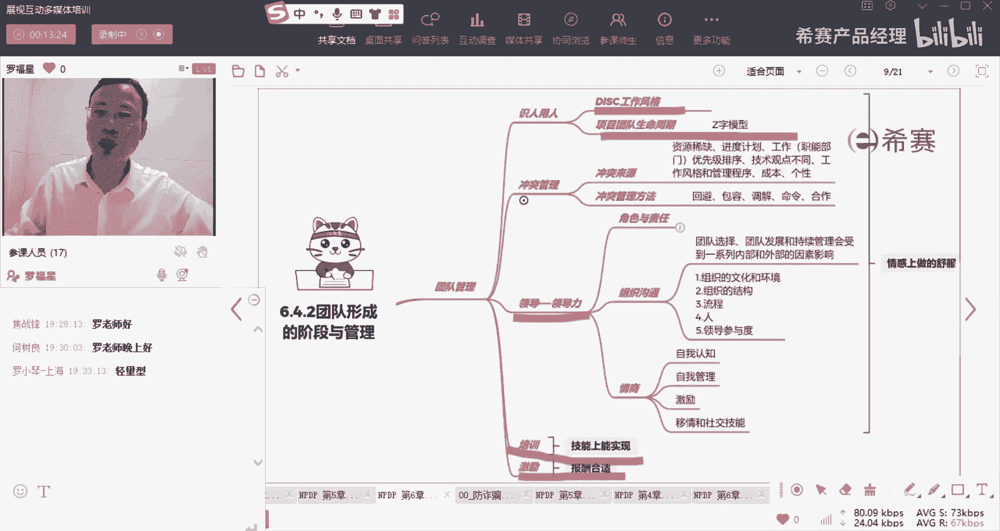

所以呢在这里还会讲到一个叫冲突管理，那我们就来一起来过一下，再上一次已经是讲过了，关于时政，用人中讲了一个叫disco的工作风格，然后接下来就是继续来往下面讲啊，讲到什么团队生命周期啊，要是冲突管理啊。

谈判啊。

情商啊，以及领导力培训和激励，我们先来简单回顾一下，我们在下一次已经讲过，说第四个工作风格就是人的个性，他其实很难做大的调整和改变，就一个人不太可能说短时间内就转了一个性子，除非说有一个很大的冲击。

冲击我的头脑呀，冲击我心灵呢，才有可能会做大的改变呃，但是呢我们的工作风格，工作的方式确实是会有可能有改变的，就是这种行为习惯的上面，是可能会有一些改变的，那么这样一个地质工作风格。

就是我们通过一些测试的方式来了解某一些人，他是会比较快速迅捷的方式去做事情，还是比较慢悠悠的方式来做事情，他是会更关注事情，还是会更关注人，从这两个维度把人分成四个区间，一个区间叫支配型，那支配型呢。

它其实也就是属于我们的这个叫指挥者，指挥者这个角色，我要你干嘛干嘛干嘛干嘛对吧，一件事情一件事情你这样去干，然后第二个角色叫影响者，那影响者呢他其实也是社交者，社交者就是会能够去穿插到人和人之间来。

一起共同去完成一些事情，就引领大家，影响大家一起去共同完成这一个社交者，然后还有一个呢是稳健型，那稳健型其实就是一个支持的角色，就支持就默默的去支持大家的这样一个角色，还有一个就是谨慎行，谨慎型的话呢。

其实就是一个思考者，还是做事情做得相当慢一点，但是他会他会去认真的去思考这些事情，并且去给一些解决方案，他是对事情慢慢悠悠的，他相当于是一个系功，慢工出细活的这样一个感觉在里面。

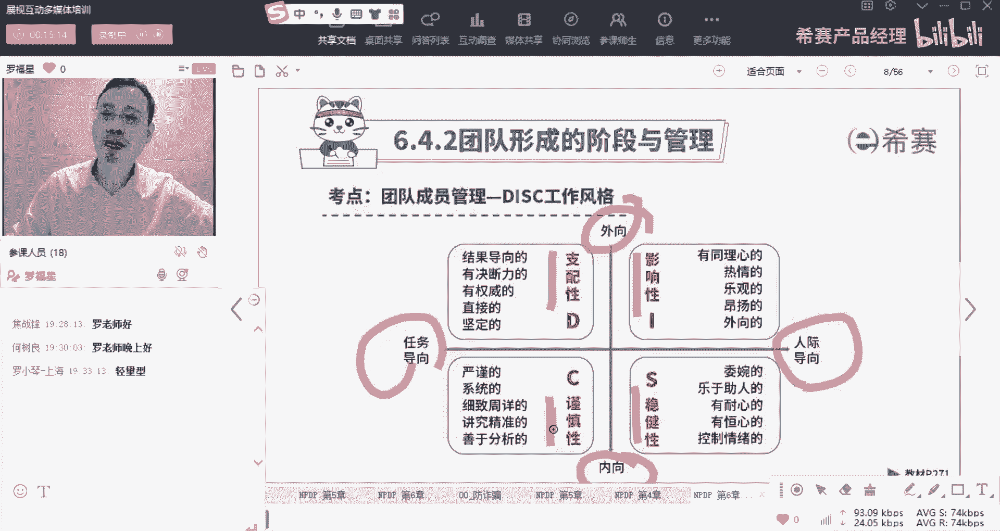

好我们了解这些信息以后，我们来看一道题目，看这个选什么，因为刚好上一次课，还这个题目还没做的，这样可以来回顾一下，看那个diss是不是有点点感觉，好在在线的同学其实都可以选一下，如果说你用手机在看的话。

那你就可以写1234，来代表a b c d都是可以的啊，那我看到已经是有六位小伙伴给了答案啊，你们给答案呢事实上也是这个题目的真实答案，我们来一起解读一下好不好，你看你在负责一个项目。

然后呢会有一个跨职能团队，团队里面有很多角色，其中你观察到小羊，你观察到小羊是什么样的，非常的健谈，能聊对吧，很容易和你建立社会关系，会搞关系，面向人，会聊天，面向人，然而这就是在面向人。

并且呢他是很快很容易就可以搞定，所以他是属于那种快节奏的，所以是面向人快节奏应该就是属于这个区间，我们说d i s c它就属于i属于影响这个区间，ok他这边给了一个词叫只说不做。

并你不要去局限到说他用指数不做，就表示这个人真的是指数不做啊，只是说影响型或者社交者，通常它具备这种特质，他这种特质就是说的比较多，做的没那么多，是具备这种特质，但其实每一种都可以讲出一些。

不那么好听的特质出来。

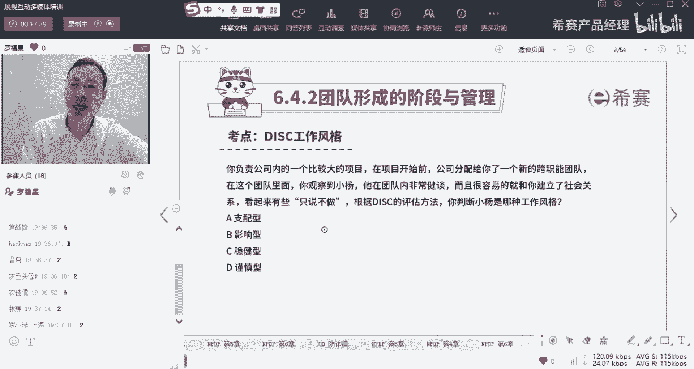

比方说你可以说这个影响者他是只说不做，光说不练对吧，这种很热闹，嘴巴上面很热闹，你可以说他是这样的，你可以说他像是一个什么啊，就是一个控制者，哎呀所有的事情都是要在掌控之内，并要求是火急火燎的对吧。

没有人情味嗯那种形式，你可以说这个人是什么，就是一个没有什么主心骨的这个人，然后就是很呃偏软弱啊，或者说什么什么之类的呀，你可以去直接这样讲，它还有这个呢，就是我们会说它有点像偏。

类似于嗯一点冷血这种方式，这是个类型，另外的叫法没有没有记清楚是吧啊，ok再说一下啊，就这个第一个支配型，它是面向面向事情快速去解决事情，那么这种面向事情并快速去解决事情的人叫呃，指挥者指挥指挥你呢。

你你你去看这个，你去看那个，你去看那个，你去看那个指挥k指挥者，或者谁帮我敲出来也可以啊，就第一个他就是一个指挥者，快速去指挥，便是控制者的这种类型，就偏控制，偏指挥，直接是面对结果指挥的这种方式。

然后第二个角色呢叫影响型，影响型它是会关注人，并且会非常敏捷快速去关注人，所以呢他也叫社交者，就是社会交往，就是像一个一个一个一个什么交际花一样的，交际花，花蝴蝶社交社交者，他是一个社交者。

就快速的跟别人搞关系，这是很很强的，说一说起来也是头头是道的，这是社交者，hi美女，帮我叫一下社交者，然后还有第三个呢，这种人，就是他会默默的去给大家提供一些支持和帮助，但他那种速度啊，效率啊。

各方面其实是稍微缓慢一点，还是慢慢的默默的，但是呢他会去关注你的情绪啊，关心你的一些东西啊，去帮你来去完成一些东西，那这个群体呢我们也给一个词叫支持支持者呃，我举个例子。

就是说有点有一点点像那些说什么便利贴女孩，就是可能不算是那种反应特别迅捷，特别快速，但他会很友好的去给你提供支持，所以这个区间是支持者，还有最后一个区间，最后一个区间。

它就是会仔仔细细的来去思考这些问题，它很细致，慢慢的去探究这些东西的规律，然后他不会那么去表达他，但他会关心这个事情，在心里面去盘算，盘算了一遍又一遍一遍又一遍，所以呢也叫思考者，这个谨慎型也叫思考者。

对啊，谢谢hackman，谢谢何数量啊，他要思考者，你们也可帮我唱一下，这个是支持者，这个是思考者啊，这是他们的一个差别，那我们刚刚说到说，如果说要非得要给他加一些不好的，一些名词的话。

像这个角色可能是光说不练就说的比较多对吧，这个呢就是控制型，就是你掌控控制控制欲望很强烈，这个要求那必须我我我这样子来去进行，那这个觉得可能就是有点慢慢坨坨，就是那种很很慢条斯理的。

慢妥妥的这样一个一个一个一个角色，但是他会去给大家提供支持，而这个呢就有点像冷血一样的，就是像很冷血动物一样的，他也不说话，他也不不他也不他他也不回应，他在自己的沉浸在自己的世界里面。

沉醉在自己的世界里面，自己在慢慢的默默的思考，而是你的每一种他都有一些好的词汇，也有一些不好的词汇来去表达，就同样的就像你的星座，因为每一种不同的星座，每一种不同的血型，它有一些很好的词汇来表达。

同时有一些不好的这样一些词汇来去表达。

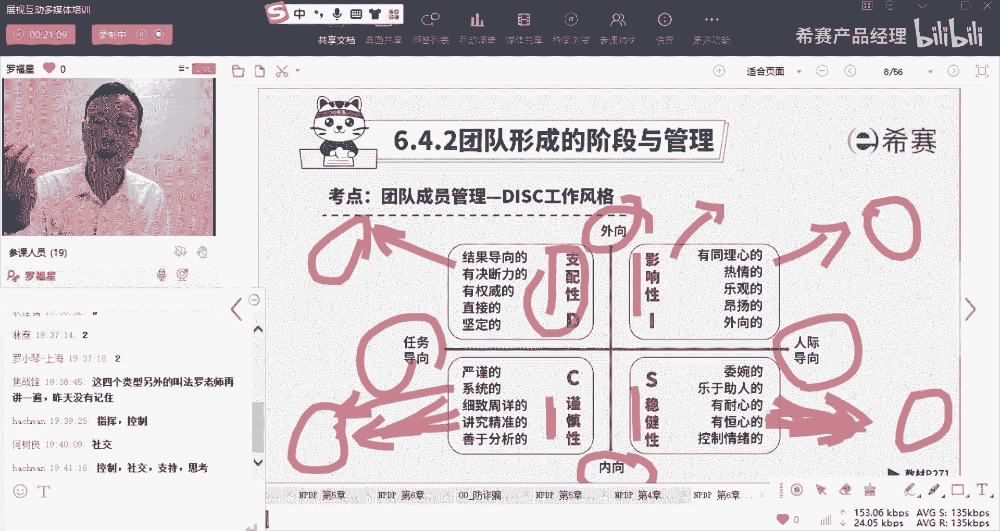

是一样的啊，所以这道题目中对，谢谢hackman啊，然后所以这道题目中他说的是只说不做，就是说的比较多，但是做的比较少，更关注的是人，而关注视这一块关注的比较少。

所以它就属于第二个区间i这个区间叫影响者，你们在考试的时候呢，它会是中英文双语，所以到时候你还可以看到这个单词，它那个就是单词的开头啊，也是可以看到的，好，就是这样一个关于工作风格。

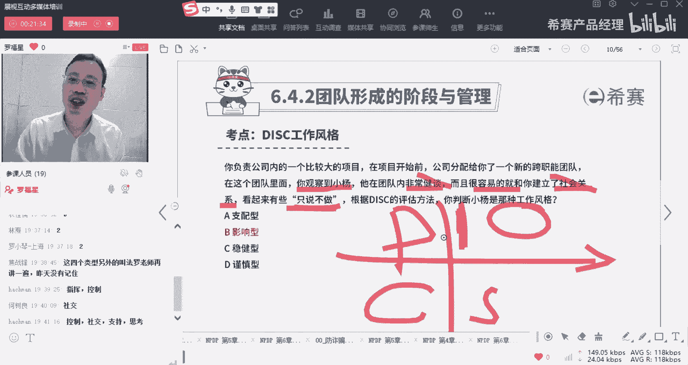

那接下来我们再来看看另外一个内容叫z模型，这个呢z模型坦白说我觉得他其实有点扯淡，其实完全犯不着，非得要叫一个什么什么模型出来，它只是为了方便去记忆啊什么之类的，就叫了这一个模型。

其实就是四种不同的角色吧，他的意思是什么呢，就如果说我们要去做一个新产品开发，那总有一些人想出一些想法和创意，我们前面在第四章，第五章学了很多新产品创意的来源，对不对，我们在在应该是在第五章的时候对吧。

在第五章的时候，学了很多这样一些新产品创意来源，那那些新产品创意应该是第四章啊，我们在第四章学了很多新产品创意来源，那么那些创意来源的那个，那个时候有一些人非常的擅长，他特别擅长于冒出一些新的点子出来。

特别擅长这个东西，那么另一个角色呢他给了一个词叫创造者，创造者或者是创新者，所以叫创作者这个角色，他会关注的是他在新新想法产生的阶段，诞生的这个阶段，他总是能够有一些新的点子，有一些奇思妙想的东西出来。

然后觉得说诶我们做这个事情，我们可以这样做呀，我们可以这样做呀，什么类似的这样一个角色叫创作者创作的，他是会关注，我们还可以这样做，我们还可以做，关注的是各种可能性，然后呢第二个角色呢。

他是说我们你不能只是说有人在提啊，有人提议以后，我们还需要有人把他推役吧，对不对，就是需要去去落实啊，因为你这种想法是什么，你这种想法只是idea，你这种想法只是idea，只是一个创意，只是一个想法。

但是你要从想法，创意要变大，具体去落实，中间要干什么呀，我们说要先把这些idea变成什么concept，变成概念，变成一个新产品的创意概念变成一个概念，也就是产品概念，那产品概念生成需要有谁来做呢。

这里有一个词，就是这样一个呃这样一个角色叫推进者，这个推进者呢他就负责去关注互动，把这个创意往前推一步来，去让大家关心和关注这个事情，所以他专注的是互动，并且向利益相关者来去传达相关的重要性。

来去向其他人去交流这样一个东西的必要性，其实也就是说把这个创意去推进了一步，变成一些概念，并且可能会用这种概念，测试的方式来去做这样一些事情，所以是变量的概念啊，这是一个推进者，然后第三步呢叫经验分析。

专注分析，它可能词呢叫分析者，ok这个阶段中那些概念已经生成了以后，到底做还是不做呢，我们可能做也可能不做，我们会去综合考虑，在生活中就叫可行性研究分析对吧，可研分析，而货车是叫立项分析。

那最近可言分析力量分析，其实就是论证这个东西值得不值得做，还是不值得做，所以这里给了一个词叫念游诗人，这个理由是他说喜欢去分析，去工作，协调各方面的东西，结果就是得到一个详细的设计和开发计划。

其实也就是说敲定下来值得做，并且做了计划，所以他是这样一个精炼炼油师，去把这东西定下来，并且做规划，做计划，然后后面第四个角色呢是执行者，那执行者就说具体去落实，把你的这些计划去落实，来产生具体的结果。

所以他会更关注的是细节，关注的是交付，而他们这几个角色呢，其实坦白说在生活中，可能同一个人会承担这四个不同的角色，这也是有可能的，或者说某一个人会承担多个角色，这都是会非常有可能的。

他因为只是在讲到说从没有创意到产生创意，从创意到区变成一个概念，概念到论证可能性，并做计划，计划到去落实去执行，讲的是这些东西，所以呢它其实其实这个z模型，我觉得它其实就是说我们这个产品的创意。

概念的过程中，可能会有几个不同的角色来去做这个事情，但是这个角色他不一定真的是说非得要是张三，李四王五赵六四个人来完成，你也可以是某一个人来去完成几个角色，或者某两个人来去完成，都是可以的啊。

就我们不要太过于去拘泥。

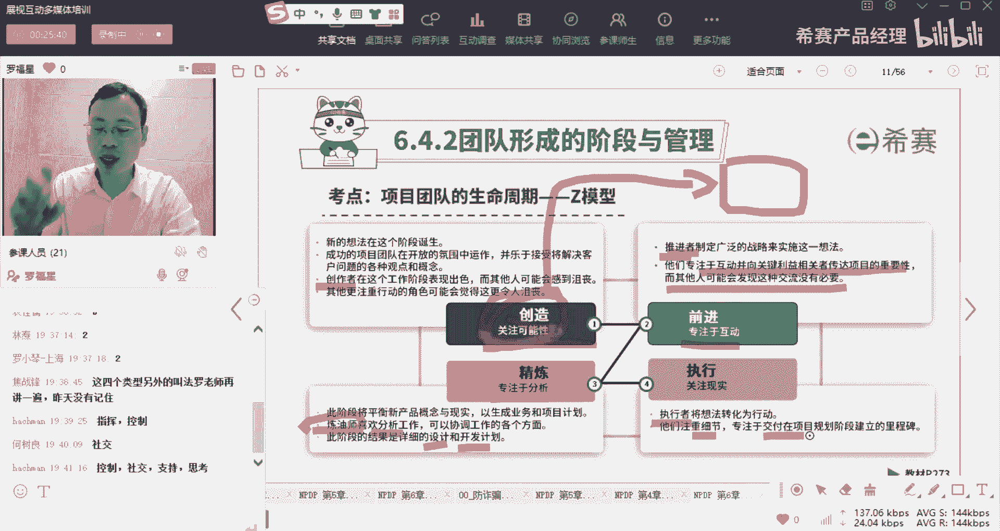

你知道它其实本质上都是可以的，另外其实还有一个点，就是说在不同的阶段的时候。

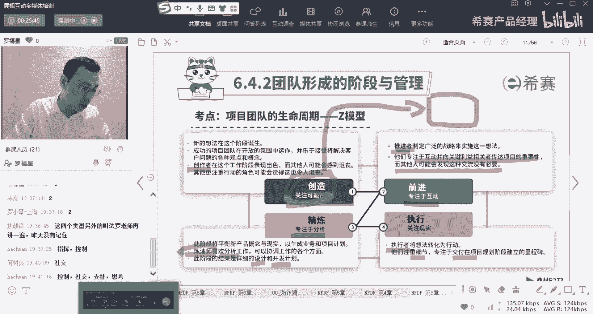

可能不同的人才的重要性是不一样的，那并且呢大家各自相互可能有点看不上眼，像这种创造者本身，他可能就更喜欢这种奇思妙想，他会觉得有创意是更好的事情，然后这些他就会觉得你老师提了一些创意，你又不去推进它。

你又不去落实它有什么用对吧，那这个推进者呢，那他就说我这种推进，其实是能够去助推这个事情，如果我不去助推这个事情，他就永远都停留在一个想法的阶段，没有去执行，那你你这个想法和概念你到底要怎么落实呢。

我都要做计划呀，要得有人专门去做计划，你才能去落实，你计划再好，不去做也是个毛，也是个毛线，所以还是需要去执行着来去落实啊。

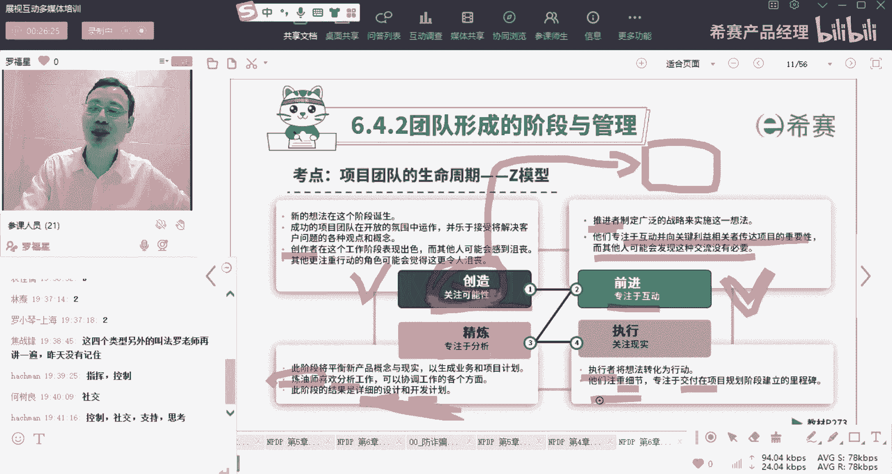

所以是不同的人，他会有一些不同的想法在里面啊，这个这个点来加强一下哈，好，我看到有六位小伙伴已经是，七位小伙伴已经是回答了问题啊，呃你们都选c，答案呢确实也是c在项目的生命周期中，随着项目的不断完善。

就会进入到对于新产品，概念和现实进行权衡的这样一个阶段，他此时要制定经营计划和项目的计划，那谁来修复的做计划呢，你就想一想这个z模型中开创者或是创造者，他是负责去想idea。

然后推进者他是会把这些idea变成概念，产品概念，然后这个规划者呢他就是把这个概念来去论证，论证完了以后，并且去做出后续的这些计划，而执行者是把这个计划去落实去执行，它是这样的一个z模型。

所以呢答案就是规划者或者说是计划者，是这样的一个一个一个情况啊，那不管说是前面第四个模型也好，还是这个z模型也好，它你会发现，其实那他会是对这些人做了一些区分和分类。

但是我们其实同一个人可以适用多种东西。

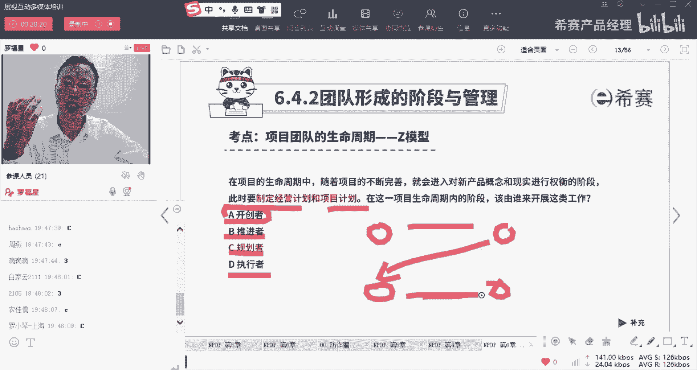

就像包括前面的这一个diss模型，你同一个人。

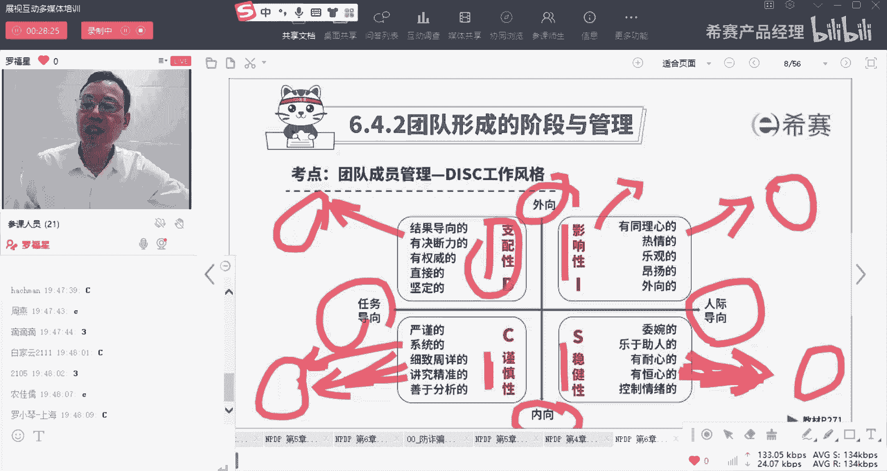

他是可以拥有两种不同的这样一个工作风格，像我自己的话呢，我可能就是倾向于这个和这个为主，那可能有意识，他甚至可能完全对立的两种方式也是有的，有可能说是他是这两种，又或它是这两种，也不排除各种情形都会有。

就不要是唯一。

那包括同样的这里这样一个z模型中，这几种不同的这样一些角色，其实有可能一个人身上都具备。

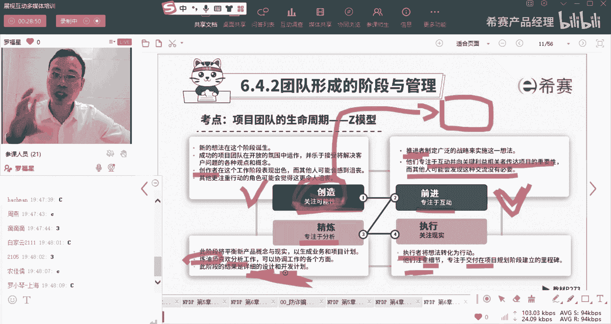

具备多种不同的情形，这都是有可能的啊，嗯尤其是建立多说一点，其实很多那种公司的老板呢都很聪明，都很厉害，他可能同时就可以兼具很多不同的角色，他才能够把这个事情完全推起来。

因为刚开始的时候其实也没有什么人，也都是靠自己来去推好。

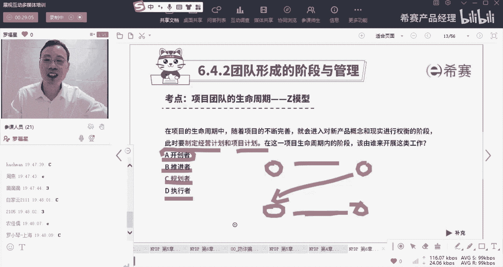

接下来呢我们来讲到，就是说我们在前面已经讲过，一个叫塔克曼阶梯理论，对不对，我们已经讲过了塔克曼阶梯理论，我们说知道团队呢它的形成过程中，那么有震荡有鸡蛋，这个呢其实也就是说团队有冲突。

有人的地方就有江湖，就有是非就有冲突，那么对于冲突的话，我们不要去知道整个在不管是产品管理，项目管理，在生活中工作中，我们说那种建设性的冲突，其实是推荐的，是允许的，也就是说这个冲突它能够推进。

把这个事情往更好的方向去走，那么这种冲突是ok的，那破坏性的冲突是不ok的，而在生活中，在工作中一般什么情况下会导致有冲突呢，很多时候是信息的不对称，导致冲突或者意见不一致导致冲突。

比方说在这里列的这几个像在资源方面的分配，我们有不同的意见，在进度计划方面有不同的意见，在工作的优先排序方面，我们有不同的意见，在技术观点方面有不同的意见，在工作风格和管理程序方面。

有不同的一些一些一些意见，一些不同的方式，不同的方法，然而在成本管理方面有不同的意见，在个性方面，个性方面有一些不同，有些差异，总之就是有不一样，会导致有冲突，那有冲突它不一定是坏事情。

但是有冲突我们一定要去解决，作为一个管理者，不管是产品管理。

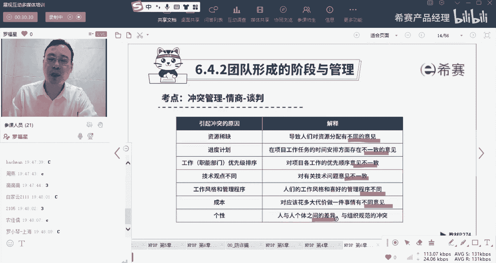

项目管理，你作为一个管理者，你肯定是要去懂得一些冲突处理的一些方式，那该怎么样去处理呢，这里有一个工具来跟大家分享一下，这个偏僻的学员是听过的，我在但是我还在这要讲一下。

因为我们这个课程也有一半以上的同学，是不是偏僻的学员，还是给大家讲一下呃，就曾经有一次我们公司，因为我们公司大家知道，就是西塞是专门做培训的，我们其实是专门在做这种考证类的培训。

就像像你们目前学的这样一个np tp课程，pmp的课程呢，然后还有cp的课程嗯，然后还有那个什么prince的课程呢，这都是建一些国外的这些项目经理，产品经理这一套对吧，然后除此以外。

还有国内的像软考的什么信息系统，项目管理师啊，集成工程师啊，然后架构师啊，呃那个什么啊，网工啊，晚归呀，然后还有建造师，一级一级建造师，二级建造师，消防工程师，然后还会有通信工程师。

还会有什么教师资格证，护士资格证等等，有很多，那你知道有一些科目它是会比较火，比较红火，有一些科目它可能就没有那么火，那那销售你想你，你如果你是一个销售人员，你肯定是更想要去做那种很火的那种。

那种项目对吧，但是不管怎么分，一定会有人分一些不太火的这些项目，那其中有一个有一个销售主管，他分的是一个不太，就是目前不是很红的这个一个一个一个项目，然后就客户不是很多。

但是呢有一天他就要求他的所有语言，那个就是团队的成员那一天都群发信息，销售想要去群发信息，跟客户之间有多一致的这样一些链接，结果呢其中有一个销售他就没有去群发信息，他一直在跟你一个一个潜在的客户去私聊。

那结果但大概是做完这些工作以后呢，去汇报的时候，发现诶这个人他就没有去群发信息，他一直在私聊一个事情，当时那个销售主管就很生气，然后他就他就说这个人谁谁谁我就不想要他了，不想让他在我的团队里面。

他就跟公司领导来去来去讲这个事情，那当时我们就问询他说你想一想，你让大家去群发信息，大家都去群发信息，对我们群发信息的目的是什么，群发信息的目的，不就是为了让更多人知道你这个科目。

然后让更多人可能会想要去成交吗，对不对，所以目的最终的目的其实是为了去成交好，然后这个销售人员他不去群发信息，他在私聊一个客户，私聊一个潜在的客户，他私聊的目的是什么，问了问了一下那一个小时。

他说感觉那个人很有可能会成交，感觉就快要成交了，所以他的目的是什么，他不也就是想要去促成这笔交易吗，促成成交吗，所以你群发信息是为了去成交，他私聊客户，他也是为了去成交，所以你们本质上有什么那么差异吗。

其实没有，所以这一点说明你会发现，如果说你关系从行为的角度来看，确实他们之间差异是很大的，ok我要你群发，你非得不听我的话，你这个人不听话，我不想要你这种做员工对吧，但是事实上。

我们群发也是为了去达到一个销售的目的，我们去私聊也是为了去达到一个销售目的，并且还很巧的是，确实另一个潜在客户那天还真的是就成交了，就更加说明你看其实达成共同愿景，所以有的时候。

我们站在一个很低的一个位置的时候，看到的东西都是对抗对抗对抗，但是你往拔高几成以后，你看吧其实都是一样，还没什么差别，都一样，包括我们去学习很多东西也是一样的，你单独学这个科目，你会觉得哇好难呐。

好多东西啊，你单独学这个东西啊，好难啊，好多东西啊，但是你如果多学几个东西以后，你会发现其实都是相通的，很多东西都是相通，包括我们现在所学的这些东西里面，有20%的东西是在偏僻中，已经是有讲过的。

可能跟偏僻有20%的重合，然后呢，偏僻的东西可能会跟那个软考的那个高校里面，也有百分之三四十的重合，跟print two可能有百分之三四十的重合，就好多东西它其实都是都是相同的，都是相一致的。

那在这个点上面就告诉我们说，即使有冲突啊，他也不一定是坏事情，那你要看怎么样去解决，其中有一种解决方式，就是当我们可以拔高两层的时，候，拔高两层的时候，你会发现其实大目标大方向是一致。

那这里就说到一个点，我们甲方和乙方通常是什么关系，甲方和乙方很多时候是一种对抗的关系，对不对，对抗的关系，对立的关系就是甲方会觉得乙方如何如何，如何如何，乙方会觉得甲方总是挑剔挑剔挑剔挑剔，变来变去。

变来变去，但事实上你想一想甲方他的目的是什么，希望这个项目能做成疑犯的目的是什么，也是希望这个项目能做成，他们的目的都是一样的，亲都想把这个项目做成，所以你这样去想一想，你玩大格局。

你把格局扩大一点以后，其实我们的目标是一致的，我们都想要去把这个事情做成，还包括说我不知道有多少同学，就是小朋友已经是上上小学了，你想你想你上小学，你把小孩送到学校里面去，你的目的是什么。

不就是希望老师能够教教好这些小孩，能够让小孩能够成才吗，那那些老师的目的是什么，他不也就是希望教好这些小孩，能够让这些小孩成才吗，但是你会发现经常有一些家长会特别挑剔老师，挑剔这个老师挑剔了一个老师哇。

真的是不得了，因为我刚好是，就我们家小孩在一个很好的一个学校上学，然后呢，呃我是那个我我大姐的班上的家委会的会长啊，这会也会遇到好多这种事情，我就不想想，不明白那些家长他的脑袋里面是怎么想的。

就很也有很奇怪的一些事情。

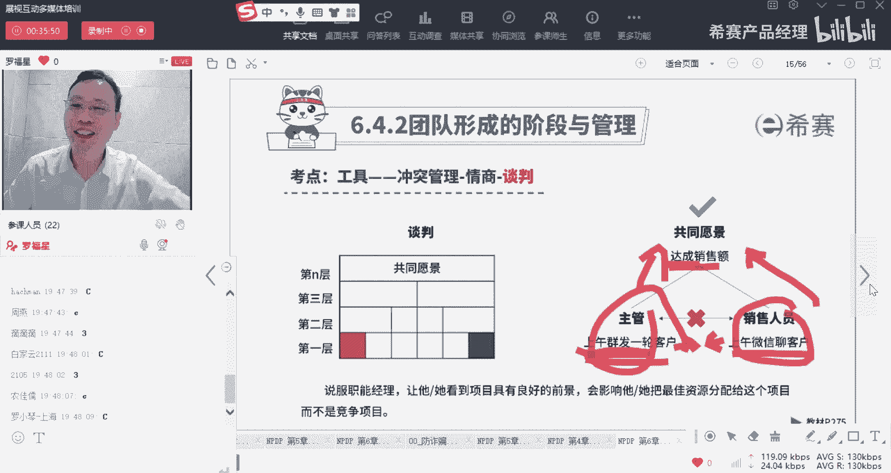

所以很多时候其实有意见，他真的是就很喜欢这种这种就是跟别人对抗啊，抗拒啊什么之类的，那那有人说过这样一句话，他说世界上有两类人，有一类人是想要赢，有一类人是想要赢得争吵，亲你是哪一类，你属于这一类为主。

你打一个一，你是这一类为主，你打一个二，你目前是属于哪一类，但也可能说是1+2啊，啊，我看到有好多同学都说自己是那个想要赢的，对吧，就是为了能够赢，能够忍气吞声，能够哎呀，就是给别人，给别人一些机会。

甚至就像把韩信作为一个榜样，他是为了做大事业，所以有的时候我们去做大事业，不拘小节，那些小事情无所谓，爱咋地咋地对吧，那事实上有的时候呢就是我们可能会想1+2，有的时候呢如果说非得只能选一个的话呢。

更愿意大家只只选第一个，更愿意大家是只选这个赢，你能够赢到最后，至于说就像有的时候，比方说你跟跟你老婆吵架，假如说有件事有一天，然后那个洗碗关于洗碗的事情，然后就开始争吵起来，吵起来以后。

如果你吵赢了以后，这碗归谁洗，如果你吵赢了以后，这个碗估计也是归你洗，因为他是老婆呀，但是如果说这个关于洗碗的这个事情，你吵输了哎，让老婆很痛快很爽了，有可能他他即便他他他他赢了，他还自己去洗碗了。

有这种可能性，对不对，所以有的时候其实我们去往大格局，往大一点的方向去想，这个事情可能会不一样一点哦。

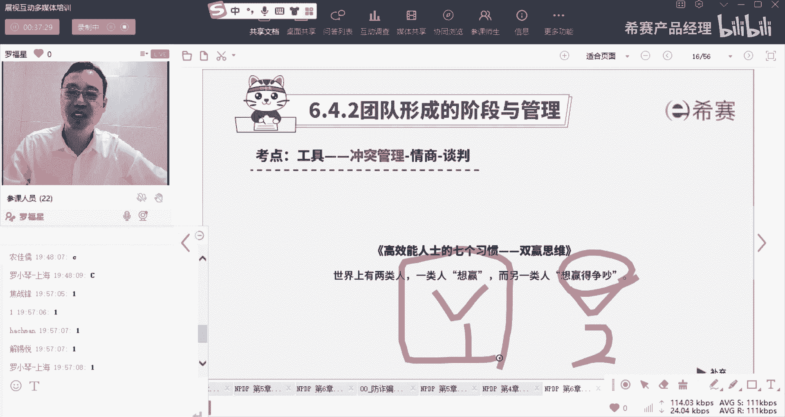

好然后呢，接下来再来认识一个，这个是非常重要的，这个可能很多人会颠覆很多人的一个思考，我们通常会觉得前因后果，前因后果，我觉得有前因，所有后果，同意吗，来同意，敲个六，我们通常都会觉得说有前因就有后果。

是不是这样子，但是你知道前因和后果它确实有就是有关系，有因和果的关系，但它这个因和果呢不是一条直线，就是因和果它不是一条直线，它是一条什么线呢，它是中医，可有其它岔路，会跟跟一些不同的。

跟一个东西叫信念有关系，信念就是前因，那前因发生了以后，后面的结果，如果你产生成是不同的信念的时候，你会发现完全不一样，这个怎么讲呢，就同样的一件事情发生，你会发现大家看待这个事情的观点完全不一样。

那么他受到的影响也完全不一样，那我们先把这个情绪abc讲完以后，再来去讲后面的，但是这个情绪毕竟他是个慢，他们来去提出的这个这这一理论，打个比方，比方说你的信念是a，我的小孩还是个宝宝的时候。

那么他如果打碎了一个碗，因为你觉得他还是个宝宝，所以呢你会心疼他，你会关心他有没有有没有有没有割到手啊，啊有没有害怕呀，什么只是来过来抱抱啊，亲亲举高高呀，你可能会心平气地去教他。

下一次端碗的时候要怎么端对吧，但如果说小朋友打碎完以后，你的信念是说这是他打碎的第29个碗，那个火气往上冒啊，那种感觉对吧，有可能会一顿暴狂风暴雨对吧，就有这种可能性，所以你会发现同样的一件事情发生。

同样是小朋友打碎了一个碗，你拥有不同信念的时候，你的处理方式是其实是可以不相同的，其实是可以不相同的，所以这里面也会给到一个很重要的点，就是因为我自己的话，应该大家都知道，我是一个就是没有没有去从业的。

国家二级心理咨询师，这个这个这个title你应该知道的对吧，就是我现在没有去从业，但是我也做了很多这种训练，同时呢我也去做了很多公益课程，我也给很多给一些社区，给很多人去讲过什么公益课程，那其实会发现。

其实很多人他的一些那种叫限制性的信念，谁帮我把这几个字敲一下，限制性信念，什么叫限制性的信念呢，就是当一个事情发生以后，他就觉得只能是如何如何，这就是一种限制性信念，他又回到这里面来。

那我们很多时候在成年人的世界，其实要想办法去突破一些限制性的信念，当我们能够去突破某一些限制性的信念的时候，你的格局会更加打开，你会看到更不一样的世界，相当于你的世界会更更开明，更广阔一些。

但这个事情其实不是很容易的一件事情，但是同时在心理学里面有一个这样的词汇，叫看见即疗愈，什么叫看见即疗愈呢，就是如果你都不知道说打碎了一个碗，这个事情我其实可以不生气的，如果你都不知道你。

你觉得说打碎一个碗，我就肯定要生气，你就其实都没有看见这个事情，但是如果说你看到哦，其实我打碎一个碗以后，小朋友打碎一晚以后，我很生气，是因为我有这种信念，当你能够看到这个信念的时候，看见是放下的开始。

看见是改变的开始，当然也有人说是接纳是改变的开始，但是你只有先看见你才能接纳，如果你看都没看见，你知都不知道，无从谈起，而作为一个产品经理，你其实很多时候是完全需要去知道这些东西，你需要基于前因。

知道后果，你需要知道在什么场景下，那些用户他就一定会如何如何去操作，你有这种基本基本的这种心理学的常识，能够去了解大家这种用户的使用的习惯，这是很有必要的。

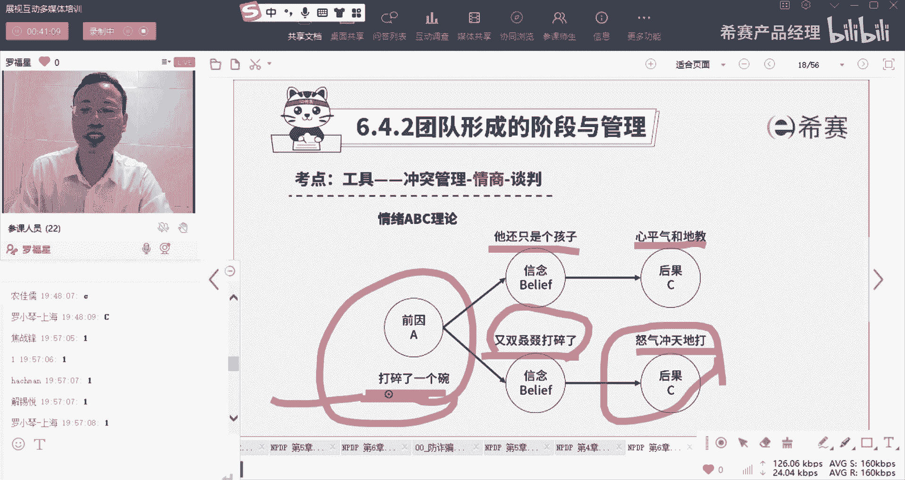

好这个例子呢有点有点太过于那啥，我们再讲一个可能在工作中例子，在工作中我们可能需要去找不同的职能经理，比方说我们通常是默认是什么什么矩阵啊，什么型的这种组织结构，矩阵型对吧啊，你们要给我一点回应啊。

兄弟们，姐妹们，你们都不回应，我都觉得是不是我讲得太差了，还是说这个电脑又坏掉了，那通常我们是一个矩阵型的这样一个组织，矩阵型的组织中，这些人员怎么来呢，这人员他其实是需要来自于各个职能团队。

你项目经理是需要去找各个职能团队来去要人，来去谈判对吧，那你作为这一次的项目的项目经理，或者说这一次的产品经理，你需要去要人的时候，你找那个张三去要人，结果那个张三他不给你，他是一个职能经理。

他不给你资源，如果说你心中的信念是这个up的，每一次都如何如何如何对吧，每一次都找我的麻烦，每一次都不给我，就是不把好资源给我，你就很生气，很生气以后会怎么样，你就会想要赢得争吵，跑过去跟他吵一架。

就指着鼻子骂这种形式，ok诶，这是一种信念，但是你知道世界它其实不只是一个维度，我们说在白和黑之间还有一片灰色田野，我在那里等你，那除了有这种，他是一定的死对头，他总是想要不给你好好果子吃。

或者他总是不想给你资源以外，还有一种什么情况呢，就是有可能他都不知道，这个事情对他有什么好处，对他比较笨，他比较笨，他没有发现这个事情对他的团队，对他自己又会产生什么好处。

但如果说你的信念是这种信念的时候，你要怎么办呢，哎你要想办法去跟他建立共同的愿景，需要拔高一层，你看你把这个谁谁谁给我，这样的话你可以怎么样，我也可以怎么样，我们大家可以怎么样，我们整个团队就如何如何。

公司会怎么样对吧，所以是建立共同的愿景来去得到资源，那这里面这个这个信念中又会引出一个内容，叫什么呢，叫剃刀原则，呃，有一个剃刀叫阿卡奥卡姆剃刀原则，还有一个叫汉龙剃刀原则，我们来讲一个汉龙剃刀原则。

他讲的是个什么概念呢，啊剃刀原则，你有兴趣你可以自己搜一下啊，就剃剃刀，剃胡须，剃刀ok他是说有一些东西啊，就是我们宁愿把这个人想得比较笨，也不要把他想的比较坏，你觉得他是一个笨蛋，但不是一个坏人。

如果你觉得他是坏人的时候，那么你很多东西都是往坏的方向去想，但如果说你觉得他是有点笨，他没有想明白这个你们好处的时候，那你可能会以你的处理方式就是教导他，帮助他，引导他，给我一点回应嘛。

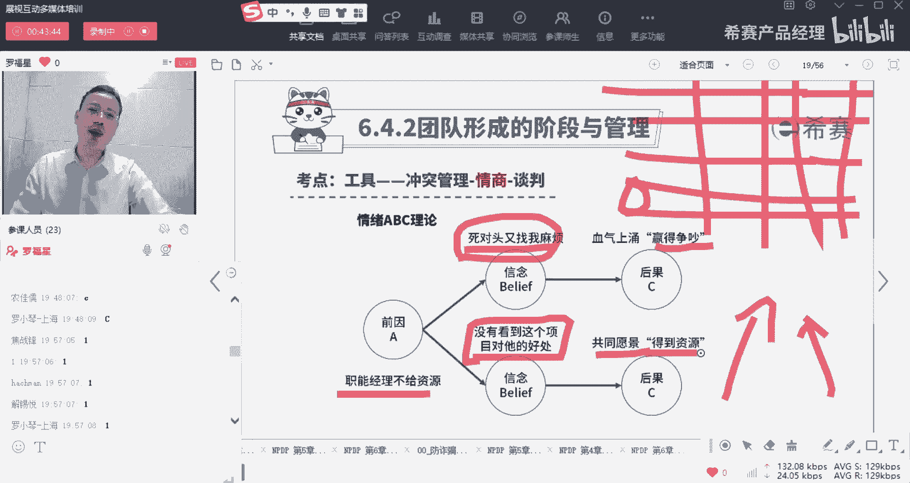

兄弟们好了，那么关于情绪abc，那我就说到这里，然后再来再来分析一下关于情商的这个概念，情商这个词它其实不是一个很老的词，他总共出现了时间才几十年时间，在90年代才出来，所以才30年的时间，那情商哥们。

他们研究会觉得情商包括什么呢，你看他的情商是由，当然不同的人，他的表达方式是不一样啊，他说是由自我意识控制情绪，自我激励来去组成，除此以外还有就是认识他人的情绪，情绪处理相互的关系。

我们来简单解读一下自我意识是什么意思呢，就是有一个词叫觉察，谁帮我掐一下，觉察爵士醒觉的觉察是观察的，察觉察在训练心理学这个板块中，经常会说哎这种觉察能力很强，觉察的速度很快或醒觉的速度很快。

那这种自我意识就是说你能够去觉察出，此时此刻心情又不愉快了，觉察出心中又有了一些愤怒，燃起来，觉察出又有一丝落寞的情绪在里面，会觉察出自己有点得意忘形了，就不要去做觉察，觉察自己的这个单线的状态。

只要控制情绪，其实呢我更喜欢的是，现在更流行的是管理情绪，因为控制这个词它有点什么在里面，控制有点压制在里面，就过于去打压这个东西，而管理呢是可以去疏导它，不只是去控制它，打压它，我们还可以去疏导他。

让他能够诶我看一下网络还好吗，让让它能够处在一个比较良好的状态，能够去抒发出来，如果说发现自己有一些得意忘形的东西哦，原来不对，即使你们再回应对吧，只是你们在回应，只是我这里没有没有没有出了，对不起。

对不起，错怪你们了，是我自己这里没有没有跳出来，对不起啊，那他就是会给到一个什么信息呢，就是说他会需要去看到这样一个情绪升起以后，他需要做一些静心的方式，需要去通过一些方式来去调整自己。

让自己处于一个良好的状态，所以这是一个去调整情绪，那关于调整情绪的方式有很多，这就免费送你一个，送你一个免费的这个情绪调节方式好不好，极其好用，你回头可以去用一用，叫自由书写，所以帮我敲一下自由书写。

自由书写是什么意思呢，呃我因为我给很多人做过这样自由书写，做自由书写，发现真的是极其好用，就是我给团队给一些人去做自由书写，做完以后估别人就然后就泪流满面，你会知道其实人的那种疗愈，他通过眼泪的方式。

它是一个很好的一个疗愈的这种方式，自由书写当然是这么做的，就是你找一个没有人的区区域，或者没有人的建议，没有人打扰，这个时间段，脑袋里面不管在想什么东西都没关系，你可以去尽量去清空。

也可以随便他想什么东西，想什么东西算什么东西无所谓，但是你不要去刻意，你不去刻意想，然后你就使劲写，你想到什么写什么，你随便自己写，写个大概五到十分钟，写完以后，你找一个相对比较安全的这个区域。

就是没有没有没有人打扰啊，没有人会笑话你啊什么之类的，找一个安全的区域，你可以把你写的东西读一遍哇，很多人我因为我做过很多这种做过很多场嘛，就基本上很多人都是会，我讲着讲着就我就开始就流泪，然后就就哭。

因为可能在成年人的世界里面，就是压力太大了吧，很多人都嗯包括有很多那种人过来，就是表面上很光鲜亮丽，就是因为有我有时候也反正遇到各种人吧，有很多人真的是那种经济条件呢，各方面都很好，穿的很体面呢。

哎就是他真的做完这个事情以后，也是哭的稀里哗啦的，它也是一个很好的疗愈方式，这种东西经常可以做，不要钱，免费，特别好，自由书写是一种很好的方式，当然前面有我看到也有同学写了一个叫深呼吸，对吧。

对深呼吸这种方式，你通过这种深呼吸来去调整这情绪，肯定也是很好的，来去不断去暗示自己，鼓励自己，同时还有一种呢叫动态静心，而大家也可以去可以敲一下动态，就是静态和动态的动态动态动态静心诶。

他就是那种就是通过这种快速的舞动的，这种方式来去来去，让自己的内心能够沉静下来，他反而是一个很好的东西，有很多音乐你不用去狙你，你如果你自己有兴趣的话，你可以去尝试啊，比如说你可以在家里面搞一个区域。

你戴个眼罩，然后呢就然后就开始放着大量放着音乐，然后就开始跳舞，随便乱跳无所谓，不要拘泥什么动作呀什么之类的，就是释放你的内心的这种方式哇，那种感觉也会很好的，当然前提是保证你的安全的情况下也是可以的。

就有很多这种方式可以去调整自己，因为确实在成年人的世界太不容易了对吧，男生也很男，男人也很不容易，女人也很不容易，都很不容易啊，那我们可以通过一些方式来去管理自己情绪，去试试去释放自己情绪。

包括有些同学会喜欢跑步对吧，有一些同学喜欢跑步，那跑步也是一种很好的方式，你通过运动去流汗，它是一种很好的去缓解我们情绪的方式，当然还有一种情绪的处理方式呢，女生用的比较多，叫倾诉，就你去找你的闺蜜啊。

找你的朋友去倾诉，这个是很好的，但是这个东西的话男生不太好用，因为哪个哪个抠脚大汉去找一个兄弟去倾诉，那些东西，就感觉很怪异，你知道吗，就很少去倾诉，但女人经常会喜欢去倾诉，所以女人为什么活得比男人长。

有很多原因，其中有一条他们能够去倾诉啊，这个扯的有点远了，就是我们可以去有一些自我意识，然后呢能够去自我去调节意识，去去调整这些情绪，去管控这些情绪，然后呢还有一个就是自我激励，这个自我激励其实很重要。

就不断去暗示你自己，男人可以喝点小酒，诶，这个好吃的，那暗示自己其实很重要，有没有觉得，有的时候觉得自己好像啥啥啥都不行，啥啥都不会，啥啥都没有什么用，我相信可能经常会有人有这种感觉对吧。

你你们看那个880980980视频教程，罗老师穿正装打领带，你觉得这个视频录的还还怎么样，还可以吗，我每一次在录这个视频之前，我都会不断给自己加油，我说罗老师加油，我是这样的。

真的我就每一次都会不断的去说，我说罗老师加油，因为真的录视频特别痛苦，就是超级痛苦，他比这种讲课要痛苦，痛苦十倍不止吧，至少我会不断的就啊做一些口腔的，做一些口腔的行为动作呀。

然后去然后对着静止器这样啊，然后再给自己打气啊，然后再去做，其实很多时候当你遇到一些挑战和困难的时候，你要给一些自己激励，这种激励，其实如果你有小朋友，你可以从小去从小去灌输一些思想，灌输什么思想呢。

你要灌输一个思想，就是说勇敢，不是说无所畏惧，勇敢是即便有害怕，有恐惧，依然可以迎难而上，这才是勇敢呃，第一次用在这个时候是用什么时候，因为打针的时候用的比较多，就可能很多人都会用这种。

就是小朋友打针的时候，你说打针的时候害怕不害怕，害怕痛不痛痛，但是敢不敢，其实心里面是拒绝，但是我还是会即便心里面很害怕，也敢去把手伸手臂伸出来，让让那个护士阿姨去打一针，哎这就是一种勇敢。

那以后就别的事情也是一样的，你会遇到很多挑战和困难，面对挑战和困难的时候，你要激励自己就没有关系，即便是很难，我也要加油，类似这样的一个方向去自我激励，自我自我调整，因为没有人去固定你。

别人他哪有那么多闲心和时间来去鼓励你，没有那么多时间，所以呢前面其实关于我的这一部分，关于自我的这一部分，k能够去识别到情绪，能够去管理情绪，然后呢还有另外一个呢就是识别他人的情绪，就是我们说情商。

情商管理中情商什么样的情商比较高，就是能够让别人觉得很舒服，同时也让自己觉得舒服，那才是情商高对吧，那这边就会有一个你要去识别别人的情绪，如果说你讲的什么东西讲错了话，别人脸都垮下来了。

那这个时候你要搞搞清楚哟，对不对，你就要搞搞清楚是什么什么个情况了呀，你肯定是说错了话，你要去识别别人情绪，或者说是不是因为你的原因，是因为其他的一些事事情的原因，你能否去比较好的去帮助他走出这段情绪。

你帮他走出这段情绪里面的话呢，其实有的时候很多时候往往不是你说什么东西，有的时候就是你你可以安静的去陪着他，或简单的去问一两个问题都是很好的，然后因为我有的时候也会帮别人去做一。

偶尔去做一做这种心理心理的疏导啊什么之类，就是抛一些很简单的问题都没有说，很特别，就是很简单问题问询他，哎呀以前发生了什么事情呢，二边说是夸眼泪就流下来，因为他觉得他说有一个生命在旁边去倾听。

他感觉他自己就不是一个孤单的这样一个生命，他觉得生命中会有有，有这些共鸣的东西在里面啊，这个有点玄学了啊，其实也不是玄学，就是这是另外一个科学，跟我们的这种做事，面对事情的方式不一样，它是面对人。

面对人的内心的这个东西啊，但我们至少是能够去觉察到自己，也能够去觉察到别人，这个决别人里面就有个什么样的点呢，就是你真的能够去关心别人，当你把你的心放在别人身上的时候。

你才能够去觉察别人的这种情绪不好的地方，如果说你都不会关心他的话，你根本就i don't care，爱咋地咋地，从眼前过过，我根本就没看到对吧，就有可能会是这样的一个情况。

所以我们其实还是需要去关心别人，去关注别人，去看到他有什么样一些诉求，有什么一些艰难的地方，嗯我其实不能去讲心理学，心理学它是一个很专业的东西，我只能是偶尔做一做分享，简单的分享是可以的啊。

我只能做简单的分享。

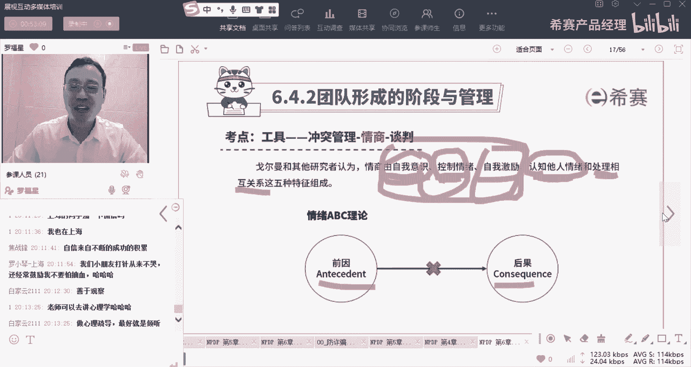

我可以偶尔帮大家去做一做这种心理疏导，但是呢不太不太好去做。

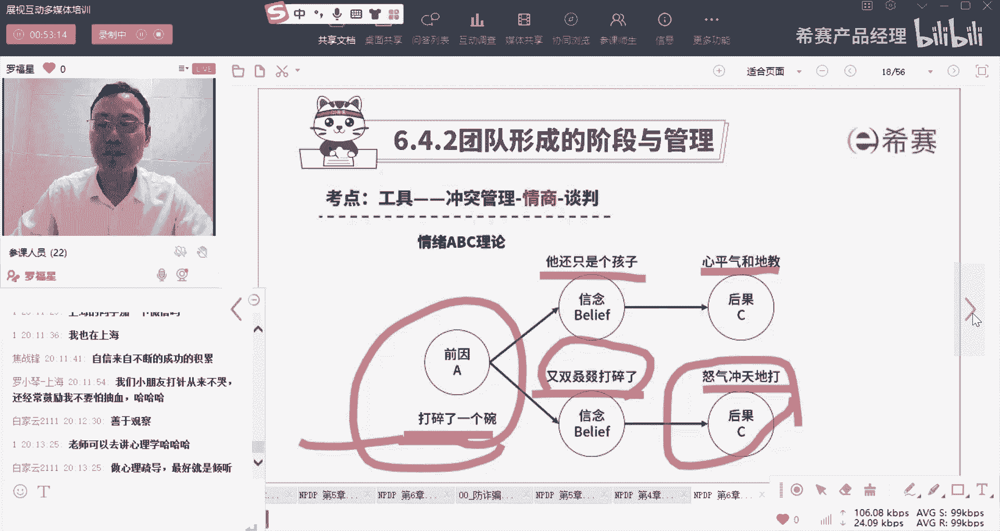

因为这种东西特别麻烦，特别麻烦，特别不方便好。

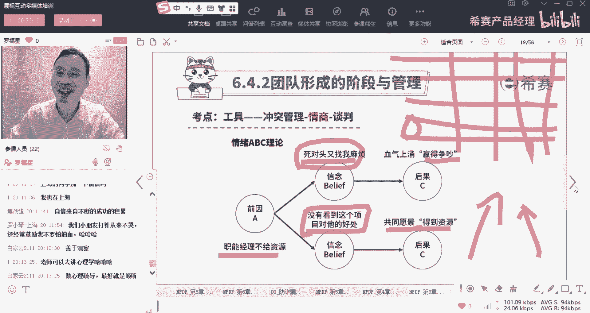

关于冲突管理中，我们刚刚已经是看过，其实首先是认识情绪。

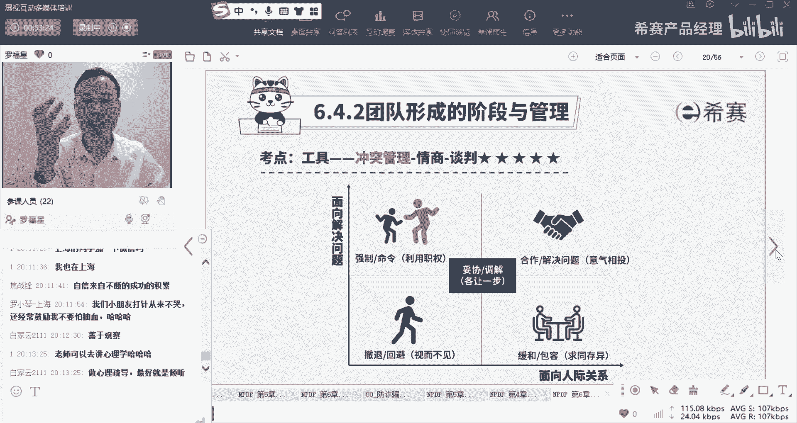

去识别一些情绪啊，然后会有一个叫情绪的这样一个信念，就是信念这个限制性的信念，那么其中关于限制性的信念这一条上面，其实我会就是有的时候，也是也是在不断的成长的过程中，不断的会去重新悟到一些新的点啊。

就是我们经常会说什么行万里路读万卷书对吧，你会发现你行万里路，你发现你遇到不同的事情的时候，你真的会产生一些新的认知，你会拓宽你的认知，我们有的时候会很，我不知道在座有没有这种情况。

你会发现其实那种读书读的比较多的人。

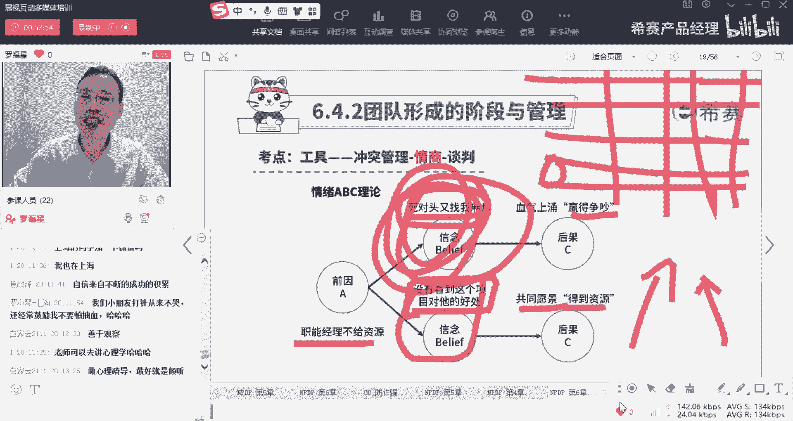

都比较害羞，会比较内向一点，会比较内敛一点，就不太好意思去那种，就有些东西你就觉得这种行为显得有点粗鄙，但是那些没有读太多书的人，他的那种行为看上去是粗鄙一点啊，有些行为是出皮一点。

但是呢他也许更加有力量，他能够去解决某些事情，你那种那种书生那种读书读的多的那种，受过教育的比较多的人，他反而没有那种力量去解决某些事情，那种靠那种那种比较比较原始，原始的那种那种力量的东西。

他反而能够去解决一些事情，所以没有说某一东西就绝对只有好的一面，他也许会束缚你啊，对确实多，我们读读书读的多以后就比较要脸，就是就自我修养嘛，就是自我修养方面会比较就比较关注这东西。

也会去也会去关注别人的情绪啊，就不太会去用那种不好意思打扰别的方式，但某一些事情上他就需要你豁出去一点，就有一些事情啊，他确实需要你去豁出去，所以呢这东西当我们看的多一点以后。

也许会突破你的原有的一些信念，因为知道原来在某一些不同的时候，一个事情的解法不止唯一的一种解法，它可以有多种不同的解法，也许某一些解法可能会更快，就是快准狠地去解决。

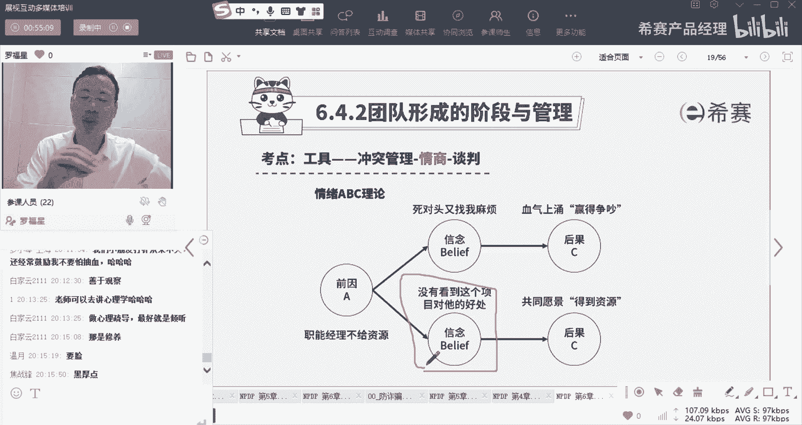

是有这种可能性的，但这个不好举例啊，他太太累了，太太暗黑了啊，但是反正就你知道，就是其实其实世界不止一种方式，不止一种颜色，有很多种不同的东西，我们都是可以去尝试的，那个啊master你说的很对啊。

有流有文化的流氓对，如果说我们可以去做到那种，这是很牛逼的一个事情，这就下不来，那种面子上拉不下来，或者不太好意思去那个就是自己的，自己的这种受过的教育，不允许自己做那个，做那个做那种动作或者行为啊。

言语啊之类的，好然后再来讲到另外一个管理冲突，其实面对冲突呢，我们处理方式有很多，面对冲突处理方式有很多，那有很多呢，那这里有一个区分的方式，是你的面对冲突的处理方式，是面向于人际关系来去解决冲突。

还是面向于解决问题的方式来去解决冲突，如果说你只想要对事不对人，快速去解决冲突，那么这里有个方式叫强制或强迫命令，也就是说是只对事情选a选b k快速解决事情，但他没有去照顾的情绪，没有照顾到人的情绪。

所以这种方式呢它能够快速解决问题，但不能够从长远来解决，他不能从长远来解决，一般来讲是那种当事情特别紧急的时候，有危险的时候，必须要当机立断，马上解决的时候，我们可能会用这种强迫强制的方式来解决问题。

因为这个时候我没有办法去教你，这个什么东西啊，那个什么东西啊，你就按我的去做，不要想那么多，ok按我的做就可以了，就类似这样的啊，这是我不要你以为我要，我以为领导的这种方式来去搞定事情。

那还有一种呢是面向于人际关系，他没有去解决这个冲突本身，但是他在人际关系这块搞得很有一套，叫什么叫缓和包容，那缓和包容我更希望你记得是这四个字，叫求同存异，他是什么意思呢，其实我们刚才说把那个拔高一层。

就是在求同存异，就是我们可以你要你说要群发啊，可是他在做那个私聊大的行为其实是不一样的，但是我们去想一想，我们大方向都是一致的呀，都想要去成交啊，啊没事没事没事对吧，就类似这样的一种方式。

就像你看到那种香港电影那种老的香港电影啊，他们有一个黑帮过来拿着砍刀，另外一个黑帮过来拿铁棍，两个黑帮就开始准备干架了，哎这个时候中间来了一个中间人，他来调停，他说求财求财。

ok其实你看你们有什么好打的呢，我们大家都想要求财，对不对，和气生财，所以大家一起去打劫好了，不需要打人，所以通过这种方式来去，没有把这个冲突直接平息下来，但是我们短时间内去转移注意力。

让我们共同去做某一件事情，包括你看那种张怡宁的小说里面有这种桥段嗯，一个女人和另外一个女人，她们之间就是不对付，就是相互之间啊如何如何，结果第三个女人来了，第三个女人出现在一个男人身边的时候。

这两个人女人马上就联合起来，先把第三个女人给干掉，干掉这个第三个女人以后再来解决内部矛盾，所以是先暂时临时放下我的冲突和矛盾，来去聚焦另外一件事情，这就是求同存异的方式，那这种方式呢。

它其实是一种显得非常高情商的方式，请注意他是写的非常高情商的方式，没有解决问题，但是又把这个事情给平息下来，牛不牛很牛，这是高情商的方式，那还有一种方式呢是既没有去面向问题，他也没有去面向人际关系。

叫撤退，回避撤退，回避是什么意思，当双方有冲突的时候，我赶紧退出，那这种退出的方式啊，就是显得说嗯既没有去勇敢的面对事情，直面问题，也没有说去跟他好的去交流和沟通，这有点像什么。

就是那种我们刚才那个看diss k里面的那个，最后那个那个那个角色，他不去面对人，他也没有去面对事，他都是比较缓慢的这种方式啊，但是不是说第四个，那这种方式呢看上去是很消极的一种方式。

但是在这里有一句话，我想送给所有的小伙伴，先处理情绪，再处理事情，帮我敲一下，可以先帮我敲一下，先处理情绪再处理事情，我们撤退的时候，你想当我们在气头上的时候，但我在气头上能说好听的话吗。

没有一句话是好听的，什么难听捡什么来去说，对不对，但是当我们撤退了以后，是不是就会冷静下来，我也冷静下来，你也冷静下来，我们冷静下来以后，我们就可以，所以是先处理情绪，处理完情绪以后。

冷静下来以后再来看这个事情，也许就变得更容易一点对吧，所以这种方式看上去很消极，但是还未必就绝对是不可用的，有的时候其实也很好用好，既然说到先处理情绪再处理事情呃，作为一个心理咨询师，我也认真的告诉你。

再多一点好不好，有一个解决这家人之间的冲突和矛盾，的一个很好的一个工具，两个字拥抱，帮我敲一下，拥抱你，你可以去用用，真是百试不爽，不管是老公和老婆之间，还是还是还是家长和小孩之间哇。

你去拥抱真的是极其好，我说一个残疾吧，就是小朋友吧，你想一想，你如果去辅导过小朋友功课，你没有没有被他生气到，那只能说你们家小孩真的是千里挑一，万里挑一，我相信很少就每一个小朋友，你去指导他功课的时候。

多少都会被他气到，哪怕是像我们家两个小孩，他的性格差别很大，也是有也是会中，但有的时候就会搞得很生气，你很生气，你训斥他，你训斥他就会他就会他就会哭，哭了以后你会怎么办呢，像我通常就是来过来过来抱抱。

ok就就就就就就就过来抱抱，来抱一下，以后过一会儿会诶就好了，好了以后哎他又可以再去做工作，那如果你不去报的话，他可以尽量跟你较劲，较一个晚上的进，就是这一个晚上写作业，他一直在磨蹭啊，在干什么干什么。

你的这种方式，你就会发现就是就是很麻烦的一个事情，ok，啊那个master，你说的这个不对啊，你下次可以试一试，你可以去试一试，你撒撒娇，然后就给他抱过去了嘛，这个。

但这个话题不适合在我们这种课堂上面去讲啊，你是对吧，嗯你总有办法的，你肯定有办法的，ok所以通过这种拥抱，因为人他其实这种人这种动物，它需要这种需要这种需要这种拥抱，这种这种行为只拥抱了以后。

你就会发现好很多，情绪会好很多，能够去评去你的平复，你的情绪会好很多，真的下次可以去试一试啊，啊都说说都说到这里了，多给你推荐一本书吧，叫爱的五种语言，帮我敲一下爱的五种语言。

呃我推荐的书都是那种很容易看的书啊，爱的五种语言，但有兴趣可以去看一下，就是它是一本很薄很薄的书，很薄的一本小书，他会讲到说，我们表达爱和感受爱的方式有很多很多种，其中这个作者呢他把它整理成五种语言。

这五种语言是绝大部分人都能够去感受，爱和表达的方式，哪五种语言呢，我给大家简单讲一下，有一种语言就是肯定的言辞，什么叫肯定的言辞，就是夸夸，他说哇你今天写的这个代码简直太酷了，哇。

你这个你这个你你你你这个什么什么，那个游戏机肯定好贵的吧，在哪里买的怪，就怪你好好玩哦，哇你这个你的这个发型好酷呀，那你这个衣服真的是太漂亮了，你就是夸她，ok你做的饭真的好好吃哦。

肯定的言辞去看见他的优秀，去肯定他的优秀，这是一种爱的语言的表达方式，爱的表达方式，很多人都吃这一套，罗老师也很吃这一套啊，你们也可以夸我呀，然后第二种方式呢叫精心时刻。

精心时刻叫special time，精心时刻，他什么意思呢，就是我们专门搞一个时间出来，专门只有我和你，我们两个人共度的时光是精心时刻，那就是因为平常多好多好多杂七杂八的事情，对不对。

那杂七杂八的事情太过于繁琐了，以后甚至都忘记我爱你，你爱我了，那如果说我们再单独留一个时光，不管说是看电影也好，吃烛光晚餐也好，出去散散步也好，一起跑，一起跑步也好，或是那啥也不干。

就是聊聊天也好啊之类的，就是我们两个人哇也会很好，如果能够把这个时间能够定下来，定到每一周固定的某一个时间段，那就是更加好了，ok这是一个特殊时光，然后第三个爱的感觉方式是什么呢。

礼物有没有人喜欢收礼物，有一句话叫包治百病，但是这句话其实不适合所有人，不是并不适合所有女性，但是她适合一部分的女性，他会很需要，就是觉得礼物是你表示你很看重我，你给我准备了什么礼物。

说明你心里面有我很看重我，你出去出差呀，或者去哪里玩呢，或者干什么，这样你还记得给我带个礼物过来，一些重要的纪念日啊，你给我准备一个礼物，说明你在心里有我，ok这是一种很好用表达爱的方式。

很多人会吃这一套，女性居多，然后呢还有一种爱的表达方式呢，哎就是这种身体的接触，那身体的接触呢就是肢体的接触，就刚刚我们说的拥抱就属于其中一种，你会发现这个就说我们有的时候需要。

你有没有发现有一些人他聊天聊天的时候，坐在你对面的人，他就拍一下你的大腿呀，或者拍一下你的肩膀呢，或者会搂着你的胳膊呀，或者是什么什么之类的东西对吧，那这种哎有这种身体的接触。

还包括说你知道如果说是家庭的亲密，就亲密关系的话，你可能有拥抱呀，还有更多的一些这种肢体的接触，它也是一种感受爱和表达爱的方式，那还有一种呢就是服务，就是你为我准备一些贴心的服务。

比方说你看你帮我倒了一杯开水过来，你帮我把这个椅子放调到我合适的高度，放到我合适的位置，你帮我准备了一顿可口的饭菜，你帮我把这个环境卫生整理的干干净净，整整齐齐，帮我把这个床床单被褥铺好。

那你帮我洗头发，你帮我呃干什么，你以为我提供服务哇，这种也是一种表达爱的方式，那很多妈妈家长他给小孩表达的方式，是不是就是给小孩提供各种各样的服务啊，就是无微不至的关怀，提供各种服务对吧，那这也是一种。

那你通过就爱的五种语言，它就是讲了这么一点东西，书很薄，你看完以后，它对于你的这样一个亲密关系，这个部分一定会有多少有一点的帮助，但是不只是亲密关系，包括说在职场上，职场上也同样的。

你是不是偶尔也可以出差的时候，给同事带点礼物呀，你是不是也可以去给我肯定的颜值，去夸赞你的团队成员呢，你是不是偶尔也可以去跟别人一起呃，搂肩搭背，搂肩搭背一起练一下，比方说我记得像跟不同地方的人。

他的差别是比较大的，像南方人就相对比较婉约一点对吧，北方人比较豪爽一点，我记得我当时去北方出差的时候，去那个去东北出差的时候，那别人真的是才跟你见第一面，然后就跟你聊天，聊天就聊的火热朝天。

然后就是一起请请你们出去吃饭啊什么的，然后跟你聊什么东西啊，甚至还会勾着肩膀哇，那种感觉我其实是极其极其尴尬的，哎但是架不住边的热情就很热情，那你是不是也可以去考虑用用这种方式，其实也不是不可以用对吧。

也是可以的呀，那包括说像这种特殊时光，我们不能够说两个人特殊时光，我们可不可以团队的特殊时光，我们每两个月，然后组织一起七起出去玩一玩，那每两个月出去打一场球，或者是干干一个什么什么事情。

也会有那种建立一些一些，一些一些一些共同的时间都是很好的，ok好了，这里扯得有点远，总之呢你知道其实你要去带团队，你要去管理团队，你要去跟人相处，它里面有很多很多东西，都不是一件很容易的事情。

但是一定是有有一些方法可以去参考和使用的，学到了没有没有学到那么一点点好，我们再来看到下一个冲突处理的方式呢，叫合作解决问题，那么合作解决问题它是讲什么呢，合作解决问题是说我们就一起来坐下来。

好好的去聊这个事情，把他聊开了，来找到一种大家共同能够接受的这种解决方式，所以这就是既能够面向人际关系，我们大家一起都可以敞开来聊，同时也面向于解决问题，你不要去藏着掖着，没关系。

我们去聊这个事情的这种方式来去解决问题，ok这是合作解决问题，它是一种能够从长远来解决问题的方式，从长远从长时间来去解决问题的这种方式好，除了这些东西以外呢，还有一种叫妥协，请注意哦。

妥协呢它是没有完全面对人际关系，没有完全解决你内心的人气，但是也同时没有完全去解决这种事情，它是一半的解决，就是我们说退一步海阔天空对吧，这个回避呢是我完全退的不见，而这个妥协的是你也退一步。

我也退一步，我们各退一步，我们各退一步，海阔天空以后，哎发现这个事情反而好办了，那么妥协的这种方式其实看上去是双输，我没有达到我的目标，你没有达到你的目标，但是我们能够去有一些共同的。

我们都各自退一步以后，适当的满足一半的满足而妥协这个词，我真的是很想要告诉大家的是什么呢，人的成长的过程，其实就是在不断的去学会妥协的过程，如果说你都还没有学会妥协，那可能是你活的太过于顺利。

遭受社会的毒打还不够，但是我希望你能够不遭受社会的毒打，可以就很无忧无虑到老对吧，那是最好的一个事情，但是在生活中，在职场中，你说完全不受挫折，几乎是不现实的，很多时候有些事情完全随心所欲。

几乎是不太现实，所以呢妥协是在所难免的妥协，你不要觉得他是双输，就是不一个一个不好的行为，生活中大部分时候我们都需要妥协，都需要离退一点，我退一点的这种方式，来去完成这样一个这样一个冲突的解决好。

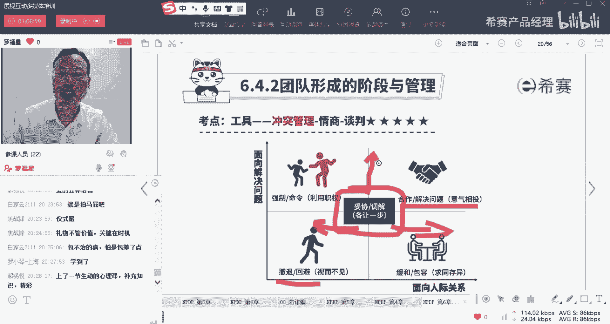

那么冲突的解决了，我们就刚花了一些时间来去简单回顾一下啊，撤退的方式，它是撤退，转移等待，ok我暂时先冷静下来，我不去参与这个冲突，我退下来，然后呢，还有什么是强迫的方式。

强迫呢就是我命令要快速解决问题，当遇到危险，遇到挑战的时候，马上要去做决定的时候，我没有时间跟你解释，听我的这种方式就用强迫命令来去解决，那还有一种呢就是缓和包容，它是一种求同存异的方式。

它是关注人际关系，他没有直接把这个问题给解决掉，但是呢会照顾到人的情绪，人的这样一个心理的价值来做这些事情，那还有一种方式就是合作解决问题，合作解决问题，是一种长期有效的方式来解决问题。

就是真正要从长远来解决，那么就用合作合作的方式，但是它一个问题点是什么呢，它耗时比较长，他耗的时间就会比较长一点，那还有一呢就是妥协，妥协就是居中的一种方式，就是一种居中，事情方面唉各退一步。

人情方面各退一步，哈哈就是这种方式，那这种方式反而会写呢，其实也是一种很成熟的一种很睿智的方式，你不必要太过分的去说，只能是我赢，而只能是他，他如果赢了的话，我就不活了，没有这种。

其实我们也可以是大家都各自赢一半，同时输一半，我们可以去妥协的方式也都是可以的。

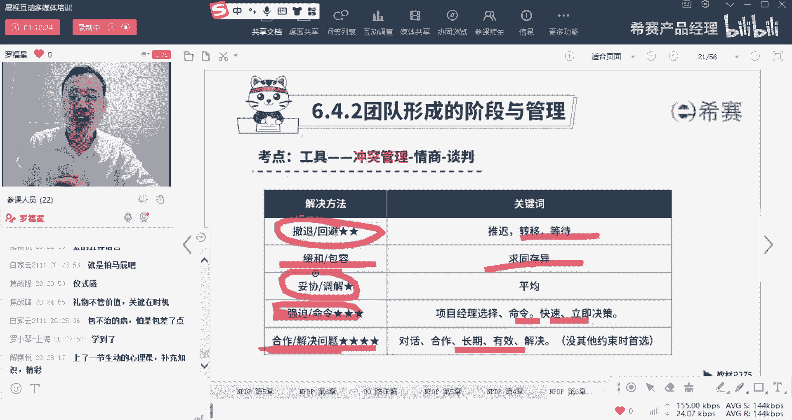

好了，我们先休息一下。