# 01NPDP霁月-产品设计与开发工具 - P1 - 希赛产品经理 - BV1PG4y1w7sm

前面的部分讲的基本是差不多了啊，第四章前面部分我们介绍了什么东西啊，大家还有印象吗。

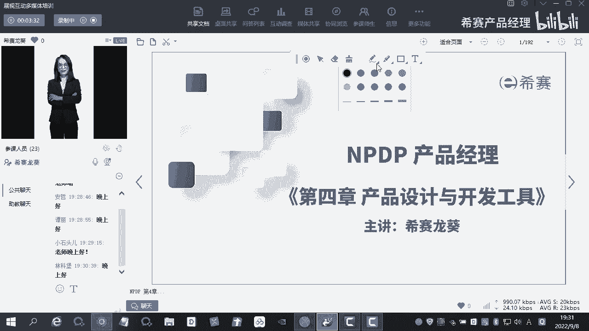

简单来回顾回顾一下啊，整个第四章的话呢，我们把它的一个整体的脉络，先给大家去梳理了一下，就是说整个第四章，它到底要讲一些什么类型的工具，这些个工具你把它对应到具体的开发阶段，它是在哪个阶段去用的。

通过这张图的话呢，基本上大家能够建立起一个初步的印象，那么你最开始啊，因为咱们现在还没有把这个所有的东西都学完，所以你看这张图的时候呢，呃如果你觉得还是比较抽象，或者说是不太理解的话，没有关系。

我们后面把它学完了之后，你就会更加清晰一些。

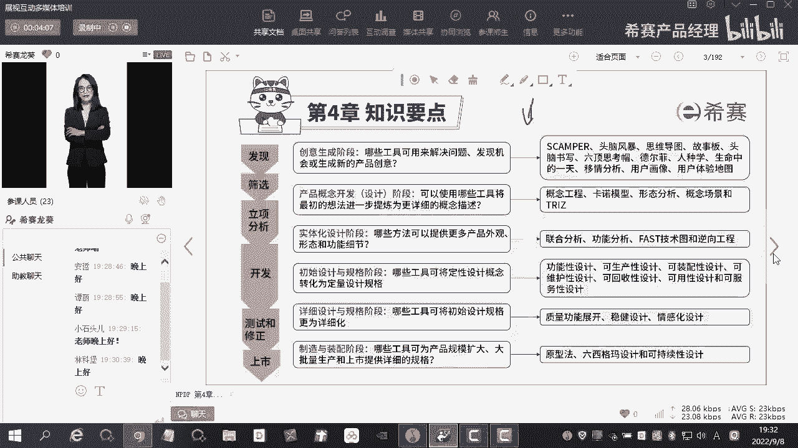

好接着呢我们就讲到了一个，因为整个第四章它其实就是讲的设计工具。

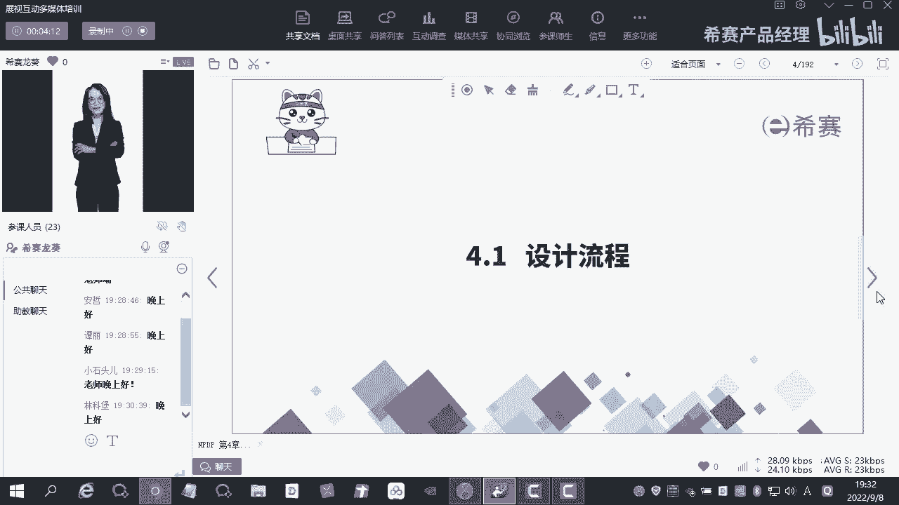

对不对，所以我们把设计流程呢给大家去掰扯了一下，设计，从消费者的角度以及从什么呢，从我们生产者就是制造产品的这个角度呢，去给大家去介绍了一下消费者，从设计的领域来说，它关心的是外观和功能。

而作为我们的什么需求实现方产品的制造者，他会更加从什么呀，从这个创意或者本身这个概念的一个可行性，这个设计的可一个可行性，去进行这个左手和切入好，这是我们讲的设计啊，设计的话呢。

在这里给大家去讲出来的一个区别点，就是说呃可能大家平时认为说这个设计的话，应该是在产品开发阶段才做的事情，但是其实不是啊，我们讲设计应该是从最开始的创意，就已经引入了这样的一个概念，所以我们讲啊。

你看开什么设计流程，是整体创新流程中的一部分啊，然后呢他关注什么呀，关注创意，关注制造，关注上市啊，好这个地方呢它不会出考题啊，基本上它是一个导入性的一个课程，另外的话呢就是本章啊。

其实还相对来说是一个比较重要的一个章节，它的占比是15%，15%没嗯，就是这个章节它会考30个题啊，量还是比较多的，请大家一定要慎重的对待，但是啊这个章节的话呢，因为它是属于新增的内容。

那么这个新增的内容的话，它的考试难度不太好去估计嗯，据我们的经验的话啊，如果他在最开始改版的第一版，考试搞得太难的话，其实是不太利于去做这样的一个推广的，所以这部分的新增内容的话，我们估摸啊。

它可能更多的会偏向于去考察你的概念，好吧好。

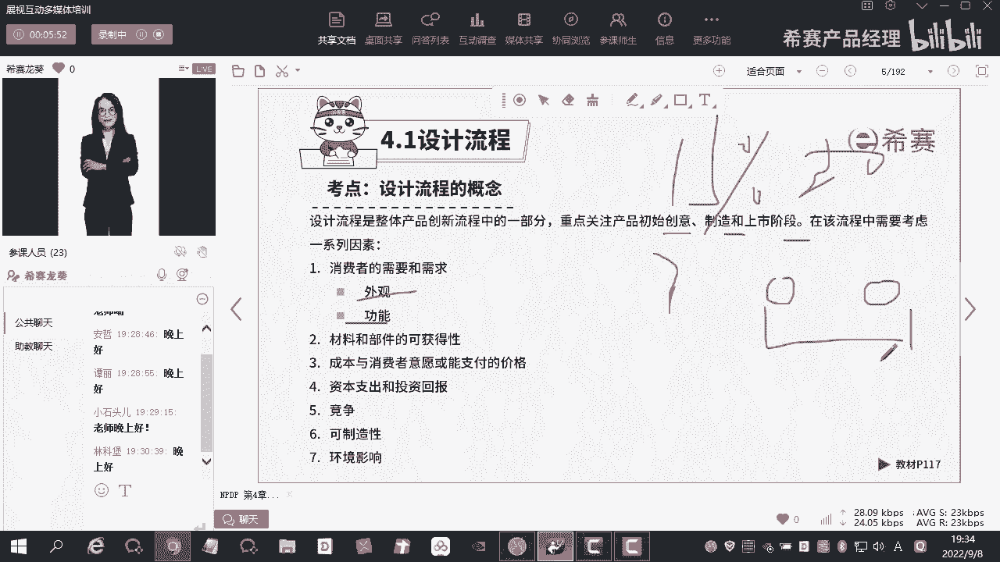

那么今呃昨天的话呢，我们主要是把创意生成阶段的一些工具，给大家做了一个简单的介绍，首先给大家介绍了什么是创意开发。

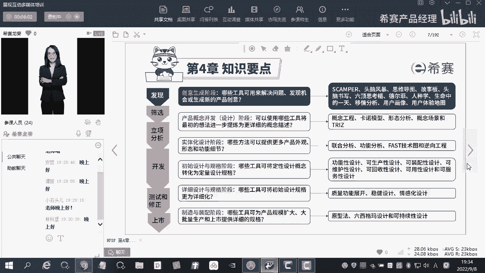

什么是创意生成，它是生成发展交流的一个创造性的过程，它可以被用在早期，中期和后期啊。

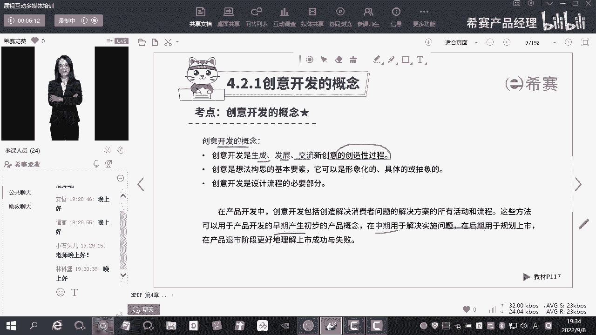

以及退市阶段都是可以用的好，然后就是讲到了创意开发的四个大的方面，一个是问题驱动，一个是竞品驱动，一个是技术，一个是方法，我们接下来要讲的最重要的其实就是方法啊，这三个的话呢。

其实在之前讲第123这三章的时候，是多多少少有介绍的，那这个东西呢简单的去了解一下啊，我们在考试的时候也会出考题，但是呢你看到没，他是个两星考点，基本上每年可能会出现。

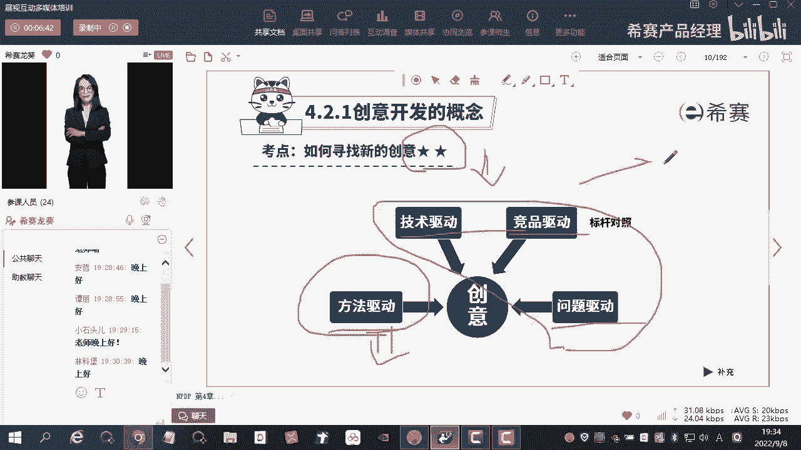

但是出现的话它的这个难度是比较低的啊，不用担心，好吧好。

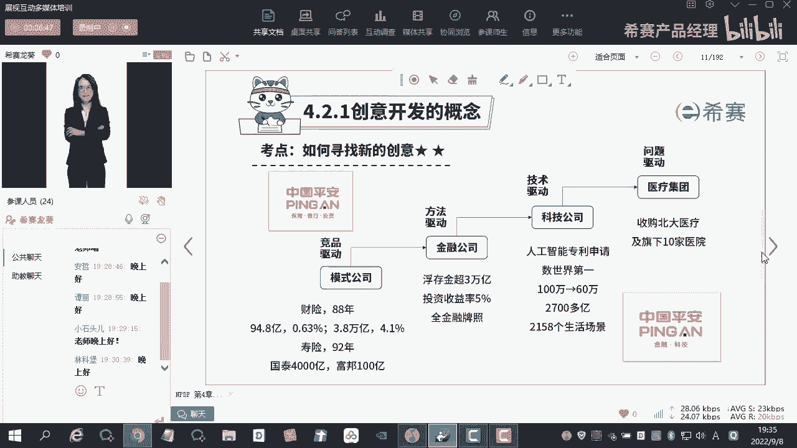

接着的话呢，就给大家讲到了什么一些具体的方法，是不是我们在这个过程中间，先由大到小的去介绍啊，在这个过程中，我们总的来说会有两种思维，一种是发散思维，总是收敛思维这个东西啊。

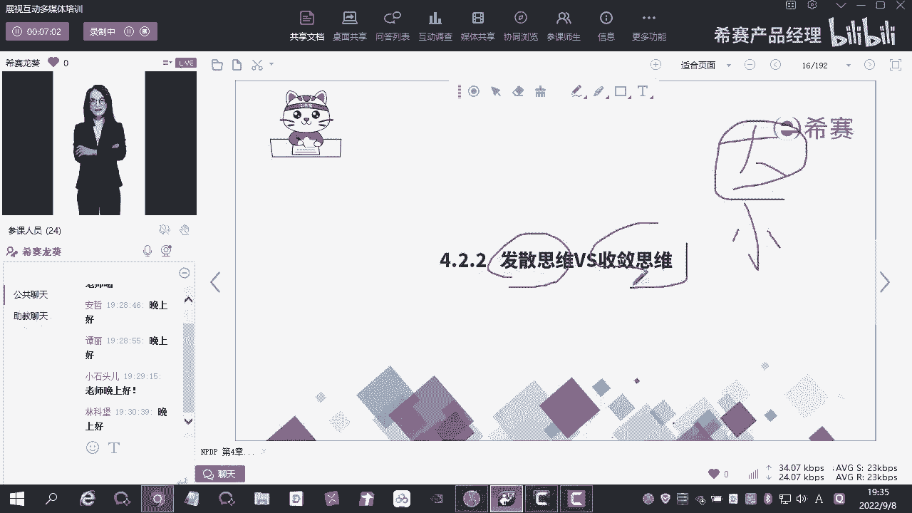

你别看它好像只有一张ppt对吧，但是呢它有五星考点，这个非常重要啊，他们二者的话一个是由少到多，一个是由多到少，不管是由少到多还是多到少，它们两者的话都不会对创意产生负面评价，知道吧。

这一点是非常重要的啊，不会对创意产生负面的评价，好其余的我就不说了啊。

看文字都能理解的好，另外的话呢就是讲到了一些具体的工具了，比如说camper对吧，camper是由这几个单词的首字母组成的，考试的时候啊，你就记住每一种每一个动词啊，它代表的是什么意思就可以了。

考试不会太难，也不是一个高频考点啊。

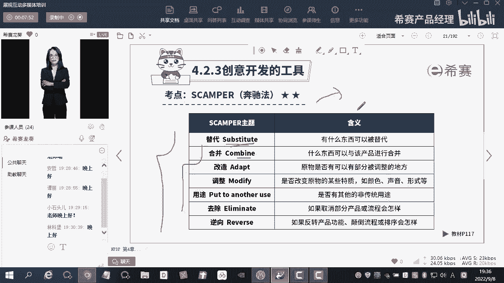

它是个两星考点好，另外的话呢就介绍什么，camp过后就介绍了6。4考帽，六点思考猫，核心的考法，核心的考法其实就是这六顶帽子的一个区分啊，六顶帽子的区分。

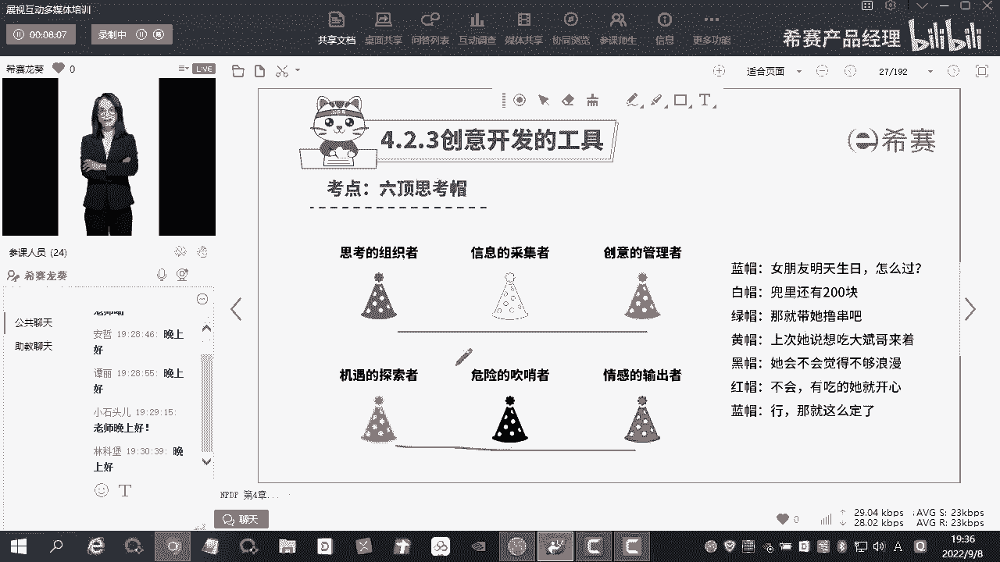

他们各自是负责什么事情，搞清楚即可好。

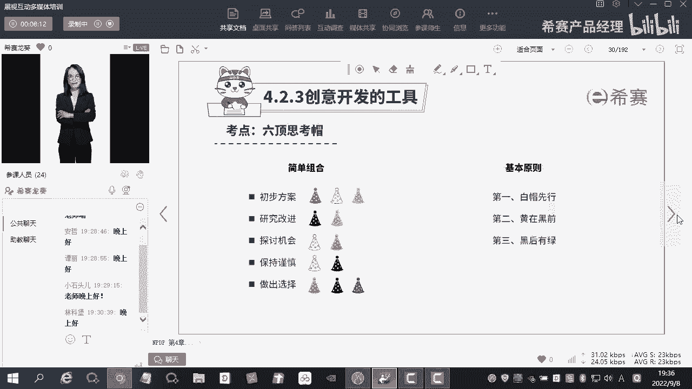

再就到了什么呢，故事版，对不对，故事版这个东西啊啊考试的频率是极低的，但是呢它会在一些其他的章节，或者其他的内容里面附带着去考察，比如说比如说我们今天要讲到的这个概念，场景对吧，讲的概念就是这个概念。

开发里面的一些工具的时候，讲到概念场景，这个工具的时候啊，其实这个东西它就是一种概念场景的一种展示，对不对，故事吧，我们有了一个解决方案了之后，你跟你的开发人员去沟通，发现讲不通，鸡同鸭讲的时候怎么办。

通过这种什么场景呈现的方式，图示的方式，让什么，让对方更加能够清楚地去get到，你这个东西到底是什么，好，这是我们讲什么故事吧，考察的频度极低啊。

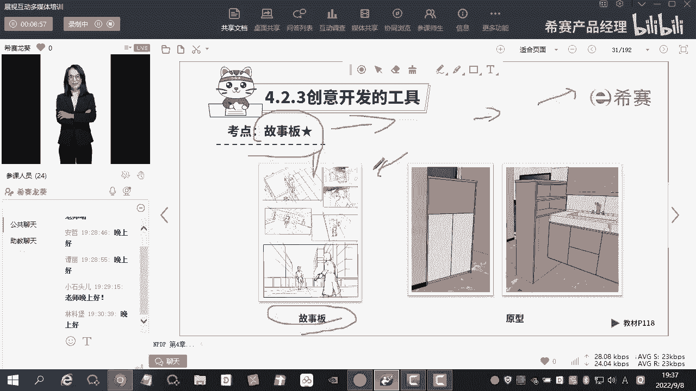

极低了解即可好，再就讲到了什么呢。

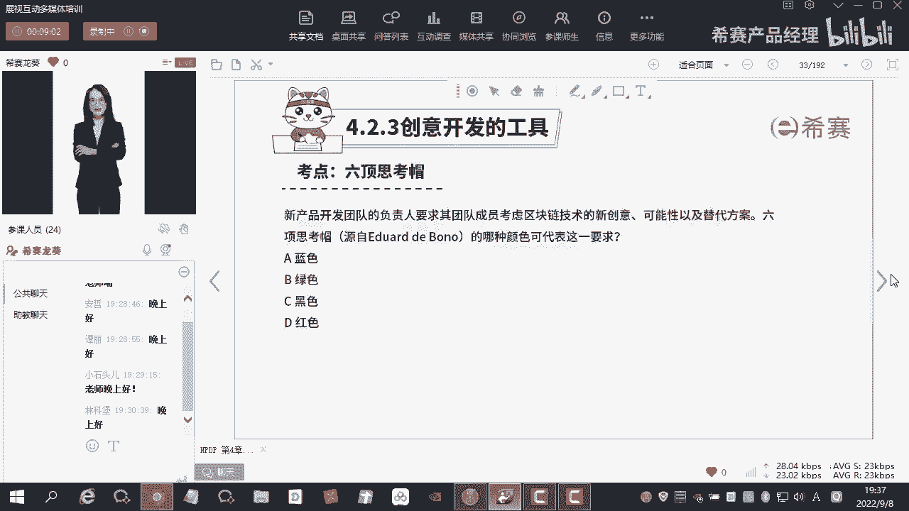

头脑风暴，头脑书写，还有电子头脑风暴，本质都是头脑风暴啊，只不过依托的品呃，这个媒介是不一样的好，另外的话呢讲到了一个名义小组对吧。

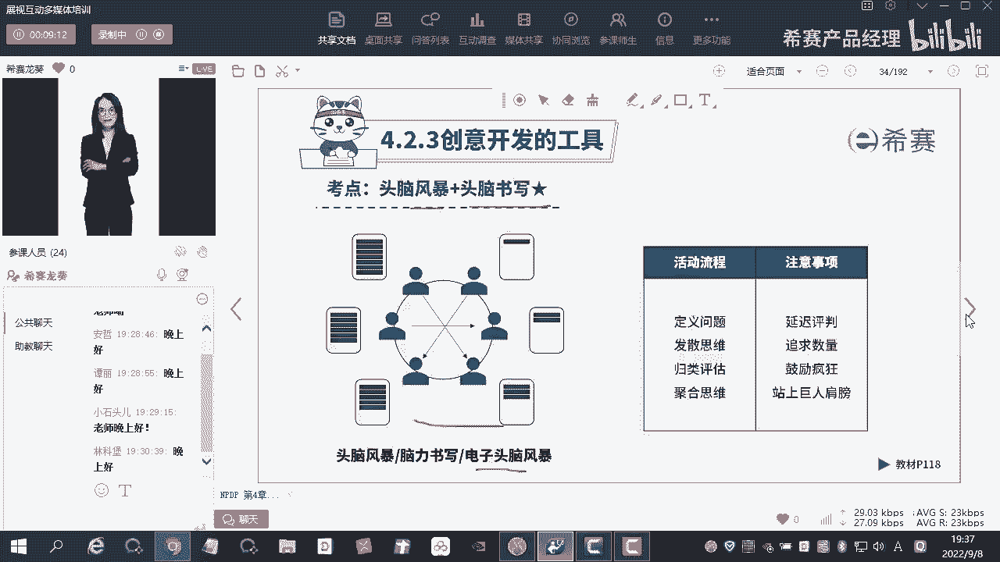

名义小组和头脑风暴，他们两个的本质区别是什么，责任心是吧，都有头脑发呃，风暴发散的一个过程，但是呢民意小组会产生排序，是不是会产生排序，会产生排序啊，好另外呢讲到了一个交警小组，是我们第六章的内容。

第六章内容的话呢，关于这个焦点小组啊，它和名义小组的区别就是它是一个强控制啊，它会有一个范围的一个射线，而他的话呢是没有的啊，这个我们在第五章的时候，还会再一次的着重的去介绍。

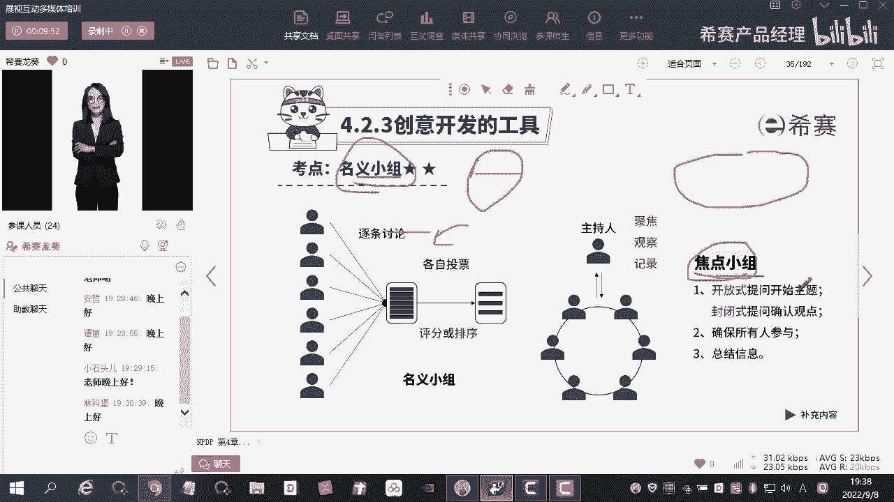

好吧好，另外的话呢就是德尔菲，德尔菲，他跟你讲这么些东西啊，没有必要去记这么多，没有必要，你只需要记住什么呢，它的最核心的一句话，专家匿名多轮迭代趋向一致，对未来进行预测，对创意进行研究不都可以。

除非什么呢，除非啊我们既然是一个新版的内容，那么他可能还会考你什么呢，考你第一步，第二步，第三步，第四步，第五步，第六步，第七步，各自每一步是干什么，这是什么，这是他一个新新进阶的一个考法啊。

这么多年了，基本上德尔菲这一块，他是没有给你去考的这么细的，所以这个地方呢我给大家顺带的去提一嘴啊，你们要知道这个知识点，他可能会考你什么东西好。

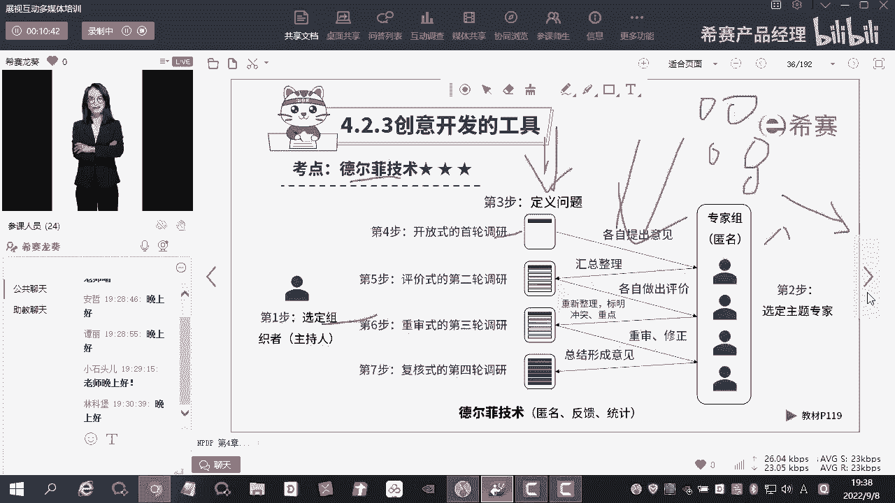

然后就讲到什么呢，讲到思维导图和清河图这两个东西啊，它都是一些图形化的一些技术，但是思维导图它是一种发散的啊这个过程，然后呢清河图是什么，它是一个收敛的过程，那么关于清河图和思维导图。

他们两个的话呢在考试的时候啊，如果只是一个图形化的图解技术的话，选什么呢，选思维导图，因为我们书本上只有思维导图，那如果说啊他讲的什么，他讲的是一个趋于分类的这样的一些信息的话，那么就是属于什么呢。

亲河图啊，清河图思维导图它当然可以被用作来分类，做聚合也可以，但是呢它最本质最开始的时候，它是一种什么发散性思维的工具啊，所以这个地方请大家注意一下，考试的时候也不会太难。

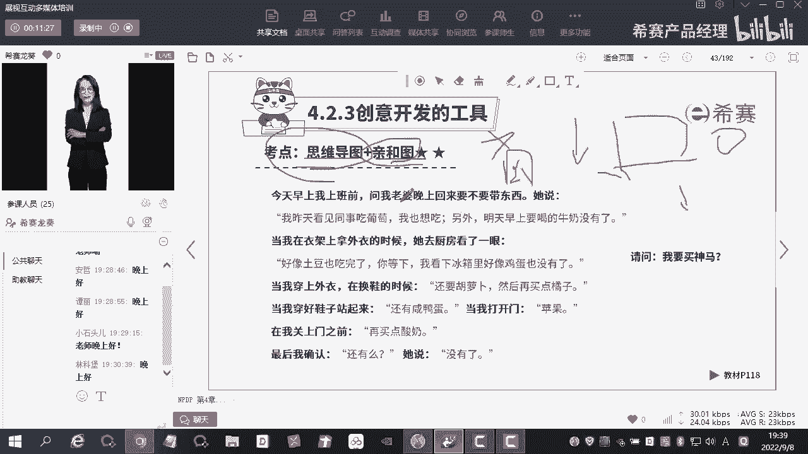

就是我刚刚讲的这个点，你搞清楚就没问题了，好到上节课为止啊，我们是已经学完了这么几个工具对吧，这几个工具啊。

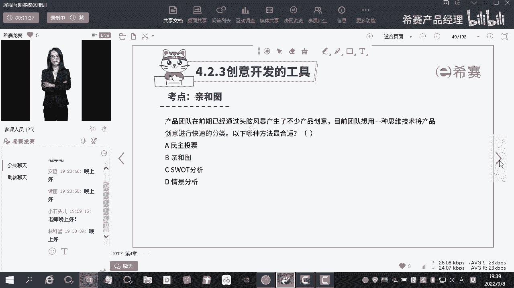

很多人呢到这里他就已经搞不太清楚了，谁和谁的区别到底是什么，那么接下来我们还会有很多的工具啊，所以呢大家啊就是课后啊搞一搞这个思维导图，把自己的这个逻辑给捋清楚，好不好好，另外我们来看啊。

接下来我们要学学习的内容啊，今天我们的进度的话呢应该是会到呃，这个我看一下啊，这个ppt是多少页呢，应该是会到这个概念开发的一些工具啊，大连开发的工具，我们今天希望是能够讲到翠子吧，希望能够讲到翠子。

就算讲不到翠子的话，应该也就是在这附近啊，在这附近好吧，今天的课程呢是两个小时啊，好首先我们来看到人种学，人种学这个东西的话呢，我们在第五章做市场研究的时候，会再一次的去学到它，你发现没有改版之后啊。

他很多的工具它有一些什么，它有一些这种使用范围的一个蔓延，不单单的啊只是用在某一个领域里面的人种学，把它用在创意开发是可以的，因为我们要去做创意开发的时候，首先得要干什么，得要对用户理解，对不对。

我要对用户去做研究才可能是吧，去发现他们身上的问题，然后呢产生自己的创意，然后在后续干什么呀，后续再形成我们自己的概念，然后再所谓的什么去做相应的一些评估，对不对，这个过程大家应该能理解是吧。

那么人种学这个方法的话，其实就是一个非常好的一个工具，干嘛呢去做用户研究的一个工具，他是什么呀，他是观察用户在自然环境，比如说厨房啊，营地啊，建筑工地呀等等等，为什么是人种学呢。

人种人种它是研究的某一类人群，对不对，我们讲没有一个公司的产品，它可以覆盖什么呀，可以覆盖全人类，70亿人口甚至更多的人口，或者说是就拿中国来说吧，你生产一个产品，你不可能是为14亿人口去做的，对不对。

你可能就是为某一个人群去做的，比如说我们在第一章的时候讲到什么战略，讲到了细分市场战略，对不对，为什么要有细分市场啊，因为公司的精力是有限的，它必须要聚焦才能够什么呢，有的放矢是吧。

所以呢人种学人种学诶，这个人种其实就是体现了什么，每一种不同的人的选择，每一种不同的人，他都会有相应的一些特征性的一些东西是吧，他们会有不同的行为习惯，会有不同的一些经历，对不对，好，那你看啊。

我们呢需要干嘛呢，需要把自己放在这个人群中间，去去观察这一类人群，这一个人种，他们在实际的生活和工作中间，到底是如何去工作的，在工作工作的过程中到底遇到了一些什么问题。

这对于我们产品的创意到底有什么启发，就比如说呃大家家里有没有小孩，小孩都比较喜欢有一种意志类的这种游戏，或者说工具叫什么的，叫乐高游戏，对吧，好，很多人还会花花这个钱去做，去买这个乐高的课程。

当时呢就是有一个学者啊，专门去做了这样的一个研究，就是通过人种学啊，他们要去做这个产品的改进，然后呢，他们就采用了人种学识和方法，去做这样的一个用户研究，发现什么呢，发现我们以前的这种乐高。

乐高的这种玩具呢，它更多的是针对什么，针对单个的人，对不对，争论单个的这个小孩子，然后呢给他提供一系列的这个工具，然后呢让他们自己去买啊，或者说是大积木啊等等的，但是呢会发现。

如果啊那个家里边有两个小孩的话，他会什么呢，它会导致一种现象，这种现象就是啊大的小孩在玩乐高，但是他那个小的小那个小的小孩子呢，他不让他玩乐高，然后呢把这个乐高呢给他摔了稀巴烂，这个东西你别看了。

好像是发生了很平常的一件事情，但是啊他在一段时间内对乐高这个公司，对于这个产品的销售是有一个非常大的影响呢，为什么他需要去改变，或者是需要去寻找一个新的创意啊，为什么，其实就是因为遇到了销售的下滑。

所以他们希望去解决这样的一个问题，但是解决这个问题，你不能够说是我不在用户研究的基础之上，随便去改呀，我们得要去做用户研究是吧，好然后呢他们发现了这样的一种现象。

后面呢觉得哦原来可能是因为这样的一个原因，你说那个小孩他就是那个更小的那个小孩，他不愿意玩那个吗，其实并没有对吧，他也想玩，但是他为什么会去破坏这种行为呢，其实就是因为哥哥沉迷于这种什么乐高，游戏之后。

他就不再陪他玩了，所以怎么样去很好的去解决这个问题呢，其实就可以什么针对这一类人群，对不对，有两个小孩的家庭，我能不能够去开发出一些什么，像就是相互才能够完成的，或者说更多的人才能够完成的。

这样的一种什么乐高游戏，是不是就很好的去解决了这样的一个问题啊，另外一个就是呃可能啊我们的国家的话呢。

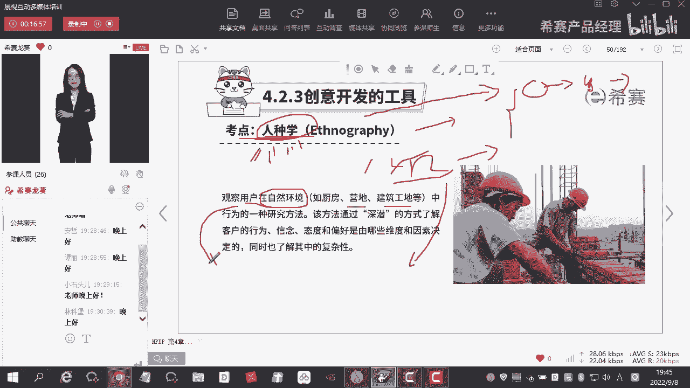

对于这个色彩啊，还没有那么的就是那种一呃也不叫依赖程度吧。

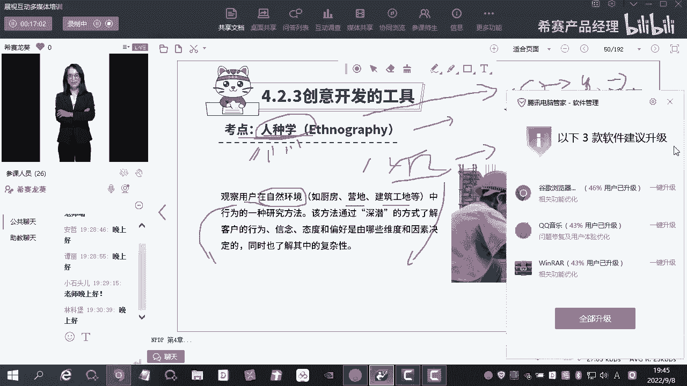

应该是怎么说呢，就是对于那种色彩的敏感度还没有那么高，嗯你像韩国啊，韩国的话呢，不管是老人还有那个呃就是青青年啊，或者是中年的话，他们都比较喜欢什么呢，素色的一些衣服对吧，那你相反的。

你比如说印度啊这些国家的话呢，他可能像那种老一辈的这种人的话呢，他对于那种色彩比较鲜艳的这种东西的话，会比较喜欢，然后呢年轻一代的话呢，因为受到了更多的一些时尚的一些理念的，一些宣传的话。

或者说渲染的话呢，他们会更加喜欢一些比较素雅的一些东西啊，那就会导致什么呢，导致导致在一个家庭里面啊，会正经常的去出现争吵，出现争吵的原因是什么呢，原因就是婆婆和儿媳啊。

一直都是一个什么不可调和的一种状态，那么这个时候的话啊，对于买家庭的生活用品来说，它就会存在这样的情况，这种家庭到底是谁能够去做这个决策呢，我们在最开始讲商业画布的时候，大家还记得吗，讲商业化部。

我们讲到了谁是这个产品的使用者，谁是这个产品的什么影响者对吧，我们要兼顾这几类人群的考虑，你不能够单独的就是，我就考虑说到底是谁去使用这个产品，使用的产品，她可能儿媳和婆婆都会去使用对吧。

所以这两个方面我们都要去进行一个调和，经，经过这样的一个什么呢，深入到这些个家庭内部之后，我们发现啊，他们之间的这种矛盾，主要是来自于对色彩的这种敏感度，所以他们做了一个什么改进呢。

对他们的这个产品做了一个什么改进呢，把这个瓶子啊分成了上下两部分，因为原来老的老的那部分的人啊，身高比较矮一些，营养没有那么好嘛，所以呢，你你的这个东西把它放在很高的地方的时候啊，你从下往上看的时候。

你觉得这个瓶子的底部是非常的绚丽多彩的啊，那我用着也很开心，对不对，那我们这种年轻人的话，他比较喜欢素雅的颜色好，我站在比较高的地方，哎我的身身高比你高一些，我从我的这个平行视角看过去的话。

它是一种比较素雅的这样的一种颜色，所以我也会比较开心，那么就是不是就很好的去调和了，这样的一个矛盾，导致什么呢，他的这种产品啊，在这个地区的话呢是卖得非常好的，但是对于这种东西的话呢。

呃我觉得哈其实我个人会觉得有点点不太理解，因为这个东西当你拿到手上了之后啊，你去看的话，其实嗯对于老人来说，它也只有下面这一部分是比较花的，上面那一部分也是比较素色的，我只能是从另外一个角度去考虑，说。

唉，这个产品它兼顾了两个方向的这样的一个意见，所以呢能够得到双方的这样的一个认可，从这个角度来说的话啊，是成立的，你要说真的说这个东西嗯，就是通过这上下两层，能能够去很好的去影响他们的这样的一个行为。

选择的话，我表示存疑啊，但是不管怎么说的话，这两个案例其实都非常好的体现了什么呢，非常好的体现了我们在做这样的一些创意选择，或者说产品改进的时候，想要去获得一些思路的时候怎么办。

可以去把你的这个用户画呃，这个用户人员啊选定了之后，然后把自己沉浸在那个什么氛围里面，然后去看一看他们的一些行为，到底是如何去影响他们的一些消费的好，这是讲什么呢，讲人种学，所以人种学啊总结起来两个点。

哪两个点，第一个你需要去到环境中对吧，去到真实的环境中间，你要和他们融为一体，去观察，去了解，在这个过程中间啊，更多的是观察，你可不可以和他们去交谈呢，可以但是呢交谈不是最重要的手段啊。

可能更多的是通过观察啊，通过观察第二个是什么呢，第二个是要深浅，什么叫深浅呢，你一定要什么，比如说你想要去研究啊，这个成都人民他们他们的一些什么消费习惯，那你说哎我去到那里一天两天这种行不行。

其实不行的，一天两天，你能够对于他们当地人的生活，有一个比较透彻的了解吗，他们的生活习惯，他们的什么这个呃一些用户的心理，你能够了解吗，了解不了，所以这种方式啊它的耗费的时间是比较长的。

它的耗费时间比较长，你一定要深入的去啊，把自己投入到这个领域里面去，投入到这个氛围里面去啊，所以这是他的第二个要点叫深浅申请啊，考试的时候是很关键的啊，另外第三个就是他研究的是什么呀。

他研究的是环境对于什么呢，对于消费者的行为习惯的影响，就是说这些个自然环境和他们的人文环境，到底是怎么样去影响他们的什么产品的选择的，对吧，到底怎么样去影响他们的产品选择的，这是啊关于人种学。

那么关于人种学，大家还有还有什么疑问吗，还有没有疑问，关于任正确啊，它的最大的三个要点已经给大家去解读出来了。

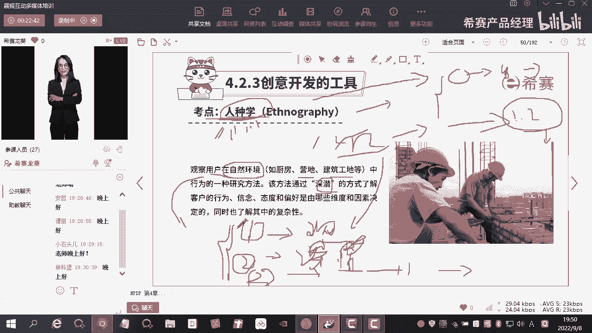

好接着我们再往后看啊，再往后看叫生命中的一天哇，这个东西看起来和这个人种学极其相似啊，对不对，但是啊你看你光看这个题目的话，你都能够知道它们之间的一个，最大的差别是什么呀，这叫生命中的一天。

我研究的是24小时对吧，而之前我们讲的什么长时间的一个环境的影响。

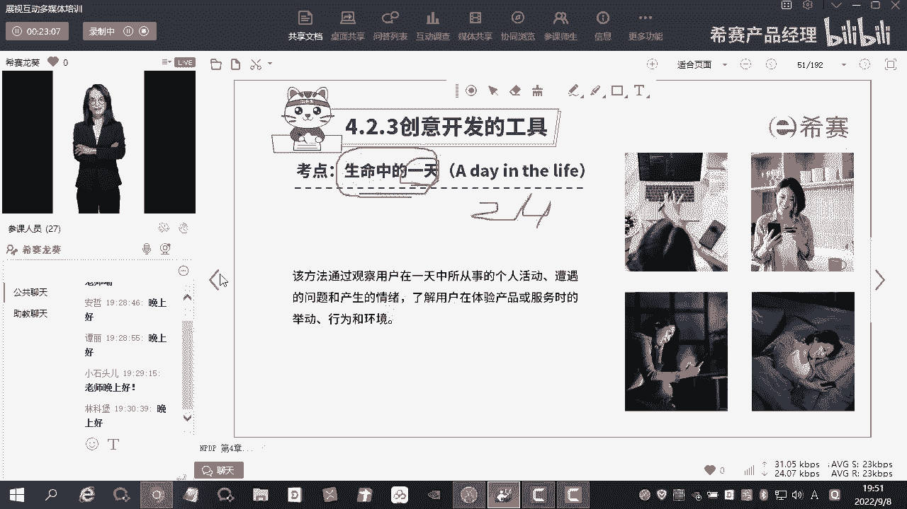

是不是好，那你这里看生命中的一天。

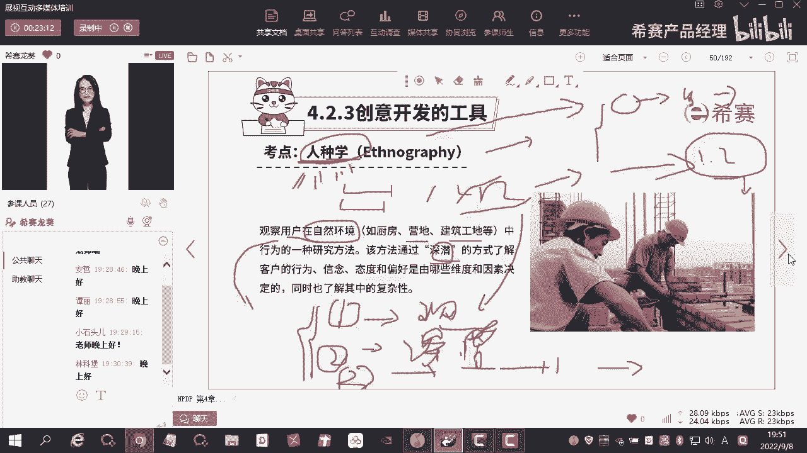

他有没有环境，它也有环境，比如说你看啊，该方法，通过观察用户在一天中所从事的个人活动，遭遇的问题和产生的情绪，了解用户在体验产品和服务时的举动，行为和环境，什么意思呢，比如说你看到右边的啊，对不对，好。

就讲这个手机的话，手机你在最开始早上工作的时候会不会用到，那么这个手机它是处在一个什么样子的位置呢，你对它的使用频次是什么样子的呢，早上你主要是用这个手机拿来干什么呢，在你做这件事情的时候，对不对。

讲的是什么，你在体验产品的过程中间，我把这个产品放到你的生活中间去，他在每个时间节点扮演的角色是什么，它是如何去影响你的工作的，你的体验到底是什么样子的，你到底在这个时间段用的它的功能到底是什么。

感受如何，对不对，好，那你看比如说我在什么，我在喝咖啡，或者说是呃搞其他的一些事情的时候，哎我在想拿手机干嘛，可能是为了去打发时间，去看一看或者是什么呢，或者是比如说他拿了一张卡片，对不对。

拿了一张卡片是要干什么呢，可能用手机支付对吧，是不是用手机支付客户，甲方马上要给你打打款了，你开不开心开心对吧好再然后是什么呢，夜深人静的时候，我把我把我的什么手机的夜拍模式打开。

或者是把我的手机的这个，夜间阅读的模式打开是吧，或者是什么呢，有些女生哎没有时而没有这个工作的时候，喜欢干嘛，喜欢自拍，是不是这都是一些什么，都是一些你的这个产品，在这个具体的什么生活中间的一些什么。

具体的场景的应用，然后呢在什么睡觉的时候用这个手机，他又是充当了一个什么角色，你主要是用这个手机干什么，你的体验感受到底是什么样子的，我在这几个时间段我收集什么呀，我收集你的这个产品。

具体的一些体验方面的一些信息。

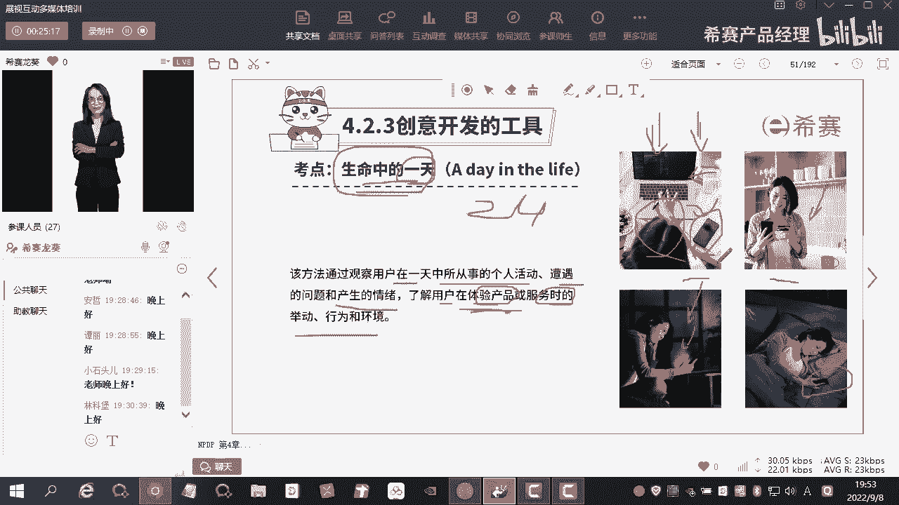

是不是好，那你再看啊，回过头来你再看人同学，他们两个极其相似对吧，但是极其相似的同时下，它又有一些比较明显的一些区别，人种学有没有讲到说诶，我现在去观察这个产品在这个过程中间的一些，具体的一些情况啊。

其实没有提到，对不对，他更多的是偏向于去做一个什么，创意型的产品啊，创意性的产品你要去先了解这个用户群体，然后针对这个群体，针对他的一些什么习惯，再去做你后续的一些产品的创意的开发。

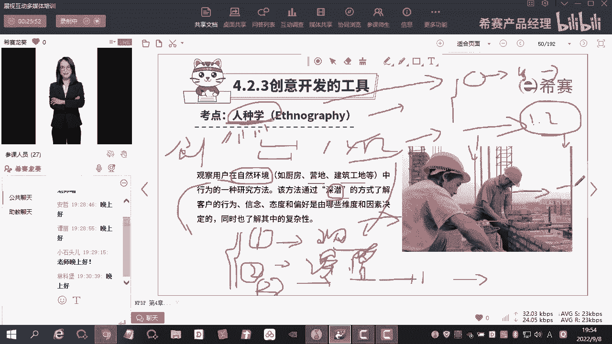

而这个的话好像有点类似于什么呢，你有了这个产品，你去看一看你的这个产品在他的生活中间，到底使用频次是什么样子的，感受是什么样子的，有点类似于什么，更加偏重于这种产品的一些改进型的东西是吧，对不对。

这是一个区别点吧，第二个区别点是什么呢，第二个区别点就是什么时间的维度差异，这个是要深浅时间的维度会要长一些，而这个的话呢生命中的一天，一天是24小时是吧，所以呢这是它的第二个区别啊。

第二个区别关于生命中的一天就涨这么多。

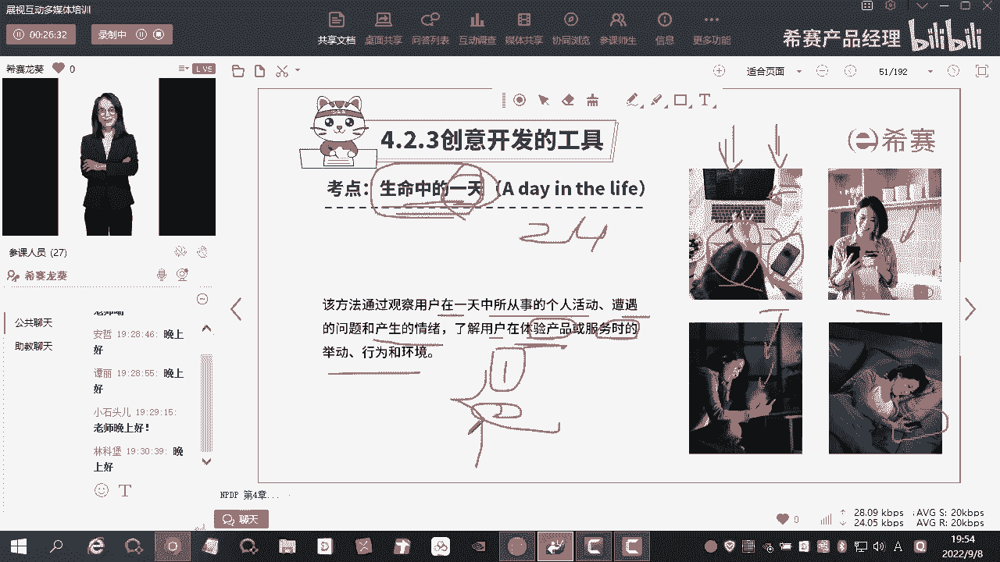

好吧好，接着呢我们就来看到移情分析，好，移情分析这个东西啊，如果有学过心理学的话，应该是能够知道的，疫情分析应该是在精神啊，疾病治疗这一块啊，精神分析这一块用的比较多的一种手段，什么叫移情分析呢。

移情就是我把我们的患者啊，患者他可能对于有一些人，比如说我们的自己的父母啊，我们自己的非常好的朋友啊，会有一种什么心灵的寄托，或者说感情的寄托，你对于他们的感受或者说印象是比较好的，那么对于什么呢。

对于你比如说你是一个什么心理咨询师，或者说是一个治疗师，对不对，你怎么样站在他的角度啊去思考问题，然后呢把他对于他们的这种比较什么，比较依赖或者比较信任的感情，把他移情到你身上，他能够更加相信你。

然后呢更加愿意去吐露自己的心声，然后给你，然后让你更好的去了解什么，了解他们内心的真实的想法，这个其实就是一个移情的过程，如果你不理解也没有关系啊，不用想的那么复杂，其实一个词就能够解决，叫同理心。

对不对，我们现在不管是讲销售也好，讲运营也好，还是讲我们的做产品也好，都是要有什么以人为本，以用户为中心对吧，以用户为中心的话，你必须要什么呢，你必须要把自己当成用户，然后站在用户的角度去思考。

才能够什么呀，才能够去真正的去了解客户，他到底想要的是什么，所以我们来看一下啊，与客户进行深入的沟通，了解客户，并与客户建立直接的情感联系，设计者呢需要将自己置身于客户的世界之中，了解客户的问题。

并从客户的角度提出解决方案，好到这里的话，大家又会觉得哇，移情分析和人种学，以及和生命中的一天也好像哦，但是啊你只能这样子去理解。

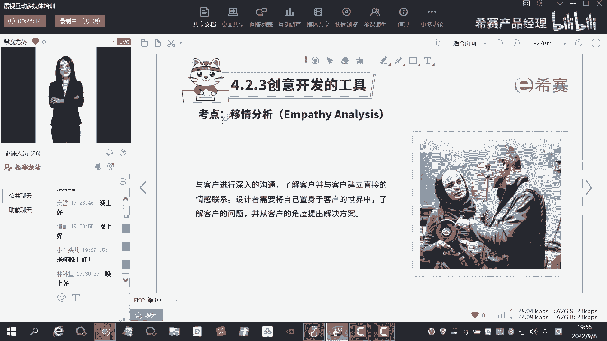

怎么理解呢，你在生命中的一天的这种什么调研的过程中间。

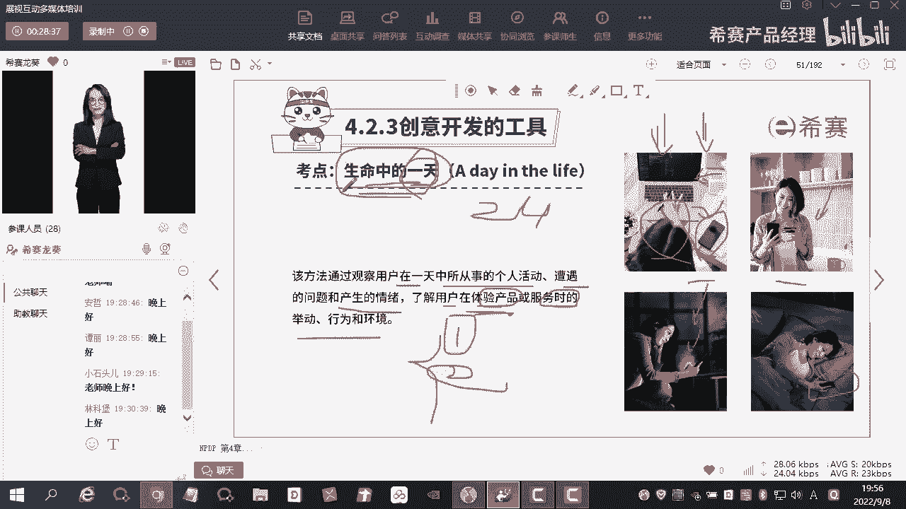

或者说在人种学调研的过程中间。

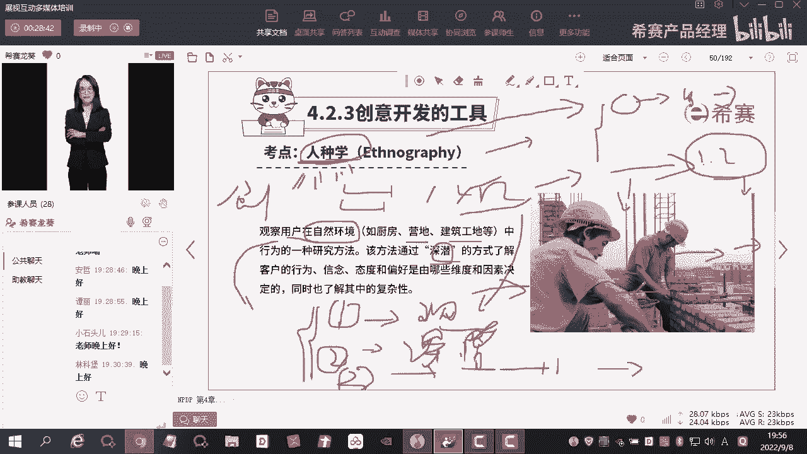

你可不可以用到移情分析的这样的一种方法呢，其实是可以的，比如说你做人在人种学调研的过程中间对吧，人种学调研的过程中间，你去了解了这样的一个生活环境了之后，你得要去真正的去理解它。

站在他们的角度去感同身受，为什么你要去深浅啊，你为什么要申请，其实就是这个时间你如果太短了的话，你并不能够什么，把自己融入到这个文化氛围当中去，并不能从这个角度更好地帮助你，去深刻的去理解你的用户。

所以我们讲啊疫情分析这个东西的话。

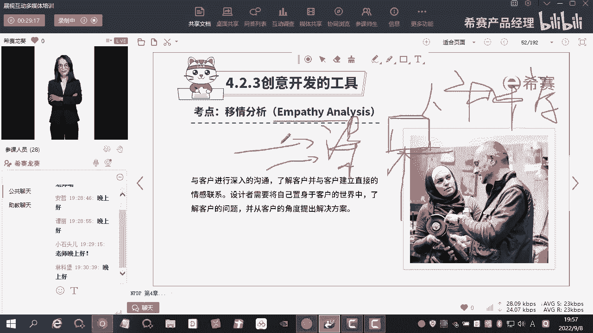

还有包括我们的生命中的一天，还有包括什么这些个人种学，你不要把它单独绝对决然地割裂开来，很多工具它并不是互斥的，它是什么，你在用什么生命中的一天的时候。

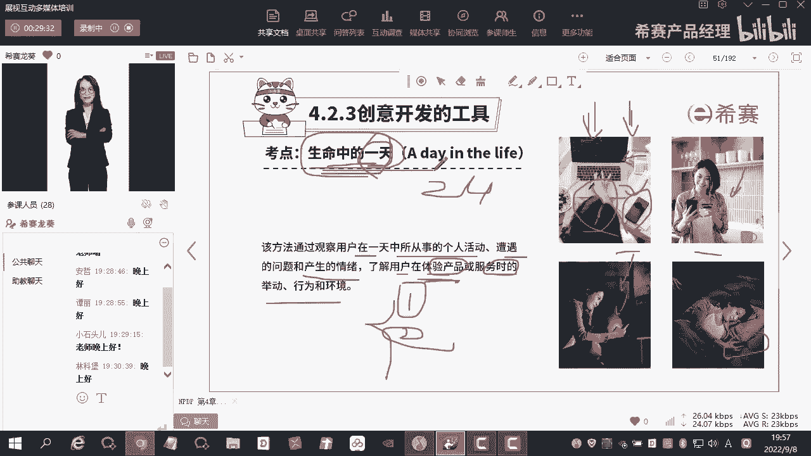

你需不需要移情啊，你需要移情，你在做人总结的时候，你需不需要移情啊，你需要移情，而这个移情其实讲的什么，讲的就是你和客户建立一个情感的互通联系，你站在他的角度去思考，他就叫什么呀，他就叫移情。

没有什么太多的一些什么高科技的东西啊，好这是关于疫情分析，还有我们什么呢。

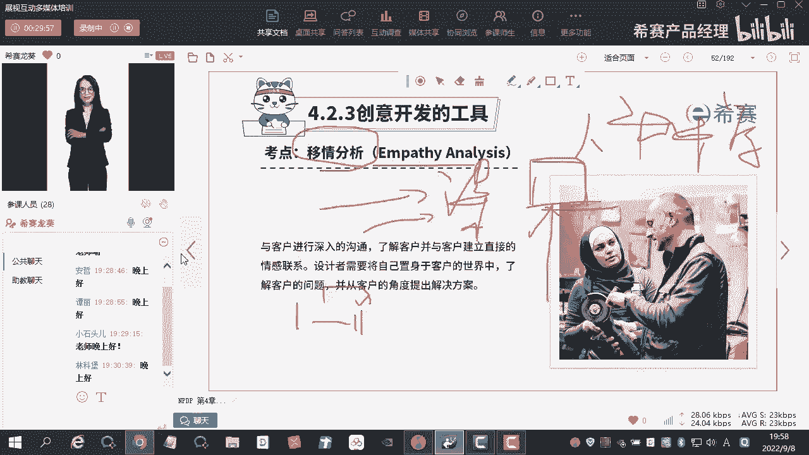

在生命中的一天，还有在人种学啊，这三个点上面的一个什么对比啊。

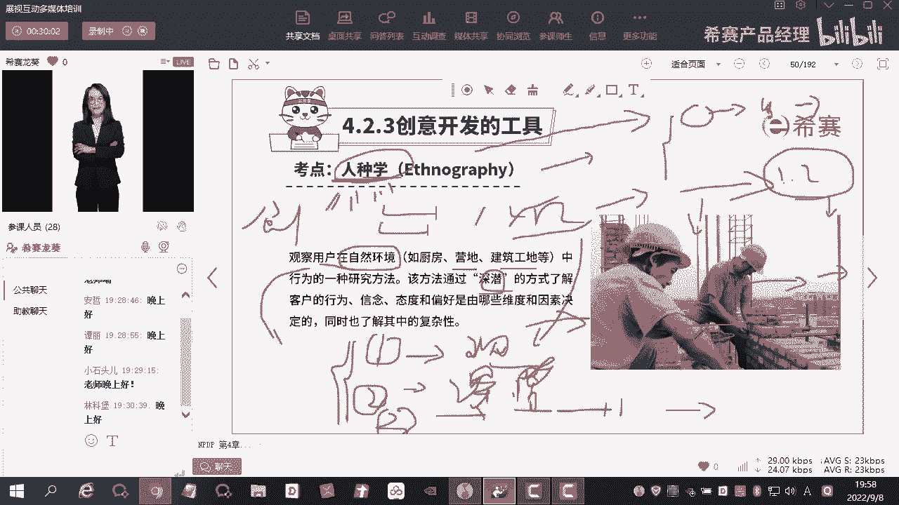

好那么关于考试的话啊，这三个东西呢它是一个新加的内容，新加内容的话，我们预测的话啊，关于这三个点，它最多就是考你概念啊，最多就是考你概念，我们来做一些，做一些题目。

来感受一下他大概会怎么样去出考题好不好。

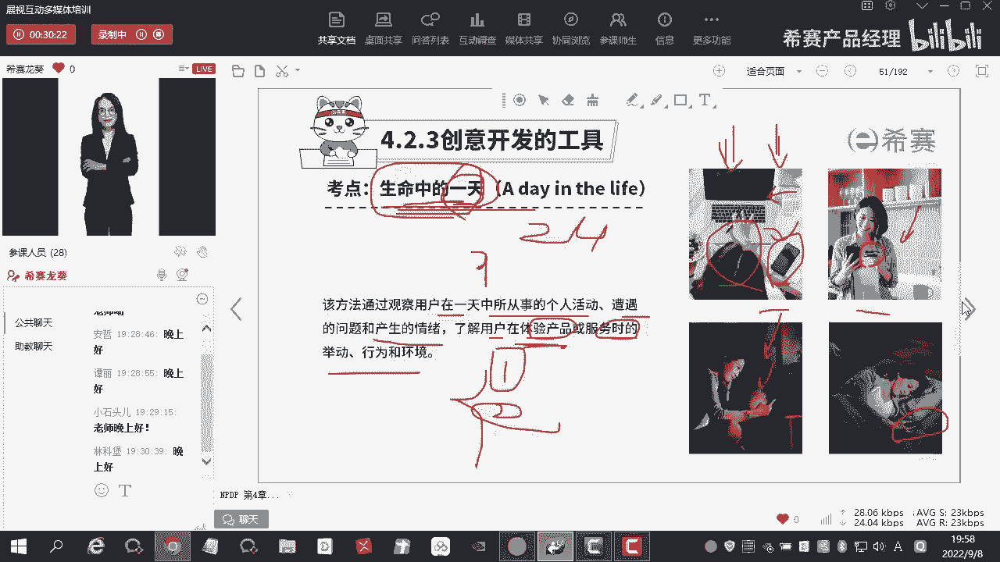

好这个题目呢大家都做出来了啊，我们来一起看一下好不好，哪一种方法是通过观察用户在自然环境中的行，为来获得创意的，人种学，对不对，人种学的三个特点，第一个第一个是什么，我们要深浅，对不对。

第二个时间的维度很长，第三个是自然环境和什么和人文环境，更多的是人文环境啊，这些个文化氛围本身的一些风俗习惯，他们对于这部分人群的什么消费行为的影响，所以呢你看这个题目，从它的题干的中心的意思来看的话。

应该是属于什么人种群，对不对，用户画像，用户画像是我要去把我的用户啊，通过打标签的方式啊，形成这样的一个什么，形成这样的一个啊这个这个划算的一个展示，题干有没有体现，没有体现例题思考帽有没有体现。

有没有白帽子，黑帽子，黄帽子没有，对不对，德尔菲什么专家匿名多轮迭代也没有体现，所以这个题呢很明显只能够选择第四个啊，好再来看一下这个题目，大家做一下，好观察用户在一天之中你看到没，关键信息来了吧。

一天之中的活动遭遇问题和产生的情绪，了解什么呢，刚刚我在做他们二者对比的时候，是不是有给大家去强调这两个内容啊，对不对，所以肯定是选什么呢，选生命中的一天，而不能选什么，不能选人种学疫情分析。

他有没有讲到说你们情感之间的互通啊，他可能讲到了情绪，但是他讲的什么，讲的是客户在这个过程中间产生的情绪，他讲的是单方面的，对不对，讲的是单方面的，如果是移情分析的话。

他们是需要找到双方的一个情感的一个互通的，对不对，所以不能够选移情分析啊，虽然他有情绪这个词嗯好再来看一下这个题目，大家感受一下，这个就是我刚才讲的对吧，他们会有一个什么情感的一个互通，一个联系。

一个换位思考，一个同理心的这样的一个什么意思在，所以呢这个题目，你能不能够读到这样的一个意思啊，显然是可以的，观察情绪的体验，建立直接的情感联系，联系是什么，联系是双方才有的，对不对，所以它是什么。

它叫移情分析啊，他不能选人种学，也不能选生命中的一天，所以这三个东西啊我们预测什么呢，他们会在这一次的考试啊，也就是11月份的考试中间，可能会做一个区分性的一个考察，所以呢一定要理解清楚啊。

好那么到这里为止的话啊，所有的这个创意开发这一块的工具。

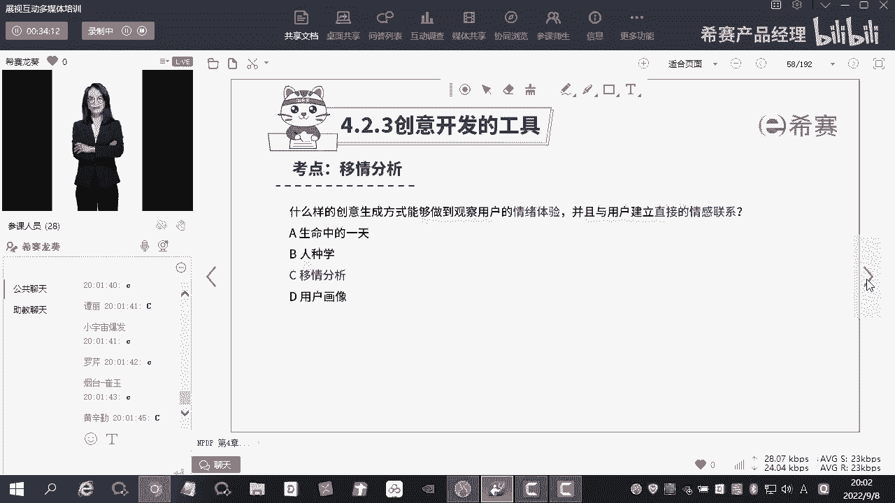

就是相对来说比较简单的部分啊，我们都讲完了，接着我们来讲一讲，相对来说啊实操性比较强的两个工具啊，一个是叫用户画像，那么关于户画像的话呢，其实很多的公司他都没有做，就算做了的话呢，其实也做的比较什么呢。

嗯比较简单啊，比较简单，但是你说他嗯做的比较简单，就没有意义吗，也是有意义的，你比如说我们公司啊，我们公司其实做用户画像的话，那就比较做的比较简单啊，做的确实比较简单好，来我们来看一下啊，用户画像。

什么是用户画像呢，就是我们去查一些这种定义的时候啊，关于用户画像这个定义啊，你会发现不同的人对他的理解它都不一样，有的人呢他理解的比较复杂啊，比较复杂什么呢，比如说我讲用户画像的时候。

可能还会有另外的一个词叫什么叫用户角色，对吧，叫用户角色，但是呢很多人他认为他们两者是不一样的，但是也有人人认为什么呢，用户画像就等于什么，就等于用户角色，他认为他们两个不一样，这种说法。

或者说这种观点它是建立在什么基础之上呢，它是建立在我们去研究用户画像，这个用户画像应该是什么呀，应该是真实的用户，他用了我们的产品之后，我们根据他的一些什么行为，根据他的一些什么啊这个基本的信息的啊。

填写我们采取什么生成，什么生成我们的这样的一个用户画像，方便我们对后续的产品去进行改进，这叫用户画像，那用户角色是什么呢，用户角色他认为是什么，认为是我们在去开发这个产品之前啊。

就是说这个东西还没有上线，还没有真实的用户进来的时候，我们针对什么这些个用户角色，建立了这样的一些虚拟的人物去做什么呢，去做我们需求的一些分析，方便我们把这个产品给开发出来，这个叫什么叫用户角色。

所以用户角色和用户画像，你不用把它理解那么复杂，你就把它等同啊，就就认为它是用户画像就可以了，因为用户画像它其实是什么，我们看它定义啊，它其实也没有去区分，对不对，没有去区分啊。

这个东西可能在这个实际使用的过程中，不同的人可能对他有些许的不理解啊，这都不叫不理解啊，就是理解不一致也是情有可原的啊，也是一种什么正常的现象，好的你看啊，用户画像它是什么呢。

他是对用户群体进行客观和直观的观察以后，所设的所干嘛呢，所设计的一个什么虚构的角色，这个设计啊应该是这个设计啊才对，它是设计了一个虚构的角色，这些用户呢被称之为典型用户或者是什么呢。

用户原型开发者它有什么作用呢，开发者通过对这些个角色进行研究，能够预测客户对产品特性的态度和行为，从考试的角度来说啊，从考试的角度来说，到这里就ok了，他只会去考你。

什么是用户画像以及用户画像为什么很重要，它在创意开发阶段能够为我们带来什么价值，从考试的角度啊，到这里就ok了，但是我们还会给大家去发散性的讲一些，其他方面的一些内容啊，你看到没，下面还有这样的一段话。

这段话呢其实是你们讲义上的，这样的这样的一段话啊，他这里还有一个什么uses profile，然后这里是什么uses personer，这个就是单词的不一样，可能就会导致他们什么理解方面。

存在这样的一些差异，这个这个部分的话啊，你就什么呢，你就把它当做一种课外的资料去理解就可以了，就是我刚刚之前讲的啊，用户画像和用户角色的一个区分好吧，但是呢你不用把它搞得那么复杂。

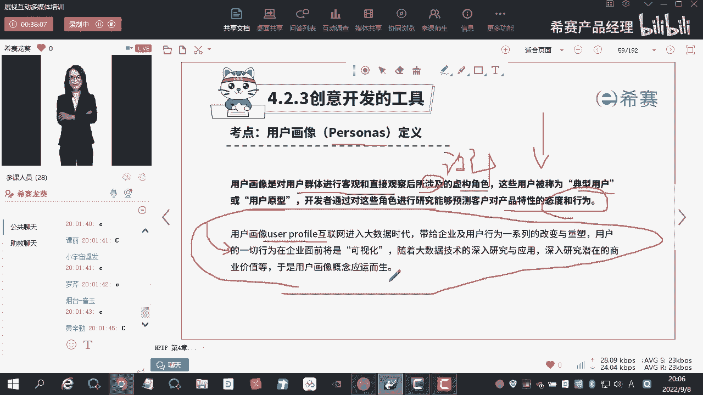

你把他们两个等同就ok了，好好那么用户画像的话呢，我们刚刚之前讲的什么，它能够在我们产品设计，包括我们产品啊这个开发的过程中间，给我们提供一些什么用户研究的一些价值，能够让我们更加清楚客户到底是谁。

他想要的东西到底是什么，对不对，好，那你看啊，它可以帮助我们去审核产品，研究它的可行性，然后呢了解客户的共性和地域的差异，研究用户的体验，研究用户的使用流程，哎，就是我们后面讲到的啊，用户故事地图啊。

这些东西对不对，明确我们的功能到底要做什么对吧，我不是所有的用户我都关心，我，只关心我的典型用户，我只关心我的核心用户对吧，你的用户画像，可能我在我在最开始讲的时候啊，你的用户画像一个企业针对一个科目。

比如说我们的m p v p这个科目，我们的科我们的什么，我们的产品其实就是科目对吧，科目的考试培训，而你们的公司的产品可能就是不同的产品，对不对，那我拿我们公司的这个m p科目来说对吧。

我们之前做用户画像啊，嗯最开始的时候做了三种用户画像，后面呢在这三种的基础之上又去进行细分啊，最终是做了十几种用户画像出来，那么这其实十几种用户画像的话，我是不是所有的东西我都要去满足呢。

我得要去在这十几种里面去挑选出什么，挑选出我的核心这个用户画像，对不对，我首先要满足的是他们的需求，研究的是他们，满足的也是他们对吧，然后我再课再去看什么呢，再去看其他的这样子是什么用户画像，对不对。

所以呢他要明确功能典型的用户，典型的场景，将目标和任务这个东西熟不熟啊，我再一次的又提到了，这叫什么，这叫需求四要素，对不对，需求四要素是吧，我们讲需求不能够是凭空的去捏造它，在什么场景之下。

什么人发生了什么事，要干什么去满足他这样的一个需求，做什么任务，对不对，你只有把这个东西这四要素讲清楚啊，你这个需求才是真实的，要不然我就会认为你这个需求啊是思域啊，思域你们开发和你们的这个产品。

不是经常打架嘛，对不对，有的时候产品突然提了一个需求，然后开发就怼他一句，你这个需求到底是满足了什么，哪一类人群，什么问题，对不对，如果你回答不出来，人家就说我不开发是吧，有没有这种情况。

我们我们经常就会遇到这样的情况啊，就是我去提个需求，要就是过五关斩六将一样的，就告诉他这个东西它到底是什么场景之下，然后呢什么人他遇到这样的一个情况，然后呢他需要做一个什么样的功能。

去帮助他们去解决这样的一个事情，我们能够去很清楚的去明确，我们接下来产品的功能到底要怎么做，然后再一个是什么，在运营阶段了，对不对，运营阶段我的用户增长对吧，我在这个时期我的早期用户是哪一部分人。

早期用户他的行为习惯是什么样子的，我怎么样把这一部分的早期用户给它圈养起来，然后呢方便他去给我做什么，做我的这个口碑营销等等的对吧，然后再就是什么呢，你的产品有很多的什么，有很多的用户之后。

我怎么样去把用户做做一些什么呢，做做一些这种标签化，标签化的目的是什么呢，目的其实就是为我们的用户画像做更新对吧，你在做这个产品之前，你的用户画像是这个样子的好，那有真实的用户进来了之后。

你的这个用户画像要不要变，其实是要变的，通过什么呀，通过你的真实用户，他的一些行为数据，对于你之前产生的用户画像，再去做一个什么调优，那么为下一次什么，下一次的产品更新和迭代去做什么呢，做基础好。

明白没行为记录，数据分析，就是我刚刚讲的这一长串，我就不说了啊，那么用户画像的话呢，要满足一些基本的特征啊，这个特征是什么意思呢，第一个诶这个怎么回事，第一个要什么呢，要有基本性，然后呢要有真实性。

要有独特性，要有目标性，要有数量性，要有应用性和同理心，什么意思啊，什么意思，就是你去做的这个用户画像啊，我们有的时候做用户画像的时候，会陷入一个怪圈，我之前的时候做用户画像的时候就会自己啊。

我什么数据我都没有看，我什么数据我都不看，然后呢我也没有去问这个销售部门，我也没有去问这个运营部门啊，我就自己一个人了，在这个办公室里面啊，就是对着电脑，然后呢在网上各种搜信息啊，搜完信息了之后。

8888就写，就开始写我的p p t了，然后呢就开始去写我的这个用户画像了，用户画像基本上的模式结构基本上是一致的嘛，就是六个格子，可能最开始的时候是四个格子啊，四个格子这个人是谁，张三李四王五。

他是一类人群啊，这个不是具体的某一个人，他是一类人群，好，他的基本的信息是什么样子的，他的职业，他的婚姻状况，他的这个收入，他的职业啊，这职业刚讲了这个属立对吧，还有这个什么啊，性格血型等等这些个东西。

我把它先全部都提炼出来，提炼出来了之后呢，领导反问你几个问题，你就被问蒙了，他说你这个东西数据哪来的，我们的，我们的用，我们的用户里面多少人是这种类型的用户，你有没有去做这样的一个用户的分层，好。

啥都答不上，对不对，你们做用户画像的时候，是不是也会遇到这样的问题啊，是不是这是什么呢，这就违背了它的基本性，什么还有真实性，你的用户画像它必须要是什么，必须要是你的什么呢，经过了一些数据啊。

经过了一些什么信息的采集之后，你才能够做得出来的，不要是天马行空凭空想象啊，好就是要代表它的真实性，然后再一个就是基本性啊，基本性这个东西的话，可能大家也会容易去忽略啊，但是呢比我们之前的这个真实性。

要相对来说好一些，它代表的是什么意思呢，就是说你画的这个用户画像，他一定要具有相应的一些代表性，你不能够说比如说啊，嗯你们公司是一家这个住处，做这个宠物医院，或者说做这个宠物寄养的，对不对。

那宠物寄养这个东西，你要去研究它的用户选择的，基本的这样的一个用户画像，可能是什么猫狗啊，这一部分的这个呃，这个这个这个这个人群是不是养猫养狗的，你不可能直接去搞一个什么养蜥蜴的，或者说养这个养蛇的吧。

对不对，本身这个东西它有没有研究的价值呢，研究价值极小，它不具有基本性，是不是这是常识都能够判断的对吧，所以呢你做的用户画像啊，要有一定的这个基本性，然后就是同理心，同理心又是什么呢。

它是一个相对来说比较比较公用性的，这样的一个概念，就是你张三啊，是这个养猫养狗的，迷你四也是张这个养猫养狗的，然后我把他做了这样的一个用户标签，比如说是这种啊，年薪50万以上的这种it白领啊。

这种养猫用户，那么在在这个里面的话，我去做一些个性类别的一些这种调研的时候，发现他们都有这样的一些需求，这个叫什么叫同理性啊，因为我们讲后面讲这个用户画像的时候，他还会去描述出什么呢。

你的什么用户的需求，还有痛点，对不对，所以一定要有一个什么一个共性所在啊，好其他的我就不说了，好不好好，这是关于用户画像啊。

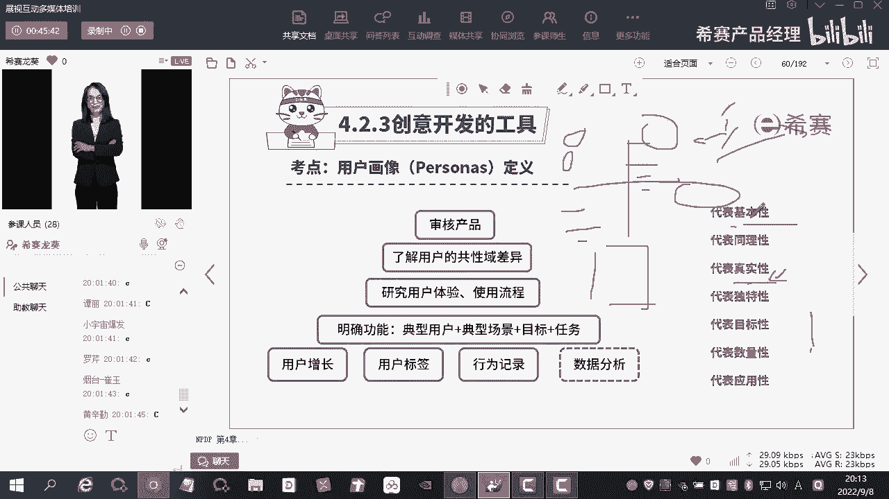

它的一些作用啊，它的一些特征等等的好，那么用户画像的话呢，我们一般建议的是啊这种六个六个格子的嗯，也有那种四个格子的啊，但是四个格子的话呢，没有什么太多的一些实质性的价值，一般我们是怎么操作呢。

一般就是说，你先可以把它的一些基本的信息先做出来，做出来了之后干嘛呢，可能你的这个问题呀还是痛点，还有需求和目标的话，可以通过什么呢，可以通过左边记录了之后，然后给他们去发针对性的问卷。

或者说对于他们去做针对性的访问调查，然后去补充后面的这两个格子，这个是ok的，所以嗯会有这样的一种说法，就是说什么呢，这个用户画像啊，它是从四个格子，然后呢把它进化为六个格子啊，使得你的什么呢。

使得你的信息变得越来越充足啊，越来越详细，这是我们讲什么呢，用户画像的内容，那么用户画像内容的话，你会发现啊这些个什么统计学的信息，年龄啊，性别啊，职业啊，收入啊，婚姻啊，教育啊，这些东西是属于什么。

属于静态标签，对不对，我们讲其实用户画像你讲的直白一点，其实就是就是干嘛就是去打标签，对不对，打标签我们有静态的标签，有动态的标签，什么叫动态标签，什么叫静态标签，我们在我们在后面其实会讲到啊。

那么我们先来看一下吧。

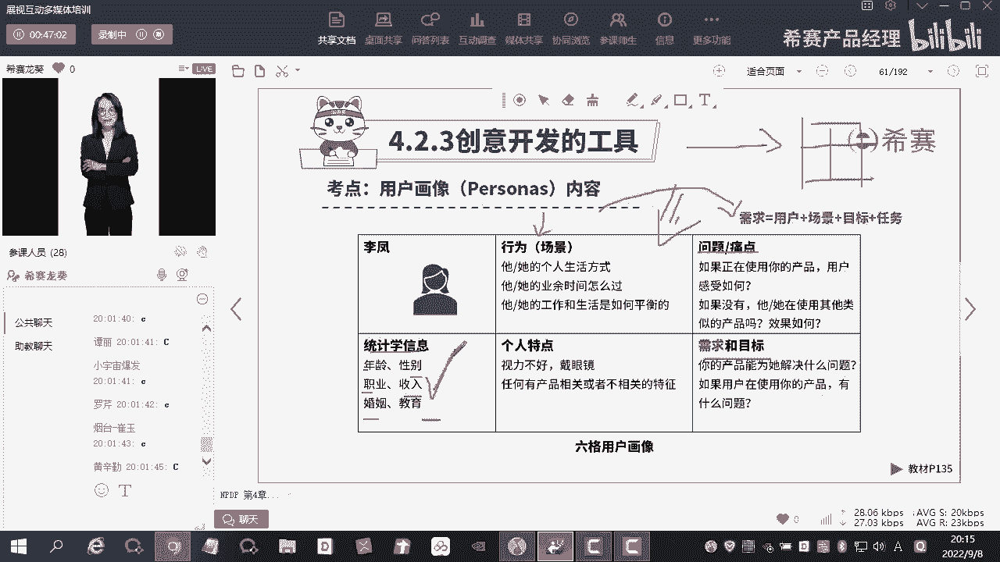

好那你看啊，静态标签是什么呢，就这种自然属性的标签，比如说性别啊，血型啊，地域啊，那社会标签也是属于什么呢，也是属于自然这种静态表情，比如说你的婚姻，比如说你身高年龄，职业体重轻座教育水平，还有爱好。

对吧好，有的人呢他会长诶，我的这个身高一直在涨啊对吧，你这个身高一直在涨，基本上来说的话，你的变化也不会也不会特别的频繁吧，你不是说你不可能说你今天1米5，你明天就1米7了吧对吧，相对来说啊。

我跟你讲了是吧，相对啊，相对相对来说你是一个什么静态的标签，你不可能今年哎我们叫什么50岁，明年就80岁了吧，这跨度没有那么大吧，啊你婚姻不可能我今天结婚，我明天也结婚吧，对不对，教育水平。

我今天是硕士，我明天就是博士了吗，肯定不行，肯定不行啊，所以他们都是属于什么，都是属于在一段时间内，是一个相对比较静态的一个状态，所以呢也被称之为静态标签好，那么静态标签其实相对来说是比较容易获取的。

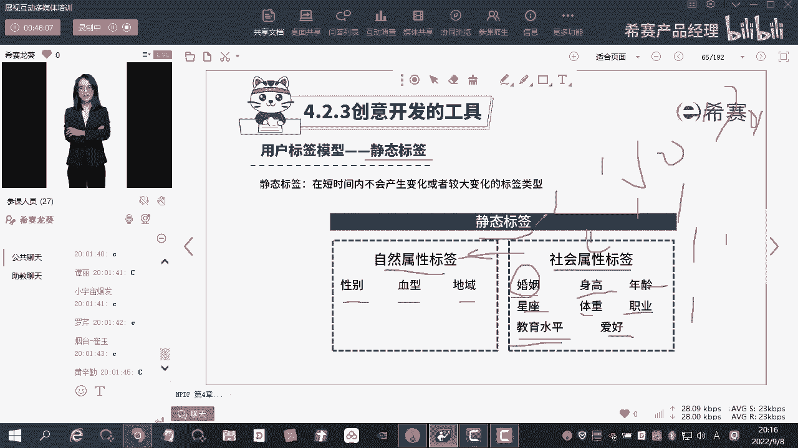

怎么样去获取呢，第一个用户主动填写对吧，你们在报名西赛的时候就会给你发什么东西啊，就会让你去填相关的信息表，对不对，是不会让你们去填相关的信息表对吧，或者是说你去别的一些这种a p p啊。

或者说是用一些相关的产品的时候啊，也可能会要去让你去填相关的一些这种啊表格，你的籍贯啊，你的这个性别呀，你的职业啊，你的住址啊等等，巴巴拉一些具体的一些信息，对不对，那这种方式的话它有一个什么优点呢。

就是因为他是主动填写的，所以它的真实性其实是比较好的，但是啊这个东西呢我也是存疑的，其实这种说法的话呢，现在来说的话啊，也要打一个大大的问号了，为什么呀，为什么，大部分啊这种用户主动填写都是通过什么呢。

通过发送网网络的这种问卷，对不对，他现在有一种有一种情况是什么呀，有种情况就是大家都是想快速的去完成，完成了之后呢，我就赶快去滑滑到最下面，然后就快速的想要去使用这个东西，对不对。

所以这个里面的真实性啊，未必真的是未必，有的时候你去搜啊，比如说你们有的人啊，就是填了这个信息之后，我们去后台去调信息的时候，做这个做这个数据统计，或者说用户画像分析的时候，发现很多人填的信息啊。

其实是有一些字段啊，它是没有的，他没有的，或者说是呢有些有些时候啊，发现他填的这个东西乱填的，他他本来是这个北京人，他非要给你填个天津对吧，有这种情况是不是，但总的来说啊，它的真实性还是有一定的保障的。

那它的缺点是什么呢，需要对用户去进行引导，而且呢对于用户来说的话，它会增加它的什么，增加它的使用门槛，你我本来只是想去你这个app去领一个什么券，然后呢你要你又要我搞这个，又要搞那个，我搞来搞去。

我就搞得我非常的不耐烦了，我就不想搞了对吧，比如说我去用那个什么用，那个就是哎呀叫叫叫什么来着，一下想不起来，就那个腾讯游戏，我想要去打那个斗地主啊，还有打那些个麻将的时候啊，他比如说他告诉我。

今天你填一个什么信息了之后，然后呢我会给你多少多少金豆子对吧，好，有的时候呢我确实是输完了之后，我又想玩的时候，我又不想充钱，怎么办呢，我就想要去填这个信息，但是我填到一半啊，我发现我实在填不下去了。

算了就不填了对吧，就流失了我这样的一个客户，所以呢这一点的话呢，你们可以通过这样的方式去获取客户的信息，但是它有一定的风险点所在啊，有点风险啊，然后第二个就是什么呢，和其他的数据共享。

就是能够直接获取到相同用户的部分数据，节约节约的这个时间成本啊，什么意思呢，第三方服务对不对，通过第三方服务，然后比如说你们有的时候啊登录的时候，哎，比如说我们的这个a p p登录啊，用第三方用微信。

它就会让你去说啊啊同意授权获取你的头像啊，什么什么基本的一些信息，对不对，这是数据共享，然后它的缺点是什么呢，缺点就是获取的信息还是比较有限的，同样呢也是比较被动啊。

而且呢这个方式需要什么达成深度的合作，才能够实现，就比如说啊最直接的是什么，最直接的就是你可能在某一家机构，或者在某一个地方，留下了你的什么姓名和联系方式，结果就有人给你打电话，说谁谁谁。

你们有没有这个买房的需求，或者是谁谁谁，你们有没有这个贷款的需求等等等等一系列的，那么你作为客户，你接到这样的一个什么电话，你的感受是什么，你的感受是很不舒服，而且会质问他，你从哪里拿到的。

我的信息对不对，我要告诉你啊，或者什么什么什么什么之类的，对不对，这种感受是非常不好的是吧，所以呢这是它的一个风险点所在啊，缺点所在，还有是什么呢，是基于lbs服务的一些信息获取。

就是这种基于位置的一些服务啊，信息获取啊，比如说我要去公开获取你的这个位置信息，现在你几乎是打开每一个app，它都会有这样的提示，都会有这样的提示，它提示什么呢，提示诶我要去获取你的未知信息。

然后呢呃可能就是需不需要你，你允不允许授授权什么的授权，我跟踪你在这个app上的这个所有的活动对吧，我一般情况下都是选择不同意不同意不同意啊，好那还优点是什么呢，能够通过技术的方式。

直接去获取用户的部分信息，有利于对用户画像的完善，但它的缺点也很明显啊，收到技术层面的什么，这个是受到受到技术层面的制约，而且获取的信息呢大多数为基本信息啊，就是比较简单的信息，不能够判断购买力。

或者是做精准化推送的核心依据，比如说这呃这个基于这种位置的这种服务，你只是获取了他的什么位置信息，对于说它到底是有实力嘛，还是没有实力嘛，其实不能够做很精准的一个推送，假如说他是北上广深一线大城市。

你可能会笼统的判定为说啊，像这一部分的人群的话，它的消费力或者说他的工资水平会比较高，如果他是什么那种二三线的小城市的话，那可能它的消费力就没那么高，你可能只能够是基于这个层面。

做一个粗略的一个分析和筛选啊，所以就是讲静态标签，它一般的获取方式和它的优点，以及各种方法的这个缺点啊，你们可以根据自己的产品的情况去选择合适的，这样的一种方式。

好现在就是什么呢，动态标签对吧，动态标签和静态标签是相对的，动态标签就是什么呀，上网的时长啊，上网的时段啊，网络环境啊，切换场景啊，下载的渠道，你是第三方还是新媒体，还是递推的二维码。

还或者是什么其他的渠道，你的使用习惯是什么样子的，你的使用频次，你的使用时长，你的使用时间段，使用间隔，根据你的这些行为习惯啊，现在比较火的一个行业叫什么呢，叫直播，网络直播对吧，现在所有的都在万物。

万事万物都在直播啊，就是我们那个我之前我看到那个叫什么来着，茶颜悦色，他也在搞直播，我都惊呆了，我说哇原来这个东西也可以搞直播带货哈，好这个东西我为什么在这里讲呢，其实就是啊基于大数据的分析。

他们会统计啊，统计什么呢，统计各大平台它的一个流量流量情况啊，比如说它的高分段啊，高分段在这个12点到一点对吧，或者说是晚上的十点钟左右，它是什么，它是整个流量的一个高峰段，它的使用人数。

该平台的使用人数，活跃人数是比较多的，那么基于这样的一个情况的话，作为什么呢，作为电商就是卖方的话啊，就是这个直播间的话，它会有一个什么操作呢，它会基于你的这个用户行为去做一个什么，去烧钱，什么意思啊。

叫买流量对吧，买流量，什么叫买流量呢，就是大家都知道这个什么这个时间段啊，人数比较多，观看时长比较长，然后呢向平台付费，然后呢，平台把这些流量更多的分到他这个直播间去，这个这个这个职业叫什么。

应该叫投手啊，应该叫投手，我之前是看了一篇文章，是专门讲这个的，他们的薪资都还是比较高的啊，好这是讲什么呢，讲动态标签啊，这个动态标签的话呢，它就是什么呢，它的变化性表达啊，它会有一些时效性，也就是说。

你这这一天你的行为习惯是这个样子的，那么下一天的话可能他会产生变化，它有它有一些这个不确定性啊，然后再就是用户行为，你的购物的品质啊，你购物的价格，购物的品质啊，点赞啊，你有没有点赞，你有没有分享。

你对哪些东西分享的比较多，观看的时间比较长，停留的时间比较长，然后你的这个活跃的情况是什么样子的，对不对，就是啊现在我我我之前应该是在咱们班吧，应该也说说过这个事情啊，就是说比如说头条。

我有的时候在刷头条的时候，突然之间和我朋友讲说，哎我们哪天去吃火锅，结果过了不一会儿啊，就有有这个推送消息，说这个火锅底料啊，或者说是哪一家周边，哪一家火锅打卡比较好吃啊等等，这些东西又推送过来了。

虽然可能他不太，他不太愿意去承认他做的这样的事情，但是确实这个东西啊，现在真的是感觉自己就是被监控了一样的，这大数据已经大数据，大数据还包括什么，这些个行为分析已经到这种地步了，真的就是有点太恐怖了啊。

还有一次就是嗯我给我的一个朋友啊，就是发了一张照片，这张照片内容我就不描述了啊，发了一张照片没多久，然后第二天啊这个头条还有抖音呢，他就给我推送了相关的东西，你说说细不细思极恐啊，真的是细思极恐的啊。

很可怕的，真的我后面会讲到的啊。

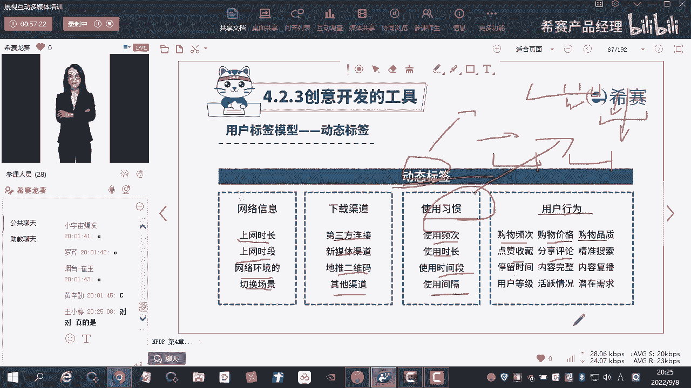

后面会讲到好，那怎么样去获取这个动态标签呢，可以通过sdk买点啊，或者是标签共享或者推荐引擎，什么意思呢，给大家说一下sdk买点的话，如果你是做开发的话啊，这东西肯定是不陌生的，如果你做运营也不会陌生。

对不对，因为有的时候你去做一些sdk的买点的话，其实就是为了去实现自己的相关的一些，运营的一些需求，对不对，就比如说我们公司啊，举个非常简单的例子对吧，我们公司呢这个a p p啊。

就之前有人他跟我们去抱怨，或者说是这个网页端，还有人给我们抱怨说，哎你们的这个a p p也非常不好用，我问他为什么不好用，他说老是给我弹出来一个，这个就是这个这个私域运营啊，就我们内部来讲的话。

其实是为了实现我们的私域运营嘛对吧，好弹出来这样的一些优惠券啊，或者说是一些这个这个推荐的一些这个这种呃，这种什么就是物品清单啊，好然后呢，它会有它会有很多这种就是可以点进去的入口，好点进去的入口呢。

其实在每一个入口它都做了买点啊，他就是去看一看你这些个用户啊，我们的老用户，你对于哪一个方面是比较感兴趣的，那么你点了其中的某一个入口，那我就知道，你可能未来对这个方面是有一定的规划的对吧。

是不是这叫sb可以买点啊，这是非常简单的一个栗子，好然后再用什么呢，再就是标签共享啊，标签共享是什么意思啊，你们现在可以打开你们的这个呃，这个这个这个这个购物车啊，你们可以打开你们的购物车。

哦我之前是没有发现的，我现在我应该是在今年的时候，我忘记是在哪一个月份了啊，思域这个思域啊，我忘记今年是在哪一个，每个月应该就是前不久吧，前不久我买了很多的衣服啊，买了很多衣服。

它上面它会有一个非常小的一个提示，这个提示叫什么呢，叫和朋友共享购物车，和朋友共享购物车，然后呢，它下面还会有一个很有意思的一个提示啊，就是说他会给你推荐很多很多的朋友，对不对，对不对好呢。

然后呢他就会推荐其中的某一个朋友，这个朋友的话呢，他是以前学街舞的啊，或者是学这个爵士的好，你如果勾选了他，然后你就会可以这个这个系统，他就会把这个系统啊，这个这个这个这个购物车里面的东西啊。

再一次的就是推荐给你，把你朋友的这个购物车推荐给你，他这个东西其实就是一种标签共享，什么意思啊，我为什么会收到这样的一个提示呢，是因为我最近报了一个爵士班，我最近报了个爵士班，你报了爵士班之后啊。

一定会老师一定会让你去买衣服，虽然这不是一个硬性的要求啊，但是我问了很多的人，基本上啊你学这个爵士的话，他都会要求你对自己的着装要有所改变，你要变得自信，要变要去尝试自己以前没有尝试过的东西。

结果诶我的朋友中间确实也有这些个人，他们之前也学过爵士，是不是，那我直接把这一部分的人的东西直接推荐给你，你们之间是有这个共享标签的存在和可能的，对不对，那么是不是就能够达到一个精准推送的。

这样的一个什么目的，里面的用户画像在某一些方面来说，它是有共性存在的，是不是好，再就是推荐引擎啊，这个东西的话呢，其实就是讲各大应各大搜索平台的一个，什么流量的互换互换啊，你比如说京东，你比如说淘宝。

还比如说我刚刚讲了什么微信，对不对，微信你在微信上面发了一张什么图片对吧，为什么会体现在什么其他的抖音啊，或者说是头条啊，里面其实就是这些个引擎啊，他们之间的一些数据的互换，所以你可以通过什么呢。

可以通过这个方式啊去获取你的这个动态标签，这个东西啊，不是咱们没，就是怎么说呢，你你有这个概念之后啊，你需要借由什么呀，你需要借由开发这个团队帮助你一起去实现啊，帮助你一起去实现。

不是你通过说哎你现在完全没有接触过开发，然后你自己去做这些个东西是不可能的啊，是不现实的，你比如说我们经常做这个产品开发的时候，那个开发团队啊，开发团队他就会和我们一起啊，开会呢。

我们的这个产品端需求啊会有，然后呢还有什么还运营端的需求啊，还有销售端的需求对吧，这些个需求各方都要满足，是不是，当然产品端的这个需求肯定是一个核心的需求，运营端的需求重不重要。

其实重要还有什么销售端的需求重不重要，只不过我们从什么，从卡洛模型分析来说的话，这些个需求有的是基本需求，有的是期望需求，有的是魅力需求，有的是什么，有的是这个反向位叫什么，反正叫什么。

我现在想不起来了啊，那个名词叫什么，谁来提醒我一下，王晓婷，提醒我一下，我一下子想不起来那个那个那个词叫什么来着，反正不管怎么说吧，意思就是说什么呢，意思就是这个啊反向型的需求啊，就是叫反向型的需求。

通过这样的一些方式啊，去满足各方的需求，好吧，说实话还是不太能理解哎，没不太理解也没关系，现在你第一次啊，你不可能说哎我听完一次，我就完完全全把所有的东西，把他所有的底层的逻辑内核的原理。

全部都搞清楚了，如果你之前是有接触过开发，或者说你在开发领域，或者说是你之前已经做过很多，就是很多年的这个产品了，那你这些东西的话，相对来说理解起来就会比较容易一些啊，后面的话你们可以什么呢。

可以基于老师讲的东西，然后再去做一些拓展性的一些东西啊，比如说你去查一查这个呃，这个用户画像呃，怎么样去实现，对不对，用户画像其实我后面讲到了这几个步骤啊，这几个步骤其实不是一个共性的步骤。

其实不是一个共性的步骤，你比如说有的公司他做这个做这个用户画像，它就不是按照这样的一个步骤去做的呀，对不对，你能说他的他的这个步骤就是唯一的吗，其实不是，你只要什么，你只要是最终能够达到这样的一个目的。

什么目的呢，你建立用户画像的目的是什么，第一个你希望你建立的用户画像具有代表性，具有真实性，对不对，能够是吧，为你的新产品的开发，去提供相应哪些基本的信息，解决你的问题就ok了，你用什么方法。

你用什么流程去做，那是你的事情，你到底是先去做这个动态标签，先去做这个买点，还是先去干嘛干嘛的，都没有关系，但是它基本的原理有一个有一个什么呢，首先我们会有一个基本的啊，基本的这样的一个判断。

说建立了模型，建立了模型之后，我可能要去和客户去什么去，对对不对，我去对，通过一对一的访谈，或者说是这个问卷调查，然后再对我们之前建立的这个模型呢，可能要去进行调优，调优完了之后。

哎我们还得要去这么进行什么，进行评估啊等等的啊，就是基本的一个逻辑啊，好那么用户画像它的作用是什么呢，就是为了什么精准推送，对于你就是精准推送，对于你做产品开发是什么，是什么。

能够精准的get到用户的需求，然后呢根据什么，根据用户的需求，然后去设计你的产品，去开发你的产品，然后呢上线你的产品，去运营你的产品，总而言之就是以客户为导向，满足他们的需求，才能够什么获得产品的成功。

对不对，你看比如说新媒体哎，现在这个新媒体做的这么火，是不是就比如说我最近啊在面试面试了很多啊，这个小伙子啊，小姑娘们啊，就是刚刚大学毕业的，然后我问他，我说你对这个未来的规划是什么样子的。

他就会跟我讲到蹦出来很多的新词啊，或者什么新媒体呀，这个新能源啊，哎好像这些新词他们都知道啊，这词嗯但是呢往深了说的话呢，也好像了解的不是很多啊，可能也是基于什么呢，基于我们这个长沙这座城市吧。

它没有像呃这个北上广深那么的信息发达，或者说是他的确实呃人的这个什么视野水平，是要差一丢丢啊，好那么新媒体的话呢，也是根据什么大数据的一些信息化，然后呢啊通过这个新闻啊，段子啊，视频啊，商品商品等啊。

然后去做一些什么优先位置的一些推荐啊，就是根据你大数据信息化，其实就是什么通过大数据整合，然后知道你的用户画像，然后去做什么呢，做这些个新闻啊，段子啊，这些个内容的一些针对性的一些一些推荐啊。

嗯有一句话是怎么说来着，嗯那个叫什么来着，可能啊呃后面互联网比你自己更懂你自己啊，比你自己更懂你自己。

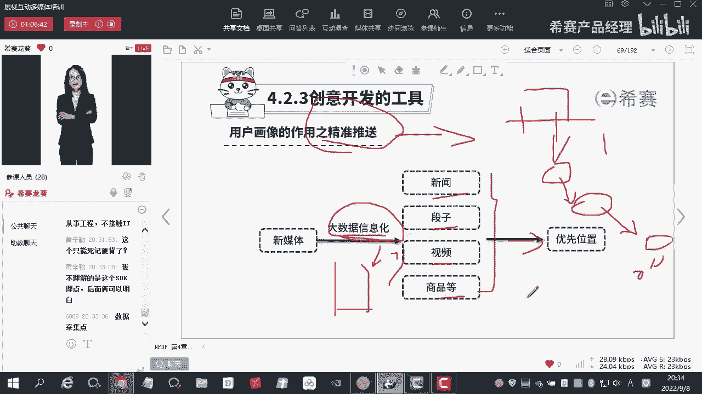

就是因为什么呢，就是因为这些个过程啊，就是因为这些过程好，这个呢是精准推送的流程啊，这个推送的流程的话，其实就是我们刚刚讲的那些东西啊，我们会要去优化我们的模型，会要去建立一个基本的模型。

然后呢会有内容的画像和用户的画像，然后内容和用户去进行一个匹配，匹配了之后呢会有什么协同过滤，然后呢会基于内容，基于热门呢去给你排序，去做内容的展示，然后呢，然后呃展示完了之后会有一些什么点击啊。

会有一些使用时长啊，正向的反馈啊，负向的反馈啊，你到底有没有点赞呢，有没有分享啊等等的，然后去了解到什么呢，了解到新的用户画像该怎么样去啊，补充或者说是完善。

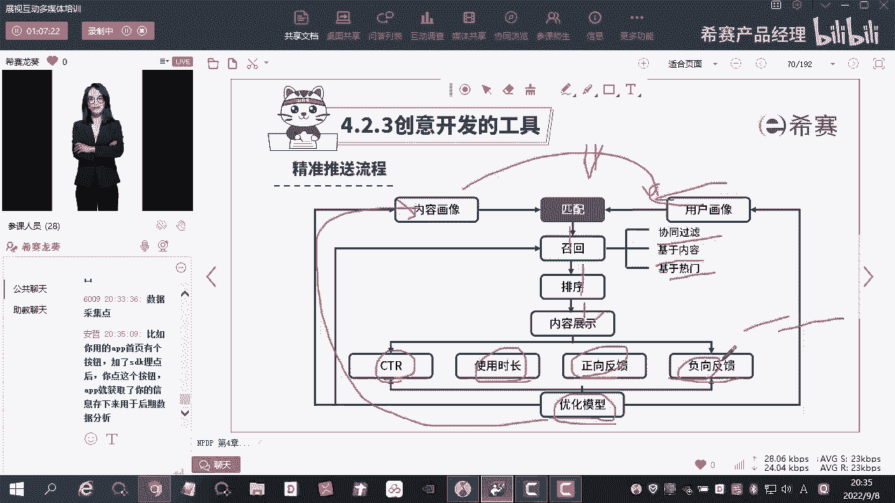

对不对，好，这是我们讲什么呢，关于用户画像啊，到这里的话基本上已经讲完了啊，嗯这个s d k买点后零正按钮啊，对是的是的，刚安哲讲的这个东西啊，可能嗯可能，嗯怎么说呢，确实是的。

但是呢如果啊如果你给他讲的更清晰一些，想要怎么样如果想要讲的清晰一些，怎么样去表达会更好呢，就比如说现在啊c塞呢给你挂了一个橱窗对吧，挂了一个橱窗，这个橱窗里面是干什么呢，是有很多的物品的展示啊。

那物品的展示下面呢会有很多的入口啊，会有很多的入口，入口一入口二入口，三入口四入口五啊，好不同的入口其实就是什么呀，点进去了之后就是不同的产品的详情，对不对好，那么对于你们来说啊。

我刚刚之前在应该是在第嗯第123章的时候，应该是有讲过这样的一个信息，这个信息是什么呢，现在的增量市场已经不好做了，什么叫增量市场啊，什么叫增量市场，增量市场就是一直在不断。

什么有发展空间的这样的一个市场，对不对，因为现在疫情的原因啊，这个增量其实已经不好做了，大部分的企业都在转做什么，转做存量，什么意思呢，比如说现在现在现在到现在为止，已经服务了几10万的学生了。

我把这几10万我把它二次利用对吧，你们报了np c p，你们还想报什么呢，这通过这些个橱窗，比如说有什么有通鉴吗，有人考啊，有考博呀，有什么什么这些不同的产品，然后呢好比如说你刚刚这个什么黄心情好。

看到这个弹窗了，结果呢你点进去了，你点的什么呀，你点的考博好，你通过这一点我就获取到了你的信息，获取到了你的行为数据，那么我在下一次的时候，可能就会给你推荐什么推荐考博的东西了，其实也没有那么难理解啊。

也没有那么难理解，是因为可能你们之前没有接触过，所以才会有这样的一些呃，这个不我就是不理解的地方啊，好这个题目我们来一起看一下好不好，某产品经理呢入职的阿巴，阿里巴巴的一个大厂，刚上任第一天啊。

主管跟他说，要求他做一个他所在产品的用户分析，最好是可以什么呢，具体到用户的年龄，生活水平等等等内容，这个产品经理应该使用的是哪一个创意工具啊，应该是用户画像，对不对，因为用户画像有基本的什么呀。

静态标签也有什么呀，也有一些动态标签，对不对，所以呢这个题应该选择第四个啊，那么这个部分的话呢，考察的话用户画像应该是比较简单的，给大家拓展的一些内容啊，给他拓展了一些内容。

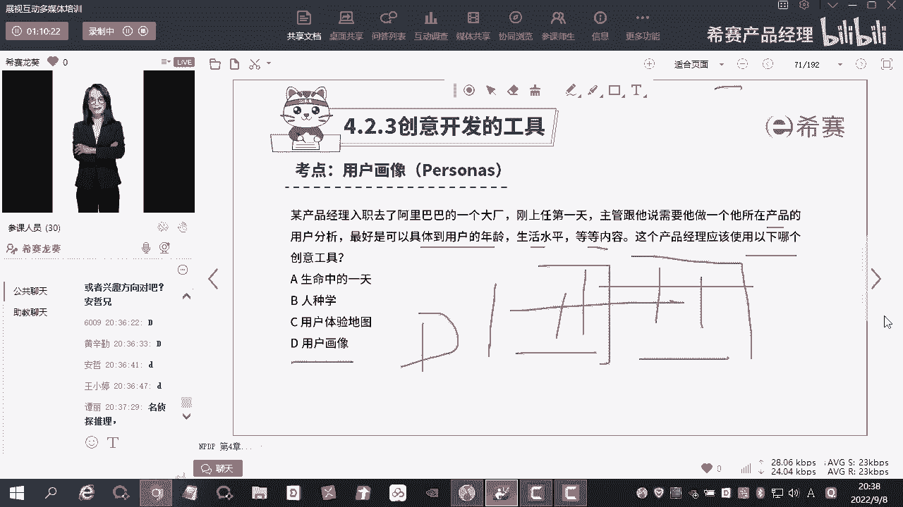

好接着呢我们来介绍一下啊，来来来给我讲一讲，你们看到这个东西你们会想到什么，想到什么，我们之前我们之前讲这个经历，还有敏捷的时候，讲到了一个工具叫什么，来说一下知识和知识之间啊。

虽然他没有绝对的必然的联系，但是呢还是会有一些啊这种浅浅的联系在了啊，看到这个东西你们想干什么，我们之前讲的，打车的那个软件，大家还记得不红包发红包的这个过程，大家还记得不叫什么，叫用户故事地图。

对不对，对是的，安卓说的非常好啊，叫用户故事地图好那啊，你把它转换成什么呀，然后它的体验到底是好还是不好就ok了呀，是不是对吧，好你比如说滴滴答滴啊，滴滴打车这个软件是吧，有什么呢有登录。

然后有什么有注册，然后有什么有这个地址的定位，然后有什么有和司机的联系，联系完了之后呢，有在在涂的这样的一个过程，然后有什么呀，有付费，然后有什么呀，有评价这些东西是不是就是什么，就是触点，对不对。

体验的是在每一个触点，他的感受到底怎么样，所以把它换一种思路，这叫什么呢，对不对，好就是讲啊它的基本的概念啊，你把这些个触点搞清楚，横轴是什么呀，横轴是时间点，什么时间点呢。

就是会发生和用户发生交互的这样的一些触点，刚刚我讲了什么滴滴打车，这个是不是我罗列的，是不是就是用户的这样的一些触点了，对不对，好，那纵轴是什么呢，纵轴是什么，纵轴就是你的体验感受。

纵轴就是你的体验感受，哎越往上体验感越好，越往下体验感越差，对不对，你是一般好还是非常好，你是一般差还是非常差，对不对，好，那么把横轴和纵轴搞清楚了之后，然后呢又把时间点，每一个触点搞清楚了。

接着我们要干什么呢，我们就要针对每一个触点给出什么呢，给出自己最直观的真实的体验感受，比如说在什么啊，在a p p下载这一块，我觉得体验感受非常的不好，在这个时候啊，我不需要你说原因，你就告诉我。

你在这个点的体验到底是凭你的直觉，到底是好还是不好就ok了，好比如说你现在给的分数啊，在这个下面你说体验感受不好，是非常不好吗，不是一般不好，对不对，好同理的对吧，同理的a下载之后，我得要注册注册。

繁不繁琐呀，好繁琐，好繁琐的时候，繁琐的话他就会给我带来一个感受，非常糟糕，对不对，每一个点我都把我自己的感受搞出来了之后结，然后干嘛呢，然后把它连线起来，其实到这里我基本上都把这个东西怎么样去做。

讲的7788了，我们再来看一些例子啊，帮助大家去理解它到底是个啥玩意儿，到底什么意思啊。

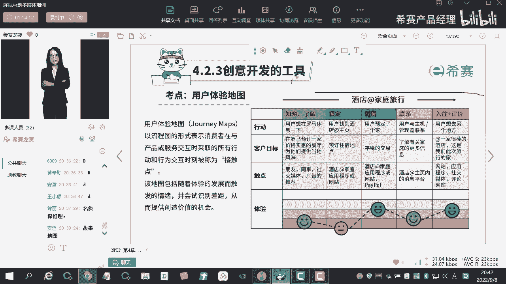