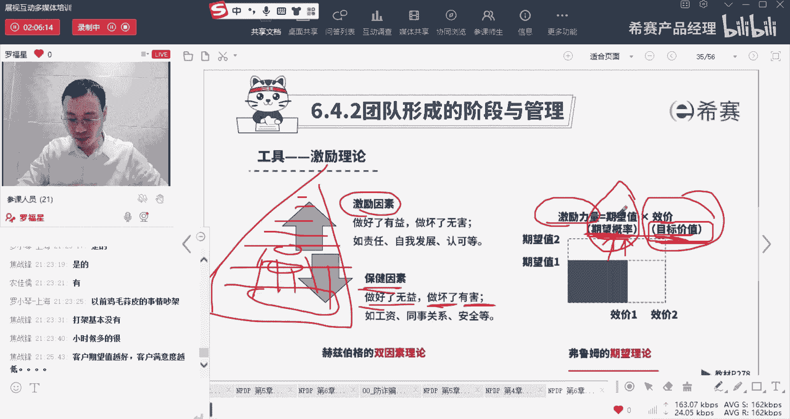
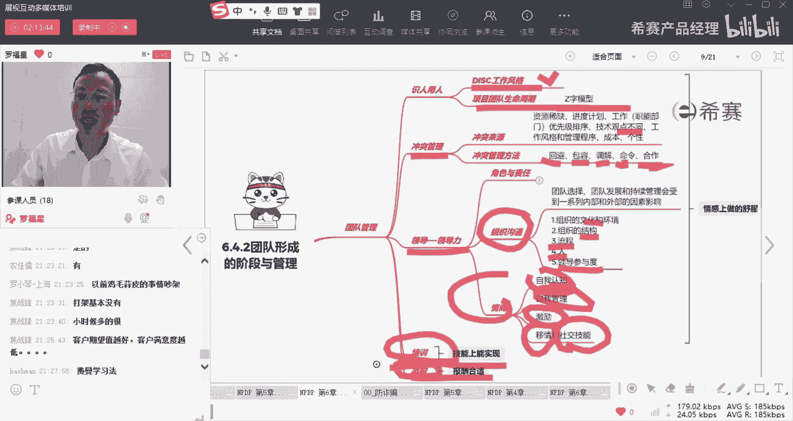

# 02NPDP清风-文化、团队与领导力 - P1 - 希赛产品经理 - BV1XP4y1k7E5

大家晚上好，欢迎来到西塞网专业的在线教育平台。我是罗福星。那今天晚上我们一起来分享到的是第六章文化团队与领导力。刚刚花了一些时间讲了一下关于团队管理中的一些比较有意思的东西。然后同时这一页我给留下来啊。

就是呃焦张峰同学问说，有一些心理学方面入门的书籍有没有啊？这里有几本书给大家去分享一下，你有兴趣可以去看一个，一个是懂我就是爱我，一个是非暴力沟通，一个是绝非偶然，还一个是被讨厌的勇气。

当然其实关于这种呃心理学板块的东西有很多。如果说你在育额方面有更多的想法的话呢，有一本书叫正面管教。我个人是很推崇的正面管教。很推崇。呃，其实作为一个产品经理，我们肯定是要懂一些心理学。

懂一些产品的心理学，懂一些用户的这种心理。呃，做销售的话也同样的，那么做老板肯定是更需要懂一些东西啊，懂这些东西。好，我们刚刚花了一些时间讲了一下冲突管理的这样几种方式。我们来做一个题目。

我们看这个题目会选什么会比较好一些。

它里面有一些关键词，前面很长，但是那关键词在比较靠后的地方。看学什么比较好一点。好。哦，我把那个关键词给划了一下啊，就产生激烈冲突以后，有很多种处理方式。其中他说用什么样的处理方式可以长期解决这个东西。

那什么叫长期解决呢？有一种就是像这种强迫命令的方式是可以快速解决，但他并不长期就强迫命令，他是可以快速解决，但他并不是能够长期解决。他没有从长远来去解决。他是有些人是心不甘情不愿的对吧？

那真正要长期解决，就是你都要去口服心服，那怎么办呢？对，选第二个啊选这种合作解决问题，就我们通过这种合作对糖的方式来去解决这个事情，而不是那种说我压迫着你啊或者什么什么呀之类的。😊。

所以如果涉及到长期解决问题的方式，那就是合作解决问题。如果说是各自退让一步，那么就是属于妥协的方式。如果说是想到一种求同存异的方式，我们保留自己相互的这种意见，对抗也保留。

但是呢我们现在放一个大的东西用大东西来去转移大家的注意力。那么这属于一种缓和包容。我说了算，这是强迫，很紧急强迫。

好，接下来再来认识几个词。嗯今天我本来原计划是今天这一节课的时间把这个东西讲完。但是今天前面那节课讲的东西讲的比较有点细啊，然后也要做一些延展。😊，所以有可能讲不完，但是我我是尽量我还是想要把这东西。

我不是为了去把它讲完。但是我更想要去讲的是你们能听起来觉得有意思，也有收获。那接下来会分享的一个词呢叫影响力，还有一个词呢叫领导力。我们先来说影响力吧。就是在你会发现在你的那个职业生涯中。

你作为一个小小的产品经理也好，或者一个小小的一个项目经理也好，你的这种职权。😊，非常的微弱，有没有？其实你没有太多的这种职权。你不能说我用职业的这个，就是我用我的这个角色，我用这个项目经理这个角色。

我用产品经理这个角色，我去要求你这样，我要求你那样，这个几乎是很难的一件事情。但是我们可以怎么样呢？我们可以发挥发发挥我们的优势来去影响别人。那怎么样去影响别人，你就这样去想一想，你比较愿意受谁的影响。

来，你说一说你比较容易受什么样的人的影响啊，或者谁说的一些东西，你比较愿意听什么样的人说的东西，你比较愿意听告诉我，我们一起来正好头牢风暴一下，就是你觉得。😡，具备些什么特质。

或者打一些什么样的标签的这些人他说的东西，你比较愿意去听他的。你会受他的这些东西影响。不一定是说完全受到影响，就是说你更愿意去听听他的东西。哪些人。想一想。嗯，我看到呃加丹峰说我的领导，我的直属领导。

直属领导跟我讲的东西，直接领导跟我讲的东西，我比较愿意听。还有那种思路很清晰的人，很有魄力的人，他讲的东西我比较愿意听，还有吗？大家都可以来来那个分享一下啊，还有就是比较平和的，比较公正，比较正直的人。

😊，他讲的东西我比较愿意听，我比较愿意服气。还有什么？都可以说一说啊，你想一想。对我自己内心很钦佩的人，我很佩服的人，我觉得他很牛逼的人，他比我牛逼的人，我比较愿意去听他的。

他在某一个方面很上长的这样一个人，我比较愿意去听他的，他在某一方面是一个专家，对吧？啊，愿意授权给下属的这些领导，这些管理者，我比较愿意去听他的。然后还有就是他虽然可能位高权重。但是呢他跟我说话的时候。

他能够好好的去把这个话讲清楚。他会脾气温和的去跟我把这个事情讲明白，而不是移植气使的这种方式。那么这种人我觉得他是能力也比较强，同时呢为人这一块也比较不错，那我也愿意去听他的。还有吗？😡，啊。

对下属有一定的容错的这种就是能够包容你，能够允许你犯错，能够容许你犯错的。哎，这种人呃经验很丰富的人，能力很强的人，我们比较愿意去听他的。所以你看到就是我们就是在座的各位，你们所列出来这些信息。

你想一想，这其实就是大部分的人，他能够接受的就是什么？接受那些能力比我强，这个专业技能很牛逼的人，然后他能够把这个事情讲清楚人，他情绪平和的方式来去跟我讲清楚这个事情的人。

他会能够公平公正的来去处理事情的人，他有话好好说的人，他经验非常丰富的人。那么对于这一些人，我比较容易去受他的影响。那同样的你作为这个管理者，你想一想你的下属。他为什么要听你的？是因为你的能力比他更强。

还是因为你那种呃说话更有条理。还是你会比较公平公正，讲道理。还是有你的人格魅力。嗯，还是说你在呃利种能够去看重他的一些利益。总之你一定是有一些东西，你才能够去释放你的影响力，对不对？

你要是没有这些东西的话，你光靠你这种职位的权利，没有什么权利，别人不会听你的。但是你为人处事比较好。同时你的专业技能有很强的时候，别人就会愿意听的。所以呢我们其实要去施展自己施展自己影响力，你就想一想。

你会接受什么样的人的影响。做了一个自己喜欢的样子，做成自己喜欢的那个人的样子。哎，这就是一个很好的。我最近其实也经常在反思，我觉得我说话太快了。我其实我曾经有一段时间我刻意练习，练习了以后。

我说话说的已经比较慢了。但是现在听录课天天讲课语速又特别快，也很也很纠结。其实很想要缓慢的优雅的去讲东西。好，这是关于这样一个影响力啊。你看说服别人清晰的表达观点和立场，能够去积极有效的倾听别人。

你想一想，我曾经真的是我有一次很深刻的感受。我记得那时候上上上在上大学的时候，有一次不知道因为一件什么样的事情，就特别的难过。😊，就心里面就很难过，然后就不想上晚自习了。

然后我就刚好看到我那个教室里面有一个同学，是我寝室那一个哥们儿，我就是跟他说，我说要不我们就回去吧。我说我今天有点不看不开心，然后他就他又陪我一起，就从教室一直走到宿舍。

那一段时间可能其实也就走了走了十几分钟的时间吧。😊，我就一直叨叨叨叨叨讲去讲我那些不开心的事情。我讲完以后，当时你知道我内心里面有个什么样的一个信念或者一个一个感受。就我那哥们他是一个不像言辞的。

他跟他女朋友打电话，他要列个提纲才能够跟女朋友打电话。就是那时候我们像上大学的时候好不容易找个女朋友对吧？他每一次跟他女朋友打电话，他会列个提纲，要说哪些事情，哪些事情，哪些事情。

这种这种人平常也比较沉默一点的，不太说话。虽际上那个人不是很不是说那种特别闷，但他不太说他更多听。但是我当时讲完以后，我觉得哇，我说他太会沟通了，太牛逼了，太强了。我当时直观感受是这种感受。😊。

所以有的时候那种倾听的能力真的是一件很不得了的能力，这是一个很。😊，很很真的是很不得了的能力嗯。如果说你学会你会有这种倾听能力，但然这个倾听它其实有个什么样的要求呢？不是说你假装在听。

而是你真正能够去听这个其实需要你有很大的一个一份包容。你有一份好奇和包容，你好奇他发生了什么事情，同时你能够去包容那些接住那些他讨吐的那些垃圾，能够去接住它。这是一件很难的事情啊，其实是很难去修炼到的。

如果说你能够做到这个倾听者的话，也是很强的，也是很有影响力的一种方式。好，能够考虑到各种不同的观点，能够去收集信息，能够有专业技能，你能够在某一方面很强这样的话你都能够去施展你的影响力啊。

这是关于第一个影响力。然后再来一个呢叫领导力。那领导力呢，我们呃这里写了很多啊。😊，我给你换一种方式来去讲解，你有没有看过那种就是抗战电视剧。在抗战电视剧里面的话，那些国民党的军官他要去冲锋的时候。

他会怎么说？他会说兄弟们给我上对吧？兄弟们给我上，这是什么？这就是领导力，领导力是能够去激发别人来完成某些事情的能力，这是领导力。那既然是领导力的话呢，你是一个领导，他是一个被领导者。

那些兄弟们他都是被领导者，你说兄弟们给我上，他们就上了啊，这是一种领导力。同时你会发现那共产党的军官，他们会怎么说，他们说兄弟们跟我上，哎，这个兄弟们跟我上，他也是一个领导力。

他是能够带领着兄弟们一起去做这个事情，他也同样是激发别人来完成这个事情，只是说他会自己身先士卒，通过自己的身先士卒来去激发大家，那到底是跟我上比较强还是给我上比较强。历史已经给了我们答案。

但同时你要知道一点，就是你只要是能够去激发别人去跟我上，或者给我上，这都是一种领导力。而领导力很多时候是领有领导者，有被领导者。那这里面的话，那个领导者他是能够看到这个路径，这个路径，他未来的走向。

他知道这个事情是一个好的事情。而那些被领导者呢，他是愿意去追随这个领导者的脚步来跟着往前面冲的这种方式。那很多时候就相我相信我如果跟着他就有肉吃，有汤喝，所以我才会愿意跟。如果跟他没肉吃，没汤喝。

我还跟个毛线，我就不会去跟他，对吧？所以领导力是你能够去。剥开这些纷繁复杂的这些表面现象，能够看到一些东西的本质。知道说往这条路走一定可以找到水源，往这条路走一定可以找到生机。你带领大家去往前冲。哎。

这就是一种领导力，能够去激发大家去干事情。所以这个项目我们只管这样子去做，肯定可以做成。这就是领导力。OK那领导力中有很多条啊。😊。

这里有一个说组织领导力、自我领导力、团队领导力，还有业务领导力。那这种我我看一下该怎么怎么说比较好一点啊。我们先来看一下关于团队呃，就是先看一下自我领导力，自我领导力。就是说你有没有发现这种情况。

就是有的时候好不容易真的是有一份工作真的很特别好。虽然有的时候也会抱怨，抱怨说哎呀，一天到晚忙的要死。但如果说这一天没有工作的话，你会怎么度过呢？😊，也就是在混吃等死。就这么度过了。

就没有什么自我领导力。那你要自我领导力，就是你能够去把自己的这一个闲暇的时光安排的井井有条，能够把事情往前去推进，这是一个很好的事情。当然呢，有的时候混制人死也不是完全是一坏事情呢？

有的时候其实它是一种自我调节，自我调剂，就是当一个人很忙碌的时候，有一个词叫过渡性嗯，就是过度补偿。谁帮我敲一下，过度补偿。什么意思呢？过度补偿？就是说当我们在某一些事情上特别比方说特别讲究，特别用功。

非常努力去学习，学了很多很多很多很多以后，好不容易这件事情完成以后，我就想要吃吃东西三天三夜好打游戏三天三夜，我想看电影，三天三夜。哎，这是这种过度补偿心理，就是会觉得说我在前面花了很长时间。😊。

去历经一些比较辛苦的事情以后，我想要疯狂的犒劳一下我自己。这一种过度补偿心理。其实过度补偿心理不是一个坏事情，每个人都会有，它也是一个很好的条剂。我们要张弛有度。但是你要知道一个点。

你不能够基于这个过度补偿，你补偿了三天以后，又加三天，三天后再加三天，再加三天就没完没了，那就浪费了，那就可惜了。所以你需要有一些自我领导力，你需要去调整自己，你稍微过度补偿一下。

允许自己放纵一下以后呢，你还是要回到一个比较好的状态。就像比方说像罗老师自己我来检讨一下我自己啊。我今天上午真的是在混吃能死的这个状态。就是我因为前天前天是我我家里面就是我给我们家小朋友办生日会的事情。

然后就操劳了一整天。然后昨天呢讲了一天课，上午讲一上午的课，下午讲一下午的课，然后晚上还带着一家人一起出来去书店待了待了一个待了半个晚上。😊，然后今天好不容易周一，因为周今天晚上又有课。

所以我今天上午真的是觉得家里面就躺在床上在刷手机，很无聊很无趣。但是它它是一种调整，就调整我的这个状态。然后调整完了以后，今天下午我又录了课，你看我今天穿的很帅的样子，有没有？我今天又又在录课。

录了一下午的课，让晚上给你们讲课。所以有的时候我们需要一些自我调整，但是调整你不能有需要有些过度补偿。但是过度补偿，你不要过度补偿以后就一直在补偿，一直在补偿，就天天就变成一个另外一个状态。

那个是不太好的。😊，你需要有一些自我管理的能力啊，当然不是说你熬制我们我们我们需要有这样一个自我管理的能力。OK好，这是这样一个。然后呢，我们还需要有一些团队领导力，团队领导力就是能够给团队赋能。

能够去激发团队的热情，能够去教团队怎么样去行为处事去做事情。这里还有一个叫业务领导力，就是目标计划导向，然后呢那做事情。然后组织领导力。

能够去呃从组织的层面能够从这种结构的层面来去引导整个团队整个公司来搞事情。

这些呢有些东西就简单过一下，你只要记得说跟我上给我上都是领导力呃，跟我吃跟我走，有肉吃，有汤喝领导力啊，把这个记住啊，后面其实都好说，你看一下。这个领导力中呢。

团队领导力说是团那个就是团队领导者为了达到目标，为一个群体提供方向说明指导。然后呢呃能够去了解大家的优势和劣势，其实就是让大家跟我上或者给我上，对不对？提供目标，说前面有肉吃，有汤喝。

前面有绿洲OK前面有水源，我们一起往前走就可以了。然后呢，我要去打造一个好的团队，就是让这个团队是真的是能够心甘情愿的跟着你走，并且中间会遇到很多困难和挑战以后，能够去面对困难去解决困难。

那你前面看过一个叫正那个那个那个那个敏捷管理，敏捷管理中那个敏捷团，他其实默认是一个比较牛逼的团队哦，是一个自组织团队哦，他就是一个很强的团队。好，我结果共享啊，什么全员去开发大家的潜能呢。

然要让工作变得有趣啊，这都是说跟我上或者给我上，让他变得更好一些，对吧？鼓舞大家跟我上。😊，还有就是领导和促进建设性的一个沟通交流。我们其实人和人之间很多时候为什么会产生那种冲突和矛盾？

就是因为信息不对称啊，当我们信息不对称的时候，就会有很多的这种误会呀，冲突矛盾。那如果说能够做一个良好的沟通和交流。那这个跟我上的过程中就会容易一点，对吧？比方说李云龙在亮剑里面有一个亮剑这个电影啊。

是个电视啊，电视里面的话，有一个角色叫李云龙，当然他说让那个谁就是就是给我打了一个谁谁打了一个鬼子，然后你轰他对吧？轰下来以后就我给你一个一经地瓜干。哎，那个人就马上就去轰那个对吧？就是为了金地瓜。

他是为了那金地瓜干吗？不是的呀，他其实就是听这个人的地瓜干只是说做一个就是做一个明面上的一个影子。但其实本质上是他就是会接受领导的领导，接受这个领导者的领导，是这么一回事啊。

同时这里还有一条就是说我们要去不要太过于微观管理，我们要去有有界限。什么叫微观管理呢？其实就是被干扰到。当他感觉到被干扰，那就属于一种微观管理了。

好了，接下来还看到就说我们要去组织团队，能够往前冲呢，能够要打造一个高绩效团队。那什么样的团队才是高绩效的团队呢？他说通常情况下。有这几个因素会影响团队的个那种那种沟通绩效。一个呢是团队这种文化。

就是他的这些文化环境，会跟这个团队的沟通能力有关系。如果说你本身是一个很开明的文化，大家就比较好去聊事情。如果是一个很压抑的文化就不行。好。第二个呢是组织结构。组织结构。

你是一个呃这种职能型的这个组织结构还是一个自制型的组织结构，还是一个矩阵型的组织结构，那么这个组织结构，它也会影响你的沟通，影响你的交流。还有一个呢是流程做事情流程，你们是有流程还是没流程。

你的流程是一个很好的流程，还是一个很垃圾很臃肿，很冗长的流程。那好的流程就比较容易一点，坏流程就麻烦。还有一个是人跟人有关系，就是跟这些人的技能能力水平有关。哎。

有的时候就是你会发现找一群比较合适的人合拍的人真的是不要太幸福，就太太太幸福了。有一时候找一些人真的是让你觉得想吐血的心都有，对吧？还有一个就是领导的这个参与度，领导越参与这个事情这个沟通啊。

这些各种团队的绩效各方面都会变得更好。如果领导不参与呢，就会麻烦很多。😊，除了有会内部的这些一个因素，会影响我们的这个高阶团队，还有些外部因素，一些什么名誉啊竞争啊，这些我就不去讲了啊。就简单过一下。

好，接下来就是关于这种领导力中的情商里面有一个叫自我自我那个个人情商。个人情商部分，我们其实前面已经花了一些时间讲了一部分的东西。有一些东西是重叠，有一些东西不重叠，我们来过一下，首先是自我认知。

就是你能够去识别自己，对吧？你对自己有一个清晰的认知，你知道你自你的说，你知道你的情绪大概是什么样的，你知道你的优势劣势，你知道你的一些需求，你知道你好喜好什么东西，你知道怎么样去拒绝一些诱惑。

你对你自己比较清楚的定位，这是一个很好的一个事情。😊。

有没有遇到过那种完全不自制的人，我有的时候真的是遇到过给大家讲一个很搞笑。😊，其实就是我们的一个学员，嗯有有一就是那还是在两年以前还是在什么时候，我忘记了，就不是两年以前还是一年以前。

就是当时罗翔老师很火火了一火了一阵，就罗翔老师大家知道吗？就那个有一个男人很帅的一个男人，他说中国最赚钱的事业都写在刑法里，就那位那位那位男士。😊，嗯，他是呃好像是是对，就是法外宽度粘山那个啊。

就当时有有有学员在群里说，他说哎呀他说呃他说其实以前有机会可以去做一个讲师的，然后但是没有去做，他说要做的话，就是要要他说他也有机会能够像罗老师一样。但是我看到他说像罗老师这样，我以为说像我这样。

后面他们的聊天里面才知道他说是像罗翔老师这样，我在想这是对自己的自我认知有多么的大的偏差。这个世界上能够有几个人能够像罗翔老师这样子。😊，这个自我认知太太太诡异了，就很奇怪，真的是很很很很很很诡异。

我们还是需要有一些自我认知，就是还包括说我同我我太有时候，他说他说那个谁谁，他说为什么？就他一有一些同学长的其实真的是其貌不扬，然后就觉得自己魅力无限。😊，我那种感觉很奇怪，像我的话，我只是搞笑的说。

哎，但是叫我罗帅罗帅，对吧？他不是说真的是我长得好看，而是说可能是能够就是讲课讲的是一些你们我懂，但是你们暂时还不知道，所以我跟你们去分享，哎，这个时候但散发着一点点智慧的光芒，所以就抬举一下。

就说哎呀，这个老师就大家都叫了罗帅，但并不是我真的是说觉得自己长得帅，其实从小到大谁还不知道，对吧？讲的什么样，自己还是很清楚的，但有时他又迷之自信，就是对我自己的自我认知，其实有点。😊，有点偏差。

这还很特别。那我们首先需要去对我自己有一个相对来讲清晰的认知，知道你自一些优点是什么。确定什么？那这里也多说一个点，有一些人会极度的怀疑自我，极度的觉得自己这样不行，那也不行。

就觉得自己深度的觉得自己不行。那种方式也是一种自我认知，有很大的偏差，就没有清晰的自我认知。我们的自我认知应该是真正能够看到自己的优势和劣势，而不是说一味的去去毁诋毁自己啊，去伤害自己啊。

觉得自己这不行，那不行，这是一个病态，这是一个病态，呃，需要一些呃就需要一些支持。好，这是第一个自我认知。第二个呢是自我调节，就是你能够去我们会不会生气，会不会有一些难过，会不会有一些什么东西都会有。

但是你要能够把那种不好的情绪能够通过适当的方式来去转换，来去转换成一种正能量的方式。比方说你可以用自由书写呀，你可以通跑跑步呀，你可以通过这种深呼吸呀，你可以通过动态进行啊，通过一些方式来去调整。

通过跟朋友去倾诉呀，或者是喝一顿小酒呀。但是你不要去酗酒啊，就喝喝一顿小酒啊，来这种来来去来去来去倾吐心声来去自我调节，调节完了以后，还是一种比较良好的状态来去面对生活。

那个他说能够创造一种信任尊重公平的团队氛围，能够去调节自己，也能够去带动大家，哎，这是一个很难的一个事情。还第三项是激励，能够去自我激励自我成长。😊，OK能够去通过各种各样的方式来去带动大家往前冲。

还有一条叫从同理心。同理心这个词呢其实是很重要的，尤其是做产品经理，一定很重要。同理心讲的是什么？我们能够对别人的这种难过悲伤，感同身受，能够对别人的这种不方便、不便利、尴尬，感同身受。

能够对别人的这种喜悦、兴奋感同身受。我们能够去身临其境的去感受他的感受。这才是同理心。但我们能够感受到他的感受的时候，我们会去做什么样的一些行为。我们去设计什么样的产品，我们会设计什么样的功能。

来去满足他的某种需求，能够去帮助他解决他的困扰、尴尬、难题，或能够去放大他的这种快乐、自豪。的东西哎，这都是你作为一个优秀的产品经理所需要去具备的。那么有一个点很有意思。

他说怎么样才能算是一个比较人比较有同理心呢？如果说你能够去给别人指路。一个陌生的地方的陌生一个人来到一个陌生的地方的时候，你能够跟他清斜的去指一条路，能够指清楚。那么说明你比较有同理心。

很多人只能说你往前面走，就是比方别人在开车，你说你往前面走个300米就到了。什么叫300米就到了。你开车的时候，一脚有门框一公里就过去了。哎，你你说哎你往前面走一小会就会看到一个红色的小房子。

小房子旁边有一条小岔路，你先拐进那条岔路，岔路往前面走个一会会会有一会有个巨大的一一会有个大树呃，那个大树那里还有一个岔路，你叫怎么样啊，就如何如何，你能够去站在一个他的视角去看待这个世界。

看待这个陌生的世界，能够去讲出他能够看到的东西。😊，而不是凭你的这种很熟练，很熟练的时候，你你有没有发现，其实有的时候你开车回家的时候，你都不需要去思考，你一边在开车，一边在听听一些课程也好啊。

听音乐也好，听什么东西也好，不知不觉就回到家了。你都没要去想到怎么开开回家的对吧？但是你要去指导别人去做这个事情的时候，你给别人去指入的时候，这是一件不容易的事情。那么需要有同理心。

能够去尊重别人的感受，能够去对别人的困难问题挑战、兴奋、喜悦、自豪、感同身受，并且去采取一定的措施来放大这个好的东西，来减少这个不好的东西。这是你需要搞的事情。OK是不是觉得挺有意思的？😊，啊。

然后还有一个就是社交的技能。那社交的技能的话，其实你如果你真的是有同理心，你真的能够去关心别人，也能够关心自己。你能够真的是对别人感同身受，能够去看到别人的不容易。那么我相信你社交能力不会太差。

不会太差。你只要真的是发自内心的去帮助别人的话，总有一天别人会看到你的好。当然并且呢你去帮助别人，你去做这样一些社交，你不是为了让别人看到你的好，而是说你觉得。😊，做这些事情。

你会觉得心里面其实是很舒坦的，会是很乐意乐在其中的这才是他的价值。就是我们为什么要做一个好人，因为我们做一个好人，我们才会心安理得睡得踏实呀。啊这才是他的一个最大的靠那个奖赏，对不对？

那么包括这种社交的技能也是一样的。你的这种社交，你去帮助别人，你去展现你的能力，你去引领团队，这是能够让你自己觉得很舒适，觉得很舒服，那觉得很有成就感的一件事情。我们需要这个东西，我们是人。

我们需要啊好，这是这些情商的管理。好，我们来看一下呃这个东西选什么更好一点。凭感觉啊。😊。

，如果你手上有讲义的话，你可以翻讲义也可以。对，最好玩的其实是第四章最好玩的是第四章。然后这一张呢，可能我这种讲课的方式，你觉得好玩的，换一个人讲课可能就没没那么好玩了。😊。

但它里面确实有很多东西是跟人相关的，跟人相关的东西真的是很很值得去探究啊，有很多内容值得去探究。好，关于高绩效团队，他会受到的那些内在因素的影响，有好几个。一个是公司的文化。

一个是公司的这样一个组织结构类型，一个是公司做事情的一些流程，还有一个呢是人员，还有一个呢是领导力水平，领领导的那个领导的参与，对吧？啊，有这样的五大种。那其他几个计划执行检查和处理，这什么？

这是PDCA循环PDC循环plan做计划do去去执行，然后去check去做检查，然后去action来做一些调整处理。然后产品渠道价格促销，这是产品营销组合4P4P是product。and place。

然后是price和promotion。然后这里还有个叫优势劣势机会威胁，它是sward分析，优势劣势是trains weakness。然后还有一个机会和威胁是什么opportunity和threat。

这是呃不一样的啊。那么你不管是通过正选的方式，你也可以选出它。你通过排除的方式，你也可以选出它啊。😊。

好，再看下一个。😊，有一些词汇，我们可能会通过题目来去补充，有一些东西我们可能会通过题目来去补充这些词汇。好，这个题目比较长啊，题干比较长啊，我们给大家画一下，你看你和他产生他和你产生冲突。

然后你内心里面其实觉得是不舒服的对吧？然后同时呢，你作为领导者，你没有和他起冲突。就虽然说你们之间产生了冲突，但是呢你没有跟他起冲突，没有跟他骂起来。😊，你还会认真去分析他的建议，发现有一定的批判性。

有一定的效果，这是什么？这是在自我调节，对不对？就你们选的自我调节。O自我认知是发现我生气了，这是自我认知。然后我去不去跟他产生冲突，而是去解决问题，这是一在自我调节，同时能够去带动他一起去往前冲啊。

这种这是一个激励。然后这个词认识一下移情。书上明用了一个词叫移情。移情是用的什么呢？其实就是同理心或叫共情共情的能力。哎，就是呃让我想一想啊。有一个词我想邀请你打出来叫情绪价值情绪价值。

帮我敲一下情绪价值。就你为什么有的时候你觉得说跟他聊天会很舒服，因为他能够为你提供情绪价值。你为什么觉得看刘亦菲演的电视剧，你会觉得很开心。因为刘亦菲的电视剧他能够给你提供情绪价值，让你觉得很放松。

很愉悦。那么怡情或者共情，其实是当我们能够给别人产生那种共情的时候，我们能够感受其实又是同理心的方式啊，能够感受到他的不容易啊，感受他难过呀、悲伤啊、忧伤啊、忧怨啊或者什么之类的时候。😊。

你能够去真的感知到他的时候，他其实会觉得说你再给他提供一些情绪价值，让他的情绪有地方去释放他在你这里是呃能够得到一些支持，是安全的。哎，是这样一个情形。OK。

好，我们在接下来看到就是说前面已经讲到了很多这样一些跟跟这种冲突有关系啊，也刚才讲了一些情绪有关的。接下来认识的是激励理论。就是我们要去带好团队，我们要让他家是想做事情，通过激励方式。

让他家做事情做得起劲，也是通过激励的方式。那这激励呢是PMP中讲过的啊。我们但是很多的同学没学过，所以我会从头到尾讲一下。😊，首先激励就是能够去激励某些人来做某些事情。你你让他你给他一个理由。

让他能够去做这一个事情。哎，这是一种激励。你可以怎么样去激励呢。比方说你说哇，你做的太好了，就给他鼓掌啊，对不对？你通过鼓奖的方式，你通过肯定的言辞的方式来去激励他，让他一直往前冲。然。

你可以给他发奖金啊，不断去给他发奖金，发奖金，发奖金，哇，他做的越来越越来越有劲，越来越有兴趣，哎，这也是一种激励的方式，那你也可以是给他一些给他一些荣耀，给他一些荣誉。哇，他做的很好。

让他做在一个最高的一个领奖，他上面去领奖。或者说是做在一个靠窗的地方看风景的地方，可以让他优先怎么样，对吧？类似这样的啊，这是一种认可和奖励，其实人生来是追求归属感和价值感的。

很多时候呢价值感是源于我们可以做成一些事情。有一些人他的那种自我自我认可度比较高的时候，他只要做成了，他就觉得哇自己棒棒的，但是也有一些人他是那种自我怀疑型。他做成了以后也没有觉得自己很优秀。😊。

就大家都说你很优秀的时候，你才会觉得哎呀自己很优秀。那么所以有一些外在的认可其实也很重要需要的。所以肯定的延辞其实是需要的。你们真的是可以去考虑去尝试。要不这样吧，我们做一个约定。从呃今天明天还有课。

明天这一天你至少要夸奖两个人。不管你用什么样的方式来去夸奖他，夸奖两个人。明天晚上的时候，我们在上课的时候，你再回应我，告诉我你是不是有夸奖，你做到两个人，做到了夸奖两个人好不好？

不管你夸奖一句还是夸奖三句都没关系，你正争取去夸奖两个人，去认可两个人。😊。

对，明天还有课明天还有课。明天的课更精彩啊，明天课比经天的课更有意思，更有用。好了，我们来看一下积极理论。首先第一个呢是马斯洛的需求层次理论。

它是我们在小的时候就是在上高中上大学的时候就学过了一个马斯洛需求层次理论。他会告诉我们说不同的人，他在不同的阶段的时候，他会有不同的需求。比方说最开始想要去解决温饱问题，想要去解决这种吃饭啊、睡觉呀。

这种最基本的需求，这的是属于生理需求，然后再往往上面走一层这种生命的安全，财产的安全，有安全的需求，再往上面走一层，有社会交往的需求，我们需要交朋友，我们需要有一些朋友，对吧？有一些这种社会交往的需求。

有这种聊天的人，聊天对象，我们去倾吐心声，有人听，也想要喝酒，有人陪啊，这是社交的需求。然后有尊重的需求。这个尊重里面还可以再拆分成几条。这个尊重的需求。比方说我们有爱美的需求，有求知的需求。

有尊重的需求啊，都都算啊，那这些呢就是我们能够做出一些事情，让觉得自己自己很很优秀。😊，就很棒，别人会认可你会给你点赞啊，或者说是自己会爱美，然后把自己弄得美美哒，或者说是自己求职的需求。

能能够得到一些新的知新的知识，让自己觉得自己很强。还再往上面走有自我实现的需求。就是其实那种身外之物早就已经早就已经满足了那种财务自由早就已经那个了，还想要去做事情。为什么想要去追求自我实现。

想要去给这个社会创造更多的贡献和价值。😊，那这个马斯洛修成这理论他有什么好处？我们为什么要重新提他？学他以后，首先第一个你知道不同的人，他在不同的阶段，你可以用不同的方式来去激励他。

如果他是一个新刚刚开始从学校出入职场的人，那么你跟他讲那种大道理啊，讲那个什么什么东西啊，或者给他画烂大饼了，没有用，你可能更多的是能够让他学会一些技能，能够让他在这个工作上面能够能够胜任这份工作。

能够拿到他的这个月的绩效，哎，这可能会更重要一些。所以你能够满足他这种基本的需求，如果说他已经是一个一个一个就是已经就是这种温饱这种东西，其实已经不再画下来的话。

那么他可能会更多的哎我们可能安排一些这种社交的活动呢，安排一些周末的活动啊，或者说是安排一些什么呃弄东西啊，都是可以的对吧？那这里给大家分享一个很有意思的案例。你想一想，如果说你为公司做了一个贡献。

那贡献价值10万，但是呢公司他又比较抠门，他只给你发200块钱的奖金。他只发200块钱奖金，你会有种什么感觉。😊，大胆的说出来，你有什么感觉？😡，在侮辱我有没有？有没有觉得在侮辱你？😡，对吧？好。

如果说是你的你的下属做了一个事情，然后做了一个事情以后呢，给公司创了价值价值10万块。但是公司比较抠门，他只发了200块钱奖金，并这200块钱奖金，他要你来发给你的下属，你会怎么做？

他让你去侮辱你的下属，你要不要去做这个事情，你要怎么做？😡，跟你分享一个很有意思的点，你可以这样去做。如果说你真的是发200块钱给你的下属的话，他会真的是会觉得你在侮辱他。但你可以这样去行为。

你把这个因为发钱200块钱，可能你以为是在解决某种生理需求，但你把这个生理需求转换成一个更高层立的需求。比方说。白总转换有什么需求呢？😊，200块钱买5顿豪华早餐。

邀请公司最漂亮的前台小妹妹把她端到她的仓那个那个那个工位上，只有给公司创造巨大价值的员工，才配享有这种荣耀，这荣誉。每一天早上1个40元的豪华早餐。第二天同样的第三天第四天第五天。

每一天都是公司最漂亮的一个小姐姐，她给你亲自端过来。啊，甚至还有人在给你看照片。哇，那种自豪感，那种荣耀感。有没有你还会觉得在侮辱你吗？其实也只有200块钱。😡，所以你会发现。

其实有的时候也其实我们去学这些东西以后，不是说让你真的去投机取巧，而是说你能你能否通过某一些方式把某一些东西放在更合适的位置上面去，然后去满足去真正的去激励他，让他觉得哇太棒了。

那那个谁说下次我也要下次我也要要要要要成为公司的那个VIP的那个员工什么之类的，对吧？😊，好，我们再来看另外一个那个鼓励的就是激励的理论叫麦克雷克的X和Y理论。X理论说的是说。😊。

有一些人呢他就是做一些基础性的工作，他重复做基础性的工作就很僵化，很无聊。所以他就愿意偷懒，他就很想要偷懒。那么对于那种想要偷懒的话，你会怎么办呢？你会去盯着他，你会去盯得死死的这种方式就是X理论。

他会觉得人性本懒惰，我不盯他，他就会偷懒的这种方式。另外还有一种方式呢，就是说我们会觉得像你们在座各位都是白领，对吧？甚至是精灵。那你们都是想要喜欢别人管理，管的死死的，还是希望别人给你一些空间。😊。

都喜欢给你自己一些空间，对吧？你只要告诉我你要做什么东西，需要什么结果。没事，你你让我自己去做，我一定会把它做成。所以就是他给你一点空间，你就会很努力的去往善生长，会努力去把这个东西做好。

这种情况它就适合什么呢？叫歪理论，它适合这种白领阶层。所以这种适合那种蓝领阶层，适合那种那种那种那种计件啊，重复劳动啊，这种呢适合这种智力劳动啊，这种白领阶层。那他同样提的怎么记呢？

X里面就是说你做一个白领迷其实不喜欢你说no，我不喜欢管的，我管的事事，不要这样管我noOK那这个。😡，Y里呢就是yes，是的，就是我我就是这样的，你给我一点空间，你给我一点自由，我会做的更好。

你这样去记它就好了啊。所以记住一个no一个yes。😡，好，然后接下来呢是麦克里娜这一个成就动机理论，他会说到人的成就动机其实有很多有当然呢不是说只有这三种。但是呢以这三种为主。

有一些人他的成就动机就是说他希望能够做出一些有价值的事情，这样的话才觉得自己是有价值和有意义的。像我自己在做测试的时候，我的测试里面就有一条是有一个是狮子。狮子是那个成就成就感比较强的。

就需要做成一些事情，才会比较有有有刺激我O是这个然后呢这种人的话，你就给他赋予一些有挑战性的工作，有难度的工作。因为你做的是那种很容易的工作，他会觉得昏昏昏欲睡，会觉得很无趣，会没有意思。

所以呢要做一些有挑战性的工作。那么还有一些人呢他会是权力欲望比较强，他希望能有有权利，能够有一种特权什么之类的。那么这种人呢，你我们说只要说是得能够配位的话。

就你的那个你的那个追求和你道和你那个那个那个那个德行是相匹配的，和你的能力是相匹配的。那么没有什么不可以是O的。😊，所以是能够提。那么对于这种人，我们就给他你如果做到什么程度，我就可你做小组长。

你做到什么程度，我就给你提升为经理。你再做到什么程度，我就给你提升大区经理或者什么什么经理，类似这样的O用权力来去激励他。还有一些呢他是有亲和的需求，亲和的需求是什么？他就会希望说哎呀。

我们大家都是相亲相爱的一家人，大家好才是真的好，我们有什么零食可以一起去分享啊，我们有什么好的东西，大家也可以一起去探探讨这种方式O需要有合作的氛围。那么这种情形下，我们就是经常搞一些团建啊。

一起去玩杀人游戏啊，玩这种什么啊那种什么狼人杀呀或者剧本杀呀啊一起去打篮球啊，打羽毛球啊一起去爬山呢，一起去干什么东西，哎，这种感觉就特别好。那么这个麦克丽郎的这个成就动机，他就告诉你说不同的人。😊。

你其实是需要用不同的方式来去激励他。每一个人在这三个点上面其实都有需要。只是说可能某一个点上面会特别多一点。呃，我不知道你的累疑点比较多啊，像我自己的话呢，我这一点比较多，同时这一点也比较多。

就这两点上面比较多。但至于对权力的话，我其实没有什么追求。哎，无所谓爱谁谁，只要你不要管我就可以了。是我我的习惯是这样的。好，然后再看到下一个何资伯格的双因素理论，它的这个双因素理论。

他其实是跟这个跟这个马斯洛的需求层次论是混到一起来去讲。就说我们有很多很多因素，其中有一些因素呢是保健因素。所以保健因素就是那种马斯洛这的底层需求。那种底层需求是你如果不完成，我就会造反。

O做坏了就有害做坏了就有造反，做好了，我觉得是理所当然是应该的。比方说你给我发工资，发工资是应该的呀，基本的呀。然后同时的这些基本的同事关系，还有安全需求，就是应该要做到的。如果这都没有做到。

我就会造反。所以有一句话叫什么叫穷山恶水出刁民，就是当那种连温饱都没有解决的时候，还在穷山恶水的时候，很有可能这人他就会想要去铤而走险。😊。

所以你讲铤而走险，天其实如果说你家里面很富贵，你的这个整个这个地区很富庶，还会有人去铤而走险吗？😡，基本上比较少，对不对？少很多，大部分都不会。但如果是这个地方整个就是很呃我让我想一想。

我不知道有多少个同学是农村里面出生的。😡，农村里面出生的同学，你自己想一想，现在回老家回农村和在10年前在和20年前30年前有什么区别？想没想有没有什么区别？其中最大的一个区别就是邻里之间争吵变少了。

有没有发现？😡，在20多年以前，30多年以前的时候，邻里之间的争吵其实比较多的啊，你们家的什么东西又吃了我们家什么东西，我们家的东西又怎么你们家的东西，那个水，你们家那个灌灌溉的时候。

用的我们家的水什么什么东西。😡，就很多鸡毛蒜骗琐碎的小事情，大家都在争吵，在吵闹，甚至有那种邻里之间打架的这种情况。有这种感觉吗？同志们。还是说只有我一个人是农村边出生的，我有这种享受候，有这种体验。

但是现在为什么没有了呢？因为现在物质很丰富了，完全不需要这点东西哦，无所谓无所谓，没关系，不要紧，对不对？是因为现在大家生活条件变得更好。所以你说这个东西那个东西有什么关系呢？😊，我送你两个西瓜吃。

又也也也不大紧，对不对？我们家的鸡翅啊，你们家的果子，你们家的鸡翅，你们家的鸭把我们家那个什么东西弄出了，哎，其实没那么要紧，对不对？不那么在乎。😡，所以这就是当条件比较恶劣的时候。

那种人性的恶也会更多一些。当条件比较优越的时候，其实人性的良善它就会更多的激发出来。但是这个跟那种淳朴又是另外一回事啊，就有一些地方呢那种名分很淳朴啊，那是另外一回事了，就总体来讲。

就当你的物质优越的时候，你总体来讲你会更你的面部表情啊，肢体动作啊，你的这种修养啊，各方面其实都在提升都不一样，是不是？那激励因素就是说有一些东西就是你的那种那种更好的这个要求。

比方说那种那种尊重的需求啊，自我实现的需求，即便没有做到，我也觉得无所谓。但是你如果做到了以后哇，你太看重了，你既然这么看重我，我要努力，我要加油，我要怎么样，对吧？类似这样的一个一个一个方式。

所以就是。

激励因素就相当于是上层的因素。这因素你你如果说给他就会给足他面子，他会就是奋发图强。然后保证因素就是底层的这些需求。底层需求如果没有满足，它就会破坏，他就会搞破坏，就这么一回事。

好，然后呢在最后看到一个这样一个激励理论，叫福洛姆的7望理论。福洛姆的7万理论是什么呢？就是说这个东西都有在你到底有没有诱惑力，有没有诱惑力呢？跟两个因素有关系。一个因素是这个事情发生以后。

它的概率到底会有多大。😊，他发生的概率有多大？比方说我们说哎呀，今天晚上很有可能我会喜提兰博基尼一台，不只是我哟，在座的各位，包括焦占峰，包括罗小琴，包括龙佳茹，你们每一位都有可能会喜提兰博基尼一台。

好不好？太好了，对不对？概率是0。0000000000000000001。这个时候对你来讲还有吸引力吗？还有吸引力吗？没有了。O所以一个事情它的笑价就是说如果这个达成以后对我的刺激有多大，这是一方面。

还有一个是他达成的概率到底有多少。你不要说这个事情很大的一个是成为一个亿万富翁，结果成功的概率几乎是等于0，那就对我没有什么吸引力，没有什么激励措施，对不对？那真正有激励的是什么呢？

有真的有激励是这个东西又有一定的吸引力，同时呢又有一定的概率。😊，你说有没有那种可能性，某一个事情百分之百的可能性对你有对你有会成，但是你基基本上不会去做。比方说你昨天说的一个快递。

快递上面写了说你评分就会给你奖励5元，你去评了没有，是不是拿了快递就直接扔垃圾桶了，根本就不会去去去那做那个评分的事情。那个概率是100%，但是你根本就不会去做。为什么？因为这个东西它的目标价值太低了。

完全不吸引你是不是这样子啊？兄弟们姐妹们。OK所以呢真正能够去吸引你的东西，跟这个东西的目标价值有多大效价有关系，跟这个东西的期望值，也就说是概率有关系。

如果说你要真的是给你的员工去定一个定一个东西去激励你的员工，你要定的一个东西是一个什么呢？是一个他稍微跳一跳，能够去够得着的东西，你不要定那个在天上的星星，他怎么摘都摘不着。

你讲那个东西激励再大也没有用，他摘不着，他他他他摘不到呀。你在你你定的激励是有一定的激励，同时呢是他跳一跳就能够得着的东西，哎，他就会努力去跳，就有可能会真正的是产生一个激励效果，对不对？

好，这是这些东西。呃，最后讲完这一条，我们就结束今天课程啊。最后讲完这一条，我们再回顾一下，就结束今天课程。那还有一个呢，就是我们既然是让他能够做事情，我们认为是愿意做事情，便做事情做的很爽。

其中还有一条就是我们让他能做，你怎么样让他能做事情呢？有一种很好的方式，就是培训，通过培训来让他能做事情。培训是怎么搞的。😊，此时此刻，罗老师正在给大家培训，对吧？我在叨叨不叨讲，一直在讲。

但是更好的培训是什么呢？更好的培训是我说你听，然后再你说我听，这样的话就能够搞搞搞搞清楚，你是不是真的听懂了，还有一种是我做你看，然后你做我看看你是不是真的学会了的这样一个情形，对吧？

你知道那个学习的方式中有一个最好的学习方式叫什么也不叫道最好啊，就是有一个非常好的学习方式，叫费曼学习法，谁帮我敲一下费曼学习法。我相信一定有人会用这种方法，对吧？费曼学习法里面说到一个什么点了。

就说你学到东西，你去转过来去教别人，你去你去阐述，你去表达，你去教别人，你如果能够给别人讲清楚，就说明你真的是学懂的，你给别人讲不清楚，说明你在哪个地方还是卡壳还是有点点那个那个啥是这个意思。

所以费曼学习法，就是告诉我们说要去多表达多分享。所以在座各位其实你们也可以去你是不是也可以把今天讲过的，今天老师讲过的课程去给你的团队去讲一讲。😊，呢给你的老婆去讲一讲呢，给你的男朋友去讲一讲呢。

对不对？给你小朋友去给你小孩去讲一讲呢之类的啊，把有有些东西去用一用呢，包括像拥抱对吧？包括说去认可肯定的言辞，明天要肯定两个人啊，然后今天晚上可以去拥抱一下自己小孩，拥抱一下自己老婆老公之类的对吧？

那培训呢，它其实这种奖的方式，真正的效果呢只有很少一部分。所以这里培训有个叫702010法则。😊，702010法则里面说真正去讲授的部分，其实只占了效果只有占了10%。然后如果说有些东西能够超练。

能够去演练，那么这种操练和演练，它会占到了20%，就像在座的各位，你们去学驾照的时候，你亲自摸着方向盘去踏着那个那个那个油门和离合的时候，哎，这个时候你一遍一遍练习，你就学会了。

那这个练习会更加或者是去游泳，你去学游泳的时候，你在学里面亲自去扑腾扑腾，你学会了游泳。那这个时候就是有教练在学，你能够学的比较好。而更好的方式就是让你在岗位中去练习。你自己想一想。

你刚开始开车的时候是不是很紧张？然后你刚开始第一次停车的时候，停了多久的时间，停进停到那个车位里面去。不好意思告诉大家，我第一次停车的时候，我停了大概有半个小时，停了我一身汗哇，真的是好尴尬呀。

好难过呀。😊，然后但是这个东西真的是你熟人生巧，你搞久了以后就是就很容易了，这边得就是很像呼吸一样一样自然。这里再多吹一个牛，剩下时间已经不够了啊，多吹一个牛。呃，我作为一个全职不是全职来爸啊，说错了。

作为一个超级奶爸。我们家第一个小朋友出生的时候，他那些给他洗澡呀，给他包呀，给他弄尿不湿呀，给他搞那一些什么东西啊，都是我亲自亲力亲为，前十天全部都是我自己做。为什么因为我在在在我们家小朋友出生之前的。

大概前面大概有三三四个月的时间，我和我太太有一次在产检的时候，就阴差阳错的报了一个学习班，报了一个学习班以后呢，每个礼拜礼拜的有一个不知道礼拜六的下午还是礼拜天的，下午我都忘记了，就是会去参加学习。

然后那个学习里面的老师就会讲很多的知识，讲了知识以后呢，他还会让你去亲自操练，然后我就去操练过一遍，我就知道说怎么样去抱小朋友啊，怎么样去给他洗澡呀，怎么样去给他搞这个搞那个呀我我都学会了。

学会了以后真的等到等到我们家小孩出生以后，😊，那是亲自上手，但是有三个长辈，他们都站一边，OK不用，我亲自来，但我也只搞了10天。为什么？因为因为那个时候我刚好是那是1年以前。

刚好是我那时候需要去参加一个考试。所以呢我就弄完小朋友以后，呃，搞了10天以后，后面就让他们去弄，我就开始去准备一些考试相关的事情。😊，所以真的是你学会一个东西，你不只是听别人说，你还要去说给别人听。

你不只看别人做，你还要做给别人看。这样的话就确保你真的是学会了。好，我们对于今天学过的内容来去做一个简单回顾啊，我们都今天都学了一些啥？呃，我们今天花了一点点时间。

从第几个工作风格重新回顾了一下，对吧？第几个工作风格中有有一个角色呢，他是这一个呃指挥者。OK然后有一个角色呢，他是一个社交者，有一个角色是一个支持者，还有一个角色呢是一个思考者。然后呢。

我们讲了一个叫那个这一模型。这一模型呢从从一个人是一个创意者，想出一些想法和创意，创造者。然后呢，有一个人他是一个推进者。他是能够去把这个想法和创意变成一些概念。然后还有一个呢他是一个那种思考分析者。

做计划，嗯，把那些东西做成那种具体的可行性，变做出一些计划。最后呢，还有一个角色呢是一个执行者去落实去执行。😊，接下来我们讲了一下那个团队中它会产生冲突。那么冲突的来源有很多，就各种不相同。

就各方各面的不同都会导致冲突。那么冲突处理方式呢有这样几种，一种是回避，就是我不参与这个冲突，我退出的这种方式，对吧？我们还讲了一句话叫先处理情绪再处理事情。然后呢，我们还讲了一个叫包容。

包容呢缓和包容式。那种高情商的方式没有直接解决问题，但是我们求同存异来去解决这个事情。然后还有一种呢是这种命令命令强迫，是必须就直接面对这个事情，快速解决事情。他是面对很紧急的时候来去解决。

但他不会就可能别人心里面是有怨气的。还有一种呢是合作解决问题。那么合作解决问题是真正的做下来面对面去解决问题。但这是一个很很棒的事情，很好的事情。但然还有一种呢叫调解或者是叫妥协，妥协就是各自退一步。

你也退一步，我也退一步，妥协的方式来去解决问题。好，接下来我们讲到了那个就是。团队领导力团队领导力中会讲到领讲到很多，讲到一些关于什么团队的一些领导力啊。然后我看一下啊。

呃，这里面给了一些什么角色职责，这里面说了什么啊，这些东西就就不是不什么说了，没什么特别好说。我们直接回到这一页吧，就是团队沟通中哎，说到一些人。

然后我们需要有什么啊组织的文化结构流程和人以及领导的参与。这都会对于一个高团队有影响。然后呢再讲到情商自我认知自我管理激励激励自己激励别人，然后去对别人共情，识别别人情绪，有共情。

以及能够去有一些社交的技能，然后再讲到培训培训的方式呢，能够去呃让这个事情变得更快，最后呢还讲了一个就是讲了一个激励，对吧？讲若干的激励模型，讲了一些什么激励模型。

讲了一个马斯洛的需求次理论讲了一个一个麦克雷的X论和讲了一个麦克利兰成就动机理论有些是对成就比有要求，对权力比较有要求，对亲和比较有要求。

然还讲了一个是波的双因素理论一个叫激励因素是这个事情你没做到我觉得没关系。后就好感戴德，我会努力加油的。😊。

一是保健因素，保健因素是必须做到。你如果没有做到呢，我觉得就不太爽。你做到以后，我觉得理所应当好，还有一个呢是福洛姆的期望里论，他会讲的是说这个东西到底对我来讲有多大的诱惑力。

跟这个东西本身的目标价值有关系，以及跟实现它的这个概率有关系。只有说概率乘以这个结果值才真的是能够去激励我。好了，今天就只讲到这么多，感谢你的收看。我们呃还剩了20页。

我们那就只能是明天再继续继续讲这内容。然后明天有望可以去讲点新的东西，讲一点新的东西的话呃，看情况吧。也许明天不一定会讲完全新的东西，也许也许明天还是在讲这个章节啊。

因为本来我原计划呢是今天把这个东西讲完，讲完了以后就下次就可以直接讲那个精一创业。但是今天今天可能我讲的东西引申的稍微多了一点，以后没有讲完，明天看情况好不好？好了，感谢你收看，祝你拥有一个愉快的夜晚。

晚安，记得明天要鼓励两个人啊，认可两个人。😊。

