# 02NPDP霁月-产品设计与开发工具 - P1 - 希赛产品经理 - BV1gG4y1X7Kd

嗯当然可能有的人没听清楚啊，在这个地方再给大家简单说一下啊，这个横轴其实就是讲什么时间点啊，你的触点，你的用户的全程到底有哪些个触点啊，比如说我的下载，我的安装，我的注册，我的什么定位，我的什么呢。

行程呃，这个这个是司机的联系，全程静静态的这样的一个行走的过程，然后什么呀啊这个付费，然后在什么评价啊，在每一个时间触点，然后呢写下什么呢，写下你的纵轴相关的东西，纵轴相关的其实就是什么。

你具体的体验越往上啊，是正向反馈，越往下是负向反馈，正向反馈你的道理，你的这个程度到底是非常好还是一般好啊，然后负向反馈你到底是一般差还是非常差，好吧，这个横轴和纵轴搞出来了。

然后呢再针对每一个时间节点，你的感受到底是a哪一个方向，把它什么自己写出来了之后，然后呢按照这样的一个前后的顺序关系啊，把它串联起来，好那么我们来一起看一下啊，相关的概念读一下，然后呢。

让大家对这个东西有一个基本的一个理解啊，好，是以流程图的形式来表示，消费者在与产品和服务交互时所采取的，所有的行动和交互行为，被称之为什么触点，这是什么，讲的是横轴，对不对。

就是我刚刚讲的那纵轴是什么呢，纵轴其实就是讲什么铁，是不是该地图，包括随着体验的发展而触发的什么情绪，也就是说你的每一个时间触点，它所产生的情绪到底是什么样子的，并尝试识别差距，从而提供创造价值的机会。

这个讲了用户地图的概念，同时讲了什么呢，同时讲了用户地图的什么呀，价值对不对，为什么要有用户地图，用户地图，它为什么又被放在了创意开发的工具里面呢，其实就是什么，就是去通过去识别哪些是做得好的。

感受是比较好的，哪些感受是比较差的，然后告诉我们在资源和精力有限的情况下，我们到底应该先优化的是哪一个部分的内容，对不对，好这是我们讲什么呢，接着我们来讲一讲相关的案例，帮助大家更好的去理解啊。

就比如说啊，现在呢我们想要去欧洲的一些国家去旅游对吧，那么你要去旅游的话，到底是去罗马还是去什么嗯，这个英国伦敦还是去什么尼斯本，葡萄牙，对不对，这些个东西你不知道呀，该怎么选呢，会需要去做什么呀。

做攻略对不对，做攻略你就需要干嘛，需要去知晓，需要去了解，对不对，好，那这个时候的话，你看啊行动是什么，用户想要在罗马休息一下，这个啊，注意一下啊，这个图的话呢其实比较复杂，呈现的是什么呢。

呈现的其实是这个地方啊，其实是这个地方触点的呈现啊，比如说现在用户他有了一个什么，他有了一个想法，一个想法是什么呢，我想要去罗马去休息一下，去旅游一下，对不对，那客户的目标是干什么的。

他要去在罗马去预定一些这个呃，比较便宜的酒店啊，比较好的一些餐厅嘛，对不对，提前做好攻略嘛，这是他的行动和他的目标好，那它的触点是什么呢，触点是朋友同事社交媒体广告的一些推荐。

也就是说他要他如果要去知晓和了解的话，他需要去在网上去干嘛，去找信息，对不对，那对于你的产品提供方来说的话，你需要干嘛，你需要去把你的信息，第一个是渠道的广度到底大不大，铺设覆盖的范围到底大不大。

是不是好，再一个就是内容丰富丰富多彩对吧，这些都是什么呢，都是这些个体验感的一个来源，那么在知晓了解这个触点上的话，哎你的感受到底是好还是不好，哎比如说你的感受啊，他这个是笑脸，这个笑脸是什么。

相对来说是一般般的这种良好对吧，良好的这种感受吗，是不是好，那你再到什么呢，再到预定，预定是什么用户，他需要去找具体的这样的一个酒店，是不是，那他可能就会要去下载相关的一些app，对不对。

那么在下载预定的这个环节，你的感受是什么样子的，是不好，或者是也没有所谓的好和不好，一般般对不对，那在付费呢，你找到了这样的一个合适的酒店，那你要付费，你付费的这个环节到底有没有遇到bug。

哎你比如说像你们再去呃a p p，就是我们a p p去支付的时候就会遇到，经常会遇到一些bug啊，说啊支付不成功啊，或者说这个东西不支持那个东西不支持，对不对，体验感受就不好对吧。

老师要让你用某一种规定的方式去支付，那就肯定不行吧，那你比如说像国外的一些这种a p p啊，他要要要求你用的什么apple pay，或者说什么的那种paper啊，或者是什么呢，信用卡支付，对不对。

那如果你没有这些个途径怎么办呢，最好是能够支付支持什么，支持这种支付宝啊，或是微信，因为我们中国的话大部分都是这两种支付方式，是不是，所以你看现在很多的一些国外的品牌。

比如说这个呃这个呃那个r b r b n b啊，是什么来着，这个这个这个这个这个租房的一个网站啊，具体的怎么读，我不太记得了啊，付费这一块唉，你的感受是什么样子的，诶笑得比较开心呢，是非常好对吧。

好联系联系，就说你付费了之后，你是不是得要checking对吧，你得要去和你的这个呃，这个这个酒店的这个前台去联系一下，你说我什么时候见时，什么时间到，然后呢，你有没有去提供一些这种接机的一些服务啊。

对对艾比赢啊，祝好，谢谢啊，好提供些什么服务啊，联系的这一块，我能不能跟我说打过去了之后，就有人哎给我及时的哎去接起这个电话，不需要我等太久，然后还有还有一个是什么呢。

比如说他为我提供了一些比较贴心的服务，哎看到啊，我是这个呃中国人，中国地区打来的电话，然后呢自动识别之后啊，就给我转接到什么，转接到这个会中文的这个前台这里去了，然后呢整个的联系过程就非常的顺畅。

哎好啊，我的感受是非常不错的，对不对，好，那入住之后以及什么呢，他的评价这个方面哎，他整体的感受也是比较ok的好吧。

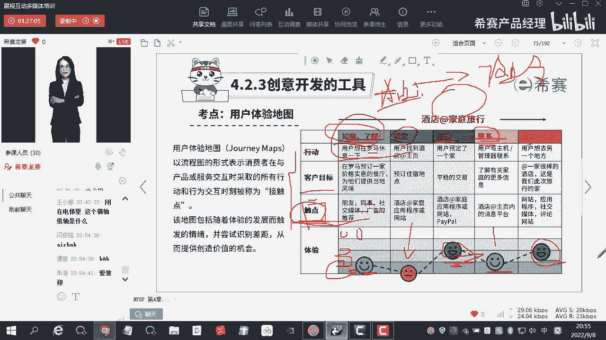

这是什么呢，就是你去哎选择一个目的地去旅行，然后去订酒店的全流程啊，它的触电这个过程假如说什么，假如说你是一家旅行社，对不对，这个东西，其实就是你的产品的整个的全流程的体验，那么对于你来说的话。

你需要去优化的到底是哪些方面呢，你需要去改善的到底是什么方面呢，对不对，那看完这个东西的话，可能你的感受啊不是那么的深切，那么我们再来看啊。

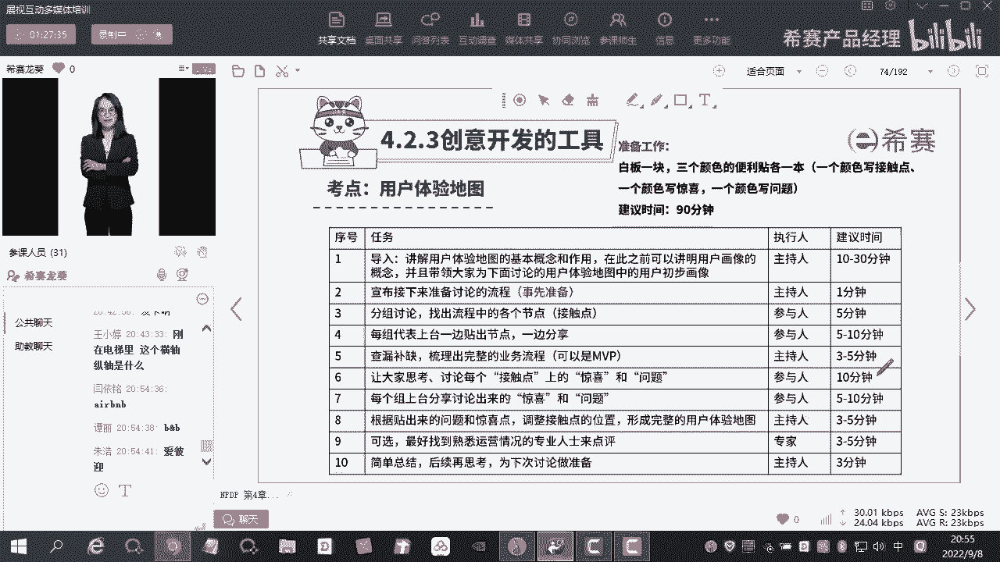

现在看这个啊，看这个这个是一个非常经典的案例，什么案例，大家看到这个东西知道是哪一家企业，不看到这个图，你知不知道是哪一家企业，知道吗，嗯这个是一个非常经典的案例啊，几乎是百分之百都会用到这个案例。

知道是哪一家店吗，它是一家这个做家具的，我在之前，我在之前讲精益产品开发的时候有讲过，对宜家对不对，宜家啊，好一加它是什么，它是北欧极简风，对不对，他在很多的城市，在很多国家都非常受欢迎啊。

除了它本身的产品比较ok之外，深知什么呀，深知自己的优势在哪，自己应该怎么样去优化用户的体验，比如说你去逛一趟宜家下来啊，你的横轴，你的时间节点，也就是说在哪些个触点会发生，这个用户的交互啊。

第一个店面的位置和外贸，你第一下对这个店面的感受是什么样子的，然后在停车场有没有停车场，你店内的装潢怎么样，高不高大啊，高不高大上，有没有档次，然后再就是这个购物的工具怎么样，有没有这种男子啊。

有没有这种推车呀，是不是有没有这种袋子啊，对吧好，这就是绕圈购物啊，产品的质量怎么样啊，价格价格怎么样啊，组合的展示合不合理呀，然后产品的使用啊怎么样啊，然后呢标签和说明清不清楚啊。

然后再用员工的服务怎么样啊，卫生间啊，儿童区啊，餐厅啊，整个服务流程他全部给你讲完了对吧，好那么对于每一个每一个点啊，每一个点你的感受是什么样子的，哎比如说你看店面的位置外貌一般啊一般。

然后呢停车场非常差，比较拥挤嘛，对不对，去宜家的人很多啊，编队的装潢呢比较舒服诶，来diy的工具呢相对来说也是比较好的，这个我就不一一的去念了啊，我要讲的是什么呢，你会发现有很多呢它是处在什么。

处在正向反馈的区域，有很多呢是处在什么负向反馈的区域，对不对，那么这些个东西它有好有坏的情况下，它有好有坏的情况下，你的资源又非常有限的情况下怎么办，有的人说我要优化，我当然是把所有的东西。

我把下面所有的啊，就是处在这个负向反馈区域的，我全部把它优化了，然后呢把它往上移，那是最好不过的，对不对，但关键是什么呀，关键就是企业它没有这么多的钱呐，没有做这么多的人力物力。

让你去做这样的一个全盘的优化呀，怎么办呢，你优化哪些个地方呢，来你们来说一下你们优化哪里，是优化这个这个这个还是这个还有这个嗯，到底是优化哪个点，大优化哪个点，来我来抽个人来说一下啊，黄欣婷在不在。

好有人跟我说是员工服务上面的r主号，说是上面的付款付款付款在哪啊，这里啊付款严一名说是付款，还有没有卡顿模型，哎卡顿模型也出来了哈，产品优化产品啊，这一块还有没有啊，就是看到大家啊都会有一些不同的想法。

对不对，有一些不同的想法来我们来揣摩一下啊，大家的想法啊，有的人会讲说，那我这几个地方我做的非常差的，我肯定是要把它优化好啊，优化好了之后感受就没有那么差了的话，他对我产品的这个整体的体验。

肯定是有帮助的啊，这里的话呢又会讲到一个心理学里面，做的一个测试啊，对于这些个用户啊，做了这样的一个测试，也就是说整个全程下来啊，大家对于什么呢，对于过程中间的一些具体的点，他其实记忆没有那么的深刻。

它对于什么呢，它对于风和中的感受是最为强烈的，比如说什么，比如说你们啊逛宜家了之后，为什么大家对宜家的感受那么好，这是因为什么它的产品本身的使用它的产品啊，这个里面的一些什么价格呀。

它本身的质量啊是过过关的，对不对，这是你们对于什么，对宜家最最为直观的一个感受，还有你们对于只对于这个宜家，最直观的一个感受是什么，他最后他会让你一块钱去买一个冰淇淋，这个冰淇淋还比较好吃对吧。

是不是当年还没有蜜雪冰城的时候啊，一块钱你想要去买一个这个冰淇淋甜筒，那是不可能的，那个肯德基是卖多少啊，八块多一杯，还有十几块钱一杯的，如果说是圣代的话，是不是就更贵了，对吧好。

那你一块钱就能够吃到一只很大的冰激凌，他最后的这种感受给人的感受是非常好的，所以整个人逛完宜家之后，可能在这个过程中间，你对于其他的感受啊是不好的，但是最终的这个感受和什么。

和这个峰值的感受也是非常好的，情况下，就会让你对整个的旅程啊感受到非常的愉悦，再给大家举个例子，有没有在啊这个迪士尼乐园去玩过的，迪士尼乐园最精彩的是什么呀，最精彩的其实就是最后的这个放烟花的过程。

我看很多人去迪士尼打呃，那个乐园打卡的时候啊，必定就会发一张朋友圈，那张朋友圈你一定就是什么，一定就是放的烟火啊，就说这个烟焰火表演非常非常的好啊，非常的nice啊啊这个迪士尼乐园真的很好玩啊。

我下次一定还要去，就激动人心啊，其实什么，就是他把最终的这个用户的体验做到了极致，然后还有什么呢，还有风风是什么呀，啊他你问他，你说除了这个烟火表演，你还有什么感受啊，他说唉这过山车非常的不错。

它是什么，它是它的峰值，对不对，那对于其他的，比如说这个里面的东西卖的死贵呀，这个厕所啊，这个量不足啊等等的，他还有没有感受，感受其实没有那么明显了，那很多人刚刚啊考虑的说，老师难道这些都做得非常差的。

我们就不需要去优化了吗，当然啊这个差是什么呢，你不能说是非常的糟糕啊，和你的竞品相比，只要是什么呢，你做的差，但是呢没有导致什么呀，没有导致说你因为你这个东西差非常糟糕，导致我的用户流失。

流失到我的竞品那里去，那么这个东西的话相对于风和中来说的话，它的优化的什么优先级就没有那么高，如果说啊如果说你的某一个点的这个体验感受，用户的打分是极其差，非常糟糕，因为这一个点非常差，导致什么呀。

导致我的用户流失到了我的竞争对手那里，那必须这个地方肯定是需要你去进行什么，进行改进的，了解了没有，了解了这个基本的这个点没有意思，是什么意思，首先要遵循的是风风中定律，对不对，风中定律完了之后呢。

我们就不去care了，其实不是的，也要care，但是呢它会有一个度啊，就是说它的这个优先级到底怎么样去排的，一个问题啊，当然有优化的地步啊，你这个风你的产品国在这个呃。

就是说本来它已经成了我的这个优势了，对不对，我还有没有改进的空间，你对于我的产品，它是对于整个什么整个体验过程，对不对，我的产品质量我还能不能够有进化的空间，当然有进化的空间呢，是不是你不要纵向的去比。

它是一个横向的一个比较横向的比，对于他的感受是要高于他们的，知道吧，纵向你把你优势的地方做得更加优势，把你的卖点更加的巩固下来，这个肯定是一个什么，肯定是一个这个方向啊，对不对，好啊。

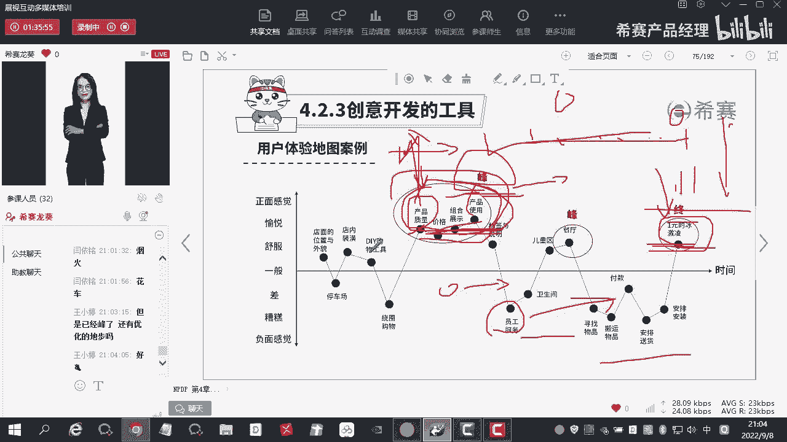

这是关于关于什么呢，怎么做呢，我们我们一般情况下啊，是这样子做的，会先干嘛呢，会先去找一个白板，找一个白板，然后呢会去找几种不同颜色的便签纸啊，嗯好的好的感受啊，正向的反馈呢。

我们用的是这种红色或者是橙色的啊，红色或者是橙色的这种变便签纸，然后呢负向的反馈我们一般是用的这种啊，那个蓝色啊，蓝色和绿色的便签纸啊，正向是红色和橙色绿呃，负负向是这个蓝色和绿色啊。

这个东西不是一定的，就是你们自己自己去去做这样的一个选择啊，只要是什么呢，能够去区分正向和负向，然后呢横轴上我们会把什么时间节点给标出来，也就是它的触点给标出来，然后纵向的话呢把我们的什么情绪的感受啊。

一个是什么正向的反馈很好一般，然后呢很糟糕，然后呢一般糟糕，把把它这样子先列出来了之后啊，然后呢再去做下面的一些操作啊，所以呢肯定是要有一个主持人的，对不对，主持人他会告诉你啊。

我们接下来要做一件什么事情，是针对什么产品去做这样的一个什么，第一步，第二步我都已经讲完了啊，宣布接下来准备讨论的流程，就是这个主持人去做的事情好，然后呢再就是什么分组讨论啊，找出流程中各个节点接触点。

他在事前的时候啊，可以自己先什么，先根据以往的经验，先做这样的一个时间节点的一个是吧，安排安完了之后呢，在讨论的过程中间，我们可以对这个时间节点再去进行补充，再去进行补充啊。

完善每组代表呢上台一边贴出节点，一边分享，什么意思啊，如果你有节点的补充，那么呢你就去补充，如果你没有节点的补充，那么你就把你自己的感受给贴出来，然后查漏补缺，梳理出完整的业务流程啊。

就说最终的话这个东西大家都认不认同，有没有问题没问题，ok我们就按照这个来好，让大家思考，讨论每个接触点上的什么惊喜和问题，就说你对于具体的某一个点上，你的感受到底是好还是不好啊，不要被其他的人去影响。

每个组呢上台分享讨论出来的惊喜和问题啊，然后根据贴出来的问题和惊喜调整什么呢，所以说你补充了，或者说是你最终哪怕是你最开始拍板，已经说这个东西是ok的啦，那可能讨论着讨论着诶，可能对。

有一些东西呢觉得他们两个可能合并一下，会更好，或者说有的东西呢我觉得它太大了，这个触点太大了，里面还有一些细分的一些动作，那我能不能去拆解一下对吧，好可选，最好找到熟悉运营情况的专业人士啊，来点评。

什么意思啊，就是我们可能是跨职能部门的啊，有一些人呢他是参与到这个过程中，然后有一些人呢是坐在旁边去做什么，做一些评审类型的这样的一些意见，然后最后呢做一个简单的总结，后续再思考啊。

为下次的讨论再做准备啊，那么这个过程的话呢，其实就是这个开会的一个过程啊，开会的过程具体的这个东西怎么画，其实我们在之前讲这些个例子的时候，就已经讲好了啊，你只要把什么呢，只要把时间的触点给他搞清楚。

然后完了之后你们每组讨论也好，自己去贴也好，都ok啊，都ok，然后另外的话呢，这个图上没有展示的一个东西是什么呢，就是你们在操作的过程中间啊，你比如说我们在操作的过程中间，横向和纵向我们都贴了对吧。

贴了之后的话呢，我们是不是要考虑它的优化，是不是，那这个时候的话，在前期我们还可以做一个什么事情呢，叫竞品分析，叫竞品分析啊，竞品分析我们可以看我同类型的竞品，它在每一个时间节点做得好的方式到底是什么。

做的不好的方式到底是什么，那么做的不好的，我要和我自己的不好的去进行对比，我到底需不就假如说啊其中有某些个点，他的感受是不好的，那我就看一下竞品，他都做的怎么样啊，他做成十分还是做成七分对吧。

那如果我是五分是吧，就相对来说就没那么糟糕，我就不需要去优化，那竞品如果做得好的地方，比如说我们的峰值是产品对吧，产品这个部分，那对于我的竞品来说，大家对于竞品的感受可能更好的话，那就意味着什么。

我的产品这个部分还有很大的进化空间。

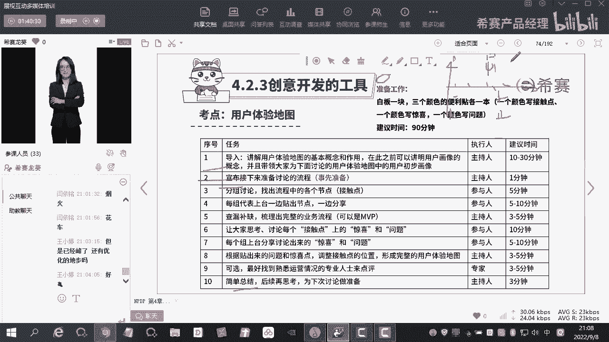

你要想真正的完完全全的说把它全流程都走完，一定要得出一个结论，这个结论就是我到底应该在哪一个点去优化，而且优化到底采用什么样子的解决方案，初步的解决方案到底是什么样子的，要通过什么呢，通过竞品分析啊。

你真的想要把它做出什么呀，做出有价值的信息出来，你要准备的内容其实是很多的，知道吧，好到这里的话就讲完了啊。

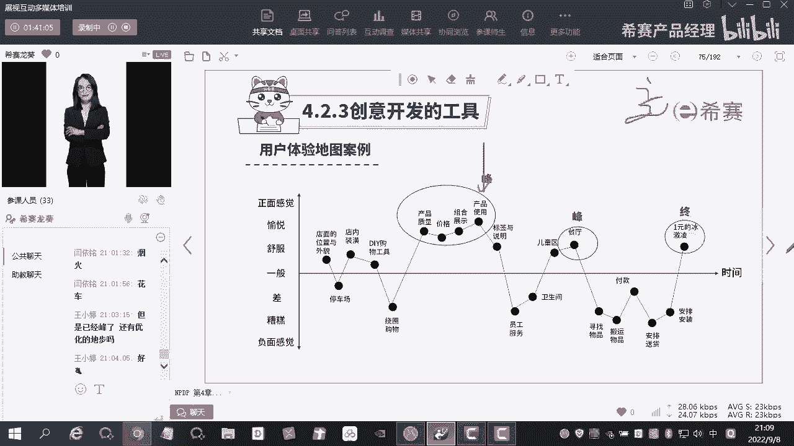

那么考试的话呢很简单啊，考概念性的一些内容来看一下，好我们说啊，答案出现在头顶上，这个东西呢从我们教研的角度来说，确实我讲完一个知识点，要告诉你这个点他到底是怎么考的，会要去配样题。

但是你们在做的时候啊，你要把这个东西给抛开，好吧，我们一起来看一下啊，2016年夏天，一家新型的快快餐，这个品牌在纽约开业，开业很快就刷爆了大家的朋友圈，因为这个快餐店老板找了一个创意公司。

为自己去设计自己的流程，发现呢攀高峰呢，年轻人呢都会排队，也就是说在整个过程中间啊排队是什么，排队是一个时间触点，然后在这个触点上呢，大家的感受是非常不好的，这家公司呢对同类型的问题和痛点。

从年轻用户的用餐旅程去入手，绘制了一幅地图，还原了整个这个过程，到最后啊去进行什么呢，找到他们的什么痛点所在，然后呢去进行优化，这这不就完全是什么，是不是有用户的旅程，然后有每个触点大家的什么感受。

然后针对什么呢，感受不好的就是他们的痛点嘛去进行优化，很很很形象的去展示了，是不是那么考试的时候啊，其实可能就是这样子去考。

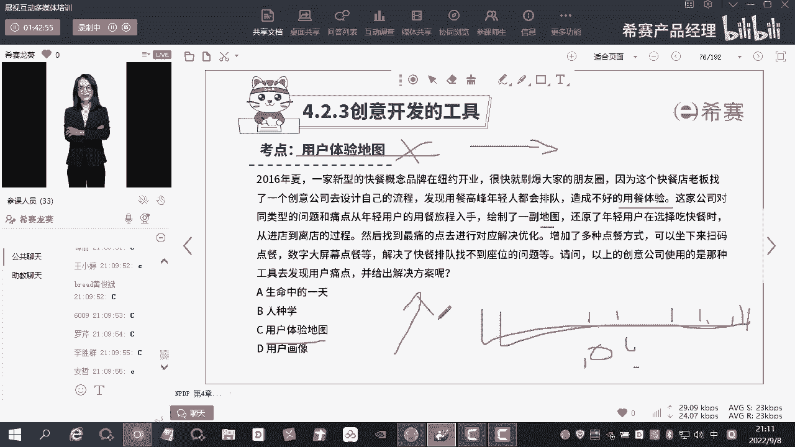

对不对，好，那么关于啊创意生成阶段，所有的内容全部都讲完了，其实啊重点呢给大家去讲了一下，呃因为前面的内容的话呢，嗯都是一些相对来说比较简单的一些内容啊，没有什么太多的一些实操的一些难度。

那确实是作为产品经理来说的话，你是用的比较多的两个非常基本的工具啊，所以这两个东西的话呢，可以大家课后再去多多的去搜集一下，相关的内容，然后去学习一下，把这两个东西啊用起来好不好，好。

接下来的话呢我们就会进入到第二个啊，叫产品的概念开发设计阶段，那么在这个阶段是要干什么呢，我们在之前发现的是什么，发现的是创，对不对，好，那么创意这个东西是非常抽象的，抽象怎么办呢，我要具象化。

慢慢地形成什么，形成概念，形成一种文字性，或者说是其他的图示可以表达的一些出啊，基本的一些解决方案，对不对，那这个阶段有哪些工具可以去使用的，第一个叫概念工程，第二个叫卡洛模型，第三个叫形态分析。

第四个叫概念场景，第五件是吧，叫trade啊，这些个模型之间啊，我再一次的声明，他们虽然有自己不同的这样的一些定义，但是他们之间不是互斥的，是什么呢，是什么可以并行存在的啊，并行存在的。

有的时候你再去做什么呀，做形态分析的时候可能就用到了卡洛模型，你在做概念工程的时候可能就用到了形态分析，你在做概念场景的时候可能也用到了形态分析，这是很正常的，互相交缠啊，好那么对于大家来说。

你首先得要了解什么呢，得要了解他们各自的概念是什么。

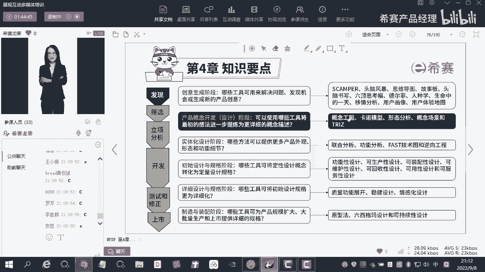

好那我们来进入到这个板块内容的学习啊，好概念设计阶段，它的工具，首先第一个概念设计的典型流程是什么样的，好讲这个概念的时候，讲这个部分的知识的时候啊，我想给大家强调的是概念设计呢。

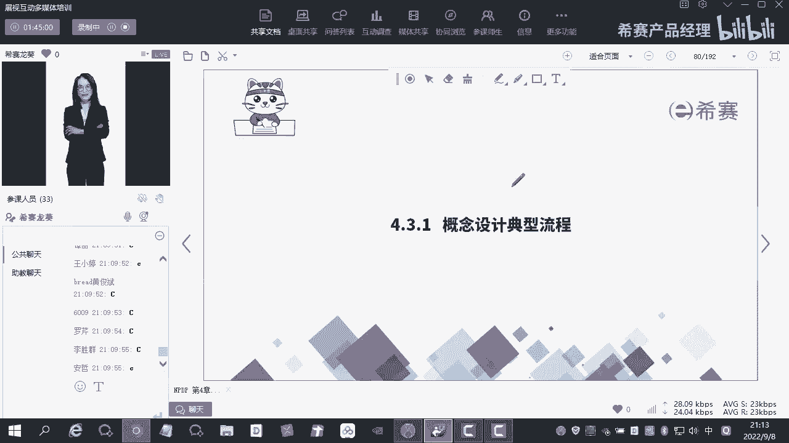

我先给大家说一下它是什么，我从基本的文字性的概念描述它是什么，它是定性的描述，对不对，好把它转换为什么呢，转换为产品设计规格，什么叫产品设计规格，将定性的这种描述转化为什么呢，定量的描述好。

在这代就到往下掉，什么呢，叫产品的技术规格，提供给产品制造商的规格好，看到这个地方，大家还是不清楚这三者到底是什么意思，什么意图，对不对，你看这个箭头的话呢，其实也能够明白他们之间的递进关系是吧。

什么意思呢，你把这个概念直接给开发开发能看得懂吗，看不懂，你把这个设计，你要把它转换什么量化的一些设计规格，开发才看得懂，好开发看懂了之后，你这个东西是不是能够大批量的制造呢。

你开发的出来和你制造的出来就是两码事，我讲了很多遍了，对吧，这是指开，这是给开发团队的，这是给谁的，这是给我们的制造供应商团队的数据好，还不清楚，给大家举个例子，比如说现在我要去建房子对吧。

建房子我要因为我现在是一个北漂啊，或者说是一个什么什么什么沪漂啊什么的，反正就是居无定所的一个人，对不对，我现在租房子，那么现在我年纪大了怎么办呢，我想要有一个家，对不对，想要有一个家。

我想要现在去买一个房子也好装啊，这个这个这个呃这个去建一个房子也好，无所谓啊，那么这个时候我就会讲什么呢，概念描述怎么样去描述啊，怎么去描述，我要去干嘛，建建一个这个房子干嘛呢，供我们一家四口去居住。

解决什么问题呢，解决我居无定所的这样的一个问题，能够让我安心的去工作，这个是不是一种概念描述，是对不对，他讲清楚了我的这个产品是什么，它解决了我什么的需求，对吧好，这是概念描述。

那么这个概念描述你给什么呀，你给施工队，你给施工队去听，他知道要建成什么样子的房子吗，不知道对吧，你得要去翻译，通过谁去翻译呢，通过设计师现在搞啊，做这个房子的建筑也好，装修也好。

他们都依赖于一个什么团队啊，叫设计团队，是不是，好设计团队给你负责干嘛呀，负责出设计图纸是吧，负责出设计图纸，把你原来的这个东西呢，通过和你的沟通，哎，你要建一个房子，这个房子长什么样子呀，几层呢。

两层好，两层有几个房间呢，上面几个房间，下面几个房间，这呃呃这个下面几个房间分别是什么用途，对不对，这是什么，这是把原来定性的东西量化了，对不对，量化好，量化了之后，施工团队就知道怎么样去做了吗。

也不知道为什么呢，我都告诉你要做几间房了，做多宽多长了，你为什么还不知道呢，为什么还不能够帮我把它做出来了，当然不知道为什么呀，你到底是用这种啊，我们讲什么这种红砖去气，混凝土去气，还是用什么。

还是用这种泡沫墙去砌，这是完完全全两种不同的规格呀，对吧好，你看哦，这个例子的话呢就很生活化，那么应对到我们的这个产品也是一样的逻辑啊，你得要先什么把它量化这个东西，它大它的这个这个嗯嗯。

由这个定性转换成什么呢，电量电量了之后呢，再转换成一些具体的一些技术的一些参数，这个过程的话是什么，是一个递进的一个过程啊，好所以你看产品设计的典型流程是这个样子的，后面呢给大家讲了一些。

这种文字性的一些东西啊，其实最重要的就是什么，最重要的就是产品概念描述它的价值是什么，产品概念描述它的价值，一个是对内，一个是对外，对不对，对内其实我刚刚已经强调很多遍了。

开发团队他不知道他要干什么的时候，你告诉他，我要干的这个东西是这个是不是起到了什么，起到了一个一致性和清晰性的作用，对团队内部去宣扬，我接下来要做的这个产品到底是什么，有一个方向性的一个一致性，对不对。

好另外一个就是你的产品是为谁服务的，是为客户服务的，对不对，你通过这个价值主张的描述，我们刚刚之前在第三章的时候，是不是讲到过哎我们要做做一个什么事情啊，做概念测试，什么叫概念测试啊。

概念测试就是我把这个概念我给你抛出来，然后呢你们针对这个概念给出相关的一些意见，对不对，所以这个概念把它剖出来的时候，其实就是什么呀，就是像你的什么潜在客户去解读，你接下来的这个产品，它到底是什么。

所以他对内对外都很重要，对内呢是什么清晰性和一致性，对外是什么呢，向你的潜在客户解释，你的产品有一个预热这样的一个过程，对不对，所以你看啊产品的概念描述，第一个它的特征是什么，它是定性的描述。

第二个它的价值在于什么，对内和对外好，那你的概念描述这里又给大家讲了一个例子啊，比如说你们现在装修对吧，装修我要装这个柜子，洗漱台旁边的，我要去装一个柜，柜子同洗手台宽，然后低于洗手台的位置呢。

向外开门，柜内的做两层。

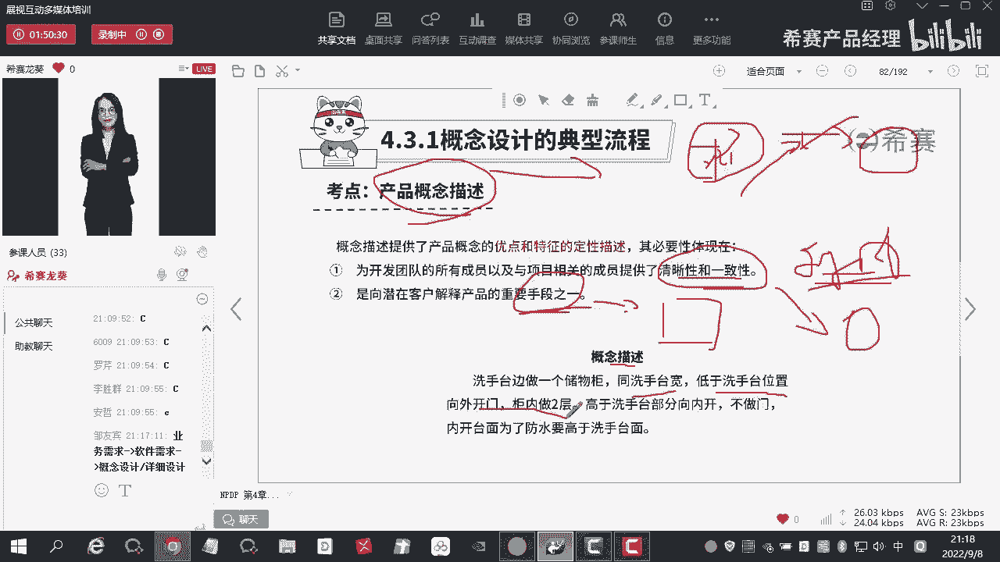

这个是属于什么一种文字性的描述，对不对好，那你再看啊，什么是产品的设计规格呢，什么设计规格他会告诉你哎，通过这种什么图纸的方式告诉你啊，它长多少高多少，宽多少，对不对，量化了对吧，那量化了之后。

它就能够让这个木公司是否做出来吗。

做不出来他得要干嘛把它拆解，拆解完了之后呢，等下告诉你用什么样子的材质去做，把它做出来，这个东西唉，施工师傅看到了之后才能够把它做出来啊，这是我刚刚之前讲的那个租房子是一样的道理，我就不说了，好吧好。

到这里的话呢，我想给大家强调的是什么呢，强调的是你看啊产品的设计规格，技术规格它是属于什么，它是属于体啊，这个这个提供给产品供应商的规格，供应商的规格是为了去把它做一个。

大批量的一个制造，对不对，那你再来看到我们最开始的这张图啊。

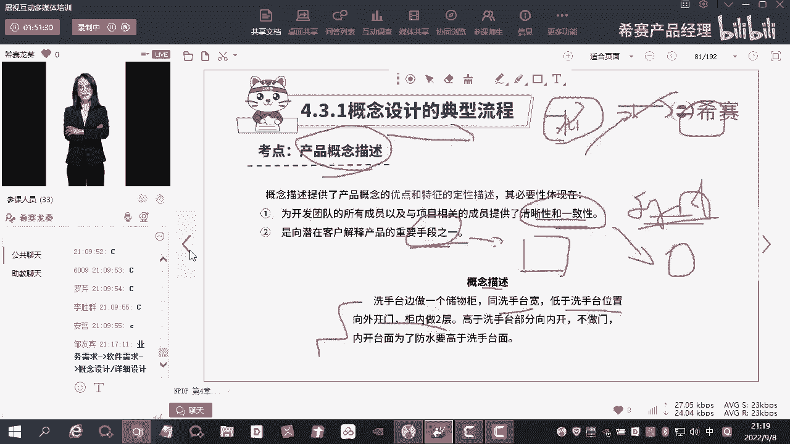

这张图我来给大家捋一捋这个逻辑关系啊，好你看实体化设计初始设计，还有详细设计与规格，其实你发现没有，在最开始开篇讲概念开发的典型流程，由什么概念是概念描述到什么，倒是技术描技术规格描述啊。

设计规格描述在做什么，这个技术规格的描述其实它有点什么意思啊，有点从这个阶段是一个总分的一个意思，是不是在这个部分诶，可能是讲到了一些更加比较粗略的这个概念，怎么样去形成，然后完了之后呢。

这个概念我怎么去完善，它，慢慢的有了些什么量化的一些这种意思了，哎我的这个外观怎么样去设计，我的功能细节怎么样去设计，可能在这个部分更多还是属于什么，还是属于这种定性的。

然后慢慢的到了初始设计和规格的时候，会有一些简单的这样的一些什么量化，然后再往后的话就到了什么大规模生产呢，所以你看他们之间可能是一个什么关系，一个总分的关系啊。

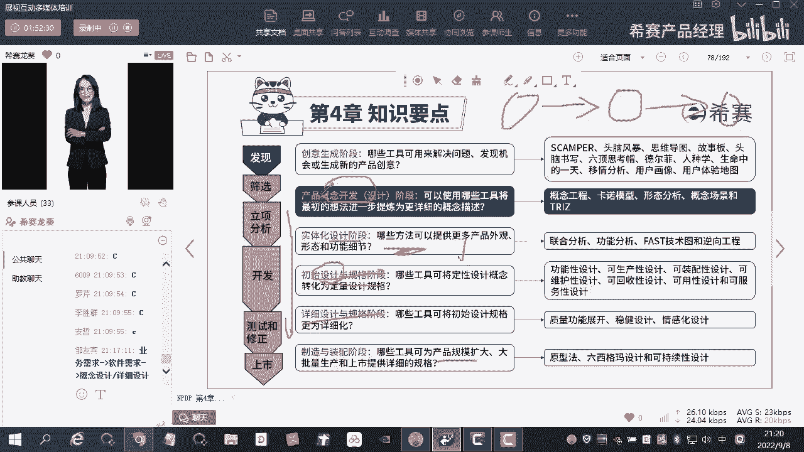

好先做做一个铺垫啊，这个地方大家如果没听懂也没关系，好不好，我们课程啊后面还有六个小时。

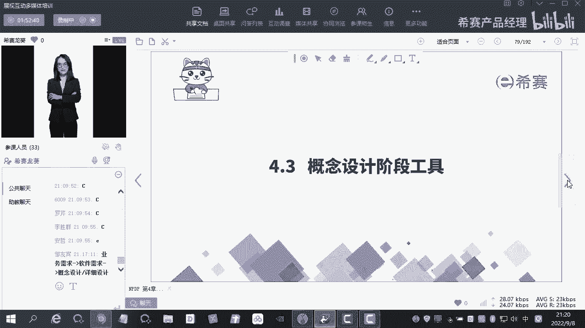

哎我再给大家去细细的翻译成好不好好，那我们今天再来看到啊，这个部分讲完了之后做一下题。

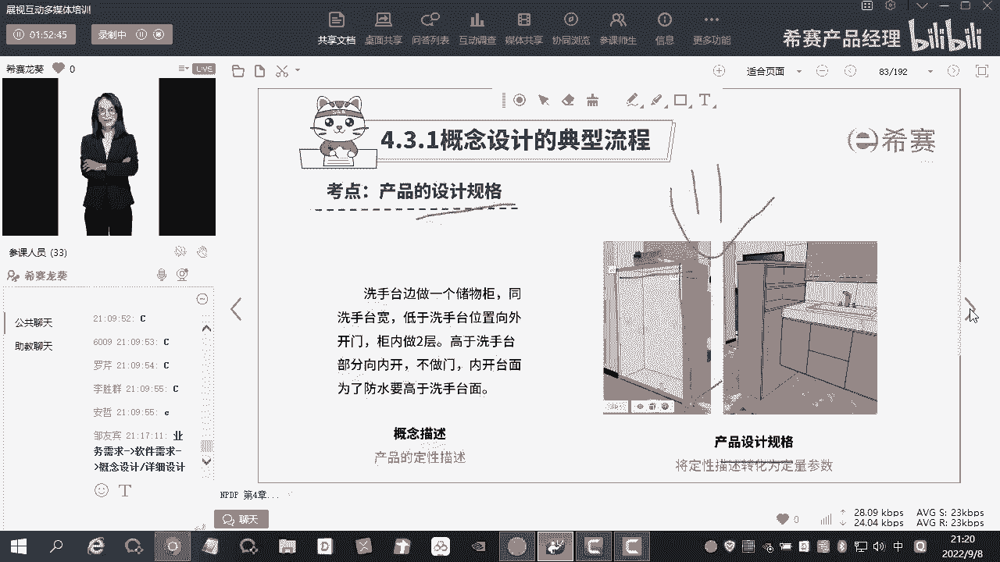

考题他怎么考呢，第一个就考什么产品的概念，第二个考什么产品的技术规格，产品啊，这个设计规格啊，不是技术规格，设计规格之后再是什么，再是技术规格，对不对，技术规格几乎是不考就考什么呀。

就考产品的概念和什么和产品的设计规格啊，就考他们两个好的，你看这个题你选什么，很easy，对不对，他问的是什么，产品概念描述非常有价值，为什么有价值呢，一个是对内的价值，一个是对外的价值，对吧。

你看针对消费者研究有非常重要的作用，做概念测试有没有有没有作用啊，有作用啊，对不对，好生成详细的产品设计规划打下了良好的基础，哎我们讲什么，这个流程方面它是一个递进关系，前一步是后一步的什么基础哎。

有没有问题没问题对吧，好，为项目团队所有成员提供了清晰的产品概念，方向性和什么和一致性，perfect选d对吧好，所以这题选什么选d没问题啊，好再往后啊，再看这个题目，大家做一下，这，题比较简单一点啊。

产品的概念描述和设计规格，概念描述在前，设计规格在后，技术规格在最后，对不对，概念描述是定性的，设计规格是什么，是定量的，所以他们两个最大的区别对吧，你看那选什么，选b是不是好。

那a c d为什么不对呢，d肯定排除了，没有区别，肯定是不可能的嘛，那就是a和c吗，产品设计规格针对工程师，而产品的概念描述针对管理啊，这个营销人员，其实没有所谓的这种绝对的分类啊。

绝对分类它其实在整个流程中间，对各个部门的人，他其实都是有一定的，什么都是有一定的作用的啊，好c产品概念描述，经常用图画表述产品设计规格，使用数字怎么说呢，你要是这样子说的话，好像也没什么太大的问题啊。

也没什么太大问题，但是啊你把它生成的是把它呃，就是我们讲什么做一个事情，你要透过现象看本质，对不对，它的本质是什么，本质就是量化和这个定性和定量的一个区别啊，至于它的展现形式，比如说概念描述。

用图画表述啊，用图画表述产品设计规格，用数字表述它是一种外在的形式啊，本质还是他们啊，本质还是定性和定量的区分好吧，好我不用图画，我用什么，我用文字描述行不行，当然行吗，是不是，所以这题选b对，是的啊。

非常不错，好，再看一下这个，哎很简单啊，设计典型流程是什么，概念描述设计规格，还有什么技术规格啊，我就不说了，其他的就是为了错而错啊，好讲完了基本的这种前导性的一些概念之后。

我们再来看这个阶段的一些具体的工具。

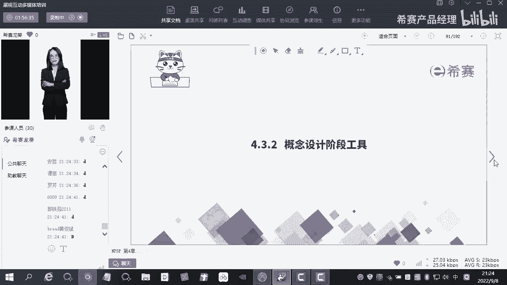

首先第一个呢叫概念工程，概念工程啊，它会有一个什么，他会有这样的一个描述，它是为了去解决模糊前端啊，解决模糊前端的一些内容，概念工程是以客户为中心的流程，明确产品创新流程的模糊前端，因为概念工程。

概念工程，它其实是为了产出一个什么比较好的一个概念，对不对，我们讲啊，在正式进入了开发阶段之前，它叫什么，它叫模糊前端，我们在第一个阶段发现创意，第二个阶段生成什么生成概念，第三个阶段生成什么。

生成迭代改进后的这样的一个概念，因为我们在这三个阶段要做什么，要做概念测试，对不对，概念测试的目的是干什么呀，目的就是对现在的这个概念做更加详细细致的，这样的一些展现，对不对。

可能会牵扯到我在这个阶段要去描述出来什么，我不单单是要描述它这个产品是什么，为什么人群服务，它的核心价值是什么，我还得要描述出它基本的功能框架对吧，我要实现一些什么功能，它大致的框架是什么样子的。

当然但是不管怎么样，它还是属于什么呢，还是属于定性的范畴是吧，还是属于模糊前端的范畴，对不对，如果概念工程这个东西做出来了之后，他想要达到一个什么效果呢，达到的效果就是通过这个概念工程，我们能够什么呀。

能够去选择出最终的这样的一个概念，最终的这个概念干嘛呢，进入到下面的开发阶段，是不是，你看该方法，可以明确客户在设计中的什么关键需求，并且提出几种满足这些需求的产品概念的方案，具体的流程啊。

就是右边的这个流程，这个流程大家简单看一下啊，其实这个东西你要实操的话，有什么有什么难度吗，没有什么难度，他其实更多的就是什么偏文科生的一些东西啊，好第一个阶段干嘛呢，了解客户的环境，什么意思啊。

我们刚刚在之前讲了很多了，为什么要做用户画像啊，你不可能满足所有用户的需求，你需要对一个用户细分做什么，据了解，然后针对这个用户细分，我们讲了什么，讲到人种学，讲到生命中的一天，讲个移情分析，对不对。

我们要通过这些个工具干嘛去了解客户的环境，在这个环境中间，它具体有什么需求，具体会对他有一些什么行为方面的一些影响，比如说他不吃这个猪肉，不吃牛肉对吧，那你再做一些食品这样的一些什么开发的时候。

是不是也要去考虑到这些个因素啊，是不是好，那么第二个阶段干嘛呢，你对客户的理解转换，为什么客户的需求哎到这个地方，你是不是对这个客户的环境呢有所理解了之后，最后你要去把它整合出来。

哎这个客户的需求到底是什么，然后呢用专业的方法去进行落实啊，比如说这个需求列出来之后，我们得要干嘛，对需求进行分类，是不是怎么分类呢，卡洛需求啊啊啊，卡洛模型呢对吧，还有我们讲的莫斯科模型呢。

是不是还有可能讲那些什么比较，原始的一些方法，就是呃这些个不同的需求之间去进行pk呀对吧，还有比如说我们后面讲到的，即将要马上讲到的一个叫什么叫q a f d，对不对，什么叫q f d啊，就叫质量无。

对不对，质量无他在最开始的时候，我们去了解客户用用户的需求了之后啊，这些个用户需求，我们要对这个用户需求去进行相应的什么排列，排序的排序完了之后，每一个用户需求我们应该用什么样子，具体的规格去满足。

用什么样子具体的方法去满足，对不对，比如说客户客户希望什么呢，希望我的这个什么这个呃，就是我们之前啊有一家这个制药公司啊，制药公司他们里面这个客户有个什么需求呢，就这需求说你们有没有喝过那种感冒冲剂呀。

对不对，感冒冲剂希望什么呢，希望这个颗粒啊要比较细，甚至是你如果能够做到这种粉末状的话，那是更好的对吧，那你做粉末状和你这个颗粒的这个细度，它是由什么决定的，它是由你最最后去什么去碾压。

这个过程中间你要用到什么，用到这个工具去决定的，你的这个缝隙的大小，决定了你的这个颗粒度的大小，是不是，那你这个时候的话啊，这个如果你的这个呃，这个这个需求的排序比较靠前的话，你就要通过什么呢。

通过这样的方案去达到这样的一个什么需求，好，这叫什么，用专业的方法去进行落实，那么这个时候的话，你针对每一个需求，都有相应的一些解决方案的时候，你最终把它连起来，会不会形成你的这样的一个概念呢。

好你到这里，我先在这里埋一个伏笔啊，我刚刚讲什么，讲的是其实是针对每一个维度的要素，哎比如说这个需求，你这个颗粒度，那么你这个感冒冲剂还有些什么维度啊，比如说这个药效，药效对不对，还有比如说什么。

还有比如说什么甜度对吧，这些东西都是可能未来的一些需求，我的甜度不能太甜，我的甜度也不能太苦是吧，还有这个药效，我希望它的这个药效比较比较长，对不对，我可以把它当成不同的一些呃一些维度。

那么针对这些个不同的维度，可能就是一些需求是吧，我怎么样去满足他的需求，把这些个东西全部了解清楚了之后，形成一个什么，形成一个概念，可能两两组合就是一个概念，两两组合又是一个概念，如果在这个阶段啊。

我们还是尽可能的希望什么呢，生成更多的概念，生成更多的概念干嘛呢，如果你的概念生成的过少，我们后面要去评估概念的时候，其实是没有太多的选择余地的，所以我们希望什么呢，希望在生成概念的时候。

你的这个什么选择性要比较多，那么生成概念的时候一定要有，要注意一个问题啊，有的时候你的这个需求可能过大，有的时候你的需求可能过小，对不对，我们在之前做敏捷的这个部分的呃。

培训的时候就给大家讲过他是一个什么，它是一个有限式的这样的一个过程，越大的需求我把它放在下面的，越小的需求，我把它放在上面的，那针对说大的需求怎么办呢，可能在这些个需求里面，你会发现啊。

有一些需求它的颗粒度太大了，比如说啊，比如说现在有人给我反映，说艾老师这个np tp的学习好难啊，或者说这个产品经理的这个学习好难啊，我应该怎么去解决呢，你给我一个解决方案好不好，这是不是个需求。

是一个需求对吧，你需要什么，你需要解决方案，按道理来说，我要根据你的需求去给给这个解决方案，对不对，但是这个需求对于我来说太大了，怎么办，我要去进行拆解，在生成概念的这个时候，你就要看一下，看什么呢。

看这个需求是不是足够的细，越细越好，为什么呀，他能够帮助你把很多的东西都给你弄清楚，然后呢针对性的去给出相应的一些解决方案，好刚刚讲了这个问题，你说怎么样去学习好产品经理这个课程，我不能够给出这样啊。

就这个需求对我来，他怕不能给出一个针对性的，这样的一个什么意见的时候，怎么办，拆解对吧，好，你到底是因为这个知识太枯燥了，还是说这个学习的视频太长了，你未来还是说你本身就很懒对吧，你不想动。

但是呢你就想什么，直接把老师的脑子，然后呢安在你自己的脑子上，面，对不对，这都是可能会导致你什么，导致你这个呃有这样的一个需求的，这样的一些原因，你再把这些个细致的哎这个需求再去看，哎。

你如果说你认为说什么这个视频，你觉得难度太大了，怎么办，那我就告诉你，你先去学习简单的基础的，然后再来学习，这是不是一种解决方案是吧，对不对，好，那你如果说是因为什么，是因为这个你自己比较懒。

或者说是你这个时间不够怎么办，时间嘛挤一挤总会有的，那我告诉你，你第一天干嘛，第二天干嘛，第三天干嘛，我给你每一天的时间，我都给你规划好，我给你控制在30分钟之内，是不是一种解决方案。

所以啊在这个地方生成的概念，一定是要越多越好，而且是什么呢，而且是什么，越细越好，针对的需求产生的概念啊，针对性的需求产生的概念好吧好，另外一个就是啊我们会进行评估，去选择出什么最终的概念好。

基本上这个过程还是比较清晰的，对不对，好，那这个过程里面的话呢，我还要给大家去讲一个就是嗯一个新的点啊，就在第一个阶段的时候，我们去了解客户环境的时候，了解客户环境是一个什么，搜集信息的过程，对不对。

那么搜集信息的过程我们要保证的是什么呢，保证的是它的真实性对吧，我们可能会通过不同的途径，360度无死角的去考虑这个环境，或者说这些信息的搜集到底是不是正确的，所以它有一个什么方法呢，叫三角互证法。

叫三角互证法，你们你们可以去看一下书，什么叫三角互证法呢，嗯简单来说啊，简单来说就是从各个维度去验证它，保证他们的信息的口径是一样的，保证他们的信息能够对得上，你不能说哎我从这个方面得到的信息。

和这个方面得到的信息，他们两个完完全全不在同一个频道上，那就说明什么，你这个信息它是不真实的，对不对，好所以这个地方要注意一下啊，这里有一个叫三角互证法啊，三角符护盾法这个地方啊，看一下书好不好。

那么关于这个流程啊，再给大家梳理一遍，先去搜集信息，了解客户的环境，还了解客户在这过程之间有什么问题，然后呢把这些东西整理出来，整理成什么客户的需求，然后呢需求要去进行什么呢，相应的一些排序也好。

或者说是相应的一些筛选也好，完了最后呢要生成我们什么，生成我们的概念，生成概念的过程中间第一个尽可能多，第二个要拆分的比较细，然后再一个就是选择最重要的概念好讲完了啊，很简单，来看一下怎么考。

好这个题目啊，我们来一起看一下在这个概念工程的哪个阶段，会将一个总体的问题分解为子问题，并呃深层清晰并可实施的概念说明表，这个东西其实题干都已经告诉你了呀，其实题干都告诉你了呀，应该是哪个。

应该是第一选项啊，我刚刚讲的生成概念的时候，两个两个点，第一个是什么，第一个是尽可能的多，第二个是什么呀，第二个是我们对于一个大的问题，我们要进行拆解，对不对，所以应该是在生成概念的这个过程中间。

会出现这样的一些什么具体的要求，所以这个题选什么，选d知道吗，我看一下大家选的比较多的是什么，b对客户的了解转化为需求，它是呃需求，它是概念吗，它不是概念啊对吧，他就说了深层清新并可实施的概念。

说明表需求是概念吗，不是的呀，对不对，第一步先了解客户的环境，第二步是什么，把客户对客户的理解转化为客户的需求，然后什么呢，第三步用专业的方法去落实啊，就是去验证一下，这里面哪些个这个卡洛模型也好。

或者说其他的这个q f d，我们讲什么质量股也好，然后呢，知道我们这几个需求里面应该要选择哪一些，我不我不可能所有的需求都满足嘛，对不对，需求满足，我等下去看哎。

这几个里面我到底选哪些个是我的核心需求好，这个需求怎么样去落实呢，我的我的指标到底是什么样子的呢，对不对，就是我刚刚给大家举的那个例子，哎你这个需求说什么，我的这个颗粒度我需要去考虑。

那这个颗粒度到底应该要做成什么样子呢，是吧，对不对，每一种每一个需求的话，可能是有两个指标去衡量会比较合适啊，所以c选项的话呢和题干有没有关系没关系，然后第四个生成概念，生成什么概念，尽可能多的概念。

那么对大问题要进行什么拆解，拆解成子问题啊，所以就可以选什么，选d这个地方啊，其实更多的是什么呢，更多的是对这几个步骤它的一个具体的理解啊，嗯可以啊，概念在软件方面可以理解为类似特性，或者说解决方案。

不可以啊，可以这样子理解，但是它是一个，但是你要注意一下啊，这个解决方案它不是最终的解决方案啊，它一定是什么呢，它一定是有一个迭代的好吧，好嗯今天的课程的话呢我就不往后了好吧，呃，下中秋中秋来了之后啊。

中秋来了之后再往后好吧，嗯课程的话呢，这节课和上节课的内容的话正常进度吧，然后内容也比较多啊，请大家呢呃中秋节抽那么一点点时间，然后去看一看咱们的书，好好的去消化一下，看一看咱们的讲义。

看一看咱们的视频好吧，好好的去消化一下啊，如果有问题的话呢，一定要及时的去问，不要怕麻烦我们的助教老师啊，这句话我讲了很多遍了，你尽可能的多的去问，你考试的时候分数就越高。

那么你很有可能就拿到了1000块钱的奖金啊，好没有问题的话可以撤了，有问题还可以聊一聊好吧，不会再往后讲了啊，嗯刚刚的例子不知道怎么学产品课程，第一步，第二步帮他拆解问题，这第二部不是分解子问题吗。

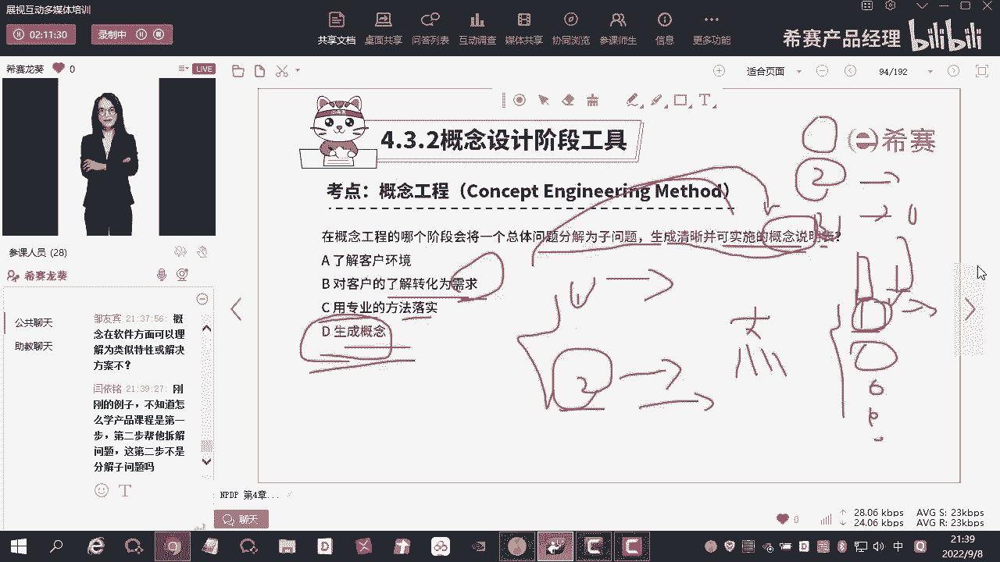

我刚刚我刚刚讲了一个例子，是在这个部分是讲的，我讲的是什么呢，哦了解客户的环境，了解客户的环境是什么呢，你需要他提出来的这样的一个需求，对不对，提出需求是因为什么呢，第一个啊，我现在去了解你。

比如说严一鸣对吧，严明你处在什么环境呢，传什么环境啊，比如说你是个i t对吧，i t呢天天996007没有时间，这是你的一些基本的信息，那么你的需求就是什么，需要什么，我能够高效地去学习。

或者说是能够高效的去解决，我现在这个产品经理的学习啊，更细致一点，对不对，好，那可能什么呢，可能你到这里的话，都不能够明确的提出来这样的一个需求，只是什么，只是我去搜集的这样的一些信息好。

你会发现你我在这个过程中发现什么呢，发现你比较喜欢在什么，比较喜欢在晚上12点的时候，12点以后啊去学习，对不对，因为你白天工作很忙嘛对吧，所以只有在12点以后才有时间学习好。

那这个时候的话对于你的需求可能是什么呢，我基于对于你这些个环境啊，这些个信息的理解，你的需求转换成客户需求，第一个客户希望什么能够高效地去学习，第二个我希望什么需要什么，能够有人去给我做这个规划。

对不对，相对来说这个颗粒度是不是就比较什么，比较细了，如果说哎我针对什么，针对你的这个具体的信息，你给我给来给了这样的一个需求，这个需求是什么呢，你说我要很容易的去学习这个产品经理的课程。

很容易的去学习这个产品的经理的课程，他和他们两个，前面两个提出来的需求的关系是什么，这两个需求，其实是为了去解决这样的一个大的需求，对不对是吧，是这样子理解的吧，好那如果说到这里啊，到这里的话。

你这三个需求我都把它什么呢，把它已经往后走了，到这里的话，我要针对每一个需求去生成，针对性的这样的一些概念的时候，我针对啊，第一个，第二个我都能给出一些具体的一些，这种什么解决方案。

那么针对这三个太大了呀，怎么办，我要去拆解呀，所以在生成概念的时候，你需要去核实的就是什么呢，核实的就是这些个需求到底大不大，够不是不是太大了，如果太大了，我要去拆解，是这样的一个过程。

这样子说了之后有没有清晰一些，清晰了没有，移民回答一下嗯，第四步是拆完了再形成概念，对呀，可以呀，就是你你在最开始，你你在这里是用专业的方法去进行落实嘛，你左边有一张什么，有一张清单表，对不对。

有一张这个需求清单表，你在下面的需求，可能你们在最开始去评估的时候，或者干嘛的时候，或者用一些专业的方法去落实的时候，排序的时候，你并没有去意识到这个东西什么太大了，直到什么呢。

直到你去形成解决方案的时候，你发现不够具有针对性的去解决这个问题，怎么办，你直接在这里去把它拆一下，拆一下之后呢，再去形成这个概念，然后再进入到什么下一步的。

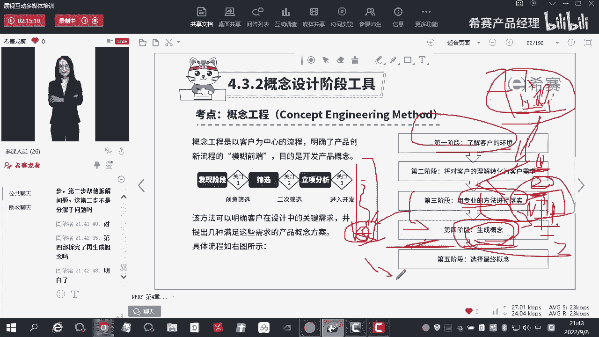