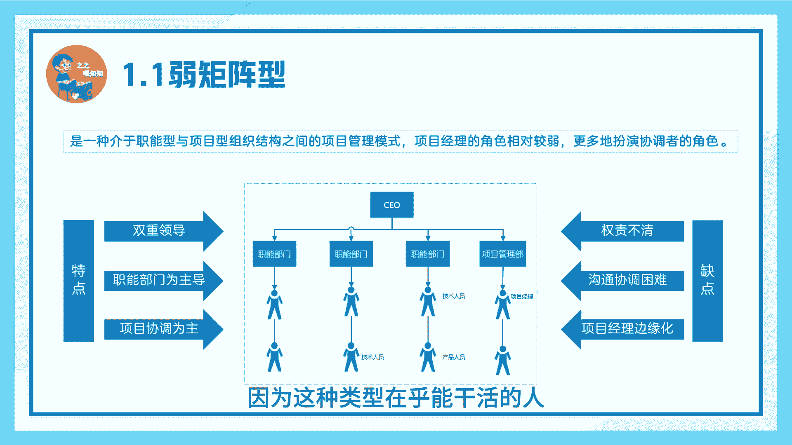
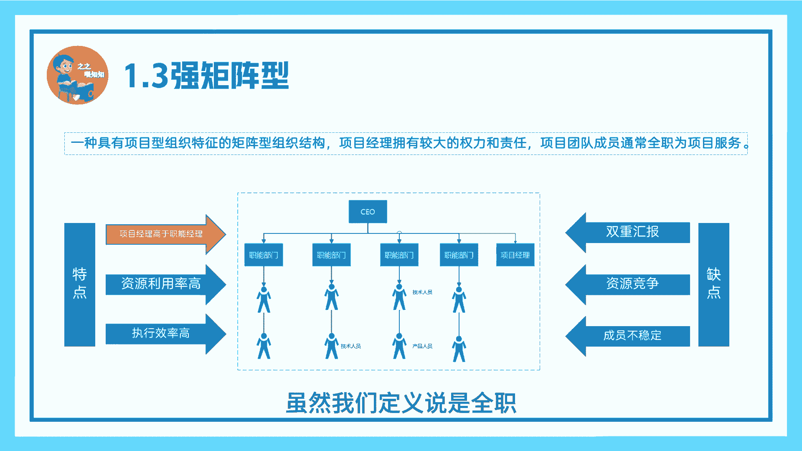
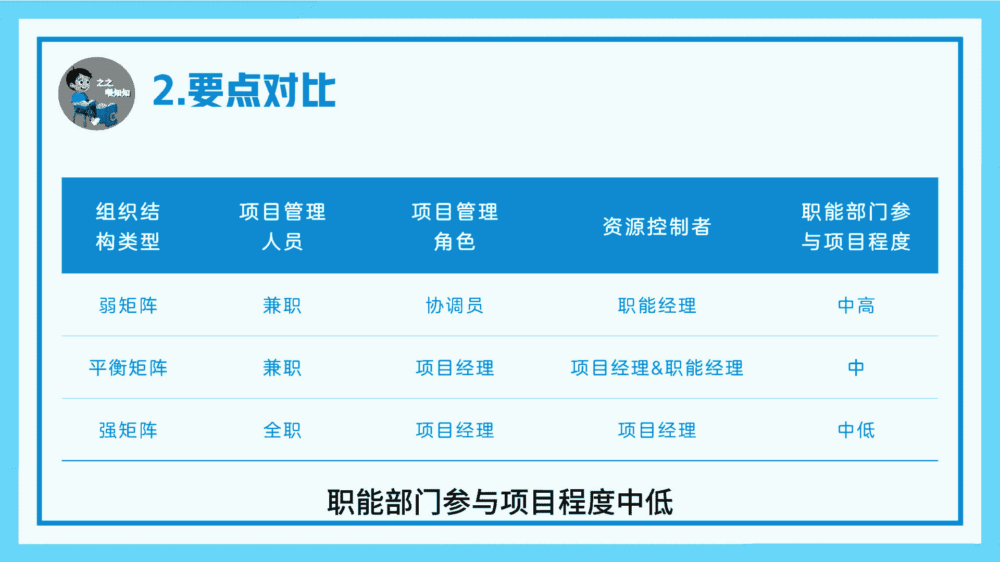
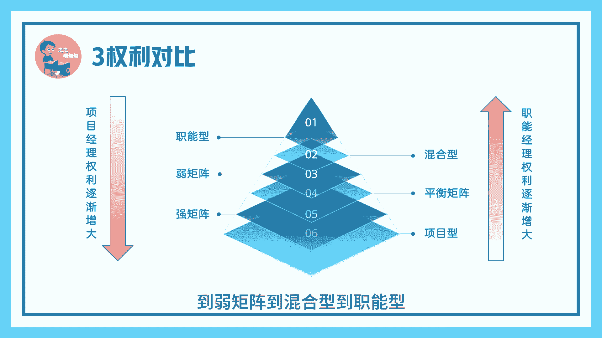

# 05项目组织结构类型（下）-PMP系列 - P1 - 之之喂知知 - BV1j5HqeyE4u

导处报告训导，啊大家好，今天继续我们PMP系列第五讲，项目组织结构类型下，我是吱吱未知之，首先来看一下弱矩阵类型，弱矩阵是一种，介于子类型和项目型之间的项目管理模式，项目经理的角色相对较弱。

更多的扮演协调者的角色，做一下矩阵型的项目经理，都你都不能在职能经理那部门下面，特点像若矩阵类型，双重领导，职能部门为主导，项目协调为主，缺点权责不清，这时候你可能觉得你是个弱矩症。

实际上别人可能觉得你是个背锅侠，沟通协调难，就是你觉得你是项目经理，别人觉得你啥都不是，你觉得你是项目经理，但实际上别人觉得你就是为项目添乱的，所以说你很可能被边缘化，因为这种类型在乎的事干活的人。

平衡型是一种项目经理和职能经理，工程的组织形式，项目经理的权利和责任，介于弱举证和强举证之间特点，项目经理与职能经理评级，资源利用率高，跨部门协调效率高，因为拟合职能部门经理都有去推动项目的责任。

缺点权力斗争，因为你们两个评级，所以说很可能会出现两个都不管事，两户都两个都抢着管事，或者一天到晚就抢着列号，项目经理和职能经理工作可能重复，就是你们两个分工协作可能没那么好。

另外的话做平衡矩阵对规章制度要求也比较高，所以这种是最难的项目类型，强举证，一种具有项目型组织特征的矩阵型组织结构，项目经理拥有较大的权利和责任，项目团队成员通常全职为项目服务特点。

项目经理高于职能经理，资源利用率高，执行效率也高，缺点双重汇报，因为你的项目组成员，他是你项目成团队的人，他也是职能部门的人，另外的话，资源竞争，多个项目经理可能会竞争同一个资源，资源也不稳。

团队成员很可能从事多个项目，虽然我们定义说是全职。

但现实中很难做到全职，要点对比落举证项目管理人员，兼职项目管理角色，协调员，资源控制者，职能经理，职，职能部门参与项目程度中高平衡，举证项目管理人员，兼职项目管理角色，项目经理，资源控制者。

项目经理和责任经理，资源部门参与项目程度中强举证项目管理人员，全职项目管理角色，项目经理，资源控制者，项目经理，职能部门参与项目程度中低。

权力对比，从子能型混合型弱矩阵，平衡矩阵，强矩阵强迫型项目经理的权利主是意见增大，测量部分权利意识减弱，相反的，从相互型到强矩阵到平衡矩阵，到弱矩阵到混合型到智能型。

职能部门权利权人大项目经理权力权减弱，考题第一题，你是一家从事高新技术开发公司的项目经理，需要组建一个跨部门的项目，你会选择哪种类型，很明显，跨部门协作我们都选矩阵型，第二题。

你在一个组织中从事项目管理工作，你的职能部门领导，对你有百分之百的绩效打分权。

你属于哪种类型，很明显，你属于职类型，要点回顾，三种矩阵类型，我们本节讲了三种矩阵类型，三种选择类型的要点对比，六种类型的权利对比。

下一集我们将为大家讲解项目开发生命周期，我是自知未知之。