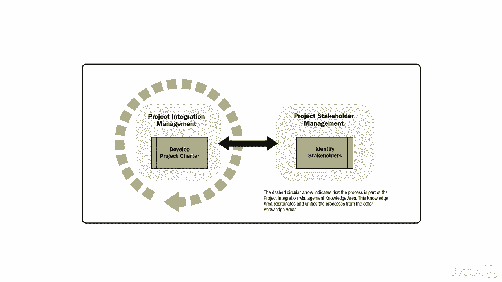

# 061-Lynda教程：项目管理专业人员(PMP)备考指南Cert Prep Project Management Professional (PMP) - P10：chapter_010 - Lynda教程和字幕 - BV1ng411H77g

在我职业生涯的早期，我很兴奋我终于得到了自己的项目，做一个负责任的项目经理，我问在哪里可以找到宪章，我很快发现这个项目没有通过，启动的第一步，即制定项目章程，没有宪章，项目不存在。

当我和项目管理办公室谈话时，我发现它甚至没有被授权，那天我学到了宝贵的一课，总是要求项目章程，发起过程组用于定义新项目，或现有项目的新阶段，获得启动授权，让我们先看看在这个过程中发生的动作。

确定初步范围，确定内部和外部利益攸关方，已承诺初始供资资源，项目经理被任命，所有这些信息都记录在项目章程和利益相关者登记册中，一般来说，项目章程是由主办方制定的，但这取决于组织，有时。

项目经理通过帮助开发业务案例和定义项目效益来参与进来，这个过程组的主要目的是调整利益相关者的期望，与项目的目的，它使他们能够了解范围和目标，它向他们展示了他们的参与如何确保他们的期望，大都会。

这些过程确定了项目的愿景，这个过程组往往是最容易记住的过程组之一，因为它只有两个过程，制定项目章程并确定利益相关者，如图所示，虚线圆圈显示此过程是集成管理的一部分，我会在另一个视频中讨论。

在此过程组完成时，您将获得以下输出，经批准的章程和利益攸关方登记册。

所有项目至少应该有一个章程，如果没有的话，然后项目经理需要与赞助商合作开发一个。