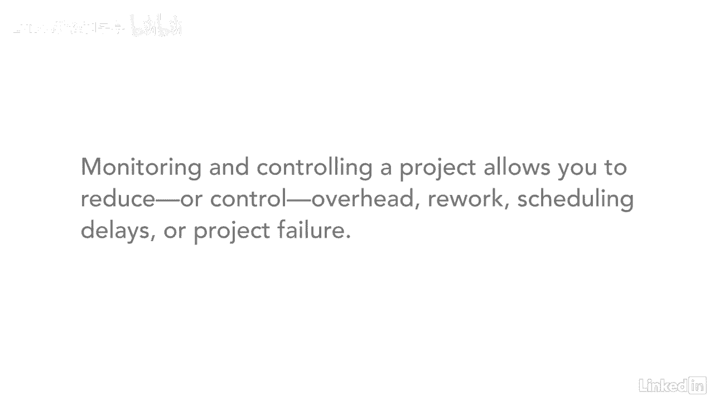

# 061-Lynda教程：项目管理专业人员(PMP)备考指南Cert Prep Project Management Professional (PMP) - P13：chapter_013 - Lynda教程和字幕 - BV1ng411H77g

你玩过那种吐出多个球的弹球游戏吗，同时，一开始你有一个很容易跟踪的球，监测和控制，然后再加入一个，它仍然相当容易维护，但后来又增加了三分之一，就会变成一片混乱，你很快就会发现你越注意球，以及它们的位置。

你对游戏的控制力就越大，监控过程组相似，此进程组跟踪，审查和规范项目的过程和绩效，另外，您将确定需要对计划进行更改的区域，然后您将启动相应的更改，你可以在这里看到，有十二个过程属于监测和控制范围，监测。

控制还涉及最大限度地减少变更请求，通过影响引起变化的因素，然后建议纠正措施，例如，你和一个队员核对一下，看看他们是否还在目标上，开始他们的活动，你发现他们需要访问一个系统，但他们似乎不能得到它。

早点发现这一点，有时间纠正它，所以不需要改变来弥补失去的时间，如果提交更改，然后，您必须评估并决定是批准更改还是拒绝更改，对照项目管理计划和基线有助于提供项目如何执行的视图，你监视和控制项目的原因是。

所以你可以密切关注它的整体健康情况，例如，这个项目是进度落后还是超出预算，如果这两个问题的答案是肯定的，然后，您可能需要提交更改请求，以使项目回到正轨，监测，控制项目允许您减少或控制开销，复工，调度。

延误。

或项目完全失败，监视和控制是项目的关键过程组，仅仅执行项目管理计划是不够的，您还需要跟踪项目的进展情况，就像烤蛋糕一样，你收集所有的材料，把它们混合在一起，根据食谱，一路上你要尝尝面糊。

以确保它尝起来很好，一旦你把它放进烤箱，你看着它，看看它怎么样了，是不是烤得太快了，太慢了，刚刚好，你在里面放一根牙签来检查是否做了这个，直到烤透，所有这些都是监控和控制过程，沿途根据需要进行校正。

直到你有完美的蛋糕，监视和控制您的项目有时是这样的，或者弹球游戏，到处都是球，没有控制，但是如果你有好的流程。

