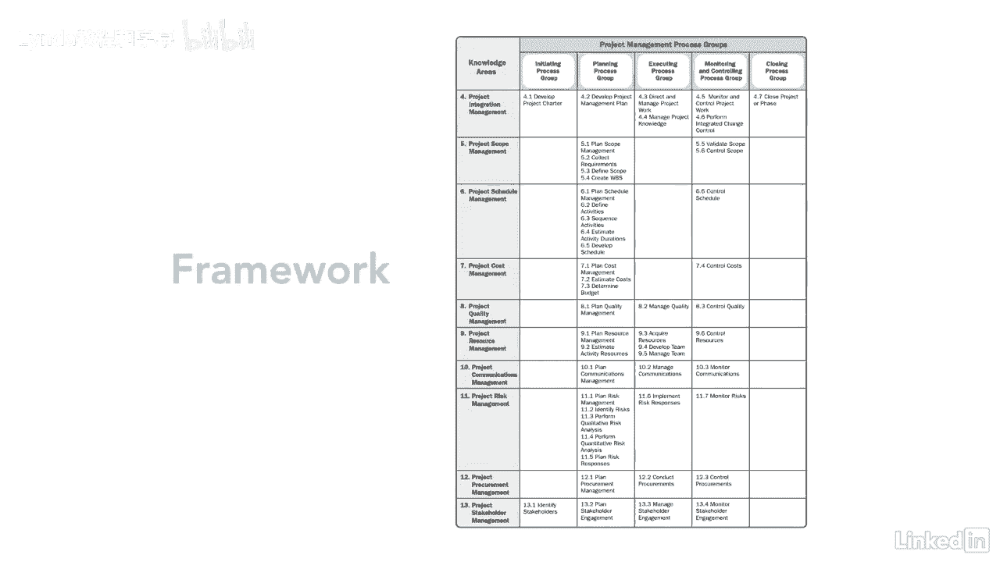

# 061-Lynda教程：项目管理专业人员(PMP)备考指南Cert Prep Project Management Professional (PMP) - P15：chapter_015 - Lynda教程和字幕 - BV1ng411H77g

当你准备PMP考试的时候，您会注意到弹球指南被分解为知识区域，我们在本课程中涉及的每一个过程都将属于十个知识领域中的一个，你看这里，四个九个项目管理过程中的每一个都在十个知识领域内分组。

知识区域表示过程的集合，每个都有自己的输入，为推动项目成功而需要完成的产出、工具和技术，弹球指南将每个知识领域分为不同的章节，每一章都向您展示了属于该知识区域和过程组的不同过程，在这个表格中。

您可以看到每个进程组都列在顶部，知识区域位于左侧，中间是过程，每个过程属于一个且仅属于一个知识区域，唯一一个过程组，例如，注意，控制计划属于监视和控制过程组，也在项目进度管理知识领域。

这是在此表中找到的唯一位置控制时间表，此表也被称为框架，您可以为每个项目遵循该框架。

视项目而定，您可以实现每个知识领域，包括你可以选择的每一个过程，框架中的哪一部分最适合您的项目，当我们走过每一个知识领域，您将看到每个过程是如何到位的。

