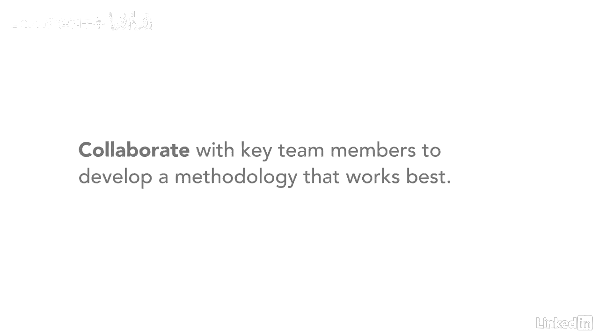

# 061-Lynda教程：项目管理专业人员(PMP)备考指南Cert Prep Project Management Professional (PMP) - P16：chapter_016 - Lynda教程和字幕 - BV1ng411H77g

当我第一次听到裁缝这个词时，它让我想起了有人在换衣服，事实证明，在这种情况下，剪裁几乎就像把你的裤子包边一样，或者你的衬衫被卷进去，你使用弹球指南中你需要的东西，并作为项目经理修剪其余的东西。

我们通常使用某种方法来管理我们的项目，有些项目经理认为Pinbot指南是一种方法，逐页跟进，逐章或逐条，一套做法，技术，在一个学科工作的人使用的程序和规则，实际上是方法论的定义。

因为弹球指南是一份指导性文件，这不是一种专门用来遵循的方法，PMI建议在PIN BOT指南中裁剪材料，满足项目的需要，例如，短期项目可能只使用通信计划，也许风险登记册，制定时间表和预算。

但是一个多年的项目可能会遵循PIN BOT指南中的所有过程，组织中使用的方法，可能是由公司的专家开发的，也可能是从供应商那里购买的，有些甚至可能是从政府那里获得的，我以前有个老板，他发展了自己的方法。

基于他喜欢的其他方法，他从全面质量管理中吸取了一点，一些来自PIN机器人指南，以及敏捷和其他过程中的其他部分，我都没听说过，然后他让我们试试他开发的方法，看看它是如何一点一点地工作的，我们修改了它。

直到它对我们有效，他的方法很有效，我遵循了它，即使是今天，我做的每一个项目，就像我老板和我们合作一样，这是你作为项目经理的责任，与赞助商合作，项目团队和项目中的其他涉众，开发一种适合你的方法。

一旦制定出这种方法，然后你可以带着同一组合作者，并在弹球指南中定制过程，以最好地满足项目的需要，就像当你把你的裤子，所以它们的长度是正确的，确保你量身定制你的项目。

