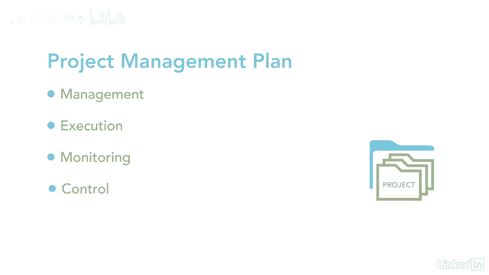

# 061-Lynda教程：项目管理专业人员(PMP)备考指南Cert Prep Project Management Professional (PMP) - P17：chapter_017 - Lynda教程和字幕 - BV1ng411H77g

现在你知道了，项目经理有很多职责，一是确保项目管理方式与项目管理业务文件保持一致，我记得我被分配了一个项目，有记录在案的商业案例，经过一番研究，我发现利益相关者试图把它塞进投资组合，未经PMO许可。

这与组织目标不一致，如果执行，公司将损失数千美元，对组织没有好处，记住每个项目都需要给公司带来一些好处，并通过适当的审批程序，此表突出显示了有助于您的业务案例和效益管理计划的两个文档。

发起人负责开发和维护业务案例，而项目经理则确保业务案例，效益管理计划章程和项目管理计划相互一致，不要忘记，项目经理还确保项目文档与程序文档一致，这里，大家可以看到，在项目生命周期中，创建项目文档，例如。

在前期工作中，你可能会有一个需求评估，然后是业务案例和效益管理计划，这三份文件将在很高的水平上显示，对组织是否有利，一旦有证据证明，然后制定并批准章程，最后，创建项目管理计划来解释如何管理项目。

有时在开发业务案例之前进行需求评估，需求评估着眼于业务目标，正在解决哪些问题，有哪些机会，最终提出解决这些问题的建议，需求评估现在可以在高级别的业务案例中记录，企划案包括项目启动的理由及其目标。

也可能决定项目的成败，它也被用来通过与项目目标的比较来衡量项目的成功，它在整个项目的生命周期中都在使用，效益管理计划基本上是一个显示项目效益的计划，以及如何测量它们，项目效益就是产品。

为赞助组织及其受益人提供价值的服务或结果，例如，我参与的一个项目，将员工上船的时间从两周减少到两天，对组织的价值或好处，新员工可以在第二天就开始工作，而不是等两个星期把一切都准备好。

该计划描述了可能包括的关键要素，比如谁从项目中受益，目标效益是什么，以及实现它们的时间框架，它还着眼于它们如何与战略目标保持一致，一旦完成，如何衡量其有效性，最后，它可能包括项目假设和风险。

项目还需要两份额外的业务文件，章程和项目管理计划，章程正式授权一个项目，并赋予项目经理使用资源的权力，章程里的信息很高级，细节将在项目管理计划中进一步明确，它告诉你项目将如何管理，执行、监测和控制。

下次你被分配一个项目时。