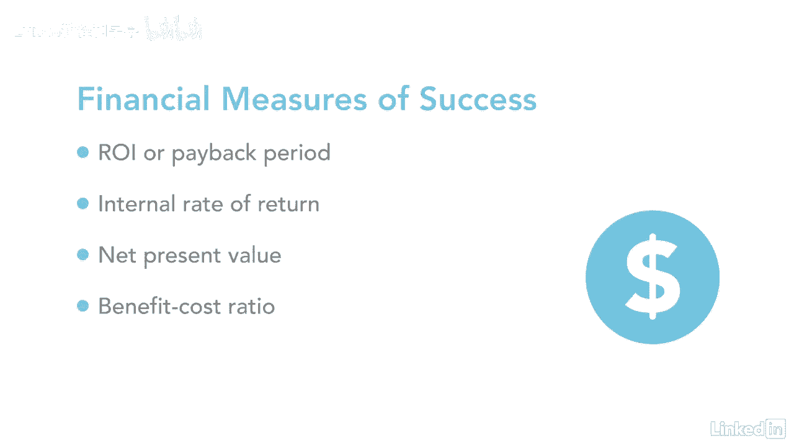

# 061-Lynda教程：项目管理专业人员(PMP)备考指南Cert Prep Project Management Professional (PMP) - P18：chapter_018 - Lynda教程和字幕 - BV1ng411H77g

所以你可能想知道你怎么知道这个项目，你和你的团队如此努力的工作实际上是成功的，当我刚开始做项目管理的时候，我们通过观察时间来衡量项目的成功，费用和范围，你知道铁三角，很快我们就把质量。

因为在预算范围内按时完成一个项目并不重要，如果最终结果是粗制滥造的，当看到项目成功时，确定项目是否达到其项目目标是很重要的，为了使项目经理和其他利益相关者与，哪些因素影响项目成功。

他们应该问自己三个问题，这个项目的成功是什么样子的，如何衡量成功，哪些因素可能影响成功，一旦项目经理和关键利益相关者就这三个问题的答案达成一致，一定要记录在案。

因为您将在项目期间和之后返回这些来衡量项目的成功，既然您和关键涉众已经就项目成功的样子达成了一致，你可能想知道你到底是如何衡量它的，可以有相对简单的测量，比如你是否完成了项目效益衡量计划。

如果您满足治理标准和涉众满意度，另一种衡量项目成功的方法是财务衡量，其中可能包括投资回报，或投资回报率或回收期，例如，如果你的项目在两年内或比预期的更早获得投资回报率，很高兴知道这两种测量方法可以用来。

在选择项目时，记住数字越低，你可以使用的其他更好的财务衡量标准是内部回报率，净现值和效益成本比率。

当使用这三种财务衡量标准来选择一个项目时，数字越高，记得越清楚，一个项目可以满足其所有的项目目标和成功因素，但仍然不成功，这种情况发生在业务或市场需求在项目完成前发生变化的情况下。

重要的是要记住项目经理需要确保。