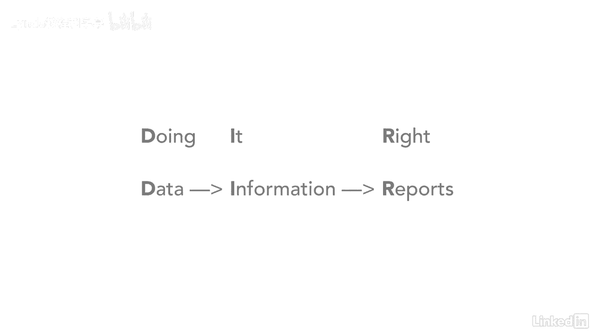

# 061-Lynda教程：项目管理专业人员(PMP)备考指南Cert Prep Project Management Professional (PMP) - P19：chapter_019 - Lynda教程和字幕 - BV1ng411H77g

你有没有遇到过这样的情况：赞助商问你你的项目做得怎么样，你也许会说很好，却不知道它是如何做得很好的，如果能报告你的项目状态不是很好吗，让它基于真实的数据--这就是我们在这里要讨论的，有三个术语需要记住。

它们也包含在这个图表中，对你考试有帮助，一般来说，在报告你的项目时，一是工作绩效数据，它是在项目执行过程中接收或生成的实际原始数据，原始数据的例子可能包括实际成本，开始和结束日期。

和每项活动的完成百分比，然后分析这些原始数据并将其转换为性能信息，现在工作表现信息是你需要知道的第二个术语，这是对原始数据进行分析并将其转换为信息的时候，然后可以用一个例子来报告。

这可能是可交付成果和预测的状态，然后将这些信息转换为工作业绩报告，第三个术语是工作业绩报告，是原始数据被转换成信息，然后通过实物或电子文件报告，报告可以采取带有红色的仪表板的形式，黄色，绿色。

红绿灯状态更新，或者他们可以在幻灯片上展示，备忘录或更新，工作业绩报告的主要目的是报告项目业绩，所以关键问题可以提出来，问题可以回答，对这个项目有一个整体的认识，有几个关键的信息你需要记住。

因为这会帮助你准备考试，任何时候你处于控制过程中，例如，控制成本控制，如图所示的质量控制时间表，或者在监视过程中，如监视通信，监测风险，你会注意到工作绩效数据总是一个输入，你把这些数据转换成信息。

它将永远是一个输出，另一个输出总是变更请求以及项目计划和文档更新，另一点要记住的是，任何时候您有工作性能信息作为输入，您将始终将工作性能报告作为输出，以及更改请求，项目计划和文件更新。

记住你做这些活动的顺序的一个简单方法是思考，如果我在收集原始数据，然后分析它并将其转化为信息并对其进行报告，那我一定做对了。

通过理解这些基本术语以及它们是如何运作的。