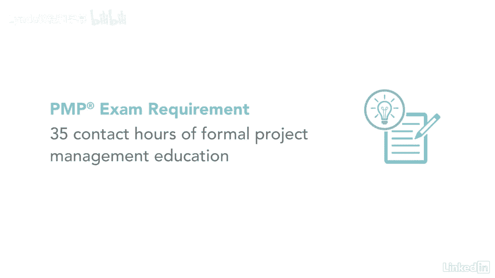

# 061-Lynda教程：项目管理专业人员(PMP)备考指南Cert Prep Project Management Professional (PMP) - P2：chapter_002 - Lynda教程和字幕 - BV1ng411H77g

你准备好发展你的项目管理了吗，事业，公司，和世界各地的组织，正在寻找熟练的项目经理，为他们的业务成功做出贡献，在您踏上获得PMP认证的旅程之前，有几件事要知道，首先呢，你有资格参加考试吗？

我来解释一下要求是什么，如果你有中学学位，也就是高中文凭，副学士学位，或全局等价物，你必须有至少五年或六十个月的唯一，不重叠的专业项目管理经验，你还需要有七千五百个小时来领导和指导项目。

如果你有四年制学位，是学士学位还是全球同等学历，你被要求至少有三年或三年的时间，六个月的独特，你还需要有四个，花了500个小时领导和指导两个教育级别的项目，除了拥有最少的真实世界经验。

你需要获得三十五个接触小时的培训才能参加考试。

当您参加本课程时，您将获得关于资格的详细信息，如何应用和测试服用策略，查看我的PP考试技巧课程，我还将向您详细介绍如何填写pmp考试申请表。

成为一个PMP认证的项目经理可以是一个很好的方式来推进你的职业生涯，增加你的收入，成为你公司的需求资源。

