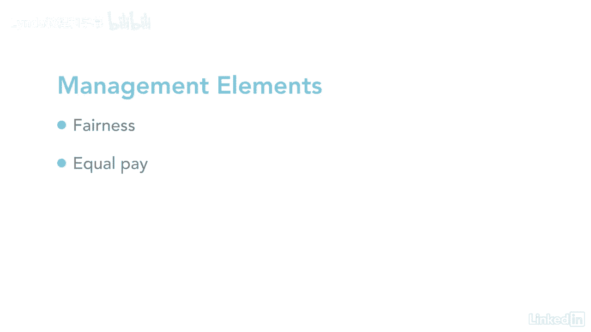

# 061-Lynda教程：项目管理专业人员(PMP)备考指南Cert Prep Project Management Professional (PMP) - P21：chapter_021 - Lynda教程和字幕 - BV1ng411H77g

想想人体，它由多个系统组成，像心血管疾病，紧张而肌肉发达，当它们一起工作时，我们就有了一个功能良好的身体，例如，如果你把手放在热炉子上，神经系统立即向大脑发出信号，告诉你快点把手移开。

当我们从婴儿成长为成年人，我们学会使用我们身体的所有系统，所以它们在一起很好，现在一个人的系统被称为组织，就像人体一样，组织有需要很好地协同工作的系统，而不是经理只考虑他们的部门。

最好了解其他部门是如何工作的，以及它们如何影响另一个部门，如果一个部门表现不好，然后影响其他的，就像苹果车里的坏苹果，这种描述正好符合系统的定义，它是一起工作的各种组件的集合。

完成一个单独工作不可能实现的总体目标，以下是一些您应该注意的系统，第一批，系统是动态的，他们一直在变，第二批，可以优化系统及其组件，最后一个系统的响应是非线性的，这意味着输入的变化不一定有可预测的输出。

为了一个项目的良好表现，项目经理需要了解什么是组织系统，例如，谁有权帮助你的项目，以及谁负责或问责，一旦你知道了这些关键信息，你可以有效地利用你的权力和影响力，加上你的领导技能和政治影响力。

更有效地管理你的项目，每个组织都有多种因素，这些因素创建了一个可以影响项目的独特系统，其中两个因素是治理框架和管理要素，让我们先来谈谈治理，这是我们在组织中很熟悉的事情，这是规矩，政策。

我们必须遵循的程序和流程，也是规范，每个公司的关系和系统，治理用于设定组织的目标或目的，并追踪他们是否遇到过，它还用于监控风险，并确保性能得到优化，就像组织治理一样，还有对投资组合的治理，方案和项目。

第二个因素是管理因素，这些是公司的任何经理付诸行动的规则或政策，这些管理要素被分配给组织中的关键个人，就像你的直接经理或高级领导，一直到首席执行官，这方面的例子可能是如何分配工作，你员工中的专业技能。

任何有空的人，它还对违反规定的人实施纪律处分，它是一个人发号施令并确保每个人都在朝着同一个目标努力的方式，当然，在工作场所应该有公平的待遇，同工同酬，我们应该在做的时候感到安全。

大家可以看到，当涉及到组织系统时，有很多东西要学，以及它们如何影响公司和你的项目，关键是知道什么是系统，并确保它们都一起工作。

