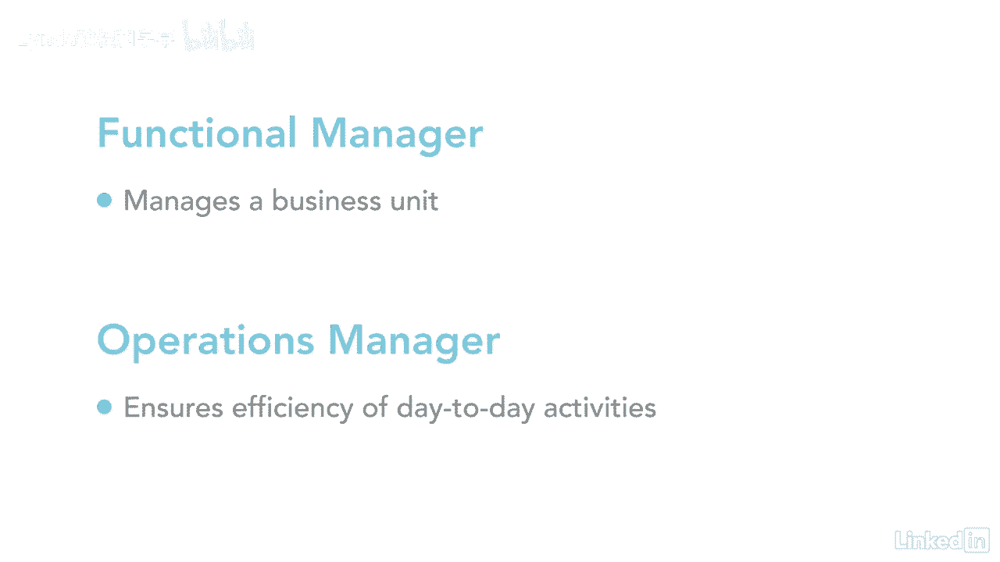

# 061-Lynda教程：项目管理专业人员(PMP)备考指南Cert Prep Project Management Professional (PMP) - P23：chapter_023 - Lynda教程和字幕 - BV1ng411H77g

我真的很喜欢团队运动，尤其是在夏季奥运会期间，当我观看女子体操队比赛时，每个成员都有一个他们非常擅长的设备，比如双杠或者跳马，每个团队成员都知道他们必须在那个项目中表现出色，为球队晋级并赢得全能金牌。

他们的教练在那里支持他们，带领他们朝着那个目标前进，清除沿途障碍，这类似于项目经理为项目团队所做的工作，每个项目小组都有负责其主题专业知识的成员，每个人都有不同的技能，可以完成一个或多个角色。

项目经理就像教练，最终对项目的结果负责，他们必须对项目的愿景和使命有一个明确的信息，然后传达给团队，项目经理在整个过程中提供支持和协调，清除路障，以任何方式提供帮助，他们几乎任何人都可以管理一个团队。

意思是他们可以检查盒子，说每一个活动都完成了，调整关键参与者，并最终激励和激励他们，我喜欢把这看作是，让某人做一些他们通常不会做的事情，就像教练让你发挥出最好的一面，所以你们的项目经理。

我已经谈了很多关于项目经理的角色，但是一个针筒如何很好地定义它呢，它不同于职能经理或运营经理，项目经理由组织指派领导负责实现目标的项目小组，现在职能经理负责管理一个业务单元。

运营经理确保日常活动高效运行。

所有的项目经理都是不同的，有些人只是遵循项目计划，并乐于检查方框，说项目完成了，项目目标完成，检查，当其他人经历，带领一个充满勇气和荣耀的团队是什么感觉，挣扎，冲突，一路成功直到胜利，你要不要检查一下。

还是想获得金牌。