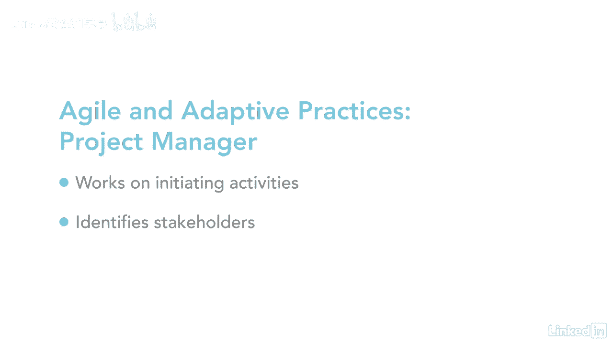

# 061-Lynda教程：项目管理专业人员(PMP)备考指南Cert Prep Project Management Professional (PMP) - P27：chapter_027 - Lynda教程和字幕 - BV1ng411H77g

让我们面对现实吧，我们的生活很忙，记录你每天所做的一切是很困难的，我很幸运，如果我还记得两天前午餐吃了什么，项目没有太大不同，有这么多活动部件，文件，通信指标和数据分析，举几个使用集成管理的例子。

项目经理负责从所有其他知识领域收集结果，让我们来看看一些方法，项目经理可以收集并使用这些信息来启动，自动化工具不见了，把一切都写在纸上的日子，项目管理信息系统的使用，或者pmis允许项目经理收集。

分析和使用从项目中收集的信息来实现目标，并实现项目效益，采购经理人指数可以是一个手动归档系统，将项目文档归档到文件柜中，也可以是电子可视化管理工具，能及时向团队显示信息。

几乎可以通过图表和图形立即传达项目的状态，作战室，提供墙面空间悬挂项目文件，scrum团队也使用所谓的scrum任务板，下面是一个看起来像什么的例子，在本例中，你会看到五列，它们被标记为积压。

剩下的工作，有事情要做，这是下一个排队的工作，显示了目前正在进行的工作，下一列显示已完成的评审工作，最后一个展示了所做的工作，任何人都可以走上前去，在任何给定的时间准确地看到项目在哪里，这几天。

我们的劳动力一直在变化，人们在公司里进进出出，而其他的却很遥远，项目经理需要能够从每个团队成员那里获得项目知识，以便对当前和未来的项目有用，就像组织在进化一样，使用混合方法的项目管理也是如此。

这是传统项目管理与，比如敏捷或业务分析，我曾经有一个项目，它以传统的项目管理方法开始，但当决定加快速度时，我过渡到敏捷，这样我就可以很快完成剩下的工作，剪掉任何不需要的东西。

我仍然用项目的时间表来跟踪工作，当团队管理活动的完成时，视项目而定，您还可以考虑敏捷或自适应环境，两者都非常适合在传统项目管理中有频繁变化或不明确要求的项目中工作，项目经理负责创建项目管理计划。

其中详细说明了团队将做什么，怎么做，当在敏捷或自适应的环境中，而不是由项目经理来做这项工作，团队成员被认为是本地领域专家，他们负责详细的产品计划和交付，因为项目经理不负责敏捷项目的计划和交付。

他们可以自由地进行团队协作和决策，并确保团队能够对变化做出反应，项目经理的角色也在不断演变，他们更多地参与发起活动，比如制定业务案例和效益管理计划，它们还在参与和确定利益攸关方方面发挥更积极的作用。

当项目经理是最棒的工作之一，但我承认，随着劳动力的动态变化，它变得更加复杂，这几天，它要求项目经理适应。

