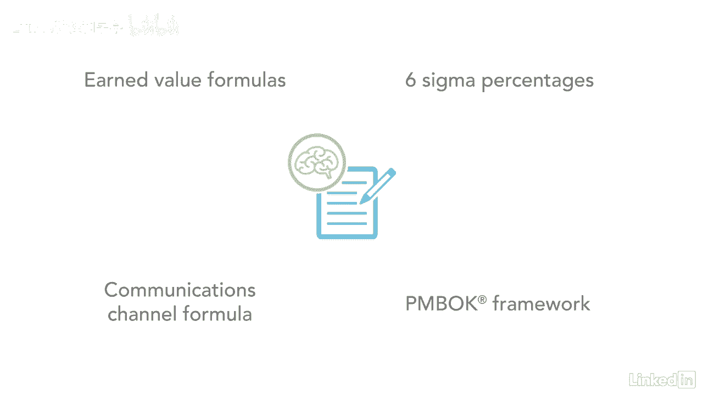

# 061-Lynda教程：项目管理专业人员(PMP)备考指南Cert Prep Project Management Professional (PMP) - P3：chapter_003 - Lynda教程和字幕 - BV1ng411H77g

在本课程中，你将有机会获得额外的材料，帮助你学习，首先，本课程提供的大部分信息来自PIN BOT指南，但是有很多关于考试的信息，这在指南中没有涉及，这些信息在附加讲义和学习指南中。

你可以从练习文件中下载，对于这门课，我鼓励你复习和研究它们，以便更好地理解材料，在整个课程中，你会听到我用许多缩写来表示像ittos这样的东西，Opas或Eev，讲义之一是常见首字母缩写列表。

所以一定要用，当你在观看每个知识领域系列结束时的每个视频时，你将会有一次练习考试，这做了两件事，一个是测试你对所涵盖材料的理解能力，另一个是测试你对所涵盖材料的理解能力，它训练你的大脑阅读考试问题。

然后抽出回答问题所需的信息片段，以及如何为这个问题选择最佳答案，PMP考试有很长的情景问题，可能会令人费解，有时充满了不必要的信息，如果你不习惯这些类型的问题，练习考试有助于提高你的分数。

还有关于赚取价值计算的额外视频，网络图绘制与通信通道，在那里我会带你通过几个问题，以及如何回答，一步一个脚印，我鼓励你看着他们，尤其是如果网络图绘制和赚取价值对你来说是困难的话题。

另一个重要的考试小贴士是练习写作，被亲切地称为转储单的东西，这是你从大脑中倾倒到一张纸上的信息，考试开始的时候，这样你考试的时候就能记住了，例如，挣值公式，六西格玛百分比，通信信道公式，针形框架。

它显示了进程组。

以及其他对你有用的信息，你应该能在五到十分钟内写下你的哑巴纸，越快越好，因为你只能开始写，考试开始后，这些文章中的每一篇都能真正帮助你准备考试，当你开始学习的时候，花时间计划你的策略。

