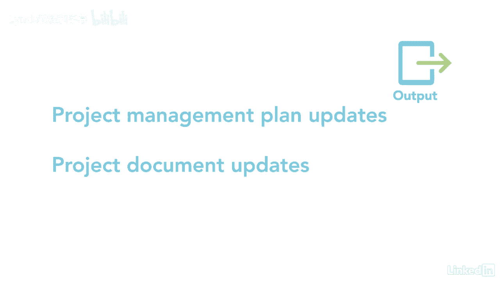

# 061-Lynda教程：项目管理专业人员(PMP)备考指南Cert Prep Project Management Professional (PMP) - P32：chapter_032 - Lynda教程和字幕 - BV1ng411H77g

当我想到监控和控制，它让我想起了一个时代，当我在医院的时候，护士会定期来检查我的血压和体温，抽血，只要问我感觉如何，当她监测我的生命体征时，她会根据我的结果做出改变，这真的是项目经理对他们的项目所做的。

我喜欢把它看作是为项目把脉，以确保它还活着，如果没有，我该采取什么极端措施让它起死回生，在这个过程中，您将查看项目计划的性能，看看你是否仍然在时间表和预算上达到目标，如果有差异，然后就会被举报。

最棒的是，利益相关者将知道项目的当前状态，并可以采取措施修改预算，时间表和范围，如果成本和进度预测显示需要做出改变，这个过程还允许您将计划的工作与，你实际完成的工作，这被称为计划与实际，如果有差异。

你做出改变，让他们回到你的计划中，例如，如果你落后于计划，您可能决定添加资源或缩小范围，因此需要生成更改请求，这个过程一直持续到所有的工作都完成，以下是这个过程的ittos，现在这个过程有几个输入。

首先是项目管理计划，接下来是项目文档，其中可能包括时间表和成本预测，它告诉你项目的执行情况，您还可以查看您的假设并发布日志以及质量和风险登记册，还记得我们很好地收集了工作绩效数据吗。

然后将这些数据转换为工作绩效信息，哪一个是我们的下一个输入，工作绩效信息是转换为有用内容的数据，它可以被审查并揭示需要做出哪些改变，项目协议是另一项关键投入，因为项目经理需要确保采购按计划进行。

最后两个输入，在继续之前回顾fs和opus总是很重要的，现在这个过程有四种工具和技术，一是专家判断，当你讨论项目绩效时，咨询你的专家是很重要的，数据分析技术还可用于确定项目的行动过程。

一些例子包括替代品分析，它着眼于纠正措施将是什么，当出现偏差，根本原因分析触及问题的核心，然后是挣值分析，用于确定项目的执行情况，一旦数据被分析，团队需要就采取纠正措施做出决定。

投票是一种在一致同意的基础上做出决定的方法，成熟与多元，技术上的最后一个工具是会议，这些可以是面对面的虚拟会议，可以是正式的，也可以是非正式的，它们可能包括项目，团队和利益相关者，这个过程有四个产出。

第一个是更改请求，任何时候你在进行方差分析并发现差异，您可能会提交一个更改请求，以使流程回到您计划的位置，这些更改可能包括纠正措施，预防措施和缺陷修复工作，绩效报告是另一项产出，由工作绩效信息生成。

这些报告可以是物理的，也可以是电子的，它们旨在产生决策，行动或认识，这些报告的例子包括状况报告，仪表板，热火报告，和信号灯图，最后两个输出是项目管理计划和项目文档更新，当您监视和控制项目时。

一定会发生更改，因此，审查这些文档对于保持它们的一致性至关重要。

项目经理经常被发现没有意识到他们项目中的差异，有时这种情况发生在意想不到的风险中，但有时这是因为他们没有监督和控制他们的项目，所以好好想想，您希望了解项目的执行情况还是忽略它。

