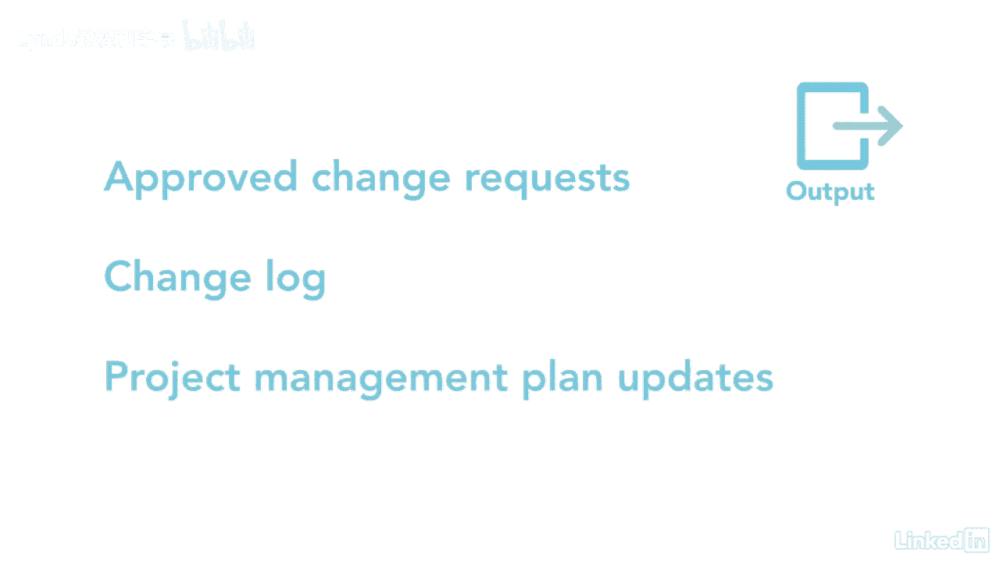

# 061-Lynda教程：项目管理专业人员(PMP)备考指南Cert Prep Project Management Professional (PMP) - P33：chapter_033 - Lynda教程和字幕 - BV1ng411H77g

执行集成的变更控制是一个需要记住的重要过程，在考试中经常被问到，对一个项目的改变不应该在真空中进行，如果他们是，存在着效果无法识别和实施的风险，在项目中，我曾经在一个项目中工作。

我们向两个不同的合同制造商转让技术，我在访问一个网站，当我看着团队制作我们的产品时，当我问他们为什么要执行这个过程步骤时，我注意到有些不对劲，不同的是，他们说，我的一个同事告诉他们做出改变。

这个经理没有做的是告诉另一个网站做同样的改变，所以这些网站遵循不同的过程，幸运的是，我们能够扭转变化，双方又回到了同一页上，但这是一个在真空中做出决定的完美例子，因此。

执行集成的变更控制是审查所有变更请求的过程，必要时更改项目文件和项目管理计划，并将这些更改传达给项目涉众，关键的好处是变更请求得到审查，才能看到项目的整体效果，包括风险，变更控制在项目开始并结束时开始。

监督这个过程是项目经理的责任，与项目相关的任何涉众都可以请求更改，一旦基线建立起来，它们应该由执行综合变更控制正式控制，过程更改也需要写出来并输入到更改或配置管理系统中。

每个变更请求也需要通过批准来处理，推迟或拒绝，这是由项目管理计划中确定的项目经理或发起人完成的，或按组织程序，也可能有一个变更控制委员会，负责审查，评价，核准，推迟，或拒绝对项目的更改。

以及记录和传达这样的决定，以下是这个过程的ittos，项目管理计划是这个过程的第一个输入，因为它必须改变和配置计划，加上三条基线，范围费用和时间表，接下来是项目文档，其中可能包括估计的基础，所需经费。

可追溯性矩阵和风险报告，工作业绩报告是对这一进程的投入，因为它们包括资源可用性，附表和费用数据，和挣值管理报告或烧毁或烧毁图表，这也可能导致向进程提交更改请求。

另一个输入是监视和控制以及执行过程提交的更改请求，在这个过程中也应该考虑作品，一个以前没有提到的工具和技术是变更控制工具，配置和变更管理使用手动或自动工具跟踪变更，配置管理侧重于确保维护版本控制，例如。

项目管理计划每次修订时都在版本一得到批准，版本改为一点一，一点二，以此类推，变更管理跟踪每项变更及其处置，是数据分析，它着眼于替代方案和成本效益分析，在决策中使用了一些技术，一是专制决策，当一个人决定。

另一种是多标准决策分析，它使用决策矩阵来评估变化的系统方法，还有投票，利用全体一致，决定批准或拒绝请求的多数或多数，最后的工具和技术是与变更控制委员会的会议，他们决定如何处理更改请求，现在呢。

让我们谈谈这个过程的两个关键输出，第一个是已批准的更改请求，第二个是更改日志，记录所有更改，不管处置，当然，您需要确保项目管理计划根据需要得到审查和更新。

当我开始准备考试的时候，我读到了集成的变更控制过程，并对自己说，啊，那是我一直在做的事，我不知道这叫综合变更控制，但令人惊讶的是，我在跟踪它，也许你也这么做过，你只是不知道它叫什么，如果没有。

您可以做些什么来将此过程合并到您的项目中。