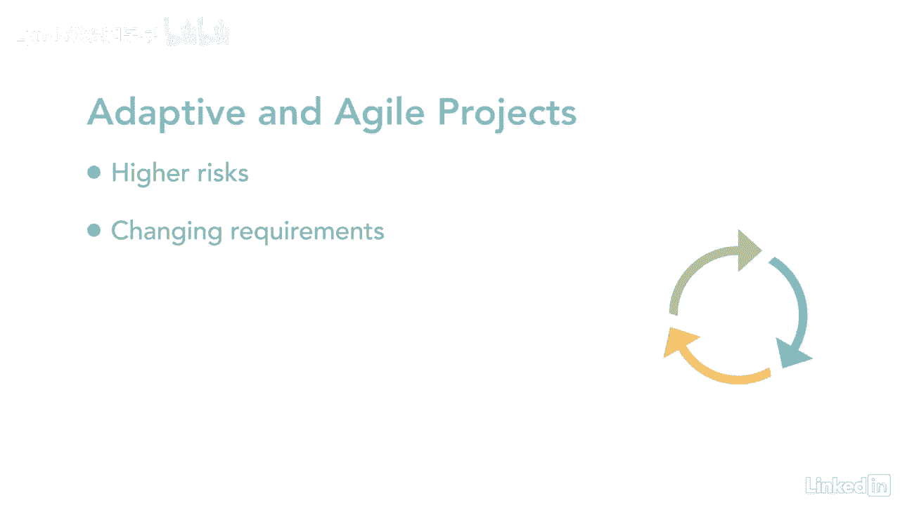

# 061-Lynda教程：项目管理专业人员(PMP)备考指南Cert Prep Project Management Professional (PMP) - P36：chapter_036 - Lynda教程和字幕 - BV1ng411H77g

项目的成功取决于需求在早期识别得有多好，所以让我再说一遍，项目的成功取决于需求被识别的程度，我强调这一点的原因，这是因为企业负担不起在失败的项目上花费金钱和其他资源，在某些情况下。

一个项目可能是一个公司失败或成功的区别，因为技术的不断进步和公司更快地赚钱的需要，企业找到更好地识别需求的方法已经变得至关重要，一种方法是在团队中添加一个业务分析师或B，Baas参与设计业务系统或流程。

这包括调查问题是什么，并确定业务需求和需求，然后对这些信息进行分析，看看是否有模式或趋势，他们的所有调查结果都记录在案，并传达给利益攸关方，并提出可能的解决方案，当涉及到项目时。

英航和项目经理都扮演着关键的角色，ba专注于确定需求，相关活动，项目经理负责确保这些活动在预算范围内按时完成，关键是，英航和项目经理了解对方在项目中的角色，这是一个合作伙伴关系。

这个项目的成功依赖于他们的良好合作，另一种选择是考虑适应性或敏捷方法，当涉及到风险较高或需求不断变化的项目时，敏捷是一个很好的方法，因为它不关注于定义前端的范围。

它一路精炼，敏捷的好处在于，每次在项目上完成工作时，团队制作了项目的一部分，可以由利益相关者检查或审查的，这允许在项目中的任何给定时间进行更改，您可能会发现，涉众从一个清单开始，比如说100个需求。

随着项目的推进，实际上只需要60个，记住，现在的公司需要适应性，并能够在任何给定的时间改变他们的过程。

