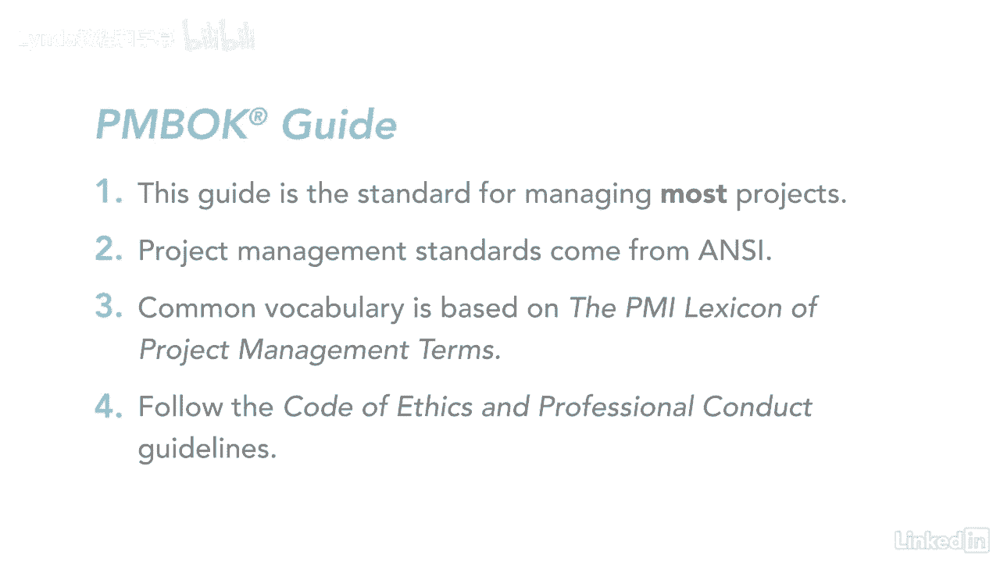

# 061-Lynda教程：项目管理专业人员(PMP)备考指南Cert Prep Project Management Professional (PMP) - P4：chapter_004 - Lynda教程和字幕 - BV1ng411H77g

项目管理方法已经存在了数百年，想想像金门大桥这样的项目，埃菲尔铁塔，甚至智能手机的发明，你也可以对那些不那么有名但仍然很重要的事情使用项目管理，比如改造你的浴室或在你的房子里增加太阳能电池板，无论大小。

随着项目管理专业多年来的发展，因此，需要有一个文件化的方法来实践项目管理，由此产生了项目管理知识体系的指南，也称为Pinbot指南，现在头衔多年来发生了变化，它最初被称为巴赫或知识体。

然后它成为项目管理知识的主体，现在它被称为Pinbot指南，那么什么是PIN机器人指南，你听到每个人都说你需要学习弹球，准备PMP考试，好吧，但为什么让我们花一分钟来谈谈弹球指南，为什么它很重要。

本指南是大多数时候管理大多数项目的标准用法，跨越多个行业，你可能会发现有趣的是，我大部分时间都在说大多数项目，那是因为每个项目都是不同的，有些比其他的小，并将此标准完整地用于较小的项目，只是不实际。

例如，假设你要把办公室从一个小隔间搬到另一个小隔间，项目本身从开始到完成可能只需要几天时间，如果您遵循了弹球指南中的所有过程，生成所有文件需要几周时间，这个项目甚至在你开始文档之前就已经结束了。

另一方面，如果你要建造一艘航空母舰，你可能会跟踪弹球中的每一个过程，管理项目时，您可以选择要使用的部分，很多项目经理不知道的，是基于项目管理的标准，这是一个独特的项目管理标准。

由美国国家标准协会或ANI创建，就像项目管理这个职业，PIN机器人指南也是如此，它现在包括更进步的做法，随着更传统的经过验证的做法，PIN机器人指南有什么好的，它在整个项目管理中都有一个共同的词汇表。

这些术语来自项目管理术语的采购经理人指数词典，您可以在任何行业与其他项目经理一起使用这些术语，你就会明白，现在还有一点我想强调一下，作为一个项目经理，专业精神很重要，并遵循首相的道德守则和职业行为指南。

当你提交你的PP申请时，您同意遵循项目管理协会制定的强制性和期望标准，或者不遵守标准的PMI PMI成员，接受纪律处分，阅读道德守则和职业行为指南是很重要的，因为考试中的几个问题都来自这份文件。

比如举报违法或不道德行为，现在您对PIN机器人指南的开头有了一点了解，PMI对他们的道德准则有何感想，那是开始准备考试的一个很好的基础。

