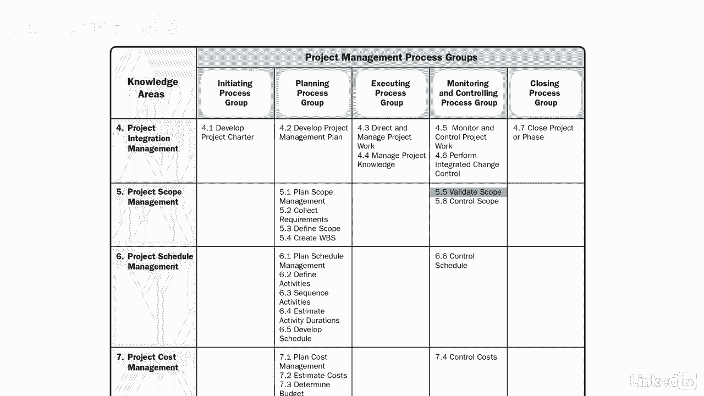

# 061-Lynda教程：项目管理专业人员(PMP)备考指南Cert Prep Project Management Professional (PMP) - P41：chapter_041 - Lynda教程和字幕 - BV1ng411H77g

验证范围是任何项目最重要的过程之一。

让我们谈谈为什么项目团队正在完成可交付成果，这些交付品需要由客户检查和接受，基于需求文档中确定的需求，例如，你想买一辆新车，你希望当汽车从装配线上下来的时候，它符合一定的要求，就像被正确地建造一样。

有安全气囊是安全的，包括其他功能，如空调，验证范围是确保这些可交付成果满足要求并被接受的过程，如果交付品有问题或问题，然后可以创建更改请求。

这个过程确保项目经理，赞助商或客户正式接受交付品或产品，这在整个项目中定期进行，或可在项目完成时完成，让我们看看这个过程的ittos，有相当多的输入和结果输出，我来介绍一下你在考试中可能会看到的。

但是请记住回去阅读PIN机器人指南以了解这个过程的细节。

第一个输入是项目管理计划，其中包含范围基线以及范围和需求管理计划，其中包括关于如何正式接受交付品的信息，接下来是项目文档，这些是需求文档和需求可追溯性矩阵，他们列出了要求，它们的接受标准。

并将它们与它们的起源联系起来，还有教训，学会了，登记册，和质量报告，第四个输入是来自控制质量过程的经过验证的可交付成果，执行验证所需的，最后一个是工作绩效数据，其中可能包括交付品是否符合要求。

如果任何交付是错误的，有多严重，这个过程的第一个工具和技术是检查，哪些措施，检查和验证工作和可交付成果是否符合要求和产品验收标准，例如，检查可以是审查或审计，甚至测量一个项目。

项目小组或其他利益相关者使用投票形式的决策，帮助形成一个结论，当他们执行验证时，这个过程有四个产出，第一个是公认的交付品，这些交付品由赞助商或客户正式签署，说他们符合接收标准。

然后在已结束的项目或阶段过程中使用此验收，在验证范围过程中，可能有不符合规范或不被接受的交付品，这些可能需要更改请求，它是这个过程的另一个输出，作为此过程输入的工作性能数据。

当工作性能信息转换为显示结果的格式时，它就变成了工作性能信息，这些结果告诉你项目进展如何，例如，项目是否按计划进行，交付品是否已经完成或接受，以及是否持续，如果项目文档受此过程验证范围的影响。

请确保更新它们。

这真的是为了确保，已根据要求对交付品进行了检查，他们已经被客户或赞助商接受了，所以当你踢轮胎的时候。