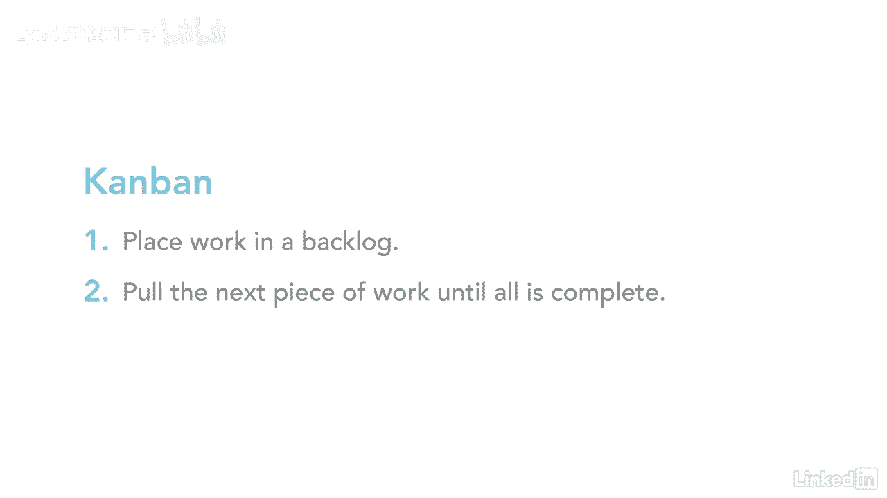

# 061-Lynda教程：项目管理专业人员(PMP)备考指南Cert Prep Project Management Professional (PMP) - P43：chapter_043 - Lynda教程和字幕 - BV1ng411H77g

你收到过日程表吗，想知道它是如何与所有的活动一起创建的，成本和资源井然有序，嗯，准备好，因为这就是整个知识领域的意义所在，向您展示如何创建完美的时间表，项目进度管理涉及最终导致项目进度和进度基线的过程。

以下是项目进度管理的流程和ittos，对于规划过程组中的过程，一定要记住它们是按顺序做的，例如，计划进度管理先做，然后定义活动，接下来是序列活动，然后估计活动持续时间，最后是制定一个时间表。

当我仔细看这些的时候，就会明白为什么它们是按顺序做的了，在这个知识领域有很多ittos，不过没关系，虽然有很多活动部件，每个进程按逻辑顺序进入下一个进程，如果你看这张照片。

您将看到有几个部分可以创建一个时间表，让我们把每一个都过一遍，从调度方法开始，所有这些都意味着你选择如何管理你的项目，例如，预测性或适应性，接下来，您可以选择像微软这样的调度工具，项目或共享点。

然后获取项目信息，如WBS和活动，持续时间，资源和制约因素，并将它们放入调度工具中创建调度模型，此模型将项目的工作表示为项目时间表，另一种看待方式，会想到汽车模型或飞机模型，当我还是个孩子的时候。

我和爸爸会坐下来制作老爷车的微缩模型，就像1953年的轻型护卫舰，当我们做完，我最终会得到一个真车的模型，时间表模型就像模型车，因为它代表了你的项目，进度表显示了这个项目的工作将如何完成。

以及什么时候会有结果，如今大多数项目都是预测性的，从端到端创建计划，为了在全球市场上保持竞争力，公司采用允许预测性和适应性方法的方法是至关重要的，适应性方法仍然使用项目计划，知道它随时可能改变。

根据利益攸关方的需要，自适应方法的两个例子是敏捷和看板，在敏捷中，团队识别需求并通过用户故事记录它们，这些故事包含了对需要做的工作的描述，然后，团队对用户故事进行优先级排序。

并选择一些可以在规定的时间内完成的，叫做冲刺，短跑通常在两到四周的时间内进行，当工作完成后，团队最终得到了一些他们可以向客户展示的东西，然后他们又重新开始这个过程，看板一般用于制造业。

所有的工作都在队列或积压中，当团队成员可用时，他们从积压的工作中提取下一点工作，这种情况不断发生，直到所有的工作都完成。

这个知识领域涉及很多，但这是令人兴奋的，在你掌握了本章的内容之后。