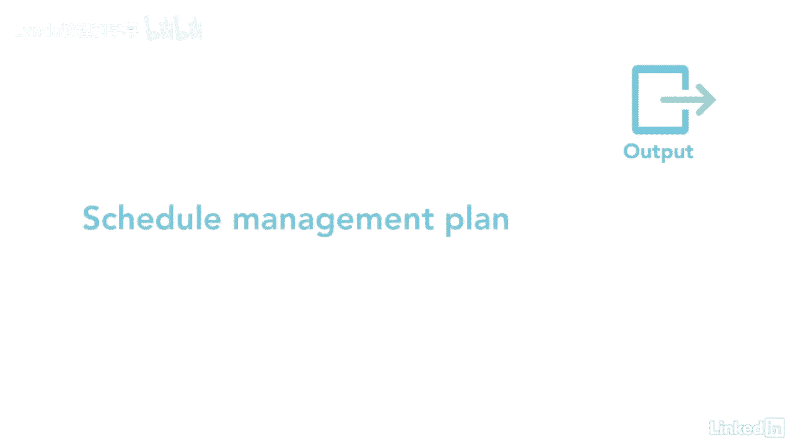

# 061-Lynda教程：项目管理专业人员(PMP)备考指南Cert Prep Project Management Professional (PMP) - P44：chapter_044 - Lynda教程和字幕 - BV1ng411H77g

作家拿破仑·赫尔曾说过，计划你的工作和工作，适用于计划进度管理流程的计划，因为这是一个定义如何识别活动的过程，把它们整理好，估计持续时间，最后制定项目时间表。

这是您的团队将在整个项目生命周期中遵循的计划，因此，为了项目的成功，需要正确地开发它，以下是这个过程的ittos，计划进度管理属于规划过程组，它本质上告诉你，您将如何管理这个知识领域中的其余过程。

以及在整个项目生命周期中如何管理项目的进度，让我们来看看它，你最有可能在考试中被问到，这一过程的主要投入是项目章程，其中有项目的总结里程碑列表，这些里程碑驱动项目的管理方式。

项目管理计划包含范围管理计划，它解释了如何定义范围，开发和控制，还有像适应性这样的开发方法，敏捷或预测性，其他输入，EEVS和OPAS是常见的输入，工具和技术，数据分析，专家判断和会议要熟悉。

这里使用的一种数据分析方法是替代分析，其中概述了您将使用的时间表方法，像敏捷或看板或端到端时间表，此流程的输出是进度管理计划。

它是项目管理计划的组成部分之一，进度管理计划将详细解释如何管理其余的流程，在这个知识领域，尽早制定进度管理计划是很重要的。

