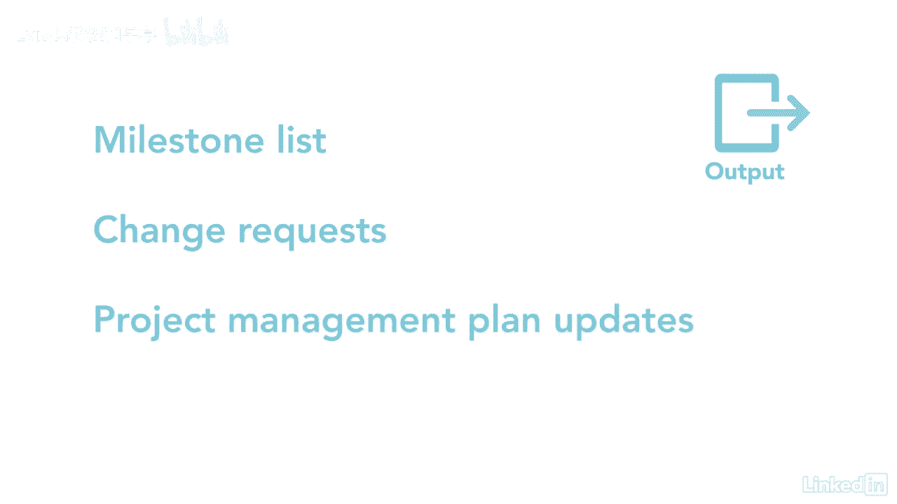

# 061-Lynda教程：项目管理专业人员(PMP)备考指南Cert Prep Project Management Professional (PMP) - P45：chapter_045 - Lynda教程和字幕 - BV1ng411H77g

你计划过一次盛大的家庭聚会吗，很多东西都在里面，你需要确定所有必须提前完成的活动，比如知道有多少人会参加，确保场地安全，点食物和饮料，定义活动过程类似，因为你在分解所有需要做的工作，这叫做分解。

它是指工作包被分解成更小的部分，称为计划活动，这将生成一个活动列表，从而可以估计出，进入项目时间表之前的成本和资源，例如，假设你在盖房子，其中一个工作包可能是浴室安装，在这种情况下。

工作可以分解为像瓷砖这样的活动，地板漆，墙壁，安装，淋浴用具等，那么你怎么知道活动什么时候已经分解得足够好了，它是你可以估计时间和成本的时候，它们可以被分配给个人或团体，这是一个相对容易的过程。

很少ittos，你可以在这里看到，进度管理计划是第一个关键输入，它还详细地解释了如何定义项目的活动，管理工作，范围基线是另一个关键输入，它包含一个作用域语句，WBS和WBS词典。

WBS是您将分解为计划活动的内容，其他输入eevs和opus是常见的输入，第一个工具和技术是分解，把作品分成更小的部分，更容易管理的部分，二是滚波规划，它是一种渐进式的阐述，详细规划近期工作的地方。

而未来的工作是在更高的级别上计划的或作为占位符留下的，需要重新审查项目早期制定的时间表，通常是为了确保每个工作包都被分解到活动级别，最后的工具和技术是专家判断和会议，活动列表是此过程的第一个输出。

它包括一个活动标识符，比如一点一或一点二点一，它还详细描述了每一项活动，所以被分配活动的人知道该做什么，记住活动列表没有任何特定的顺序，只是一张活动清单，你要把这些东西整理好，在序列活动过程中。

伴随活动列表的第二个输出，或者活动属性，这些可能包括活动代码，逻辑关系与先导和滞后，另一个输出是里程碑列表，这些是项目的关键里程碑，并确定它们是强制的还是可选的更改请求是另一个关键输出。

最后一个输出是更新项目管理计划更新。

就像时间表和范围基线，该知识领域中的每个剩余过程都需要定义活动过程，就像你需要为家庭团聚计划所有细节一样，所以一切都很顺利，您的项目也需要同样的小心。

