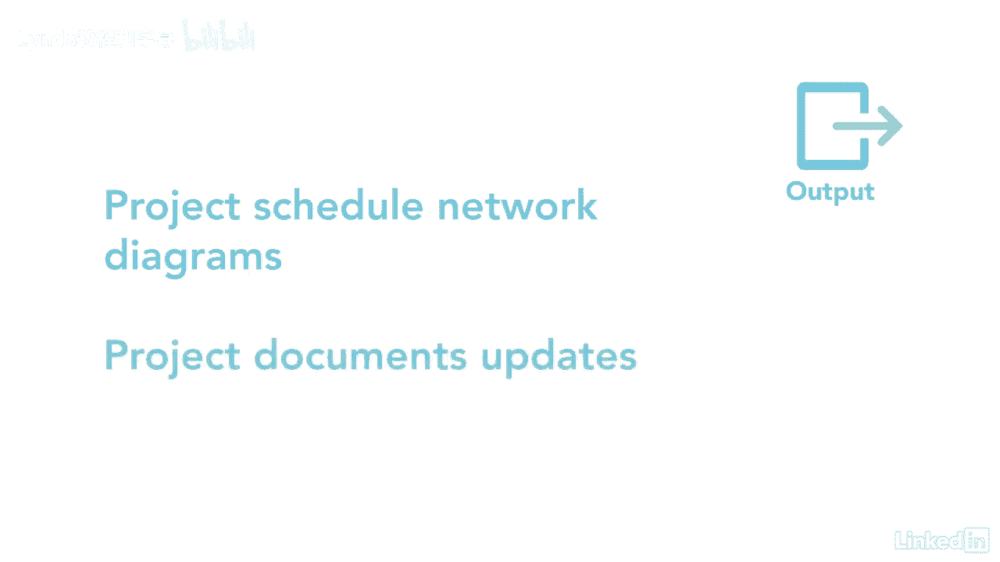

# 061-Lynda教程：项目管理专业人员(PMP)备考指南Cert Prep Project Management Professional (PMP) - P46：chapter_046 - Lynda教程和字幕 - BV1ng411H77g

当你想到单词序列，它让我想起把物品整理得井井有条，这正是我们在这个过程中要做的，将您标识的活动放在活动列表中，按照顺序，顺序活动过程属于计划过程组，您可能还记得在定义活动过程中。

活动列表没有任何特定的顺序，在序列活动过程中，我们确定每个活动如何与另一个活动相关联，然后我们把它们按逻辑顺序排列，项目网络图是排列活动顺序的好方法，下面是一个人长什么样的例子。

您将看到每个活动是按照工作将如何执行的顺序排列的，您将注意到每个活动和里程碑都连接到至少一个前驱，如果你再看这个例子，您将看到活动a有活动b的后继，活动A必须在活动B开始之前完成。

这被称为开始关系的结束，还要注意活动b和c同时开始，这被称为开始开始关系，另一段要注意的关系结束了，在这里显示为活动j在活动l完成之前不能完成，这个过程有相当多的itto。

让我们复习一下你在考试中可能看到的，前两个关键输入是进度管理计划和范围基线，该计划将告诉您如何对范围基线中的活动进行排序，您会注意到接下来的三个输入是定义的活动的输出，进程及其活动清单。

它们提供了您将使用的活动的具体列表和细节，创建项目网络图，项目文档的另一个输入是假设日志，可能会影响活动的顺序，作品是常见的输入，在开始这个过程之前应该审查，了解这一过程的工具和技术是至关重要的。

在开发网络图时，首先是总统的图解方法，或PDM，它用于创建活动显示为节点或框的网络图，和节点之间的链接作为箭头，下一个工具和技术依赖关系的确定和集成是一个节点如何连接到另一个节点。

知道它是强制性的还是自由裁量的是很重要的，如果它的来源是内部的或外部的，强制依赖关系是一种无法打破的依赖关系，例如，上厕所前得安装水管，可自由支配的依赖关系是您希望保留的依赖关系，但如果你时间不够。

你可以移动它们，例如，而不是等到所有的画都完成了才铺地毯，你可以选择粉刷一个房间，然后铺地毯，所以你节省时间，另一个关键的工具和技术是领先和滞后，潜在客户是指在活动的前一个活动完成之前将其移动到开始。

这是可以做到的，但通常会给项目增加风险，滞后是后续活动必须等待的时间，当它的前身完成时，最后一个工具和技术是pmis，它有用来创建网络图的调度软件，这个过程有一个关键的输出，那是项目进度网络图。

它是所有需要完成的工作的图形表示，最后一个输出是项目文档更新的顺序。

这是一个漫长的过程，有很多信息，建议大家再看一遍，阅读讲义也可能有帮助。