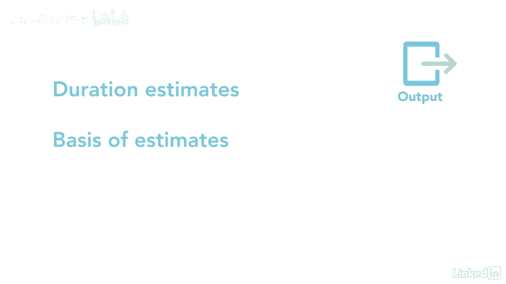

# 061-Lynda教程：项目管理专业人员(PMP)备考指南Cert Prep Project Management Professional (PMP) - P48：chapter_048 - Lynda教程和字幕 - BV1ng411H77g

您是否曾在项目进度表中添加过估算值？意思是估计的两倍或三倍，以确保有足够的时间来完成它，我曾经有一个团队成员，他总是给我他估计的最好的情况，每次他的工作完成，从那以后花了两倍的时间，他在我队里的时候。

我会把他的估计翻倍，估计活动持续时间过程将解释如何估计持续时间，不用垫，估计活动持续时间过程与听起来完全相同，它为活动清单上的每一项活动提供持续时间估计，开始那些做工作的人，应该做出估计。

一项活动的持续时间可能取决于许多变量，例如，为它分配了多少资源，每个人的经验水平是多少，资源分配时间的百分比，当他们有空的时候，如果团队成员不知道特定活动的估计，最好将其纳入风险准备金，在估计工期时。

考虑某些因素也很重要，首先是收益递减规律，哪些州，会有一个点，增加更多的资源开始产生较小的产出增长，下一个是资源的数量，使活动的资源翻倍，不一定会导致时间的缩短，你也许可以利用先进的技术来缩短时间。

尤其是如果一台设备能更快地完成工作，员工的积极性会对工期产生重大影响，下面是这个过程的ITTO，大家可以看到，对于这个过程，有相当多的输入和工具需要记住，我将复习考试中最重要的内容，进度管理计划为先。

它告诉你如何估计持续时间和精确度，还有范围基线，其中包括WBS词典，下一个输入是活动列表，活动属性都很重要，因为它们列出了需要估计的活动，下一个是所需资源，这种投入很重要。

因为它会对每个活动的持续时间产生影响，例如，如果你需要两个高级程序员两个星期，你会得到两个初级程序员，您可能需要调整活动持续时间，以考虑经验的差异，项目团队分配也会影响持续时间，资源日历是另一个输入。

它们用来显示何时有可用的资源，以及项目文件的其余部分，风险登记册，里程碑清单，资源细目，结构，假设，还应审查日志和经验教训，在尝试这个过程之前，作品也是常见的输入，第一个工具和技术是专家判断和会议。

接下来是评估工具，包括类似的，参数化，三点起底，评估另一个工具是决策的例子可能包括一种叫做五选一的方法，在那里，团队成员通过最多伸出五个手指来投票获得全力支持，或者没有支持，还有替代分析。

它着眼于不同的变量来完成这项工作，最后一个工具是储量分析，也称为应急或管理准备金，这就是在时间表上增加额外的时间来考虑不确定性，持续时间估计是这一过程的主要产出之一，这些是对每项活动的估计。

它不包括滞后，还有估算依据，哪些数据支持估算是如何确定的。

最后一个输出是项目文档，更新，请记住，这个过程的关键输出是活动持续时间估计，这些被用来制定项目的时间表。

