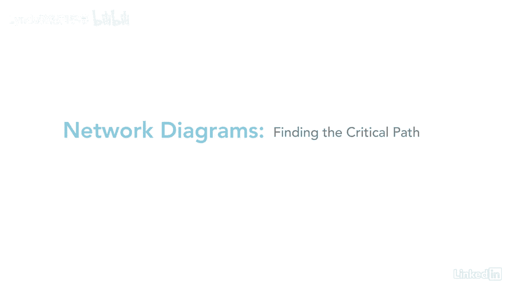
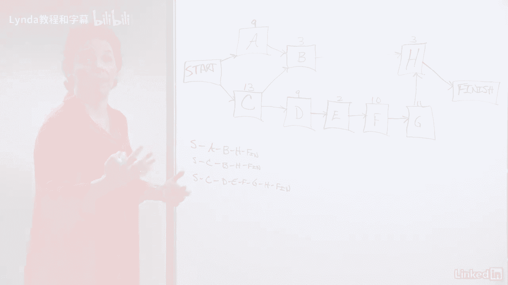
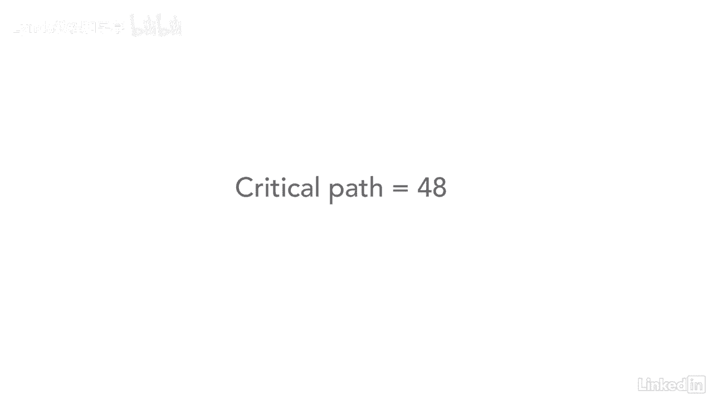

# 061-Lynda教程：项目管理专业人员(PMP)备考指南Cert Prep Project Management Professional (PMP) - P50：chapter_050 - Lynda教程和字幕 - BV1ng411H77g

所以接下来我们要做的就是找出关键路径是什么，很容易弄清楚关键路径是什么。

我有个基本原则，当我看着，当我创建关键路径时，它是这样的，所以你总是开始你的道路，先通过最高级别，然后再往下走，例如，如果我们要为这个网络图创建第一个关键路径，我们会从头开始，好啦。

然后我们会说最高的水平是a b h，然后结束，所以这将是一个，所以下一个我们要做的是，因为我们已经完成了第一条路的所有内容，然后我们就从第二个开始，以c开头，好啦，所以这将是一个开始。

然后你会注意到这里c升到b，这就是我所说的，你总是从最高的路径开始，我说这么做的原因是这样，因为你是，有时你会看到更复杂的网络图，你就会知道你已经先覆盖了高层，然后你做下一关，然后你做下一关。

所以毫无疑问，啊，我错过了那一关吗，如果你从上往下，你知道你已经系统地通过了每一关，好啦，所以这个是c b h，然后完成，如果我们遵循同样的规则，然后我们去C D E F G。

所以这个网络图有三种不同的路径，所以我们要做的就是找出关键路径是什么。

哪个是这个网络图中最长的路径，那么你要做的是，既然你已经识别了每一条路径，然后你只需要计算每一条路径的持续时间，把它们加起来，然后把它们放在这里，例如，阿B H，如果你把这些加起来，九点了。

十二加三等于十五，另一种方法，如果你很难记住数字是什么，尤其是如果你有一个很长的网络图，你可以这样说，九加三等于十二，十二加三等于十五，然后当你前进的时候，然后你知道你就像那个数字是多少。

你在前进的过程中自动地把数字加起来，请记住，当您完成该网络路径时，只需删除此，所以你不能把它和任何数字混在一起，你要和他一起工作，好啦，第一条路是十五，所以如果我们看第二条路，CBH光洁度。

你现在是13加3，十六加三等于十九，然后我们再做最后一个，这是一个相当长的，所以我们有2 2加2等于2 4，加十等于三四加十一等于四十五，好啦，再加上三就是四八，所以如果你看看这个。

关键路径被认为是整个网络图中最长的路径。

