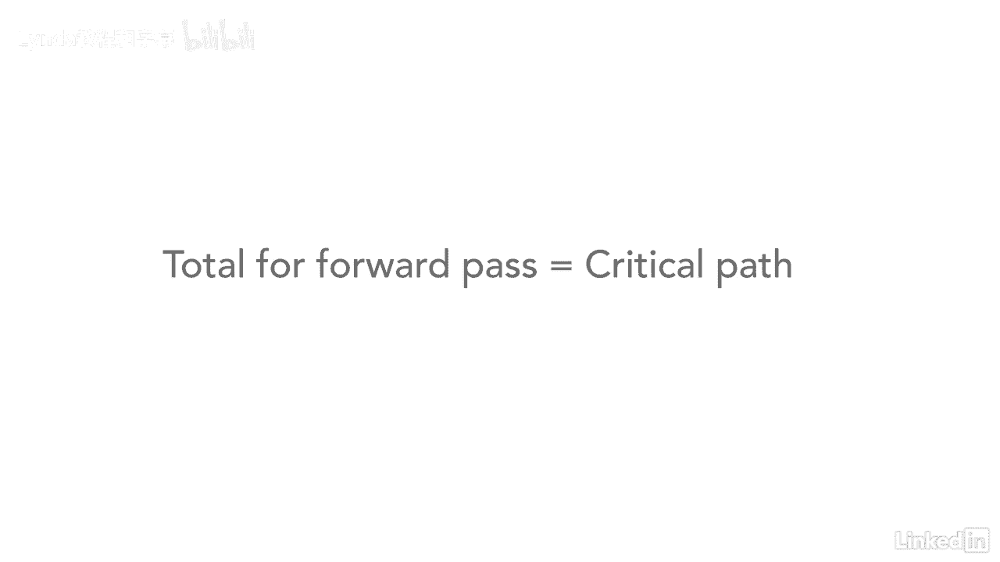

# 061-Lynda教程：项目管理专业人员(PMP)备考指南Cert Prep Project Management Professional (PMP) - P51：chapter_051 - Lynda教程和字幕 - BV1ng411H77g

所以现在我们知道了关键路径是什么，接下来我们要做的是向前传球，这有点像足球，对呀，你从场地的这一边向前，一直到场地的右手边，所以你可以从这里的第一个活动开始，你会从这个活动中走到你的右边。

所以总是从右到右向前传球，我们以这种方式前进，所以有几条不同的规则需要记住，当你向前传球时，所以向前传球，所以在向前传球时，你要提前开始加上持续时间减去一，减一是因为a和c。

你们要在第一天就开始这项活动，是的，它从一天的开始就开始了，它在那天结束时结束，你不能把那天数两次，只有一天，我们希望一天能有不止一天，但一开始，例如，有一个，这是第一天，一加九等于十。

然后你会减去一个，它给你九个，好啦，所以这是第一天的开始，这是第九天的结束，你也会在这里做同样的事，哪个会是一个，好啦，十三一加十三等于十四，减去1等于13，另一个技巧是当您开始网络图时。

总是知道从开始开始的节点将永远是相同的，等于期限，所以如果这是九天，右手边永远是九，如果是十三天，这将是十三天，所以我们要做的是，还有一个规则你需要知道，你们会注意到b前面有两个不同的节点。

永远知道当你前进的时候，把你的数字加起来，好啦，所以这应该，当你走到最后，加起来应该是四八，你的关键之路，所以你要确保的是当这些数字向前移动时，他们变得更高，好啦，既然你有两个节点接收到b。

你要确保你取了两个中最高的数字，把数字往前移，所以在这种情况下13比9高，所以这将向前推进，另一件要记住的事情是这是第13天的结束，我们将进入第二天，所以这个数字会递增，所以这是活动的开始。

B是第14天，所以这些数字总是随着你的前进而上升，所以如果你用同样的公式，十三岁左右，向前迈进，十四岁了，所以14加3等于17，减去1等于16，好啦，好啦，所以我们通常会从b向前移动到h。

但是你会注意到h也有两个活动，我们不知道这个号码是多少，所以我们得从头开始，向下移动直到我们找到这个数字，所以，让我们继续和解决这个问题，所以第二天这里是14加9，右边是二三减一，那就是二二，好啦。

所以第二天这里会有两三个，加二等于二五减一等于二四，所以第二天这里会有两个5，加十等于三五，减一等于三四，然后这里是三五，加十一等于四六，减一等于四五，现在我们知道这里有16个，我们这里有四五。

所以我们取这个号码，因为这是最高的数字，再往上走，所以第二天这里会是四六，加三等于四十九减一，等于48，另一种检查你是否正确地向前传球的方法，你知道你的关键路径应该等于48，好啦。

所以如果你一直走到这里，你做了你的向前传球，它等于4 8，然后你就知道你的向前传球是正确的了，它等于关键路径。

好啦。