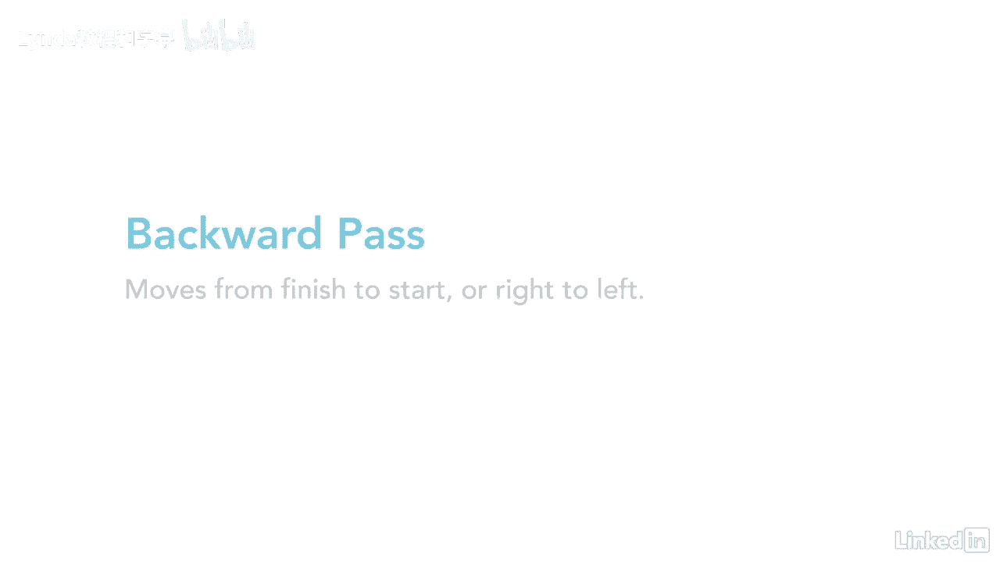
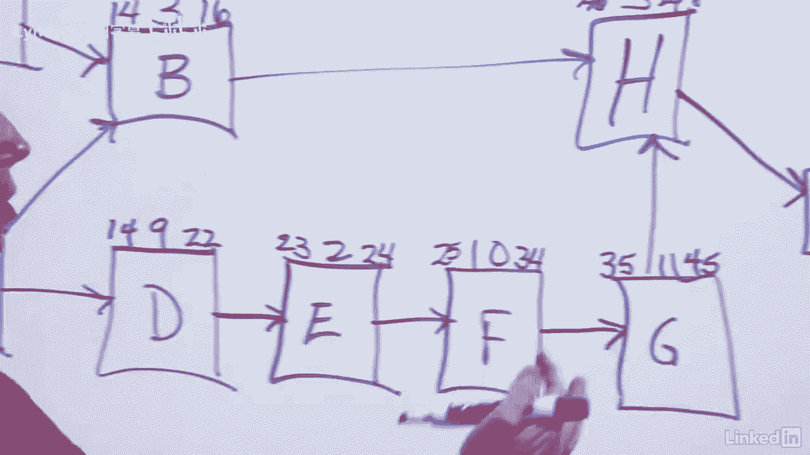
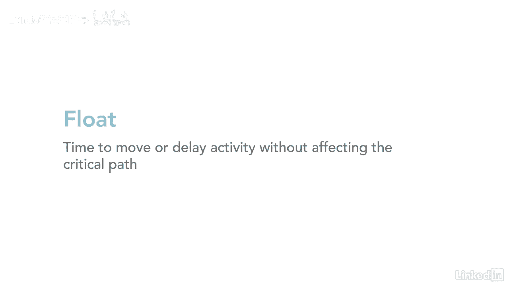

# 061-Lynda教程：项目管理专业人员(PMP)备考指南Cert Prep Project Management Professional (PMP) - P52：chapter_052 - Lynda教程和字幕 - BV1ng411H77g

接下来我们要做的是向后传球，从头到尾都是这样。

从右到左移动，因为四八是我们最后得到的数字。

那是我们项目的最后日期，然后你会从最下面的4个8开始，所以让我们从这个数字开始，在底部我们有4个8，好吧四八，同样的规则也适用于向后传球，你拿的是延迟完成减去持续时间，加一个，所以你取4 8减3再加1。

一共是四五，加一就是四六，好吧，如果你愿意，你可以选择走这条路，或者你可以选择走这条路，所以我要做的是勇往直前，先做最上面的那个，好啦，所以从第四天开始，你想确保数字正确地下降。

因为这是第四天第八天的结束，我们应该在这里结束，或者第一天的开始，所以要知道你的数字会逐渐下降，所以四六可以放在这里，截止日期是4-5天，好啦，所以四五减三等于四二，加一应该是四三。

活动b的开始是4 3，所以我们想做的是有一天下去，所以这就是4 2 42减9加1是3 4，好啦，既然我们先做了最上面的一排，让我们继续做最下面一行，所以这将是46，然后这里是四五。

四十五减十一加一得三五，所以我们从三五移到这里，是三四三四减十加一等于二五，然后二十五到二十四，二十四减二加一等于二三，这将是二二二减九加一等于十四，然后这就是十三，减十三加一，你最终得到了一个。

所以你会注意到这里有几个不同的东西，记得我说过当你向前传球的时候，你知道你做得对，因为你的n个数等于你的临界路径，一共是四八，当你向后移动时，就等于一个，因为你最终会得到一个，好啦。

所以这是另一种检查方法，你的向后传球是正确的，另一种检查方法，你会注意到在关键路径上的每个节点，他们都是，如果你从四八中减去四八，四六从四六，你最终得到的每一个都是零，如果你减去他们，他们最终会得到零。

所以每一个都是你的关键路径，它为零的原因是因为没有任何浮点数，你不能，如果你把c活动推迟两天，那你的整个项目就会推迟两天，没有流量，在关键路径上没有回旋余地或任何东西。

所以这是另一种知道你做得正确的方法，你的关键路径永远是最重要的，将永远等于你关键路径上的底部数字，如果你把它们减去，那么它应该等于零，所以这是另一种检查你是否完成了向后传球的方法，完全正确好的。

现在我们已经完成了向前传球，我们有了向后传球，接下来你要做的是看看活动中是否有浮动，除了在你的关键道路上，因为我们已经确定了临界路径的浮点为零，这意味着如果你推迟任何这些活动。

你的项目会被推迟等长的时间，所以不属于关键路径的活动，将是活动a和活动b，所以如果你减去，四五中十六，你最终会得到29个，这里同样的事情，如果你从三四中取一，你最终会得到三个三。

另一种反复检查你的工作以确保它做得正确的方法，你应该可以在两边做同样的减法，所以如果你从四减去九，它应该等于三，三个，同样的事情在这里16从4 5，四三的十四应该是二九，如果是一个不同的数字。

然后你可能需要回去重新计算你的向前传球，向后传球，以确保你的号码是正确的，所以这告诉我们，对于这条路，然后你有三三天的总浮动，所以浮动意味着你可以移动这些活动的时间，您可以延迟它们。

而不会实际影响项目的关键路径。

所以在这种情况下，你可以推迟三天，它不会影响B活动，也不会影响三两天，这个更高的数字告诉你你有一个总的漂浮天数，为了这整个，所以他们会告诉你你有三三天的时间，你可以搞砸这件事，如果超过三三天。

然后它实际上会影响您的项目和关键路径，然后你得看看，看看你还能做什么动作，使您的项目回到范围。